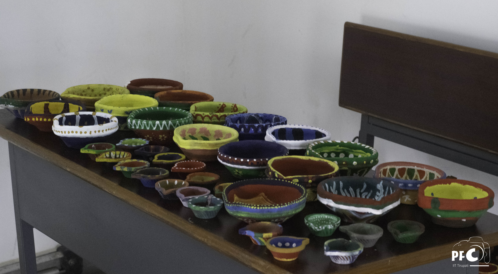

--- 
title: "Recent Activity Detected: The Student Clubs of IIT-T"
category: "Campus News"
date: "2022-06-25 12:00:00 +09:00"
desc: "Here's what the vibrant clubs of IIT Tirupati have been upto in the last year!"
thumbnail: "./images/placeholder.jpg." 
authors: "Sathyanarayann, Swathi "
starred: "False"
alt: "clubact"
---

With the long-awaited end of the covid pandemic and return to normalcy finally arriving in the second half of the academic year 2021-2022, the sun rose on a campus filled with grateful students. With the return of all students, from those who had never seen the college to those who had dearly missed the college experience for two years, campus life started blooming. The halls were filled with chatter, and the mess lines grew longer. This was an ideal opportunity for our students to immerse themselves in club activities and celebrations in order to fully experience “the hyped-up” campus life. Our student-run clubs, which were successful in keeping students engaged and active online, began actively conducting activities and events in the offline mode as well. From the online start to the offline finish of the academic year 2021-2022, let us take a fond look at the club activities that kept us involved. 

With the return of students, all the cultural activities resumed with much enthusiasm. **Actomania** conducted **‘Lights Camera Action’**, a dialogue delivery contest, as part of _Commemoration of 75 years of Independence_ celebrations. Many students took part in the **Dumb Charades** event at campus. Actomania also conducted an online workshop for the freshers to observe their interest and skills in acting. 

**Artista** came up with **‘National Leaders Painting’** and **‘Still life sketching’** events as a part of _Commemoration of 75 years of Independence_. Both these events were well received by the students and saw several creative entries. In collaboration with **Techmaniacs**, they conducted a logo-making competition to design the club logo for Techmaniacs. In addition to their own events, Artista worked alongside the cultural committee for the organisation of festivals like Diwali, Halloween, Christmas etc. **‘Halloween Face Painting’**, **‘Diya painting’** for Diwali were some of the offline events which saw enthusiastic participation and colourful faces. As a part of **Tirutsava**, our annual techno-cultural fest, the club hosted **‘Character Design’** and **‘Word Doodle’** events.

**PFC** was pretty active with a lot of events to cover and activities to conduct. The club made an innovative short film on Covid, named **'[Spoiler Alert](https://www.youtube.com/watch?v=l1q7N2tetK4&ab_channel=PFCIITTirupati)'**, where two people’s past and present selves meet one another. They even compiled a video for the pioneer Chemical Engineering batch. As part of _Commemoration of 75 years of Independence_, they compiled the winning entries of all the events and also conducted photography contests on the themes of **Incredible India** and **Frontline Workers**. They helped in the making of posters which include the New Year greeting and 2022 year calendar. The most awaited Fresher’s intro video **'[Aagman 2021](https://www.youtube.com/watch?v=npNp-UG5B-4&ab_channel=PFCIITTirupati)'** was released. They covered various events conducted on campus which include Tirutsava, Diwali, Trek to Tada waterfalls, open mics, Fiesta, Gymkhana day etc.

Our music club, **Sargam** kept their pace by conducting various online and offline activities. They took several innovative initiatives to keep the student community engaged. One such initiative was **'Radio Nights'** where the host would choose a theme and play songs based on the theme. The club released a Youtube video named **'[Just Classical Things](https://www.youtube.com/watch?v=Z0AiitCWSrQ&ab_channel=SargamIITT)'** a compilation of classical music performances as a part of _Commemoration of 75 years of Independence_. They also conducted an open mic once students were back on campus. **‘Unplugged -  Acoustic Night’** was an event where students enjoyed playing acoustic guitars, ukuleles, and singing songs. The club launched **'[Antara 6](https://www.youtube.com/watch?v=A_AtjeF47zE&ab_channel=SargamIITT)'**, an exclusive compilation of performances by freshers and the **'[Sargam Online Show 2.0](https://www.youtube.com/watch?v=upACGAWHDMQ&ab_channel=SargamIITT)'**, a compilation of performances by students on it’s Youtube channel. **'[Ek Bharat Shreshta Bharat](https://www.youtube.com/watch?v=nvzxvSQcV98&ab_channel=SargamIITT)'**, a compilation of songs in regional languages was also released as part of the Ek Bharat Shreshta Bharat initiative in collaboration with the PFC IIT Tirupati. As a part of **Tirutsava**, the club conducted workshops on introduction to music theory and music production. **‘Expressivo’**, a solo singing competition, saw talented participants from various colleges. The club held auditions to revive the band. The band practised day and night in the indoor stadium for several weeks. Whatever might be the time, people could hear those energetic beats in and around the sports complex. Finally, the band performed on the Ethnic night. They lit up the stage with their mesmerising performance. The band received huge applause which they deserved taking into account the amount of hard work they had put in.

**Xcite**, our dance club came up with dance week as a part of _Commemoration of 75 years of Independence_. All the responses were compiled and streamed on Youtube namely **'[Stream](https://www.youtube.com/watch?v=Yxk3LvKgAd8&ab_channel=DancesocietyofIITTP)'**. They even organized a **'K-pop Challenge'** where the participants were asked to perform to a particular song in any preferred dance form. They even conducted a workshop to help the novice collaborating with our Xcite club’s alumni and seniors. Once students were back on campus, the club put up some stellar performances during the open mic events. Flash Mobs, conducted as a part of promotion of Tirutsava, were eye-catching. The club even conducted various workshops. An online freshers' exclusive solo dance competition, **'Spark'**, was organized. 

The previous academic year saw a plethora of literary activities to keep our students engaged. The Debate Club, which had now been expanded to **Debate and Oratory Club**, held numerous activities, beginning with the flagship event **'Standpoint'**, as part of the _Commemoration of 75 years of Independence_, and then another one (fresher's special edition) for Republic Day. The Debate and Oratory Club has kept the literary community of our college engaged by hosting up to 12 offline debate events, 5 casual oratory sessions, and a two-part freshers introduction. In addition to hosting debates, the Debate and Oratory Club sent teams to 11 intercollegiate events, including international competitions such as the **Aristotle Cup** hosted by a university in the Philippines. Oratory events such as '**Survivor**' and '**Share your Experiences**' were held to get participants, especially first time speakers, comfortable and familiar with speaking in front of large groups. The student body responded enthusiastically to all of these events.

The IITT **Quizzing club** kicked off the academic year with a **Pop-Culture Quiz** on trending topics in popular culture, such as movies, TV shows, anime, and music. The club also hosted a **Science and Technology Quiz**, as well as quizzes in collaboration with the Astronomy Club ‘Gagan Vedhi’ and the Music Club ‘Sargam’. The Quiz Club hosted two quizzes as part of the _Commemoration of 75 years of Independence_, **the Indian History Quiz** and the **Geography of India Quiz**. Following the disruption caused by the third wave, the Quiz Club resumed their work with the **India Quiz**, the first offline quiz. Apart from quizzes hosted by the club, members also took part in the **‘Inter IIT Quiz League’** hosted by the older IITs. Overall the Quiz club has seen a busy year with eager Quiz Enthusiasts waiting for more.

Furthermore, the Literary Community of IITT has recently announced the launch of **Scribbles**, a brand new Writing Club to harness, finesse, and publish the writing talent of IITT. The club is yet to begin activities, but student response and anticipation for the club’s activities have been encouraging.

The technical front of IITT was pretty active with a lot of events being held. The **Entrepreneurship Cell** organized a talk on Decentralised startups in collaboration with Lumos Labs. Twice every month, they held sessions hosted by Dr.Hiran Vedam ma’am to help students crystallize their start-up ideas. An online workshop on Blockchain and Crypto- Currency was conducted in collaboration with industry professionals powered by Jupiter. The **Idea-thon** competition conducted by the E-cell was one of its kind where participants came up with innovative solutions to solve real-world problems.

**Techmaniacs**, the robotics club, conducted online and offline workshops on Arduino, Matlab, and 3D printing. One of the stellar events organized by the club as a part of **Tirutsava** was **Robospherea**, an Arduino-based robot soccer event where teams made their bot with a unique mechanism to hit the ball. The club encouraged students with their projects which include Hybrid 3D Printer Build, Drone Build, IoT for Smart Agriculture Applications, etc. 

**Digital Wizards** was one of the busiest and most active clubs on campus.  A 10 days workshop on data structures and algorithms namely the **'DSA Series'** was organized. They covered 80+practice problems, 20+ problems in sessions, 20+ problems in contests, spanning 10 online workshops organized by the code club team, a session on OOPS by **Coding Ninjas**, and 2 informal sessions. The club conducted various sessions on topics like Cyber Security, Competitive Programming, Web- Development, App Development, ML, etc. Offline workshops were conducted on various topics which include Node, REACT, Competitive Coding once students returned. For **Tirutsava**, the club came up with some interesting events such as the CTF, App development, and web development contests. They collaborated with **Algo-Academy** and conducted a workshop where top industry experts gave information about placements and internships. The company held a contest and winners were given prize money.

**Gagan Vedhi**, the astronomy club, conducted online workshops on AI with space applications, and rocket science. A **'Talk Show on Cosmology'** was conducted where there were discussions on shape of the universe, higher dimensions,etc. The club conducted a quiz on space missions, past, and future named **'Space Missions Quiz'** on their Instagram page. On the occasion of the launch of **James Webb Space**, the club organized an offline watch party.

Campus life be it online or offline, would be incomplete without sports. Our sports clubs rose to this challenge effectively and kept our students satisfied and busy this year. The chess club **Chaturanga** has been a busy club and has conducted numerous tournaments like the New IITs and NITs Tournament, International Chess Day Arena, Chaturanga Premier League and Winter Chess Tournament. The trekking club **Aranya** organised scavenger hunts and treasure hunts throughout the year. Once most of the students reached the campus, Aranya hosted the memorable Trek to Tada falls which saw overwhelming participation by the students. To ensure that the students remain fit with a friendly competitive spirit, **Aarogya**, the fitness club has been successful in keeping the students engaged with their weekly lineup of fitness challenges The fitness club also hosted an offline yoga workshop which saw active participation.

All our student run clubs have done an amazing job at keeping the spirit of college life active this year. Though things were uncertain with the covid pandemic, and the students were able to return to the campus only after half the year, all of our clubs have been working tirelessly to make sure the students enjoy their campus life to the fullest. We are sure that the students of our college are looking forward to more exciting club activities in the upcoming full offline (hopefully) academic year. 
