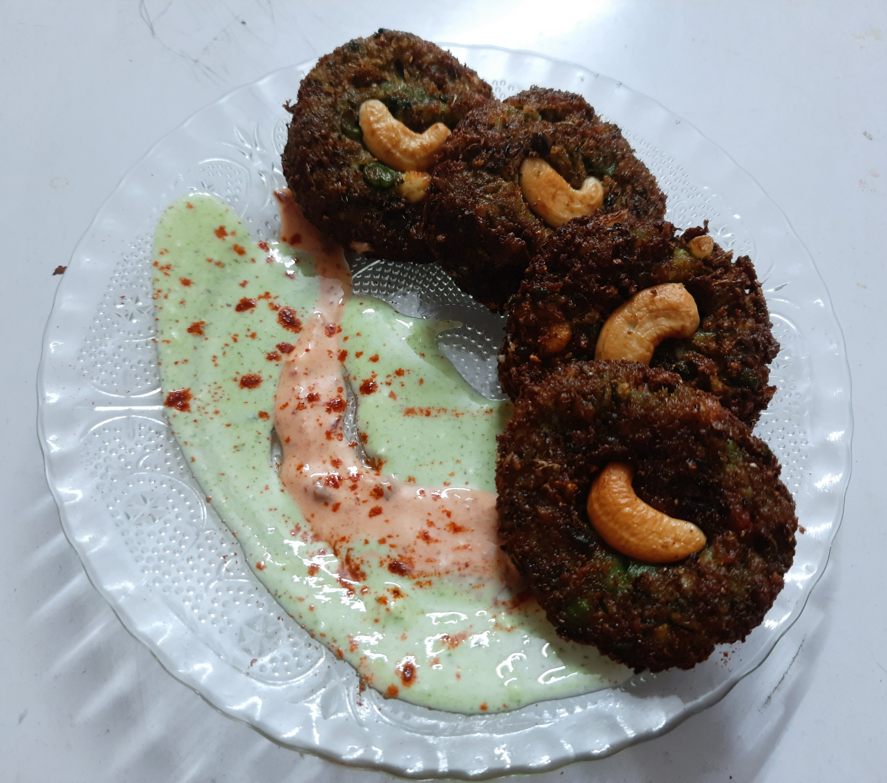

>“Cooking is like painting or writing a song. Just as there are only so many notes or colours, there are only so many flavours—it’s how you combine them that sets you apart.”          
>*–Wolfgang Puck*

Back in 2013, on a gloomy evening, I stood outside a small Chinese restaurant to get my dinner parcelled. That was when I saw the chef making a combination of rice and noodles in a big wok over this humongous flame. The way he added spices, mixed the ingredients and moved the wok through the air without a single grain of rice falling out felt like an innately choreographed sequence. That was the moment when I, as a naive eleven-year-old, decided to cook the same thing at home! With my mom’s help along each step, I used leftover rice and instant noodles to finally come up with something edible. It’s really difficult to get a kitchen to yourself when you’re 11, that too in India… forget it; my mom still spies on me when I am cooking! This small stint led me to cook some modest items like omelettes, tea, coffee, instant noodles, and instant pasta, which finally inspired and gave me the courage to try my own twists for the next 4-5 years. (childish things, really…adding sauces and cheese to stuff that was already loaded with spices) 

If you ask me how exactly I became the pretty decent, perhaps even arguably good, chef I am today, I would say that my breakthrough came during the JEE days when I was frustrated with what I was doing. Since it was JEE prep, I had a non-existent social life; thus, the only way I could de-stress was to try a different activity, and well…. I cooked. I prepared the Israeli Shakshuka one day, and it turned out great! Apart from how good it tasted (honestly, it did), I realised the following things:

- I forgot about all my worries when I was in the kitchen. Tests, scores, and ranks all seemed to be at bay when I was chopping vegetables or mixing up marinades or, for that matter, doing anything in the kitchen.       
- I realised that my creativity was at its peak when I was cooking. I could make tweaks to the recipe, and they always turned out well.                 
- That sense of accomplishment that struck when I saw my near and dear ones eat what I had cooked was indescribable.  

So, it was done. Cooking became my favourite pastime, and my efforts only increased during the lockdown when the college (everything really) was online. This period only fueled the fire (A cooking pun, I couldn’t resist); with amazing Chefs like Chef Ranveer Brar and Chef Sanjyot Keer releasing videos frequently, I had so much stuff to work with. In addition to the aforementioned setting, since essential commodities were not readily available (blame COVID), I had no other way but to improvise. Hence, this was when I learned how to bake bread, make my own cheese from milk, hand-pulled pasta and noodles at home, and many more things this article isn't big enough to describe.            

I have come a long way - from adding schezwan sauce to Instant noodles to creating my own schezwan sauce and trying my hand at creating recipes, from having mom fry stuff for me to owning the kitchen when I cook. But the fundamental essence remains the same, “Chalo, Utho aur Khana Pakao!”. 

Here ends a short overview of my love for cooking. But, why should you cook? Well, jotted below are some of the reasons I personally feel should be more than enough to give you the initial push to start experimenting with cooking. 

- Cooking is a life skill, and it contributes to your independence. You can easily live alone and not cause too much strain on your pockets if you cook instead of eating out every day!           
- Also, if you cook, you make sure that you use the best ingredients possible and make the food as healthy as possible. So essentially, you are in control of what goes into your system. You can conquer your health as well!
- Cooking is therapeutic and mentally rewarding and may just provide you with the required hit of dopamine!
- It gives you a chance to explore and exercise your creative brain cells. You often need to make substitutions for ingredients you’re unable to source. Unleash your creativity!
- Cooking teaches you planning. In order to make intricate recipes, you need to have all ingredients in place, plan the cooking of different components, and make efficient use of available resources (e.g. no. of burners, available space and most important of all, time!)
- Last but not least, cooking is fun!!!

      
 

*What do you need to do in order to cook?*
Just get in the kitchen, gather the required ingredients and start off! My advice would be - Don’t be afraid of how stuff is going to turn out. It may turn out to be delicious, exemplary, or maybe barely edible...but there's very little probability that it would turn out so bad that it's inedible. So, just enjoy the process and learn from it. Celebrate your little successes, learn from the minor setbacks, and forget them right away. Cooking is not a competition; it's meant to be a process through which you create a hearty and nourishing meal for you and your loved ones to enjoy. So treat it as such. Give it time, give it love, give it patience, and I am sure it’ll turn out delicious!

*P.S: To check out the various recipes I’ve cooked, check out my page on Instagram @reckless_recursion and follow me!*

*P.P.S: A special thank you to the two men who made cooking a fun activity and made me fall in love with it: Chef Ranveer Brar and Chef Sanjyot Keer (YFL).*
