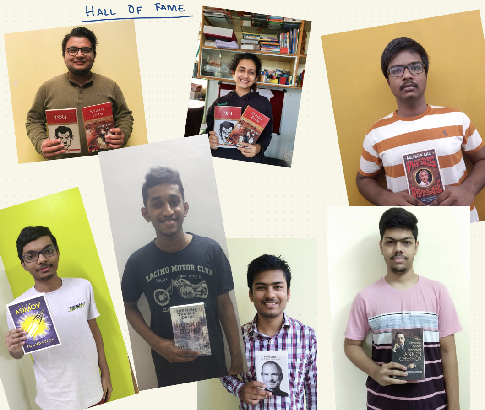

OK! Brace yourself, guys! Here we have Professor *K*, the First *PCLer*, long-time *Clash of Clans* pro, computer architecture enthusiast, and unanimously one of the coolest persons on campus, Dr Raghavendra Kanakagiri! CS students know him from the fun and exciting Computer Organisation classes. He runs the Parallel Computing Lab (PCL) at IIT Tirupati, where the students get to explore a wide range of projects and dabble in exciting research problems *(friendly reminder for the juniors to join!).* 

In an enjoyable and hilarious interaction, Dr Raghavendra shared briefly about his journey as a student. A self-proclaimed last-bencher, he described his passion for fun and his thirst to keep learning and exploring. He recollected, “I took up engineering because everyone else was doing it. I did not just read from the book and write answers, though. Rather, I used to explore. Even for my Masters, I wanted to live in a different city and go to different places. During my Masters, I thought I should do a PhD.” He believes his path was not set or well-defined in advance. In contrast, he observes that there are students here at IIT Tirupati who already know what they want to do. They are very sure of which subject they want to work on and what they want to do after graduation. 

His passion for gaming should be very relatable to many students on campus, as he says, “I was on the gaming team of my college, and I passionately pursued gaming for a long time. I prefer strategy games like _Clash of Clans_. Even though I play now, it has reduced on my wife’s insistence. IIT Madras had these game servers set up and running 24/7. You could log in and play whatever game you wanted, say Quake3. The admin at IITM threatened to cut out the internet at night because the students were up all night, playing and not attending classes in the morning.” He did, although, ask us to add a cautionary disclaimer that he advises students  ***not*** to spend all night gaming :)  

Dr Raghavendra completed his PhD from IIT Madras and two Postdocs at the _National University of Singapore_ and the _University of Illinois at Urbana-Champaign_. He is also an avid reader who enjoys science fiction by _Alastair Reynolds_ and _Isaac Asimov_. He was kind enough to answer some of our burning questions on his current projects, backpacking trips, his take on teaching and more!

**_What is your favourite ‘weird’ food combination?_**

Previously I would have thought it was weird, but when I visited IIT Kanpur, they had _jalebi_ with curd at breakfast. Now I always eat _jalebi_ with curd. It tastes really good because the curd takes away the excessive sweetness of the jalebi. 

**_What do you think the ‘quarter-life crisis’ means, and did you go through anything similar?_**

What is that?!?! WOW!! I can just say wow right now!! I’m hearing this for the first time. I have always heard of mid-life crisis (_sounds of disbelief_).[^1]

[^1]: If you’re hearing about the ‘quarter-life crisis’ for the first time, [here’s an article](https://udaaniitt.web.app/editions/2022_Jan/quarter_life_crisis/) from a previous Udaan edition that tells you a lot more!

I don't know if this is true because I am not a social scientist, but your generation is exposed more to what people are achieving. You are constantly reminded of other people’s activity in your feed - on Linkedin, Facebook, or Instagram. People are either enjoying or getting internships at top places or going to graduate school and posting about it. You are constantly reminded of this, and I think that might be one reason some of you might feel that you are not achieving enough. Although it's cliché to tell you not to compare yourself, everybody has their own path. Sometimes you should compare a little, don't be completely relaxed. But as long as you are not completely going in the wrong direction, it's okay to take your time. So, don't worry about it too much, because you don't know. When I finished my undergraduation, nobody would have thought I would become a faculty; forget about being a faculty member at IIT! I myself didn't think I would finish PhD and become a faculty. You’ll be surprised after 20 years that some of your friends and colleagues are on a path or career that you would never have associated with them.

**_We’ve heard you recommended backpacking to students. Would you like to share your backpacking experience?_**

I went backpacking around Southeast Asia. I did a lot of travelling, and I highly recommend backpacking across Southeast Asia. (Europe is more Sharukh Khan style; also, you need lots of money) There are Southeast Asian countries where you can live for cheap, like Cambodia, Laos, Vietnam, and Thailand. It has a mix of Asian and European cultures. It's very nice to explore. I stayed in places where one night's stay cost 7 dollars. They give you a bunker, like a hostel. I wouldn’t recommend it just to the guys. There were girls as well who felt comfortable. Of course, you can’t go off to completely unexplored areas because you should take care of safety. But as long as you stick to paths that have been explored before, you should be fine.

I explored Laos and Cambodia around 8-9 years back, moved around for 30 to 35 days and spent about 1.5 lakhs. I got an email from my advisor (this was during PhD) saying, “At least can I know your coordinates?!” I went back to him with a Buddha saying I went to Laos. I went to places with glass tables where snakes were moving around below, and they would serve food on them. These things are very interesting! I went to an island in South Cambodia that was completely cut off from the world. It had around 20-25 people at any given point of time where a few of the travellers ran the lodging and moved every three months. You could work with them and get paid. My friend and I worked in the restaurant for a few days. The beaches were completely for us. I have never seen so many stars in my life! I would definitely recommend travelling. One of my friends, a PhD from IIT Delhi, used to carry a pack of pepper spray and travel solo to Jaipur and other places. (_Extra gyaan: Pepper sprays are not allowed on flights._)

**_You are one person who we students admire a lot! But name one person you admire most and why you admire them._**

Thank you! I definitely have to say, first is my wife! That’s the answer I have to give because she will definitely read this interview:) 

But assuming she doesn’t, I feel really fortunate to work with three outstanding faculty. One of them is my PhD advisor, Dr Madhu Mutyam and my Post Doc advisors, Dr Laxmikant Kale and Dr Edgar. Technically I learnt a lot from them, but that's not the only thing. I observed that all three always put students as their first priority and then everything else. When I was doing my Post Doc, it was Dr Kale’s last year teaching a course that he had been teaching for decades. But the amount of seriousness with which he prepared for the course (in designing assignments etc.) was amazing! He said you should celebrate students and give them that platform to learn and grow.

I would think it was jargon if I had just heard these words without anything to support it. But I saw them implement it throughout! The same goes for Dr Edgar and Dr Mutyam too; it was always students first. I used to go to my PhD advisor every day with a new topic, saying I wanted to work on this. One day it was architecture; the other day, it was theory. I would say I have read something about this, and now I want to work on it! He never said this is a _‘Boy who cried wolf’_ story. He would just order books from his faculty fund - _Distributed Systems, Quantum computing, Theory of Computation, Computer Architecture_; even if it was not his area! He never shot me down whenever I went to him with an idea. Though he reminded from time to time, “Hey Raghavendra, I think you need to get married because you are not focused!” I really admire all three of them.

**_What is one programming language or tech stack that you love the most and would recommend to everyone?_**

I would say _Julia_ is fast catching up. Invest your time in _Julia_ if you are especially interested in ML and numerical methods. Julia has this sweet balance between ‘easy to pickup’ like Python while being really fast. Julia has this very robust environment, and I am sure it will be what Python is now in maybe another 5-6 years. There is this very interesting course called [Introduction to Computational Thinking](https://computationalthinking.mit.edu/Fall20/) by Grant Sanderson, part of [3Blue1Brown](https://www.3blue1brown.com/about). It touches all fields of scientific computing and has been taught by the inventors of Julia. I would recommend everyone to at least dip their toes into Julia. If they don’t like it, it's fine, of course. 

I don’t have any suggestions on web-dev stacks as I hardly use them. I just use Google and Stack Overflow to figure out how to build websites. 

**_Linux tips/tricks that you could share with us?_**

Instead of Linux tips or tricks, I would say get used to editors like vi or emacs. Once I gave an assembly programming assignment, and I observed people open up HackerRank, code in the IDE and then copy it! I was so surprised! It actually should be the other way around; you should code in your favourite editor and then copy it into HackerRank. Get used to one editor really well. Initially, the learning curve is steep. I also sometimes use VS Code - but my VS code is vi based. I use vi commands. Once you get used to it, it is really quick to edit documents. If you are a CS graduate, you should be accustomed to vi or emacs. Using the mouse really slows you down. You should be really comfortable writing scripts in Python, Bash, Julia, etc. I’ve seen that this is one thing we are not teaching students. Even when I force them to do an assignment on Linux, they do it using VirtualBox just for the assignment. Some people are scared. Nothing will happen. The hardware will not burn. Installing Linux is an experience. You should do it so that you get used to the system more. As a CS engineer, you should be comfortable with handling a system - installing and so on. Even now, when I give some assignments, the first complaint that I get is not that the assignment is hard but about installing MPI or OpenMP. We are not comfortable searching for it and figuring out how to install it on Linux. There will always be bugs, no matter how often you do it. You should take initiative and get it working. Even if you make a mistake, it is okay. You will remember not to do it again. Try to bring down the system. Install everything. Format it. It's not like you are holding some important FBI data on your system. These days you can back up anything on the Cloud. Learn all the commands, edit multiple files, and play around with dot files and configurations. I have customised colour configurations, autocompletion, and more, on my terminal and vi editor, and I push all configuration files to a Github repository so that I can get my setup on any machine quickly.  I’ve developed what works best for me over the last ten years. You should customise your own setup too.

**_What is your favourite thing about the students at IIT Tirupati?_**

I’ve seen that the students here are very focused. They already know what they want. They are very sure about what they don't want to work on. They know what they want to do after undergrad, the extracurricular activities they want to do now and so on. I'm a big fan of this focus.

**_What is one thing about the students at IIT Tirupati you wish was different?_**

I think the answer is the same as above. Too much focus is great, but sometimes I feel you should explore other things also. What I mean is, as students, some of you feel so pressured to fix on an area in your first year or second year. You may email a faculty and continue working on that, and might not explore any other areas because there is so much peer pressure. You are in your second-year undergrad, not your second year of  PhD! In my second year of PhD, I didn't know what I wanted to work on (_laughs_).  It is okay to email faculty and say, “I don't know much, but I am willing to spend one hour per day. I want to learn and work with you.” It can be from other (EE/Mech) departments as well. They are experts in their domain. You can also work with faculty in other IITs, IIITs, or IISc. But be honest with them. Don't say I am only dedicated or only married to you! If you say you are working on this, but you are also exploring something else, if you are honest, you can explore more in your second and third years. Then maybe you will know what you want to freeze on in your 4th year. So, please loosen up a bit. It's bothering me that you asked about a quarter-life crisis. Please, no quarter-life crisis! I don’t believe that there is some greater purpose to life. You are here; it’s just an accident that happened. Have you read _Douglas Adams_ - one of his biggest questions is what is the ultimate answer to the universe - it's fun to read! But I won't spoil it for you right now. 

>Dr Raghavendra has set up this beautiful tradition where he gifts an excellent book, (with express delivery!), whenever a student asks a singular question or answers a particularly interesting question in class. Their pictures also make it to this special page in his class notes labelled ‘Hall of Fame’, in an attempt to encourage students to read - “because reading good books will change their perspective of the world!”

**_How should students approach professors? Especially when they’re writing emails but have no prior experience communicating through emails._**

Honesty is the key. You can't really impress in the first email. Be very honest. You can say that you don't know anything and that you want to learn. People say they are totally excited about your area and want to do everything in it. But I can see that I am CCed or BCCed with other faculty! You can honestly say that you can work for an hour a day.

My grades were not out of the stadium when I applied for Postdoc. I said I wanted to move to high-performance computing. My undergrad is not in CS. I was very honest in the interview and did very well in the coding round. I saw that HPC is highly geared toward numerical methods. I approached Dr Edgar and told him I needed to work on my maths fundamentals. I started contributing as a programmer and now, with numerical methods. Faculty also are really looking for students, and if you are honest, there are many opportunities. 

**_What are you working on right now that excites you?_**

I am working on tensor computations - what a matrix is for 2 dimensions, a tensor is for n-dimensions. Everyone may have heard of it because of its frequent use in Machine Learning. I’m not working on it from the perspective of ML and DL, though. I am working on making tensor computations scalable and running them on distributed machines - parallelising them. An example of tensor contraction is just multiplication. A 2D tensor multiplied with another 2D tensor gets you a 2D tensor output. That in itself is interesting because how would I distribute the data across thousands of nodes,say 100k cores and efficiently execute this operation in a huge distributed setting. Tensors are not just important in ML and DL, but also in quantum chemistry. Much of their expression of operations is in tensor algebra. Tensors are becoming the backbone of many operations. Making them run faster is important. For me, building systems is interesting. Systems as in, not software applications, but those which actually interact with hardware, and I can extract performance. One of the other things I am working on is, exploring and learning numerical methods because the group I work with is very strong in numerical methods. They are more of mathematicians than computer scientists. I am catching up, bugging lots of students and faculty to learn more. And I think now I am in good shape. 

After an hour of exciting question answering, full of incredible anecdotes and laughter, we reached the penultimate interview, “Do you ever have free time? If you do, what do you do in your leisure?”. Pat came the reply, “I do whatever my wife tells me to. Right now, she’s making me watch Panchayat!”. Dr Raghavendra confirmed that he loves to play games and plays _Clash of Clans_ for half an hour every day. “I can't live without the game!” he says. He is also an avid reader and highly recommends [GoodReads](https://www.goodreads.com/), a platform with various interest groups where people discuss books. Some highlights of excellent books are ‘The Pillars of the Earth’, which transports you to 11th century Europe and ‘A Brief History of Humankind’, which started out as a course by the author, Yuval Noah Harari. “You guys may read books like ‘_How to be a successful entrepreneur at 20 or 10 or 5_’! But apart from being a successful entrepreneur, you can be a successful, happy person!” he added. We immediately replied that if he wrote a book titled ‘How to be a successful, happy person’, we’d be the first ones to read it! We concluded with more laughter as Dr Raghavendra thanked the interview team for listening to the ‘last-benchers’ for a change. “Thank you on behalf of the last benchers. Our voice is being represented for the first time!” (_laughs_)

We take a moment to thank Dr Raghavendra for taking the time out to be a part of this. 

Thank you for walking with us through this captivating interaction. We now leave you with this beautiful take on teaching from one of the most inspiring teachers we’ve had the honour of knowing. 

>“Once you start teaching, you realise that you can't go back. It's really fun interacting with students. The amount of fun you can have as a faculty, you can't have in any other place. I have even been to Vegas 5-6 times. I think it's the epitome of human achievement - from a barren desert long ago to its glittery and dazzling state now; it is such a great place to be. The thrill you get when you gamble at the casino is great, but teaching, standing in front of a class, beats that! It is unmatched!”
>
> &#x2013; Dr Raghavendra Kanakagiri
>
