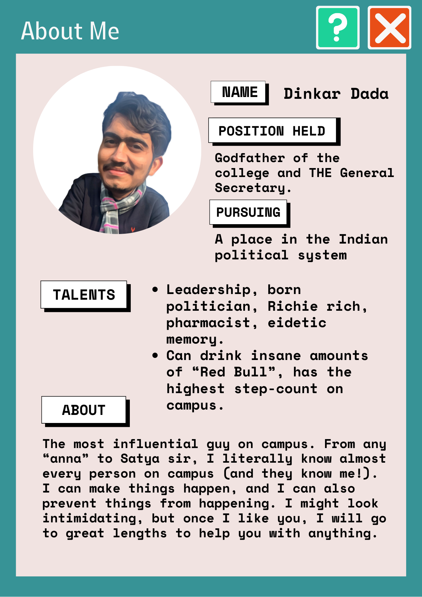
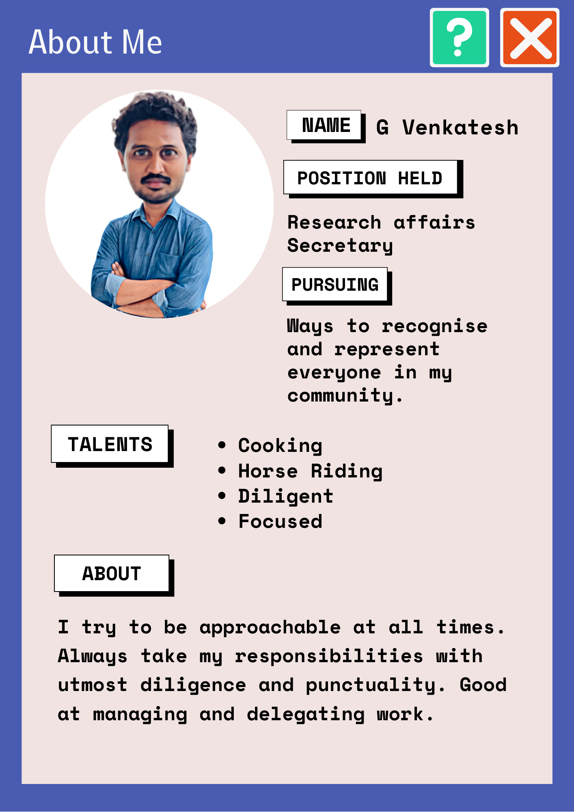
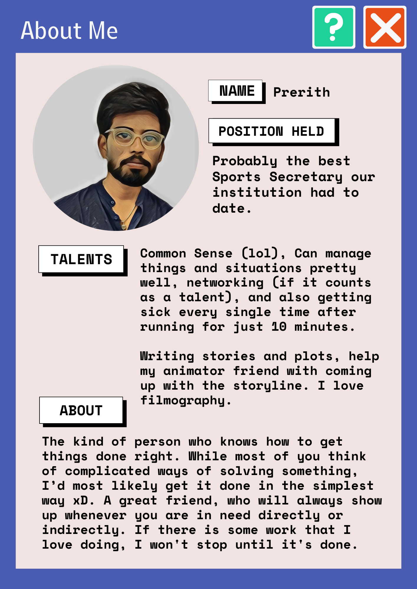
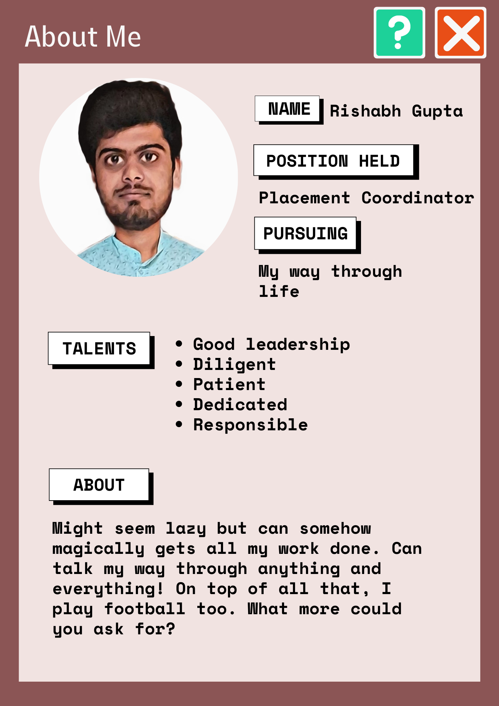
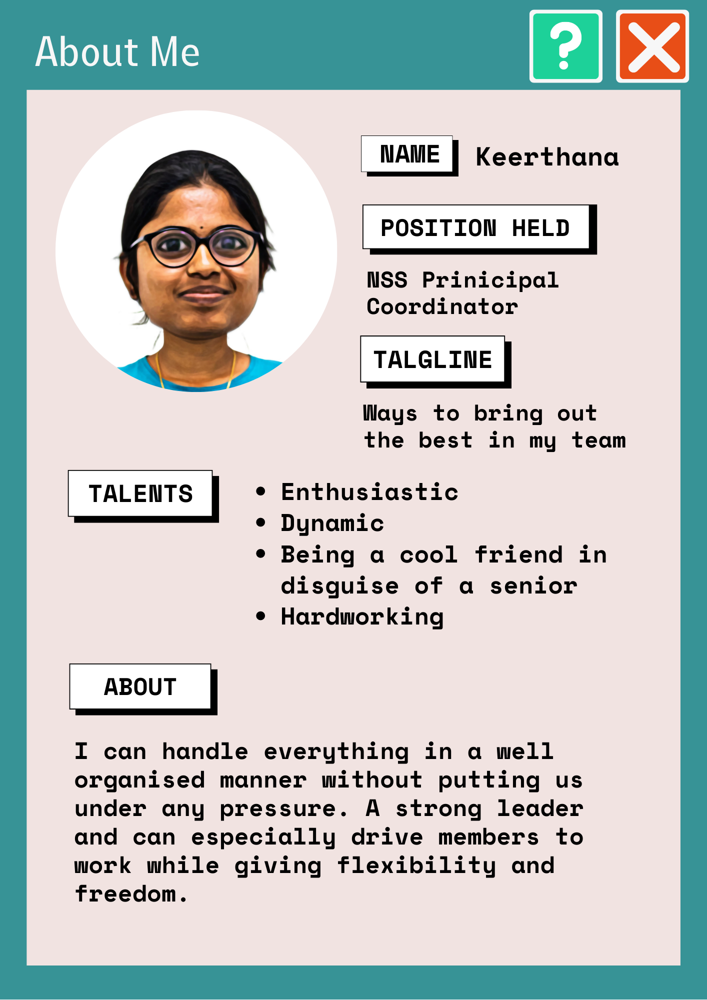
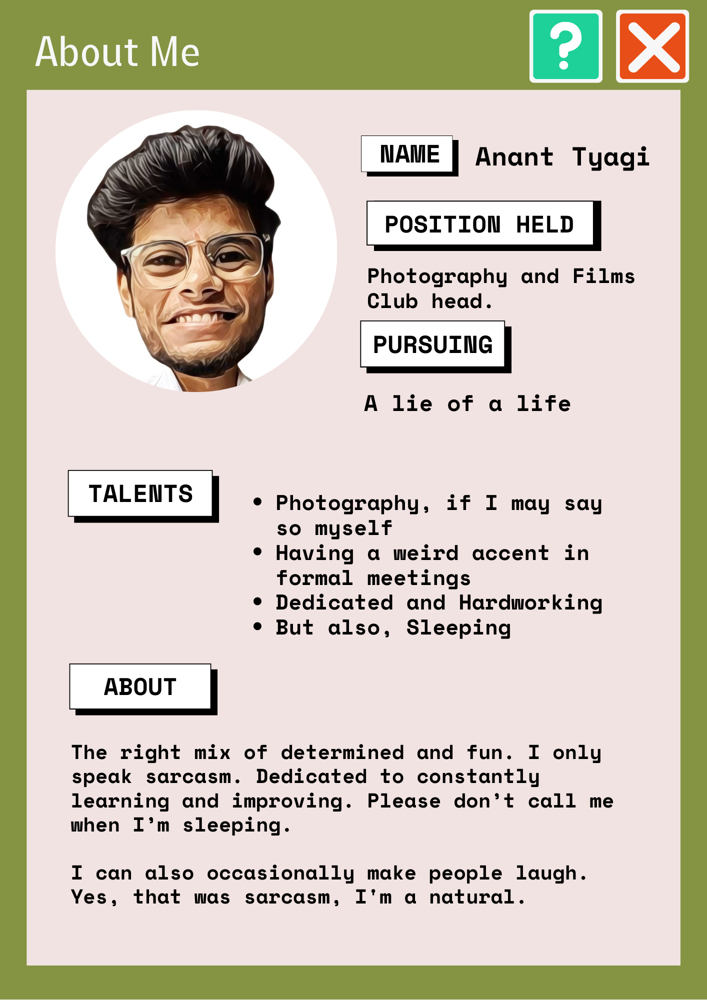
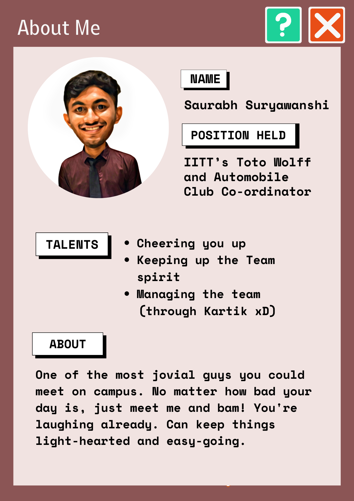
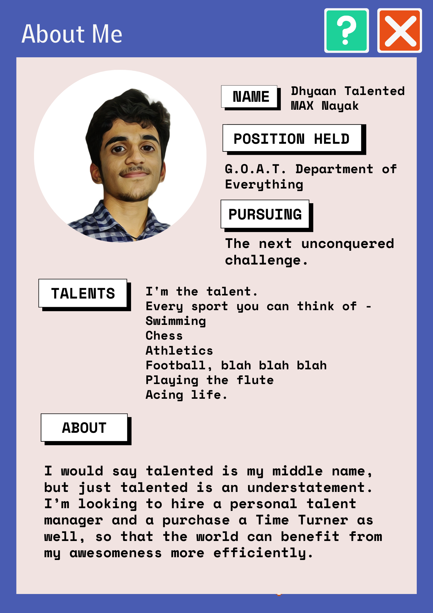

The last year witnessed some major changes like adapting from the online environment and witnessing a multitude of offline events and opportunities, thanks to our student representatives.

From handling the transition smoothly to launching full fledged initiatives, our student council worked towards constantly entertaining and providing opportunities for the community. It goes without saying that they deserve an enormous credit for all that they've accomplished.

Hence, we set to gather some of our deepest sources to present these resourceful comical social profiles for our representatives. Adding a little bit of an Udaan touch, join us as we unravel our most beloved student council.

-------------------------
## Secretaries

Starting from the elections to the end of their tenure, studies report that secretaries often feel like they have no idea what they're being blamed for. Their daily life includes waking up to get hit with a randomly tagged mail about the most random issues. The secretaries put tremendous effort throughout the year in ensuring a decent amount of the grand promises on the manifesto are fulfilled. Let's take a look at what our secretaries have to say about their experience.

-------------------------

<b>Dinkar</b>

 

*Students General Secretary*

---

**Most Commendable Achievements from his tenure as the SGS**           
From managing the campus bio-bubble and handling quarantine to containing the campus outbreak, he was instrumental in helping out the institute and students with regards to navigating those rough waters and resuming normal student activities on campus after almost 2 years. With a strong, progressive stand on student issues including hostel in-times, Dinkar has ensured smoother sailing for all students ahead.

**Dear Future Secretary,**                  
Try to approach the administration well in advance for issues students are facing or any proposal you have in mind. Last minute proposals are not taken into consideration because proper thought process can’t be put into them from the admin side.

Always take students into confidence about the decisions or discussions happening in institute level committees.

---------------------

*Thoughts and reviews from the student community*

> The most dedicated and hard-working guy who can get things done. One-man-army. One who knows EVERYTHING in IIT-T. A curious listener who will extract every bit of information from you. Never found in the room. Always ready for late-night parties.                        
>
>*-Arpit*

>No other student on campus has connected with everyone, be it security, staff, faculty or students as Dinkar has. As a consequence, no one else understands the working of the institute as well as him. No wonder then that he was involved in almost all decisions and committees the past year, be it COVID, Academics or HoME.     
>
>*-Shreyansh*

>A mastermind. He’s the mind you want to have in your team. His assurance and presence can give us the confidence to achieve few impossible tasks. A person with diverse mentality and a good friend. His greatest talent is his convincing skills and bold nature. He can literally convince any higher official with his words and can go against the whole institute if he feels it’s right. He did have a few accomplishments like successfully handling a protest(inside campus), lifting the restrictions of the girls' hostel and handling the situation of congestion in boys hostel during Covid time. These are actually enough to explain how greatly his tenure has been. Overall, he is everyone’s godfather.                 
>
>*-Yerra*

---------------------

 

<b>Tapish Kumar Ojha</b>

 

*Academic Affairs Secretary*

---

**What is your most commendable achievement from your tenure as AAS?**       
This was the academic year when ERP was intoduced in our college for the first time and all students began to use it for course registration. Since everyone including the academics section were new to it, it was really difficult for them as well as the students to use it smoothly. So a lot of issues arose during this period irrespective of the time. There were instances when I had to talk to Arun Sir and sort the issue out even at midnight. A lot of extensions in the deadline were requested. The drive was not smooth but was successful anyways. Although there were other issues with it, I was still happy that everyone registered successfully 😅.            

**Any regrets regarding your tenure?**       
I was not able to coordinate with my team well. Starting off with hybrid mode, there were no physical meetings, then the main problem was all the students who faced any kind of issue or doubts contacted me directly and I was unable to refuse to help them. Most importantly I wasn't  able to make them understand the process that had to be followed in order to sort out a query. I was hoping that they would stick to the correct workflow where the students could reach out to the CRs and their issues could be conveyed to the AAC members and then to me.                            

**Dear Future Secretary,**                          
Make sure you figure out and inform the students about how and whom to apprach in case of any queries or issues. Keep the CRs and the members of AAC in the loop, so that everyone will know the answer to common queries. This will make your work easier.

---------------------

*Thoughts and reviews from the student community*

>In a year which saw the institute transition back to offline classes and exams, we students couldn’t have asked for a better AAS than Tapish. A year or so of online functioning had seen a communication gap and friction appear between academics and the student body. Tapish bridged this gap, making sure that student grievances were put forward and redressed in a timely manner. With initiatives like a Career development Forum to connect students with their peers and alumni for guidance regarding higher education and placements, the impact of his tenure will be felt long after he’s left!            
>         
>*-Shreyansh*

>Tapish helped pull off something nearly impossible - modifying the timetable for the students interest in a system where EVERYONE says “I can’t do anything about this, please ask X”, and then X goes on to say the same! The guy can beat the odds with his talents. Kudos to him for doing wonders in spite of the difficult circumstances.       
>
>*-Debeshee*

>Here is one such person who bothered Tapish with all such doubts/queries he mentions above. 😅 But honestly none of the messages were left unanswered (Even when he was the Events Management Head). Getting such messages from everyone is truly overwhelming but you handled the situation like a pro. It was wonderful working with you as part of the AAC (probably didn’t do much). It was an awesome learning experience because of which I can now proudly say I know how certain things work in our college.      
>
>*-Sneha*

---------------------

 

<b>Venkatesh G</b>

 

*Research Affairs Secretary*

---

**What was the best part of being the RAS?**             
I learned how the administration process works in the institute. Democratically represented my views to the authorities without any coercion and I have maintained good cordial relations with the scholars, and the administration (Faculty & Staff). I thought the scholars who hadn't returned to the campus due to Covid restrictions wouldn't know my face, but surprisingly now they all are recognizing me without any acquaintance.

**What is your most commendable achievement from your tenure as RAS?**  
I was always approachable to the scholars at any time either through phone or email. I was diligent to respond to their concerns and tried to resolve the dynamic issues with the help of concerned authorities.

I thank my research affairs council members & and our 2021-22 batch secretaries for their continuous support during my tenure.                              

**What do you wish you’d done differently?**       
Firstly, I had a wish to make every scholar happy with my representation, but in reality, it is impossible. Individual opinions always conflict with group interests. Finally, I  decided to prioritize group interests over individual opinions.

**Any mistakes that you want to warn your successors about?**             
Don't take any responsibility beyond your arm's length.

**Dear Future Secretary,**           
All the best!!!!               
Just go with the flow.            

---------------------

*Thoughts and reviews from the student community*

>He is a level-headed person. He maintained a good share of goodwill with research scholars and administration. This allowed him to put the concerns of the research scholars before the administration with much ease. He was also good at managing the team by delegating the work to the committee. I would say his term as the RAS was majorly hassle free.       
>
>*-Ishaan*

---------------------

 

<b>Suman P</b>

 

*Hostel Affairs Secretary*

---

**What is your most commendable achievement from your tenure as HAS?**     
Managing quarantine with limited rooms and furniture.       

**What do you wish you’d done differently?**        
I should have made hostel representatives more accountable to the students.

-----------

*Thoughts and reviews from the student community*

>Suman has this beautiful, beautiful aura - you always feel like telling him your life problems, and he listens so sweetly, with the perfect facial expressions and responses, it often feels like he solves 68% of the problem, even if he can’t possibly do anything about it! And when it’s a problem he CAN do something about, he goes great lengths to get it done! He’s a true asset!       
>
>*-Debeshee*

>Suman is the most student friendly person I've come across who took immediate action to solve problems raised by the students. He is so polite and respects everyone, from the highest authority to the cleaning staff. He never gave up on students' interests. He believed in people working with him and gave them full freedom to work. I have never seen him taking a decision without discussing the issue with the seniors and the council members to come up with the best possible solution. I personally learned a lot from him and admire his work ethic.
All the best!!    
>
>*-Jose*

-----------

 

<b>Choppala Suhas</b>

 

*Mess Affairs Secretary*

---

**What is your most commendable achievement from your tenure ?**               
I was able to work with more dedication than I ever thought possible. Working with a great team and changing the mess tender is one of my great achievements.      

**Any Regerts or anything you wish you'd done differently?**
In the beginning of my tenure, I use to look into some unnecessary conversations happening around in the WhatsApp groups and other platforms and felt bad about the comments and stuff. Later I got habituated, people always say things. But I regret caring about this in the beginning.        

**Dear future secretary,**             
Be open to suggestions and stay dedicated towards your work.

-----------

*Thoughts and reviews from the student community*
>Suhas and I met for the first time on our fresher's night, and his sincerity has always surprised me. He was the type of guy who was always eager to explore and master the unknown. His ideology of dealing with issues and his calmness moulded my way of analysing and solving a situation.           
>
>When we returned to campus after the devastating second wave of the COVID-19 virus, the situation was chaotic; he inspired us with his hard-working nature and determined character. During the tenders for the mess contract, he worked and fought for the students to ensure we all got better food at a lower cost; he always tried to do his best in the students' favour. He ended his term on a high note by instituting ice cream night on campus and inspired not only our batch but also our junior batches to do their best in whatever duties they are responsible for.       
>
>*-Charan*

---------

 

<b>Natesh Aravind S</b>

 

*Technical Affairs Secretary*

---

**What is your most commendable achievement from your tenure ?**      
- Finally purchased a good telescope for our insti!
- We started the first Tech Summit, a series of Intra IIT tech competitions (with the hopes of seeing this transform into a tech fest in the coming years)
- We setup the ideasquare room with most of the necessary equipment for students projects
- got some good industry colaborations
- Apart from that, the main challenge is getting students interested in these activities and clubs moving forward from the initial basic level stuff and start to work on more complex and advanced projects. We took the first step in solving this by revamping the club's org structure and introducing interest groups and tech teams.

**Any Regerts or anything you wish you'd done differently?**                
- Main regret is letting people who didn't know how to use the 3d printer use it. Here's a message for students: if are interested in something like 3d printing and you want to use the machine, better learn how to use it, no one is going to (and no one is expected to) do your work for you just because they are part of the club core. They can teach you, but not do your work for you!! lol.                  
- I also regret not getting the impressed budget plan for ideasquare (basically a monthly budget) approved in my tenure, but I do hope the next team will get it approved asap.               
- Another regret is definitely not being able to properly renovate the ideasquare room like we planned. Though that was mainly because of pressure from above.                                
- One last thing is I didn't give any goodies for students who won in Intra IIT Tech summit when all others did (we did give prize money though).      
- Even though this one is not on us, the online Inter IIT Tech Meet was unfortunately a big flop due to the unethical way it was organized. Hope it didn't demotivate anyone. Never let IIT KGP organize anything ever again or simply don't participate in the events they organize (We have seen the toxic culture they follow and how it reflects in the events they organize way too many times.
- Apart from this I feel like I didn't oversee the activities of Digital Wizards and E-Cell as I was a bit too busy with Techmaniacs, Ideasquare and Gagan Vedhi. While the Digital Wizards team did a phenomenal job the E-cell team utterly failed in organising even a single event to promote entrepreneurship, which was reflected even in many of director's remarks. In retrospect I should have helped them more and focused more on that side as well.

**Dear Future anybody who takes up a tech-related POR,**    
- One suggestion will be for clubs' core teams to focus on actually doing projects (which will help their CVs as well) rather than simply organizing workshop after workshop every month, all the KT stuff needs to happen within the first month of the joining of first years, and later on the focus should be on projects and clearing doubts for freshers.
- Regular open house to show these projects should also be organized. This way other students will also be able to see what all they can do if they join the club later. Moreover, more visibility a club gets through the projects they work on, it will definitely help in many ways like getting more budget, more collabs with companies etc.. (What you show is what you get).
- Also one way to maximize audience is by having fewer but more marketed and inclusive events like the Tech summit. Try to get outside speakers like entrepreneurs etc... to these events, as next year one of the main focus areas for TAC and E-cell will be to properly setup the startup pre-incubation hub and motivate entrepreneurship more among students.

-----------

*Thoughts and reviews from the student community*   

>This guy is full of ideas and loves to work on them! You can go to him and strike up a conversation on any idea, and he always has plenty to say! And he has very specific preferences and ways of doing things, and tries his best to get them implemented wherever he can. He cycled through all the To-Do list apps on the play store until he found one he could work with! He's also a really good team player, and makes sure that all the work he takes up gets done well.
>
>*-Prabhat*

>Natesh is an inspiring and visionary leader. During his tenure, he constantly motivated us to come up with creative ideas and restore the technical culture of our college.
>
>*-Venkatesa*

-----------

 

<b>Yerneni Sri Shakunthala</b>

 

*Cultural Affairs Secretary*

---

**What is your most commendable achievement from your tenure ?**           
The first big cultural event that we celebrated in college after the COVID break was Diwali. The institute was calling students back in batches and our team was not completely on campus by then, so the transition and communication was a little tough along with the COVID restrictions but at the end of the day, we were happy with how everything worked out as we got positive feedback from the students.         

One of the most heartwarming moments was from the Signature day event conducted for the graduating students. We knew the event was a success once we saw their faces and overheard them saying “badia cheez hai bhai!!” with joy.                       

One of my favourite events was Christmas. For the first time it was celebrated over two days and many students enthralled us with their talents!                            

**Dear future secretary,**              
Well, we always try to give our best for every event. But it's important to listen to the feedback after the event and improve on it in the next instance.

-----------

*Thoughts and reviews from the student community*

>I admire Shakunthala’s patience and hard work on all the ‘behind the scenes’ effort that needs to go into any student organised event on campus. It's not easy at all, working with multiple interesting people both inside and outside the institute, without getting frustrated. So kudos to her for keeping it up throughout the year!
>
>*-Debeshee*

>Apparently, this has to be 50 to 100 words about the talents of my close friend, Shakunthala, the cultural secretary, oh yeah... the former cultural secretary. She has the talent of doing all the work just by sitting in her bed the whole day. Don't mistake it for her laziness. It's an art, and she is an artist. Only she can make our great director and DoSA laugh in the meetings. She is the first-ever secretary to be on the meme page.
>
>*-Keerthana*

-----------

 

<b>Prerith Sagar S</b>

 

*Sports Secretary*

---

**What was the best part of being the SS ?**      
Best part of being any secretary is the ability to bring changes. The fact that I was able to get jerseys for everyone who participated in Kridaan is one thing I am really proud of. Also there were instances where the previous Intra IIT was halted due to fights among students (not the sole reason). I am proud of the fact that we conducted Kridaan in the most peaceful manner. Students took everything with a sporting spirit. And we saw commendable participation from  women as well. This lays a good foundation for the next inter IIT Tournaments.

**What do you wish you’d done differently?**   
- Budget Planning. Plan for everything from the beginning. I couldn’t get this done because of the online-offline ambiguity. However the funds were approved later. But doing this before is less complicated.    
- E-sports is another aspect I lost track of. I hope the next secretary launches and lays foundation for this gaming culture.

**Dear future secretary,**             
Learn negotiating and management skills. I learnt it the hard way. Being too polite doesn’t work. Fight for what needs to be done and be assertive and confident. Take a stand and convince people. At the end of the day, this is a learning experience.

-----------

*Thoughts and reviews from the student community*

>Super practical, efficient, jovial and fun to work with!   
>   
>*-Debeshee*

>I think he's the most casual and chill person you'll ever meet. One will never feel burdened working around him. The way he carried out the events, either the Winter tournament or the Intra IIT, with calmness and composure is just incredible. Going to miss those late-night chit-chats about organising sports events and seeing you bossing around the sports facilities.
>
>*-Dheeraj*

>Being in a POR during the pandemic time has been a tricky job for all, but I believe that even with the hurdles, he has been one of the best sports secretaries our college has ever seen. Conducting winter sports tournament, Kridan, and other tournaments successfully with a little experience is a great accomplishment. These tournaments have improved both in terms of conducting and participation. From my first year till now, I have seen an increase in the number of people showing up for playing sports. Not only in terms of conducting these events, I feel that he has also done well in managing his committee and bringing in new reforms, like the hall of fame, etc. Though it is not possible right now, I would have loved to watch our college get some real wins in Inter-IIT under his leadership.
>
>*-Srikarah*

>An adventurer. After he was elected as a sports secretary, I was worried how he would take up the resposiblity because being the SS is not easy. Selecting me as part of the sports council, further enhanced my doubts on him. But after being a member of his council i got an oppurtunity to witness first hand the way he planned various activities, and events. This changed my opinion of him. Organizing KRIDAN followed by prize distribution ceremony on Gymkhana day is a mind-blowing situation that has left me perplexed.Kudos!! He is a person who takes pride in his work and make sure it never fails at any cost. Most important of all, he’s a hard-worker and a great friend.
>
>*-Yerra*

-----------

 

<b>Prabhat Reddy</b>

 

*Literary Affairs Secretary*

---

**What is your most commendable achievement from your tenure ?**     
If I had to mention my most important achievement, that would be the LAC. Everyone in the LAC is interested and have contributed to lots of activities in their own way, and while I can't take credit for their existence and their awesomeness, I will take credit for assembling this passionate little team! We had meetings every once in a while and we came up with a bunch of ideas, most of which never saw the light of reality. But the few ideas that did, did have a lasting impact. And I believe that's important, because it encourages ideation and reinforces the belief that any idea can come to fruition if we diligently work towards it!              

One example is "Have we met before": the first ever event that the LAC as a whole had organized. While the primary aim of the event was to increase the senior-junior interaction in the online mode, there was another agenda: to organize a large scale event that would bring the newly formed LAC together. While the idea of the event was inspired from the "Icebreaker session" held in December 2020, the planning, organization and execution took a complete detour. The event was organized on Discord and all the participants were divided into teams of 5-7, among which there was a volunteer who engaged the team and held activities. The amount of planning that went into it was insane! And I think that the success of that event set the environment for everything that followed.                  

The year was full of challenges, but the most important one was getting work done while involving more people. I often came across cases where I could just take up all the work myself and get it done, but doing so wouldn't have been inclusive to people. I believe that it's important to involve people in work, sometimes even at the cost of finishing the work, to build a team, and I'm proud of the fact that I continuously tried to align my actions to this belief as much as I could. And I believe that helped!          

**What do you wish you’d done differently?**     
I did take a lot of decisions that I would consider mistakes, in the sense that I could've made other choice that lead to better outcomes. However, I don't think I would change any of that, and I couldn't have as well, because the past me couldn't have known any better, and I wouldn't be the same person I am now!

**Dear Future Secretary,**             
If there's one thing, that is to "remember your role". The Literary Affairs Secretary is a student representative i.e. the LAS must represent the students' interests. The LAS isn't a CEO, they mustn't represent their own ideas all the time (doesn't mean they must refrain from doing it at all). The LAS isn't a boss, they do not have the right to boss around people and get work done (they do reserve the right to kick people off the LAC though). The LAS must understand the role of the representative and act like one, and this must reflect in all their actions.                               

I used the word "LAS" above, but I believe this applies for all the student representatives. All the above isn't a written rule. This is my perspective and I believe I stood by it!                  

-----------

*Thoughts and reviews from the student community*

>I don't know anyone else apart from Prabhat bhaiya, and he's the SWEETEST 4th year guy I ever met. Totally down to earth, amazing personality, funny and appreciative, what else would you want?
>
>*-Keshav*

>Prabhat is a super casual and fun person, who simultaneously maintains a sense of professionalism and informality. He is in short a comfort character who you can freely talk to about anything. He is always open to interesting conversations and always has a new point of view for anything and everything. His way of simultaneously maintaining a casual, fun environment and a strictly documented formal work flow is commendable. Overall, it is a joy to work under and with Prabhat.
>
>*-Sathyanarayann*

>This year by far has to be the golden year for literary affairs either in terms of events, participation or perception. His term accomplishments for literary affairs through the organisation of events (have we met before, etc) or fests (fiesta) can be considered as a huge leap for increasing literary culture in IITT.   
>
>*-Preethi*

>My interview for the LAC comprised of 40% purpose, 50% random topics and 10% lame jokes. I think this adequately sums up Prabhat.
>
>*-Krithi*

>You need help with anything… Just call Prabhat. The multi talented persona you are sooper lucky to meet.
>
>*-Sneha*

>I’ve never met anyone who takes the ***people*** aspect of leadership and change more seriously than Prabhat, as compared to actually getting work done. As a result he didn’t just contribute to the Literary Affairs of IITT, he changed lives and their relationships with literary affairs. If you get a chance to work with him, you’ve probably saved up nine lives worth of good karma! Good for  you!
>
>*-Debeshee*

-----------

 

<b>Rishabh Gupta</b>

 

*Placement Coordinator*

---

**What is your most commendable achievement from your tenure ?**
1. Core dream offer policy - allowing students placed in non-core companies to use their dream offer for core companies irrespective of the package details.       
2. 6 month internship - framing a way in which students can do 6 month intern in core companies alongside their academics. This increased the number of core opportunities in the institute.              
3. Formation of sub teams for the career development activities namely -  
&emsp;&emsp;a. Mock Placement Team 
&emsp;&emsp;b. Student Repository Team 
&emsp;&emsp;c. Social Media Outreach Team 
&emsp;&emsp;d. Placement Talks Team       

**Any Regerts? or anything you wish you'd done differently?**    
Improper planning of Student Repository and maintaining it.

**Dear Future Placement Coordinator,**                  
Maintain the repository from the very beginning.                                     
Before students sit for any company, connect them with the just graduated batch students who are placed in that company.

-----------

*Thoughts and reviews from the student community*

>His term was just after the second wave of Corona. I've seen him work hard for the placement of each and every student. There are people who exploit the power given to them but he knew exactly how to balance everything. He'd be bold while negotiating with the companies to come to the college and he had even spoken to a lot of them which none of the previous Placement Coordinators had ever done. All in all my respect for him as a friend, human and roommate grew over time as I saw him succeed.
>
>*-Aditya*

>Rishabh did a super awesome job at being a PIC despite him already being placed. Bonus points, he also plays good football.
>
>*-Prabhat*

-----------

 

<b>Amit Kesari</b>

 

*Internship Coordinator*

---

**What is your most commendable achievement from your tenure ?**
One of the proudest moments for me personally was when all my batchmates, especially my friends received their internship offer. This had seemed like a distant dream at the beginning of my tenure. When I received emails about shortlists and people's selection, it felt like one more step towards the summit on sending them the "Congratulations!" mail. Also when few students gave their thanks for the CDC sessions and mock rounds, it felt great that all our genuine efforts towards helping the students was being appreciated.

**Any Regerts or anything you wish you'd done differently?**   
Since this was the first time IGC position was brought into the Secretariat, along with the positives and the great things that happened throughout the year, one thing that I would want to do differently would be to make the students more aware about the global scenario we are living in and also to do justice to students who think that they were at a disadvantage because of me.

-----------

*Thoughts and reviews from the student community*

>So, I met Amit on my second day at college, and from that day till now, I find him highly hardworking in all the fields he works in. We even call him a "robot" for his dedication. He likes to help others; He is my coding guru and a great friend. He is all set to be the next Satya Nadela, and I am sure he will be. He knows how to work under pressure and manage a team, so I would say he was and is the best person to be IGC. He is very caring and his favourite sweet is ras malai, something he loves more than coding or helping others.
>
>*-Aditya*

>Even though IGC position was introduced for the first time, I felt that Amit did justice to the position. He used to communicate about everything on time and the queries were being resolved very quickly. He created a timeline for all the company events that would take place so that it would be useful for the students. Regular reminders were sent regarding different companies' application processes. We can even see that 150+ students have got internships which is a big number.
>
>*-Sowmya*

-----------

 

<b>Mohd Aasim Khan</b>

 

*GCU Head*

---

**What was the best part about being GCU Head?**           
The best part of being the GCU student head was to hear the word "Thank you" in a low soft voice when people express their journey either to us directly or when we become their mediator in arranging counseling sessions. It just gives a feeling of being noble and helpful amidst all the chaotic things I find myself involved into. A breath of fresh air, a pat at my own back. Those feelings are lovely!   

**What were your most commendable achievements?**                                                                               
It was creating solid steps for creating awareness about mental health and remove taboos regarding counseling. I am proud that by the end of my tenure my council had set a stern foundation for the functioning of GCU which was a challenge given the hybrid scheme of things going on in our life. And as you know when you have the basement ready, several floors can be added into that building!

**Do you have any regrets regarding your tenure?**                                                      
I wish I could have been better in assigning tasks to my team members so as to make them more involved in the work. And would have included more members in the council to have more fun based activities in the campus from GCU side.

**Dear Future Head,**         
Do lead your team by example but do ensure every member in your council is involved in the tasks assigned to them. At times, I took charge of tasks allotted to a part of my council. It resulted in their apprehension that Aasim will do it. Try to ensure full cooperation with Dr. Pooja V. She is  the actual driving force for the resurgence of this unit.

-------------------------

*Thoughts and reviews from the student community*

>Aasim is a hard worker who is willing to give everything he has to the tasks that have been assigned to him. As GCU head for the 2021–22 academic year, one of his goals was to increase GCU's reputation among IITT family members and promote the GCU motto to encourage those in need of assistance to go ahead and seek it with confidence. Another challenge was to spread awareness about GCU's presence, which he attempted to do by planning several student seminars and developing the Sarathi website and Instagram account. Since maintaining privacy is of the biggest importance for a GCU student head, I have personally observed him considering how he could assist people while maintaining complete anonymity. He gave it his all to create the GCU constitution, which will serve as a guide for all the new members. I recall an instance when a person published an anonymous Instagram post about an incident that happened, Aasim took the initiative of asking for information about it with the intention of offering assistance and support. I'd want to wrap up by saying that the entire GCU team, including the faculty advisor Pooja ma'am, put a lot of effort towards helping people and eradicating stigma surrounding mental health throughout the previous academic year.
>
>*-Dinkar*

>Search for qualities of a good counsellor and you'll get good listener, patient, observant, compassion as the go-to traits. Aasim embodies these. Even more, he embodies dedication and in a year where students and faculty were reeling mentally from the worst of Covid, GCU needed someone like him at the helm to guide all those who needed help.   
>
>*-Shreyansh*

-------------

 

<b>Keerthana Reddy</b>

 

*Principal Coordinator, NSS*

---

**What were your most commendable achievements during your tenure?**               
We, as team NSS conducted blood donation camp successfully. We also made NSS IITT instagram active. These are some of the achievements which I am really proud of.          

**Any regrets or changes that you wish you had made?**            
Not mistakes but it would have been much better if it was offline.

**Dear Future Coordinator,**                 
Conduct many offline events. And as she was part of the team last year she knows it.

-------------------------

*Thoughts and reviews from the student community*

>A really interesting term, learnt a lot of things from her about Social Service; The whole team learnt a lot.
>
>*-Ganesh*               

>As far as I observed, even in any hectic situation, she handled things in a cool way and her team managing skills are always awesome!                   
Also, she was always available to reach out and responded immediately which helped team to perform better
>
>*-Chandni*

>Apart from those sudden meetings regarding work progress which were being planned at a very surprising point of time , working with her proved to be productive. She was my go to person whenever I have some doubts regarding work.      
>
>*-Swathi*
 

--------------
## Coordinators

Apart from the mail where coordinators are announced, research finds no name of coordinators in any credit forum. They take care of everything from handling all the technical work to constantly improving the club and its policies, organising a new set of events and revamping the old events and also avoiding empty promises of prize money. Phew! Its high time we give them the well deserved recognition.

-------------------------

<b>Debeshee Das</b>

 

*Coordinator, Sargam, Music Club*

---

**What is your most commendable achievement from your tenure as the coordinator?**                             
'Just Classical Indian Things' was an initiative designed to present classical music, through music, story telling and visuals, in a way that was alluring to people from our generation who were not familiar with it formally. The participants, around 10 of us enjoyed it immensely, and the audience feedback was really warm and unforgettable! The challenges were that we were in online mode and everyone had time constraints and professional commitments to balance.

We had collaborated with PFC on the project, and I was very happy with how everyone involved in it was glad to be a part of the experience. Apart from this, putting the Sargam band back together and performing on Ethnic Night in spite of the logistic issues was incredibly memorable!

**Any regrets or changes you wish you could make?**                      
The process of making purchases, especially expensive equipment, is not clear to most people. Anyone can be misled. It's best to double check the directions you are given and check with someone higher up in the admin in case anything seems unusual.

In general, I made the mistake of trusting other people to do their job well and it didn't work out a few times. It's best to be mentally prepared for the unexpected and come up with a back up plan.

**Dear Future Coordinator,**                           
Anything involving the admin takes time so start reaching out well in advance. Having a permanent safe space for both Sargam's instruments and its people is long overdue - I hope it can be arranged soon.

---------------------

*Thoughts and reviews on their term from the student community*

>She's really supportive, welcoming, and easy-to-talk-to.
She's just perfect for the role of a club's coordinator in my opinion. The most important thing that I learnt from her was that we don't need to compromise with our academics to pursue our passion. Both can go hand-in-hand, just like that.
>
>*-Akshat*

>IITT’s first-ever Sargam Mommy set a great example of how to have fun yet come up with great musical stuff throughout the year (be it offline or online)! From exposing Indian classical music to a large audience to putting back the band together, she has achieved so many milestones in just one year. And the best part is she involved many people in the process, allowing them to learn about Sargam and making them ready to become coordinators and co-coordinators in the future!
>
>*-Sibibalan*

>I've always found it inspiring how debeshee manages all the work at hand and is still somehow chill! It's been a wonderful experience working on the team and simply vibing along with her!
>
>*-Krithi*

>Hands down the best person on campus. If you haven’t met her, don’t worry she’ll come and meet you.
>
>*-Sneha*

-----------

 

<b>Anant Tyagi</b>

 

*Coordinator, Photography and Films Club*

---

**What is your most commendable achievement from your tenure?**                    
I think my team tackled the online offline transition really well, even though everyone had very little time to adjust. We made a short film and the Freshers' Introduction Video entirely online and also conducted many contests. Then we came to the campus and tirelessly covered Tirutsava (and various other events), sleeping just 3 hours a day. I'm really proud of my team for giving their hundred percent to everything the club did.

**Any regrets or changes you wish you could make?**                    
A lot of students were very enthusiastic about workshops regarding photography and DSLRs. We tried to make it happen but the offline semester was too stacked with events that we had to cover. We're eagerly looking forward to fix this in the upcoming academic year.

**Dear Future Coordinator,**                     
Our club just gets questioned a lot. Make sure we answer with our dedication and our work.

---------------------

*Thoughts and reviews from the student community*

>He has shown remarkable leadership skills and knows how to work as a team and guide the members of the core team and motivate them to get the job done. He is skilled, passionate and is someone who would do whatever it takes to get the job done. It was a wonderful experience to work under him.
>
>*-Sathya*

>I love how Anant is incredibly fun and chill, and at first glance doesn’t fit the stereotype you’d expect from someone running the most hardcore club in IITT.
>
>*-Debeshee*

>All the PFC stuff aside, Anant is an amaa...zing poet. If you didn’t know this before, go and check out his poems in Udaan. They’re just so relatable and so well written. Your poetry  makes people float. Never stop writing.
>
>*-Sneha*

>A goal-oriented person who works hard at things he's passionate about, resorts to sarcastic humor in almost everything else! He's very nice to talk to and he's quite an easy going person in general. It's often the case for most clubs that the club coordinator keeps motivating the core team and takes things forward, but for PFC, it felt like the entire core team supported each other very well, encouraging the coordinator to put in more efforts. It's quite a challenge to keep up the standards that the PFC has set over the years, and covering all college events consistently isn't an easy task, but Anant and team have done a really good job at that! Watching them work, to be honest, is quite inspiring.
>
>*-Prabhat*

-----------------

 

<b>Matcha Jabili</b>

 

*Coordinator, Actomania*

---
**What is your most commendable achievement from your tenure?**                  
My proudest moment in my tenure is a successful event (DUMB CHARADES) where around 50 members participated and also gave great feedback!

A workshop we conducted for the 1st year batch gave us lovely satisfaction!

**Any regrets or chanegs you wish you could make?**                         
I was unable to conduct more offline workshops and events due to hectic academic schedule and covid. That's only my regret in my period of coordinator.

---------------------

*Thoughts and reviews from the student community*

>Jabili always knows what the people want! She’s exactly who you want in any ‘Party Planning Committee’!
>
>*-Debeshee*

>I know Jabili as my friend and Actomania Club Coordinator. She is enthusiastic, exciting, and down-to-earth, constantly exploring new things. As a friend, I am grateful that she took up the responsibility of being the Actomania club coordinator and did justice to it by fulfilling her role and responsibilities successfully. Though she was leading the club, she participated in some events herself without any discrimination from the club. She conducted many successful events, which increased interaction among the students.
>
>*-Manoswitha*

--------------------

 

<b>Gurram Lakshana</b>

 

*Coordinator, Artista*

---

**What is your most commendable achievement from your tenure**                                                  
Offline events! I didn’t think they would work out and that barely ten people would show up because not many people find art to be fun and truly relate to it. Not everyone gets it right?  But there were over 40 people! (Which was a little bit annoying because too many people is too much work, lol!) But it was awesome because everyone enjoyed the events. Especially the freshers. The team was amazing with marketing. They made sure more people would join us for events. I did feel very proud of our team, looking at everyone having a great time with  arts.

**Any regrets or changes you wish you could make?**                                             
Covid gave us no time at all to actually get the students more deeply involved in Artista. I could've done something about that but we already had too many events lined up because of Tirutsava , Fiesta and 75 years.

**Dear Future Coordinator,**                                         
I believe you will do it right because hopefully you also would've been in the core team in the past year and seen what needs to be done and how.

---------------------

*Thoughts and reviews from the student community*

>Lakshana has boxes of art supplies floating around her, and if that isn’t enough for you to fall in love with her, she’s also incredibly kind, sweet, caring, talented, calm and loyal. You CANNOT find a more perpetually sleepy yet fun person on the planet! She’s too cool for life…
>
>*-Debeshee*

>Literally one of the coolest people on the campus. Lakshana has been an amazing Coordinator for Artista, and I had a looot of fun working under her. Work never felt very serious, we would always just chill and have fun… and we would vibe SO HARD! From relating to each other in a lot of stuff, and sending memes to each other and fangirling about tv shows to gossipping about anything and everything, Lakshana is the perfect person to talk to for a refreshing and wholesome chat, at any time of the day
>
>*-Sathyanarayann*

------------------------

 

<b>Durusoju Ajay</b>

 

*Coordinator, Xcite CLub*

---

**What is your most commendable achievement from your tenure?**                                        
In college life experienced till now, getting into the dance core team in the first year itself and being a part of crew that represented our college in 2019 Inter IIT cultural meet. I have participated in both group and duo competition.

**Any regrets or changes you wish you could make?**                                 
I feel I should have made it more interactive. Primarily having few online and few offline made it difficult to conduct events adding to my prime procastination. Always have a to do list with specific deadlines.
And as for managing the work: should have distributed the work and assigned to the core team according to the appropriate time. This keeps the work system of club smooth. So always having the schedule of club planned and shared with core team helps in coordination.                              

**Dear Future Coordinator,**             
Bringing in the people, being on time when we schedule an events motivates the people. Maintaining this helps in having organising the event and calling in others and enquiring what problems others are facing without delaying the plans.                       

---------------------

*Thoughts and reviews the student community*

>Ajay is the most polite, cordial and sweet person you can have at the helm of anything! Supremely talented at dancing of course. And humble, helpful and fun!
>
>*-Debeshee*

>Heard about this character so collected yet so chaotic in a series-Dont know how he is at the eye of the storm yet bears a beaming smile.
I know these are all hangover thoughts after any fictional movie but what if there actually is a person who bears storm inside but still manages to win a lemon spoon race. Not only does he grooves with his limbs but also makes everyone's minds swirl. And who could actually do better than our xcite club coordinator, D. Ajay. This karimnagar boy became my first hang after coming to IITT. There is nothing special about him but he is an addiction! Usually expressionless but that vibe is priceless. After a dreary dusty day if you aspire for a person you really want to talk to- Its Ajay. A gifted listener, he has no demands-no expectations. This makes him extremely likeable, approachable and an interesting personality. This hide and seek lover has 100 tasks when I sleep and zero when I wake up. I have no clues how he manages chores. I guess that is why he is an excellent leader. He doesnt think leadership is about ordering people. Its more of involving them, living the experiences with them and teaching them the ways he knows to the best of his talent. You meet this person once and you can never forget the spark he carries for his life, be it family, friends, academics, extracurricular and XCITE.
>
>*-Abhimenyu*

---------------------

 

<b>Sneha M S</b>

 

*Coordinator, Debate and Oratory Club*

---

**What is your most commendable achievement from your tenure?**                   
Probably organizing the club mail handle and drive folder (Yes… Prabhat level documentation + Debeshee level organization). No offense to the previous coordinators, but the place was a mess. Jokes aside, probably the fact that we managed to conduct many debate and oratory sessions and participated in several inter college competitions makes me sooper proud and happy.

**Any regrets or changes you wish you could make?**                                   
One small regret is the fact that I came to know about this facebook page Indian Parliamentary Debate Calendar (which kinda has posts about every single debate competition in the country) after the first half of the year. Had I known of its existence before,  I’m sure we could have participated in several inter collegiate events in the odd semester as well.            

Other than this I pretty much enjoyed every single moment in the Debate and Oratory Club. With an awesome core team, even awesome trio of debate mentors and the best Literary sec ever there were no chance for regrets.

**Dear Future Coordinator,**                                     
People sign up to be part of the core team initially, because why not? Vacation time, not much academic related work and become a no-show later on. A friendly advice, recruit people who are active debaters. Because as a debate and oratory club core memeber there's really not much manegerial work other than, of course host sessions. Also try to do conduct activities in collaboration with the CDC.
All The Best!!!!                       

*PS: Please follow or keep track of the facebook page Indian Parliamentary Debate Calendar.*

---------------------

*Thoughts and reviews from the student community*

>Sneha has done an absolutely amazing job at heading the debate and oratory club. There have been numerous numerous debates which have been held in her term, and she has also ensured that no one gets left out due to any lack of knowledge. She has made sure everyone has access to all the sources they can improve themselves when it comes to debates. She is also incredibly knowledgeable in debate and was the perfect choice for coordinator of debate club.
>
>*-Sathya*

>The very first day for the debate, she managed to bring someone who had completely given up on debate and speaking in front of an audience(me), back into the game. That was perhaps the main, very impressive achievement in my eyes. Amidst the massive ships (other clubs), the debate club felt like a dinghy (owing to its size and other people's interest in joining or even looking at it). But with Sneha at the helm, we knew sinking was not one of the possible outcomes. Probably the only concern is that the debate club is usually revered as the most popular club in many colleges and over here, it felt like it never reached its full glory (this could be chalked up to many reasons but I believe the club head plays a part too).
>
>*-Akhil*

>Sneha is an institution! The consistency, grit, radical spirit and emotional strength to back it all up, apart from the obvious oratory, literary and people skills, is just awe-inspiring. I sometimes wish I could be her. Hands down!
>
>*-Debeshee*

>An extremely sweet person at heart, but extremely intimidating in the first interaction. Everyone I knew was initially scared of Sneha, and it's probably her bold but unique way of talking, I was never able to figure out why! And it's not just the way she talks, she's bold and confident in her actions too. And her work ethic is very inspiring. She does way too many things at a time, and till date, I have no idea how she manages to do justice to all of them!
On a work related personal note, she's very focused and a quick learner. I received a lot of help from her when I was LAS, and I knew that if she was taking care of something, I could rest easy and be assured that it would go well!
>
>*-Prabhat*

------------------

 

<b>Ayush Prasad</b>

 

*Coordinator, Quizzing Club*

---

**What is your most commendable achievement from your tenure?**                              
For me, the best part of being the Quiz Club head was the rewarding experience of creating an event that is received well by the participants. All the hours of research and planning with the core team felt worth-it when I looked at the participants and saw them enjoying tackling the set of questions that we had created. Another good thing about being the coordinator is planning events with other clubs and for major cultural events like Fiesta and Tirutsava.                    

The thing I am most proud of was conducting four quizzes in four consequent weeks during Tirutsava and Fiesta. During this time, the events received good participation and many talented quizzers were identified in the institute.                                                           

**Any regrets or changes that you wish you could make?**                     
I think the structure of the club and the planning could have been better. We were short a few members in the core team who could help in creating quizzes. With more members, the planning could have been better and we could have conducted more events more regularly.
Apart from what I have said about the structure, a social media presence of the club should be established. The Instagram page needs to be active. The club could do with more visibility.

**Dear Future Coordinator,**                           
Congratulations on becoming the new head! There are many talented quizzers who joined the club last year. I believe that you will have active participation in the events and more enthusiasm about quizzing in the next year. And make sure to build a good team for the Inter-IIT, Nihilanth and other inter-college competition. I wish you the best. Good Luck!                                

---------------------

*Thoughts and reviews from the student community*

>I have worked with Ayush for the past 3 years on multiple course projects and also our final year project. He has a great sense of humor, a very curious mind, and is always trying to push himself to get better. He worked really hard and devoted a lot of time to making the quizzes fun and interesting and knowledgeable for everyone participating, despite him being quite busy with his BTP and also his grad school applications. Despite these he has conducted some wonderful quizzes. This goes to show his excellent time-management skills. All these qualities have helped him to have a great tenure as quiz club coordinator.     
>
>*-Nirmal*  

>When I joined the quiz club I had almost no experience in making quizzes, Ayush guided me and my fellow core members in framing quizzes to the best level possible. For the most of the year we were a team of 4, but this didn't stop us from limiting the number of quizzes. We ended up framing around 200 questions for 13 quizzes thrughout the year and the best part was it wasn't hectic on us. We couldn't ask for a better head than Ayush.
>
>*-Vignesh*

-------------------

 

<b>Aditya Sharma</b>

 

*Coordinator, Digital Wizards*

---

**What is your most commendable achievement from your tenure?**                            
During my tenure, we conducted many contests and workshops, but my favorite would be the DSA series. During this, we did all the data structures and algorithmic techniques, and students who participated in the series were pleased with its outcome. I feel the success or failure of an event depends not on the number of participants but the value added to their life during the event. And as per our feedback, we were able to add some value to the participants...                              

**Any regrets or changes that you wish you made?**                  
My biggest regret would be not being able to conduct more offline workshops for freshers.                    

---------------------

*Thoughts and reviews the student community*

>Sharmaji is the most well-loved person you can find in a 100 mile radius. He’s disarming, unassuming, incredibly good with people, not to mention the hardcore technical credentials one would expect from the Code Club Head. It is an absolute pleasure working with him and watching him navigate unprecedented challenges without breaking a sweat. He’s also a gold star when it comes to the friendship lottery!
>
>*-Debeshee*

>I met Aditya (a.k.a panda) in the first week of my college life and seeing him from the first instant I knew he had a spark in him to do something great! Always building from ground up and giving into his goal everything that he has, whether it was to learn coding from scratch to becoming the top coder of our college or to run the Digital Wizard Code Club and lead it and manage it in the best way guiding students to reach their greatest or to get the best position possible for us by leading the Inter IIT Tech Meet, he keeps his goal ahead of him and marches towards it, jutsuing his way like Naruto, with full speed and determination listening to The Weekend on loop with a smile on his face ;)
>
>*-Amit Kesari (Odinson)*

>A visionary leader. Very down to the earth. Friend to subordinates, guide when in need. Approachable. No air of superiority.
Humorous and takes jokes in good spirit. He has come a long way and I'm sure he's gonna do wonders. Always comes forward to help people around him when in need. Creative (Helped make the Garuda in Tirutsava). Waiting for a treat from him. He said he'll throw one after he's paid his stipend.
>
>*-Ishaan*

--------------------

 

<b>Pavan Kumar Sandaka</b>

 

*Coordinator,Techmaniacs*

---

**What is your most commendable achievement from your tenure?**            
Tirutsava Robosphere participation is unexpectedly large. Observed interesting designs and took it with great interest. The participants were putting in efforts.           

**Any regrets or changes that you wish you made?**                                  
1. In the beginning, the club thought that workshops were the way to go and get the beginners started. But these are just basics and not a full fledged series.
2. Project driven learning which might help for inter IIT with problem statements.
3. We did not have that much outreach and experience to learn from seniors.
4. Funding was not time.
5. Because of time, we could not do as many things as planned.
6. Online mode also introduced a gap. The transition was bad for mechanical because of pending labs.

**Dear Future Coordinator,**                         
Technical culture in our IIT is weaker than expected. Our college’s culture should develop and our performance should also match.

---------------------

*Thoughts and reviews from the student community*

>Pavan is among the most hardworking people I know. Under his tenure he made sure to organise various  interesting events under Techmaniacs. He also took care of planning activities that were fun-filled and interesting when working with the technical culture.
>
>*-Venkatesa*

---------------------

 

<b>Devansh Verma</b>

 

*Coordinator, Gagan Vedhi*

---

**What was the best part about being a Club Head?**                           
Sense of achievement. After sharing any resources, conducting any activity or posting something related to astronomy, I always felt a bit satisfied by the fact that even though a bit, we were able to improve everyone’s understanding of our ‘home’.                   

Well, being a club head has its perks, you get to know some amazing people from other colleges, companies and startups as well. And as a by-product, you get some recognition too :P              

**What is your most commendable achievement from your tenure? What is the thing you’re most proud of?**      
Introducing computational astronomy as an interest group.We live in a data-driven world, all you see around produces tons of data and so do the telescopes and space probes. Applying various algorithms and extracting important features from the data is what it’s mainly about.                          

We conducted a hands-on workshop on ‘AI with space applications’ in collaboration with Spaceonova. Some more resources were shared with students to get a better insight. This has now formed the base for all other related activities that might take place shortly.                                                             

Also, this year we managed to submit a solution under the same domain in Inter IIT Tech meet 10.0 for ISRO’s web-based automatic identification of solar bursts in x-ray light curves and received recognition for the same on Gymkhana day.                              

**Do you have any regrets?**                    
The thing which I wish I had done differently was mentoring students for the NASA space apps challenge. It’s a hackathon that’s conducted every year by NASA. We did prepare step-by-step guides with links to resources but somehow it didn’t go well. Post analysis made us realize that the main reason was the lack of interaction between the core team and participating individuals.

**Dear future Coordinator,**                                          
Never neglect the importance of regular interaction. During my tenure, I realized that people pay more attention and participate well when you interact with them regularly and keep the communication platforms active. It might sound a bit hard to execute at first but with proper division and management it becomes easier with time and it’s truly worth it.                    

Even though my tenure ends now, I’ll keep on supporting the club and its activities. So don’t hesitate if you want some assistance or want to have a chat with someone who is equally enthusiastic about space. I’ll be there. Most important, don’t be ever discouraged by low participation. It happens and I know that. I would suggest trying different types of activities. Quizzes and talk shows are great but trying something new or doing it in a different way will most likely increase participation.                                  
Best wishes from my side. Let’s take our club to the next level!                 

*PS: To all the enthusiasts out there, your interest and participation is of utter importance. So, if you’re free on a Saturday night and while scrolling you came across something new, share it with others.. have a discussion on it. Let’s build a strong space community where we learn and thrive together. Our club is there for you to make this journey beautiful, all you have to do is show your interest.*

-------------------------

*Thoughts and reviews from the student community*

>Devansh, you are an embodiment of humbleness; not only humbleness but also skill and sincerity😇 . I haven't seen any other student like you. You never hurt, insult or disrespect anyone. I have never seen you in anger, despite provoking situations. It was a great pleasure working under you in Astronomy club 🤗. Your creativity is superb which was reflected from the ideas you proposed when you were on the throne👑 of head of Astro club. You never enforced responsibility on anyone, and did an ideal distribution of work equally among everyone, keeping into account the academic pressure everyone has. Also, your spontaneity and pragmatic thinking was visible when you used to point out the minute but serious loopholes in our ideas within seconds🫰🏻.  Also I love your way of conveying others mistakes to them- no sarcasm, no exaggeration, no pride- only shear politeness😄. How do you manage this?!
Being very friendly with us you were also strict about ethics. You always discharged the core members from using copyright restricted materials and thoroughly examined these things. You speak less but meaningful, never wasting your and others' time. I learnt a lot from you ( including some stuff related to coding :) )
I am really lucky to have a friend like you.
>
>*-Pranav Sutar*

>My college friend Devansh, he is not only a hard-working studious person, yet in addition brimming with warm friendship as well. He is extremely enthusiastic about programming and in fact, he had been in the top five in many of the contests conducted in our college. He is super passionate about astronomy. He has a true passion for the space related stuff, such that he would always go and learn or read more about any topic related to the astronomy. The management strategy of his studies and the coordinator-ship of the astronomy club should be admired and I have personally observed him the way he manages both of them simultaneously. Despite any issue, be it participation, or any mishap during an event, he never looses his chill and never ever been in despair and continues conducting club events. In particular, he would spend a significant amount of time for the club, planning  events, arranging meetings, and researching  topics to be posted on the club's page. Not only this, but as a person he so generous, he is just always ever-ready to help anyone. He is one of the most reliable people you can count on. He is arguably my closest companion.
>
>*-Sidhant H*

------------------------

 

<b>Saurabh Suryawanshi</b>

 

*Coordinator, Winged Voyage*

---

**What was the best part about being Club Head to you?**
Leading a bunch of good guys (mostly nerds :p) who have a similar interest and sometimes even failing to do a good job at it. But the main part was learning from the experience and applying it again.

**What is your most commendable achievement from your tenure?**                      
Restarting the club from (almost) non-existence due to the pandemic and rejuvenating it with a great team. Hopefully the new lads will take it much forward than I could.

**Any regrets regarding your tenure?**                     
I wish I could have spent more energy on getting the work completed, rather than being happy seeing the work in the progress.

**Dear Future Coordinator,**                      
I would warn the successors of becoming lethargic after achieving small milestones, this club requires the team to strive hard untill the final result (fs car) is rolled out! Build up on the little foundation that we tried as a team and make IIT Tirupati family proud. Keep the grind on!

-------------------------

*Thoughts and reviews from the student community*                  

>IITT's Toto Wolf. The first automobile club head to give a powerpoint presentation to motivate peeps to join the club... though there's still a long way to go before we could fit tyres to the car, he put together a team that could potentially build one in the years to come.
>
>*-Sibi*

>After a long break due to the pandemic, the automobile club assembled a new team and resumed work on the design of their race car. Saurabh Suryawanshi, a 4th-year ME student and a motorsport enthusiast led the project and the club. He assigned the newcomers to the different subsystems headed by old members of the club who had worked on the car before the lockdown. By holding frequent meetings and maintaining high morale, he ensured that the work picked up the pace. The project reached major milestones before it was halted by the third COVID wave. The chassis design was brought to near completion. The engine team finalised the schematics of many subsystems like intake and exhaust, powertrain and cooling and the procurement of the parts was started. In the little time that the club has had together on the floor, Saurabh was also very pivotal in maintaining the communication between teams. With the establishment of a new core in the club and impressive progress, Saurabh has primed the club to complete the car in the next year under a new coordinator.
>
>*-Ayush*

------------------

 

<b>Sandesh Deshkmukh</b>

 

*Coordinator, Aranya*

---

**Please tell us about the best part of being Head.**                        
Being head you get to work along with new people. The best part is those people become your good friend at end of the year and you create a lot of memories and a lot of new experiences. Being head of the Aranya club taking students to trek and enjoy along with carrying responsibility is what excited me a lot.

**What was your biggest achievement during your tenure?**                      
Usually, Aranya conducts treks with 120-140 students but this year just after covid guidelines get relaxed we conducted a trek with 240 people on board with 0 injuries/ unpleasant accidents.

**Do you have any regrets or changes that you wish you had made?**                       
As we spent most of the academic year online I wish I could have spent more time with club activities and club members in person. I think I should have conducted one more trek and introduced at least one new adventure sport.                               

When it comes to Aranya club which is an adventure sports club there are tons of risks involved while conducting a any event. I would recommend recruiting club core members with some adventure sport experience.

**Dear Future Coordinator,**                     
Aranya club for now is being limited to very few adventure sports there is still a lot to explore and introduce. It's one of the favorite club of students. You will enjoy being head of this club. Good luck with your journey as club head.

-------------------------

*Thoughts and reviews from the student community*

>Sandesh bhaiya is a great and composed leader. We are greatly moved by his captivating presence and his calmness. He never lost his cool even through the tough times. He always appreciated the club member's efforts. In his tenure as the club coordinator, there is great progress even though that was a tough year with COVID on the edge...
To the captain cool....🤗
>
>*-Vibhav*

------------------

 

<b>Nelluri Sunjeevan</b>

 

### Nelluri Sunjeevan
*Coordinator, Chaturanga*

---

**What was your most commendable achievement from your tenure?**                       
We as a club had some really good moments last year. We played a lot of intercollege tournaments and were performing on par with the clubs of some top colleges. We had a top-3 finish in 3-4 events in which close to 12 colleges participated. Also in terms of number of people participating within the club, some of our most participated events are CPL and Battle of Branches where we received participation of about 30 and 50 respectively.                                                                     

**Please tell us if you have any regrets before leaving.**                    
One of my regrets will be that we weren't able to get the prize money that we would have wanted for the club. We at the start of the had made some plans about having some events and we made our budget according to that but as that didn't happen we had to pivot from there. Also one other thing is that we thought we will be able to get more people interested in playing chess. We tried a few things to aiming towards new comers but now I feel maybe we could have tried a bit more in that direction.                  

-------------------------

*Thoughts and reviews from the student community*

>Sunjeevan is a very good listener who cares about what others say and tries to help them out. He considers others' words and never ignores them. He’s also a very talented chess player and has excellent team management skills. In addition, hs is a very kind person who understands others' emotions and is always there, especially during tough times.
It’s amazing how he takes criticism in the best way and tries to improve himself, without losing patience or bursting out with anger.
>
>*-Shreetesh*

>Sunjeevan is an enthusiastic chess player, and one of the best chess players I know. He demonstrates the characteristics of a true leader in the tournaments that I have had the pleasure of playing alongside him. Cool headed and calm, he quickly searches for the solution rather than worrying about the problem.
>
>*-Vishrut*

----------------

 

<b>Vraj B Patel</b>

 

### Vraj B Patel
*Coordinator, Fitness Club*

---

**What were your most commendable achievements during your tenure?**                                         
1. Handling pretty much everything independently.
2. Establishing the entire structure including the constitution and committee formation
3. During COVID time, the participation in the fitness challenge was wonderful

**Do you have any regrets regarding the cLub?**                             
1. Taking the initiative to organize the structure before starting off with events might have made it easier.
2. Putting together a core committee instead of being a one man army is a better way to go!

-------------------------

*Thoughts and reviews from the student community*

>Vraj. Vraj. Vraj… If there’s anyone who can bring life to the party, even when there is no party, it's Vraj. Don’t be misled by his unbelievably jovial, friendly and kind nature. He belongs on the cover of all “Take control of your life - My journey to awesomeness” videos. He has a PhD in inspiring people with his talents and determination.
>
>*-Debeshee*

>Vraj is "in the Gym" whenever I need him to help with any group project work, and he is also one of my best friends, so I would say that; to me, he was the perfect fit for this role. I would like to write this short piece to thank him for taking up this responsibility which ~~he was forced into and daily dreaded waking up early in the morning for~~ he took up out of the goodness of his heart and, over the year, was able to successfully "oversee all the activities under the club and ensure a smooth flow of events".     
>
>First, a bit about the man himself. To begin with, ~~he is/was/hopefully still is ripped~~ Vraj is a person who is always there for his friends no matter what and a very approachable and fun guy to chat with at that. He is dedicated to tasks (he actually sets his mind on) and goes above and beyond to get them done. This was clear to me during his term as the coordinator, especially during the yoga week celebrations when he woke up early in the morning for days on end (trust me, he is not a morning person) to ensure the event went without any hiccups. He also organised regular events over the semester to keep the club active and did his best to encourage people to join (sadly couldn't persuade me) and provide them with everything they would need to have a good experience as a club member.     
>
>This was the first time the club had a coordinator since its inception, and I would say Vraj did an excellent job. I can assure you that he has written more e-mails to ensure the proper functioning of the club than the ones he has actually read over the past year.
>
>*-Noble*

-------------

 

<b>Dhyaan Sandeep Nayak</b>

 

*Coordinator, E-Cell*

---

**What was the best part of being the E-cell Head?**                    
You get to try out new things for the benefit of the Cell and take   pride in contributing to it's growth. Moreover, being a head, you get to feature in student newsletter and put forth your views.

**What is your most commendable achievement during your tenure?**                              
Being given the oppurtunity to organise the first ever E-Cell Ideathon of our institute.

**Do you have any regrets from the past year?**                                 
Should have done a careful survey what interests students the most, so that the webinars and workshops could be more targeted.

**Dear Future Coordinator,**                                 
Make a plan of action for the entire term at the very start keeping in mind the academic activities. Wish to see some startups emerging from our institute in your term.

-------------------------

*Thoughts and reviews from the student community*

>Dhyaan is just unbelievable. Just. UNBELIEVABLE. He just gracefully flits through life, balancing all facets of life, with a cheerful disposition, no matter rain or sun! He’s always looking out for new, and completely unconventional ways to grow and surprise the world with his excellence!
>
>*-Debeshee*

>He is competent in everything, sports, cultural activities, leading E-Cell, or managing Tirutsava. From smashing shuttles in badminton and volleyball, he is excellent in almost all sports. He never fails to mesmerise everyone with his masterful flute performances. He has outstanding management skills; he ensured all tasks taken up by the E-Cell were completed within the stipulated time. Without a doubt, he is a very proficient leader in all aspects.
>
>*-Sameer*

>Dhyaan is a passionate and talented young man who finds his passion in many things. One such passion is music. During the lockdown, he learned to play flute and even started a youtube channel to upload his flute videos. He is also good at sports and plays table tennis, badminton, volleyball and also chess in which is he has got a good rating.                
One thing that inspires and astonishes me is that he can speak many languages Most people find it almost effortless to talk to him and make friends. One thing about him is that he likes to debate almost anything, from physics topics like time dilation to philosophical topics like the existence of the god, etc. He is also a great fan of Indian history discusses topics like Indian politics and Geopolitics making intriguing theories about some issues, making anyone to fall in love with the subject. Moreover, he manifests his interest in entrepreneurship and new ideas and is also a great team player.
>
>*-Aashrit*

>Chess Wizard - IITT’s very own Magnus Carlsen who makes you swoon at his melodious flute notes. The most friendly and approachable person.
>
>*-Sneha*

>A genuinely great person who has a mentality that once he accepts a piece of work, will never back away. He has this incredible attitude where he believes that responsibilities if taken upon by choice should be justified. Basically, an allrounder who can manage multiple stuff. Has Good tactical skills to survive in business industry. A great listener and a much greater person when it comes to giving comebacks to people. Overall a smart mind who can give you valuable suggestions(in case you need some help) and can help you improve your interpersonal skills.
>
>*-Yerra*

------

 

<b>Utkarsh Pandya</b>

 

---

**What is your most commendable achievement during your tenure?**                              
As the Head of E-Cell of IIT Tirupati, I got to understand that the main challenge in our IIT is to gain popular support and the interest of our students towards something new.
I can proudly with my team, say that this year we all succeeded in increasing the engagement of our students interested in entrepreneurship by 3 times on our social platforms like Instagram and Discord.
In addition, We succeeded in grabbing the participation in our events, webinars and workshops to a good level.
Also, we also got an opportunity to redirect a few Startup Ideas to their Preincubation Level. Still I felt that, only the students who were interested in Entrepreneurship and startups, most of the time turned up, till the last times for which the count has increased.
Overall, It was a Great Experience to be the Head of Entrepreneurship Cell Of IIT Tirupati.
I got a chance to talk and understand how the managers of Big Startups actually work and what Entrepreneurship actually mean apart from the typical definition.

**Do you have any regrets from the past year?**                                 
When it comes to mistakes, I feel that a few times, I got unprofessional in choosing the type of workshops or webinars, that I had organized. My motive should be to include new students also but because of that reason sometimes I did injustice to the already in people and vice versa.

**Dear Future Coordinator,**                                 
Coordinate with your team members properly, Focus on the masses not the few one out there, and try to create a cult of Entrepreneurs in our college and please be always in touch of the previous heads whenever you need any piece of advice or suggestion...Best of Luck to all of you.

-------------------------

*Thoughts and reviews from the student community*

>He brought in lot of diversity and team spirit at the E-Cell Team.Had a great time and learnt a lot working with him
>
>*-Dhyaan*

>I have worked closely with him in the E-Cell as well as Tirutsava. He always took the initiative for every task and is very responsible and committed to his role. He is always there if you have difficulties in any task while working under him. His guidance is always spot on.
I thank him for sharing his experiences and guiding me throughout his tenure as E-Cell Head.
>
>*-Sameer*

-------------------------
 
**Dear Secretaries and Coordinators,**    
Thank you for the amazing work you've put into your positon and going the extra mile everyday to make the college a comfortable space. As the leader, you have continued to manage everything efficiently
on behalf of all the community. Yours is a job that brings the college to life, and we appreciate you. We believe you’ve set a wonderful example for the present council and for the years to come.

 

