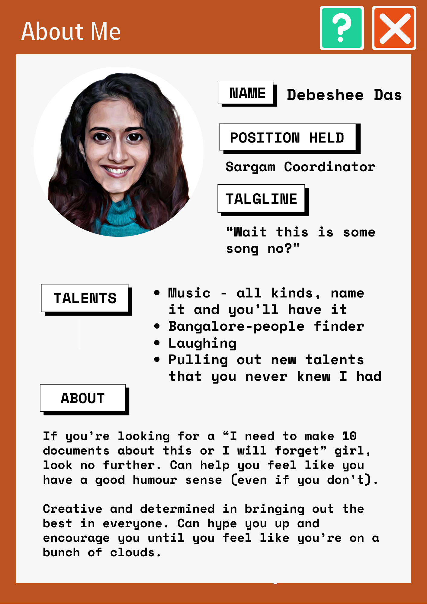

>The last year witnessed some major changes including adapting from the online environment and witnessing a multitude of offline events and opportunities, thanks to our student representatives.
>
>From handling the transition smoothly to launching full fledged initiatives, our student council worked towards constantly entertaining and providing opportunities for the community. It goes without saying that they deserve an enormous credit for all that they've accomplished.
>
>Hence, we at Udaan set to gather some of our deepest sources and found these resourceful comical social profiles for our representatives. Adding a little bit of an Udaan touch, join us as we unravel our most beloved student council.

## Secretaries

Starting from the elections to the end of their tenure, studies report that secretaries often feel like they have no idea what they're being blamed for. Their daily life includes waking up to get hit with a randomly tagged mail about issues that they had never heard of before. Let's take a look at what our secretaries have to say about their experience and tenure.

## Coordinators

Apart from the mail where coordinators are announced, research states that they recieve no sort of credit. They take care of everything from handling all the tehcnical work and ensuring to constantly improve the club and its policies, organising a new set of events and revamping the old events and also ensuring that empty promises of prize money arent made. Phew! Its time to give them the well deserved recognition.

### Debeshee Das
*Coordinator, Sargam, Music Club*

---

#### The Backstage
*Where we the student council describes their experience in the position of responibility*

>What is your most commendable achievement from your tenure?

'Just Classical Indian Things' was an initiative designed to present classical music, through music, story telling and visuals, in a way that was alluring to people from our generation who were not familiar with it formally. The participants, around 10 of us enjoyed it immensely, and the audience feedback was really warm and unforgettable! The challenges were that we were in online mode and everyone had time constraints and professional commitments to balance.

We had collaborated with PFC on the project, and I was very happy with how everyone involved in it was glad to be a part of the experience. Apart from this, putting the Sargam band back together and performing on Ethnic Night in spite of the logistic issues was incredibly memorable!

>Any regrets or changes you wish you could make?

The process of making purchases, especially expensive equipment, is not clear to most people. Anyone can be misled. It's best to double check the directions you are given and check with someone higher up in the admin in case anything seems unusual.

In general, I made the mistake of trusting other people to do their job well and it didn't work out a few times. It's best to be mentally prepared for the unexpected and come with a back up plan.

>Dear Future Secretary,

Anything involving the admin takes time so start reaching out well in advance. Having a permanent safe space for both Sargam's instruments and its people is long overdue - I hope it can be arranged soon.

### Reviews

*Thoughts and reviews from the student community on their term*

>She's really supportive, welcoming, and easy-to-talk-to.
She's just perfect for the role of a club's coordinator in my opinion. The most important thing that I learnt from her was that we don't need to compromise with our academics to pursue our passion. Both can go hand-in-hand, just like that.
>
>-Akshat

>IITT’s first-ever Sargam Mommy set a great example of how to have fun yet come up with great musical stuff throughout the year (be it offline or online)! From exposing Indian classical music to a large audience to putting back the band together, she has achieved so many milestones in just one year. And the best part is she involved many people in the process, allowing them to learn about Sargam and making them ready to become coordinators and co-coordinators in the future!
>
>-Sibibalan

>I've always found it inspiring how debeshee manages all the work at hand and is still somehow chill! It's been a wonderful experience working on the team and simply vibing along with her!
>
>-Krithi
