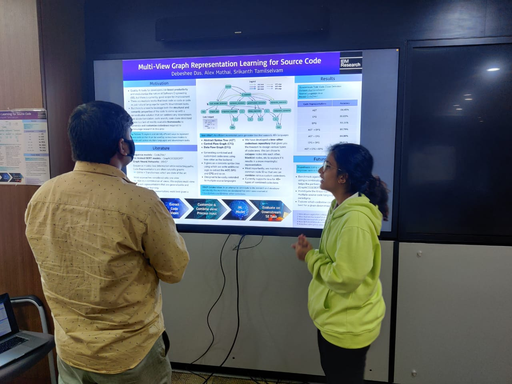
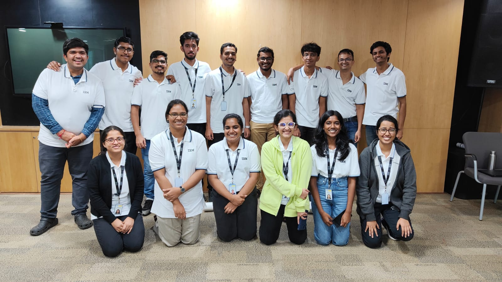

 
IBM employees have secured six Nobel Prizes and six Turing awards, among other achievements, while the company holds the world record for the largest number of patents every year. When it comes to a place with a delightful research culture, IBM Research is a model!
 
IBM Research has an interesting Open Science Collaboration Program (OSCP) where the company collaborates with people from academia, usually for a year, to work on a common topic of interest. I was honoured to be recommended as the student intern who would be a part of this collaboration between IBM Research and my professor, Dr Sridhar Chimalakonda, to work largely on the topic of Source Code Representation Learning. There were some additional aspects to the selection process, including an aptitude test and a short interview, apart from reviewing the resume. By February 2022, I was all set to intern at IBM Research for three months in the summer.
 
A research internship is quite different from a typical software engineering internship in a few ways. For example, the usual expectation from a research internship is to work on a research problem and publish a paper. However, depending on the domain, you can also expect to find a lot of developmental or software engineering work. As part of my internship, I worked on the problem of improving techniques to represent source code in a way that would improve the performance of machine learning models that try to perform various tasks, such as code search and code translation. I’m sure you are familiar with autocorrect and autocomplete when you type in a word doc or text someone. Now, imagine autocorrect and autocomplete for developers who have to code for long hours! The contributions made as part of my internship could one day indirectly help improve developers' tools, including code autocomplete. Hence, I found this area of work quite exciting! Since this is not a trivial problem and research work is unpredictable, there was an informal understanding that I would continue working on the problem even after my internship ended.

IBM Research has two locations in India, Bangalore and Gurgaon. Luckily, my internship was in Bangalore, which is coincidentally also where I’m from, so I could stay at home and spend time with my family during the summer as well. The office was quite far away from my house, though, so I had an interesting experience with Uber and the infamous Bangalore traffic. But working offline was really rewarding after two years of online life. I would work from home for half the week and go to the office for the other half.

I would have a daily update meeting with my mentor and manager. We discussed both short-term, actionable tasks and the long-term goals for the project regularly. My mentor, Alex Mathai, and my manager, Srikanth Tamilselvam, were the most welcoming, inspiring and cordial people! I felt that they created a culture composed of the perfect balance of formality and informality, which showed that work was to be taken seriously without feeling intimidated by the whole new professional atmosphere. I loved the work environment, flexibility, and focus on what is actually important.
 
During the first part of the internship, I read a few related research papers and then worked on designing and building a framework that would be useful for researchers who worked in the domain of source code representation learning. Since this was part of the OSCP program, one of its objectives was to contribute to the open-source community. Hence, we open-sourced my work at https://github.com/IBM/tree-sitter-codeviews as a contribution to the research and developer community. Using this framework, one can easily generate over 40 types of customised and combined code views or representations for Java code. It can be extended to support other code views and source code languages in the future.
 
The second part of the internship involved working on actually leveraging this framework to generate graph representations of code and then using a machine learning model to perform a given downstream software engineering task. The first task we worked on was code clone detection, which means that if I provide the model with two snippets of code, it should be able to identify whether they are both doing the same thing. Since we were heavily referring to a previous work by my professor, I had the chance to work closely with my friend Noble, who was familiar with that particular code base. Noble was interning in Canada[^1] during the time, and we had fun syncing up regularly, working on the code and exchanging notes on each other’s internship experiences.
 
IBM Research conducts a few competitions for interns that are also indirectly used for evaluating their performance. The first competition was the Blog/Vlog competition in the second week, where we had to write an article and make a video explaining the problem statement of our internships. The second competition was a code evaluation competition where we were evaluated based on all the code we had written during the internship. I was recently elated to find out that I had won both the Blog/Vlog competition and the code evaluation competition! The final competition was a poster session, held towards the end of the internship, where we all had our posters displayed, and all the IBM research employees came around as we explained our work to them.

I met many of the other interns and had a lot of fun exchanging stories about college, work, future plans and other random things that intrigue 19 and 20-year-olds. The company organised many events, lunches, tech talks, social outings and informal sessions with senior employees. I felt that all the organised events had valuable takeaways, ranging from learning how to structure code for research, to finding out about interesting teaching models in other engineering institutes, from interesting insights on how to choose between academic or industry research, to how incredibly delicious a vanilla muffin can be! I enjoyed them thoroughly. One of my favourite experiences was probably the swings that were scattered all over the tech park. Once in a while, I would play on the swings in the morning right in front of the office building before going into work. With the cool morning weather, picturesque greenery, and the familiar drop in your stomach from the acceleration while the wind catches your hair, it was definitely a “This is what it means to be alive!!!” moment. Apart from memories, I made a few friends and acquaintances, and I intend to cherish the whole experience fondly.

[^1]: Read [here](https://udaaniitt.in/editions/2022_September/Mitacs_Globalink_Research_Internship) about Noble’s exciting internship in Canada through the renowned Mitacs program

