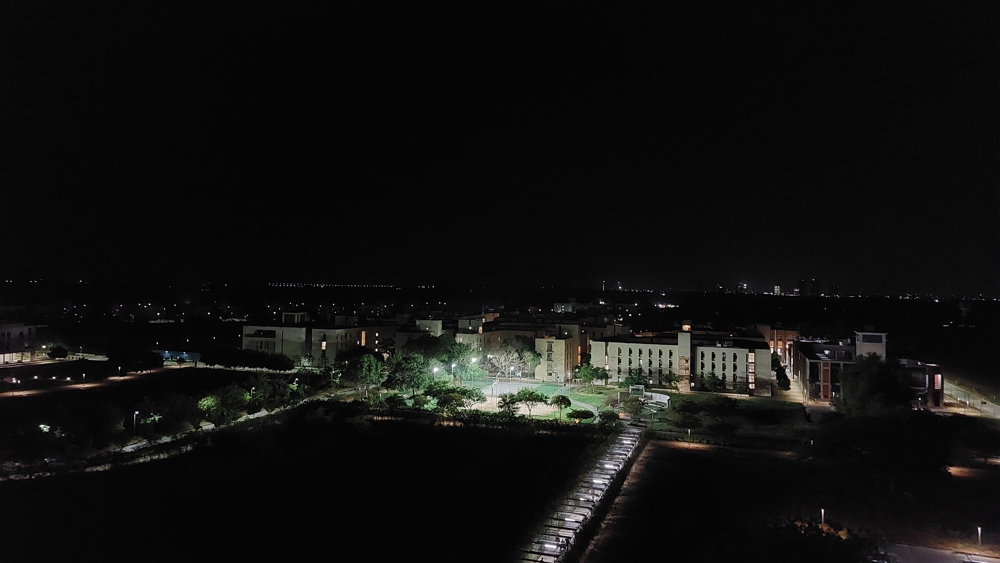

This summer, I got an excellent opportunity to do a Research Internship at IIT Gandhinagar. Through their portal, I applied for their [Summer Research Internship Program (SRIP)](https://srip.iitgn.ac.in/info/). After being shortlisted based on my profile and Statement of Purpose (SOP), I was called for an online interview. The 15 minute-long interview consisted of technical questions asked by the Professor and a couple of Ph.D. scholars working with him. They were satisfied with my answers, and the offer letter arrived a week later (Mid-April, 2022). For the next few weeks, they discussed the objectives of the two-month-long internship and details about the project over Zoom calls.                                                                 

My project was titled **‘Design and Development of Low-Cost Air Quality Monitors’**. It involved skills in the fields of basic electronics, Arduino programming, and the Internet of Things (IoT).

I arrived at the IIT Gandhinagar campus on May 19, 2022, and the internship officially started the next day. I was given a warm welcome by my mentor - one of the Ph.D. scholars. He gave a brief introduction to the campus infrastructure and facilities. The best part was that I was allotted a separate workstation in their fire lab, with complete access to the computers and necessary electronic components. My work would typically start at 9 am in the lab and get over by 5 pm. There were absolutely zero rules on working hours and time. I was given total freedom to work at my convenience.

The first few days went in doing a literature review, referring to research papers and journals. In the next few weeks, testing of a few sensors and modules was performed to understand their usage and working. The next big task was integrating [ESP01](https://www.instructables.com/Getting-Started-With-the-ESP8266-ESP-01/) and the Wi-Fi module, with the Air Quality Monitor (AQM) assembly I had made. But, here came the challenge. I first designed it by establishing a Serial Communication between the Arduino and ESP01. The correct sensor readings were supposed to be visualized in the Cloud Platform ‘ThingSpeak’. But, a constant value of 0 was continuously displayed as the output. I tried different ways of resolving this error - all in vain. One fine day I realized how close I was to the end of the internship. Apparently, I had been working on this issue for 17 days! When I was about to lose hope, an idea struck. What if I tried transmitting data over [I2C Communication Protocol](https://www.geeksforgeeks.org/i2c-communication-protocol/)? I sat on a Sunday morning. Worked with full enthusiasm. And Hurray! The idea worked!! The correct values started getting printed, and thus, the final assembly was ready.

Meanwhile, I was assigned a small side project by my professor. It dealt with making a **Toxic Gas Detection System (TGDS)** - A device that can assess the toxicity levels of sewer manholes and alert the user to safeguard the lives of manual scavengers. The project was proposed under the initiative of [Safai Karmachari Andolan (SKA)](https://www.safaikarmachariandolan.org/), a human rights organization to eradicate manual scavenging. I was able to complete it in a few days. It was followed by testing the device at the Sewage Treatment Plant situated on campus.

### Documentation
The organizers insisted on documenting the work done in the internship clearly. We had to submit a Research Proposal at the start, a Mid-Report after 4 weeks, and a Final Report at the end of the internship. Every Tuesday and Friday, we had to submit a diary - A report containing the work done in the week. Apart from this, we had a weekly meeting on Thursdays with the professor and the two Ph.D. scholars. Every week, one person was assigned to give a presentation. It was a great learning opportunity for me to get to know about other projects. My presentation skills improved drastically as well.

### Fun Stuff & Outings
The campus was vibrant. Sports and Academic facilities were top-notch. Cafes and eateries open till 3 am was like icing on the cake. I vividly remember the experience of having Cheese Garlic Bread and super-hot Ginger Tea at 2 am after getting fully drenched in the rain. Roaming around the campus after midnight was like an unwritten rule that all of us strictly followed. It was a great opportunity to meet students from all over the country. We used to chat for hours together- sharing our experiences, cracking jokes, and having fun. Five of us formed a fun gang and hung out together. Every evening was spent in the Gaming Room playing carrom board, chess, air hockey, and foosball. Weekends were meant to explore the city of Ahmedabad. Two of our memorable outings were the visit to Science City and Kankaria Lake.

One of summer's best moments was watching the IPL Finals at the Narendra Modi Cricket Stadium. Though the match was not a thriller, the home crowd made the atmosphere electric. Another memorable experience was my visit to IIM Ahmedabad. It was awesome to walk around their beautiful campus and spend some time in their vast library.

All in all, it was an incredible experience filled with lots of fun and learning. The memories created during this internship are ones that I will cherish forever.
