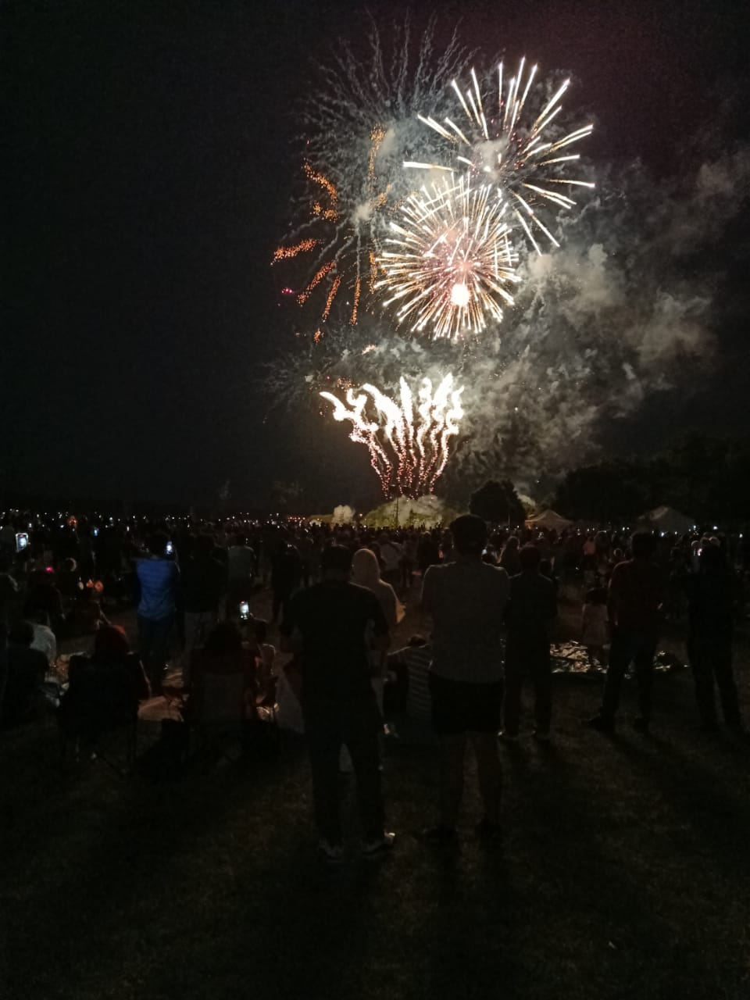
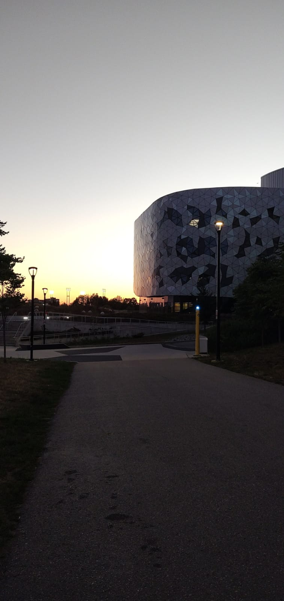

Hi there! I am Noble, the narrator of this piece about the Mitacs Globalink Research Internship. I will be joined by Srikarah sama, (forgive me for not including the honorific "sama" throughout) who was also selected for this prestigious scholarship program along with me.

First, a bit about the program itself so you can choose to close this tab and not be annoyed throughout the remainder of this article if it doesn’t fit your fancies. As you would have probably figured from the name, this program is heavily research-oriented. You get to work on a topic of your interest over a span of 12 weeks with professors from top institutes in Canada. The program is fully funded and at the end of the day you would probably not end up shelling out much from your pockets (assuming you are reasonable with how you spend what you get, unlike Srikarah). If anything, you may wrap things saving up a pretty penny if you plan out your stay properly. 

## Applying (and other boring stuff)

In this section we will mostly detail our individual experiences until we got accepted into the program. Please do refer to the [mitacs.ca](http://mitacs.ca) website for deadlines and official guidelines as these might have changed by the time you are reading this piece.

**Noble:** 

I applied to the program within a few weeks of the call being opened. The deadline for applications is usually in September. The application involves the usual personal details and writing 2-3 essays detailing your interest in the program and your background in general. You will get used to writing pieces like this or probably have already if you have applied to other off campus opportunities previously (which I really do recommend doing, don’t wanna lock yourself out!). I had my brother and parents review my essays and CV (I recommend rewriting it in the format Mitacs provides). You would also need at least one recommendation letter (Mitacs has some guidelines for these, about who you choose to get one from, the content, and what it should look like. Make sure you inform the person writing the letter about these just to be safe). I took my recommendation letter from Dr Sridhar Chimalakonda, with whom I had worked for 1.5 years at that point as a part of [RISHA Lab](https://rishalab.in/). I have him to thank for getting me into research to begin with. For my second recommendation I approached Natarajan sir with whom I had worked in first and second year on multiple projects. Again, my thanks go to him for always encouraging, guiding and enabling me to pursue projects/ideas that fascinated me in first year. 

With that out of the way the waiting game begins ;D...  As far as I know, there are no clear criteria for selection in the first round. The only thing I would say is that your statement of purpose should make it clear why you are a good fit for the projects you selected and make your interest in research apparent to whoever reviews your application (white papers and current research projects are a great value add in my opinion). I got selected in the first round of reviews so Yay! (you can also be waitlisted at this stage, so don’t loose hope yet - there are several round of reviews... as long as you don’t get a rejection of application email, you are good).

In the second round, your application and CV is forwarded to the guiding professors of projects you applied to. From this stage on it depends on your selections; the professors will review your application and will get back to you via email if they are interested. Some professors choose to schedule a video call for a quick chat with you, others may give you small tasks to complete to make sure you are what they are looking for. For me, I got a response from 4 out of the 6 projects I applied to asking to schedule a call at mutually convenient time. I was travelling during one of the weeks so I chose an alternate task of summarizing a research paper and airing my thoughts on ways I would approach that problem.  The calls were all friendly discussions and not very technical, though they did ask questions to gauge my proficiency in the topic.

After the deadline for the second round is up, you need to wait for the final decision. Once the professors interview the students that applied to them, they rank them in a manner similar to how you ranked the projects in the application. Based on your ranking and the faculty ranking, you will be assigned a project. If you fail to get matched, you will move back into a waiting list. I was fortunate enough to get matched with my first preference so that was the last step for me. You get an email asking you to confirm your offer.

A couple of rules regarding ranking projects:
1) You cannot get a project you ranked lower if you get accepted for a higher ranked project.
2) You can rerank the projects after selection in stage 1.

**Srikarah**: 

I will not write much in this section as Noble summed up everything in detail. 

I too applied in pretty much the same way as Noble did. I took my letters of recommendation from Dr. Janaki Ramaiah, under whom I was doing a research project at that time, and Dr. Prasanna Sampath, who was the course instructor for two of my courses. 

The whole idea to clear the first round of filtering is to let the panel know your potential. Even though your transcript, letters of recommendation, and your CV speak about it, you can always try to add creative things (without losing professionalism) in your essays. 

I was lucky enough to clear the first round and get an interview offer from the supervisor of the project which was first on my preference list. The interview was pretty informal. The professor wanted to know what my interests aligned to and he also asked a few questions related to the domain of the project. I remember having conversations about the weather of Canada and India during summer in the interview xD.

I finally got an offer letter for the same project through email. I also had another co-intern who worked on the same project as me. It is very common for two mitacs interns from different places to work on the same project. Another thing to note is that generally the emails from the professor go to spam (I didn't check his mail for a couple of days because it went to spam :,-)), so it is important to keep checking your spam folder regularly.

### Project Details:

First let me give some more information about our projects so we can get that out of the way. Don’t worry I will then allow Srikarah to breathe some life back into this piece with some of the fun he had during his stay. I will try to do the same but disclaimer: I am not a very extroverted person and umm... let's leave it at that (I am not good at starting conversations, feel free to approach me about anything though, I don’t bite... usually).

**Noble**: 

I was selected for a project under Dr. Mei at the University of Waterloo. The project was primarily in the realm of software security. I worked on cross-language (when native code (C/C++) is used in addition to Java within android applications), automated detection of exploitable vulnerabilities (yeah don’t leave your phones unattended around me… buahahaha.. sorry) and directed fuzzing (researching and building tools to speedup something that is usually very slow... look it up, it's pretty interesting - basically trying to crash an application by mutating and sending in input to every possible entry point). I ended up reading a lot of papers and building a few test scripts/environments, working towards research papers in the respective topics during my stay in Canada.  

**Srikarah**:

I got selected for a project that dealt with self-healing concrete, under the guidance of Dr. Liam Butler at Lassonde School of Engineering, York University. My research dealt with developing and testing the bond strength in the steel-concrete interface of a new variety of self-healing concrete infused with super absorbent polymers (what is all this? xD). So I had to read some existing literature on it, devise an experimental program, cast the specimens, test the specimens and analyse the results. 

I will not go into the details of the project, but let me tell you that the project was more fun than it sounds xD. 

## Time in Canada

Here are a few pics from my first walk to the campus in Waterloo:

And here are some from *Canada Day* celebrations in Hamilton.

And here is a view of US from Niagara falls:

I also left my home whenever my uncle forced me to... ummm to keep this section actually fun, I will just leave it to Srikarah ;D…

Srikarah:

What else could beat having a chance to explore a different country while doing your internship?!?! 

There's generally plenty of time in hand for travelling and exploring new places during the internship. You need not worry much about the expenses for all this, as Mitacs gives you pretty handsome funding (but of course, you should worry about it if you do it recklessly, which I don't think we would… it's our hard-earned money, right? ;))

My university was in Toronto, so I had the opportunity to explore the beautiful city of Toronto. I had a great time exploring the city with a group of interns, going out to visit places every weekend. There were some breathtaking experiences like enjoying fireworks while being on a cruise in the middle of Niagara falls, being awestruck by the scenic view of the city from the CN tower, finding new cultures and people around the city, and playing football on the beach (the good thing about beaches here is that..THEY HAVE FRESHWATER!!!…i.e no salt, no weird feeling on the tongue after swimming...cool, isn't it?), and a lot more.

There was also one particularly fun experience in the lab. We had a 3 day-long testing on our schedules and we couldn't just keep testing for 3 straight days in the lab, so we decided to have some fun! We brought a few sofas from the cafeteria and placed them inside the lab, connected our laptop to a huge TV and bought popcorn and snacks to eat while watching Netflix and of course, simultaneously testing :,-). It was our _Netflix and chill_, oh sorry, _Netflix and testing_ xD.

The city is well connected via subways and you can go to any place without any hassle. This made the travel a lot easier. You can always find places that you want to visit based on your taste, and you can always make your stay fun. 

## Wrapping Up

This is clearly not a typical industrial internship and you should have some interest in research oriented explorations to make the most of it. It can also be a great start to pursue higher education in Canada since, once you complete the program, you become eligible for another scholarship for students accepted into graduate programs in Canada within 5 years of completing the Internship.

Feel free to reach out to any of us if you need any clarifications. Goodluck with all the adventures you are gearing up for this internship cycle!
