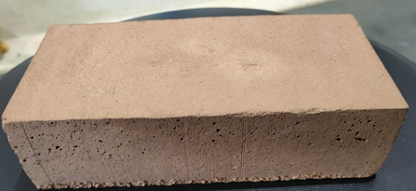

If you're in the pre-final year of your B.Tech, you probably know that you will have to do an internship during the summer before you start your final year. Chances are, you've already got companies registering for internships on POD. Some of you might have even gotten internships already. Congratulations. But did you know that our curriculum provides us with an opportunity to pursue something known as a research internship as well? And that these can be done under the guidance of professors from our own college too? These research internships under professors are often the subject of a running joke amongst students; “ If I don't get any internships, I'll just take a project under a professor, haha.” offers a whole different varied set of experiences than what a industrial internship would offer. There are a whole lot of advantages to doing a research internship under the guidance of your professor, especially if you are passionate about your core domain. That being said, research internships and industrial internships are not for everyone. You will have to carefully analyze the two and decide which is more apt for you before choosing it. We have put together a compilation of research internship experiences under IITT Professors in the hopes that these help you gain more insight into the world of research at IITT and will help you with making this pivotal decision.

First, let us take a look at what **Jaswanth**, a student of Electrical Engineering who has been working under **Professor Ramakrishna Gorthi** for a long time, has to say about his research internship experience :

> “My journey led me to embark on a research project under the mentorship of Dr. Rama Krishna Gorthi. The focal point of my research revolved around Object Tracking and Detection, with a particular emphasis on applications in drones and small objects. Looking back, I can confidently say that choosing to undertake a research project under the guidance of a seasoned professor was a pivotal decision.
>
> In the realm of machine learning and deep learning, it's not just about how much knowledge you acquire but also about applying that knowledge in a practical context. You truly appreciate the difference when you dive into a project that demands an in-depth understanding of machine learning. When I approached Dr. RKG, expressing my interest in working on a project under his guidance, he posed a series of insightful questions. He assigned me a project tailored to my interests and abilities.
>
> Additionally, Dr. RKG provided me with valuable resources, including access to powerful GPUs (A4000, GTX1080) and lab systems dedicated to my project, and even assigned a helpful PhD student to assist me when I encountered challenges. The contributions of these PhD students are immeasurable. They readily shared their wealth of knowledge and experience accumulated over several years, compressing what would typically take months into a matter of weeks.
> Furthermore, it's worth noting that working on a machine learning project opens doors to internship opportunities. Dr. RKG played an instrumental role in helping me secure internships at DRDO and VAL Labs IISC. The experience gained through these internships is invaluable, not to mention the potential for research publications that can bolster your prospects for higher studies abroad.
>
> For those considering a career or higher studies in machine learning, I wholeheartedly recommend undertaking a research project under a professor or within renowned labs. It's a transformative experience that not only enriches your knowledge but also paves the way for a promising future in the field.”

Next, we asked **Gayathri**, a student from Mechanical Engineering, whose process of landing a research internship was slightly different. Let us see what she has to say.

> “Originally, I was all set to do my summer internship at CMTI, but guess what? Imagining myself stuck with accommodation issues in a strange place, I thought, "Nah, I can handle a research internship on campus!" So, I dropped an email to Professor Balaji, hoping he'd take me under his wing. Luckily, he agreed, and bam! I found myself back on campus in no time. My project focuses on drone motors and propellers, specifically determining the most efficient propeller to match with a given motor.
>
> While I visited the lab a few times for this project, a majority of my work was done on my laptop using software. I would meet with the professor on a regular basis, approximately 3-4 times a week, to present my progress and receive feedback. My professor took care to watch my progress regularly so that I was able to work more efficiently than I expected. As there were no classes and assignment dues, I had ample time to devote to my other work. At first, the campus felt lonely and boring without any friends around. But as time went on, I managed to make some new buddies.”

Internship experiences on campus can surely open up new relationships with a varied set of students, be it B.Tech, M.Tech, or Ph.D., with varied experience in the domain.

Now, let us look at the experiences of another student who had initially gotten a research internship elsewhere (CMTI again) but chose our college over it. Let us see what **Sathyanarayann** from Electrical Engineering has to say about his research internship.

> “I did my summer internship under the guidance of Dr. Parthajit Mohapatra, Assistant Professor at IIT Tirupati. My research internship was initially supposed to be related to the topic of Physical Layer Based authentication in Wireless Communication Systems. It was a team project which I did along with my classmate Vishrut Guru Prasad. To start off with, neither of us had any knowledge about Wireless Communication Systems or Information Theoretic Concepts, which were essential for the project. Dr. Parthajit provided us with valuable resources in the form of IEEE Research Papers, Youtube Lecture series, and Textbooks, which would help us gain useful knowledge to work in this domain. We spent the majority of our summer reading about different research works in the domain of wireless communication, information theory, secrecy, and physical layer-based secrecy. We found these topics incredibly interesting and cool and then stumbled into the topic of Intelligent Reflecting Surfaces. Intelligent Reflecting Surfaces are a very interesting and relatively new type of technology that might find applications in 6G or further in the future. What we worked on specifically was in analyzing the performance of wireless channels/ systems in case of a jamming attack and how usage of an IRS could help mitigate the effect of a jamming attack. Overall, the experience was incredibly interesting and fun and helped us further our interest in the sphere of wireless communication.
>
> How did I end up taking this internship, you ask? That's quite a peculiar and rather funny story.
>
> For the most part, I didn't know what I was doing during the whole year. My domain of interest when it came to electrical engineering was quite a narrow one. I was interested in the fields of Communications and Signal Processing. As I was not interested in software or coding/CS-related roles, I chose to sit only for core internships. A primary concern with the core internships I observed was that many core companies were offering internships only for longer durations ( 6 months + ). Summer internships from core companies were pretty low. After waiting for core-related internships for a long time, I finally got into CMTI which claimed to offer research internships for every branch.
>
> At this point, I was out of the internship process. In hindsight, I would say it was a rather ill thought decision on my part to jump into CMTI, which, mind you, was unpaid and required me to move to Bangalore for the duration of the internship, and we all know how expensive living in Bangalore can get.
>
> It was at this point that the electrical department decided to float project topics for our final year project (aka BTP or B.Tech Project). My domain of interest is wireless communication, I chose to take up a project related to physical layer-based authentication in wireless networks and its implementation using Software Defined Radio (SDR). This was a team project. Once I had chosen this, my teammate revealed to me that he was planning to start working on the same/similar topic earlier as a “Research Internship” under the guidance of the same professor who was offering this project, Dr. Parthajit Mohapatra. Naturally, I was also inclined to do the same. CMTI was also offering a research internship, but it might have been in a completely different domain than what I would be working on in the following year. Unfortunately, as I was out of the internship process, I could not afford to take up this internship, even after negotiating with the professor and the internship office.
>
> Cut to a few days before the actual start of the internship at CMTI; we received communication from CMTI saying they could only afford to give accommodation facilities to nine students. This set the rest of the students into a frenzy. As they had changed their stance regarding accommodating all students, the internship office allowed the students apart from those nine students who still chose to stick with CMTI to either look for other internships or to arrange for their own accommodation. At this moment, I jumped at the opportunity and contacted the professor again, and he was happy to offer me the research internship I had wanted. Thus began my story of how I started my research internship under the guidance of Dr. Parthajit Mohapatra over the summer. “

While research internships enable you to be in touch with current research in your domain and help you contribute to them, they can also lead to something incredibly amazing, like your own innovations and sometimes even patented technology! Let us read about the research experience of **Rahul and Naveen** from Civil engineering and how they ended up applying for a patent for their innovation.

> “How did it begin ??
> It all started during our 5th semester when my friend Naveen.D decided to do a research project together. Since we both were interested in a common ground of ‘Sustainable Building Materials,’ we decided to work in this field. We started this journey hoping that decent research work would help us provide many opportunities for internships in other IITs and foreign universities. After completing our end-semester exams, we approached our professors, Dr. A.V Rahul and Dr. Shihabudheen M. Maliyekkal, to pursue a research project under them. During our first meeting, they briefed us on their field of work and explained their three current projects.
>
> Among the three, one of the projects is ‘Developing Building material using Glycerine pitch waste,’ which we found interesting and decided to work on. Even though this topic was advanced for the B.Tech curriculum level, we requested our professors to allow us to work on this topic. After clear consideration, they accepted our request and permitted us to proceed. In the initial periods of this project, we referred to most of the literature available on glycerine pitch waste. Unfortunately, there were very few literature reviews available about glycerine pitch waste. Turns out there is no proper disposal technique for this waste, and industries have been disposing of in sealed landfills all these years. Also, if incinerated, this glycerine pitch waste might release ‘Acrolein’- a carcinogenic gas. Knowing the problems with glycerine pitch disposal methods and their harmful environmental impacts motivated us to find a way to deal with the situation.
>
> So, we started our project with a preliminary study to understand the material clearly. It took all of our 6th semester entirely to get a clear picture of this material. During this preliminary study, we found that glycerine pitch has excellent binding properties, which hardens when heat-cured. Based on the results obtained from the preliminary study, we and our professors decided to develop masonry materials out of glycerine pitch. Seeing these results made us realize the potential of this research work and gave us the confidence to continue this project as our summer internship rather than doing an internship at other universities. Hence, we started our summer internship on “Developing Masonry Materials using Glycerine Pitch Waste. “
>
> **The first brick for building our research**
>
> 
>
> We started our internship on 11th May 2023 with rigorous techniques to build a masonry product from this waste. Initially, we faced a lot of minor problems like cracks in our masonry bricks, etc. Around ten days passed, and we had gotten no positive results. It was the first time we encountered failure, and we did not know how to face it. I still remember when we first reported our failed results to our professors. We were so embarrassed at that time, and we did not have enough courage to speak with them. Seeing us in such a state, our professors gave us a life lesson on perseverance and said how to embrace our failures in research rather than running away from them. That 45-minute talk totally changed our perspective on research. We continued our work from there and tackled all the minor problems that came our way. Before we were about to give up on research work, on 30th May, we made our first brick (as shown in the figure).
>
> **The daily research**
>
> I don’t want to bore you with every detail, so here is a brief overview of our daily routine. During our internship, we would go to the lab every day and work an average of 7 hours. We used to plan our experiments a day prior to going to the lab. There would be weekly presentations with our professors where we would update our work progress and discuss possible alternatives. We thank them for guiding us and helping us make the right decisions. They gave us a lot of freedom to plan our experiments according to our convenience. In addition, our civil engineering Ph.D. scholars across all specializations and the lab in charge were really supportive and helped us solve problems even when it was midnight (literally). We thoroughly enjoyed the internship period, which helped us enrich our skills in research.
>
> **Outcomes of our research**
>
> We performed some mechanical tests for our brick and were surprised after observing the results. The brick that we made had higher strength than a normal brick would usually have. Further qualitative studies were done during the internship, and several optimization techniques were performed. Our professors suggested that we attend a conference and file a patent for our findings along with the planned idea of writing a research paper. Currently, the filing of a provisional patent is under process.
>
> **Why research internship at IIT Tirupati?**
>
> If you are genuinely passionate about your core discipline and want to pursue a master's in your desired college, then research is the ideal option. Usually, people who apply for their dream school would have to compete with other students with similar grades or CGPA. So, to stand apart from other students and to show your worth, a good research work would make you shine apart from others. Unlike industrial work, we had the flexibility to plan our day based on our comfort hours and design our projects accordingly. This research internship helped me in developing the mindset of Independent thinking and problem-solving skills. To make good research work, the best environment is required, which I genuinely felt at IIT Tirupati. From encouraging professors, helpful Ph. D. students and staff to ample resources, IIT Tirupati has everything needed to nourish young research minds.”

Now, how about that? It's no lie that research is an integral part of the culture of an IIT, and hearing these varied experiences from students about their research internships/ projects reassures the sustenance of this culture in future generations. Although the idea of a research internship at IITT as a “safety net” or a “ backup plan” in case an industrial internship falls through is prevalent, one can only wonder what more can be achieved if our students understand their passion and turn it into research. We hope this article inspires you to look more towards your passions in core and helps you ask the right questions to figure out if you want to take up research projects on topics you are passionate about for your internship. Always remember that you can approach your professors at any given time for projects; doesn't necessarily have to be during your internship. They are always eager to nurture the research mindset amongst their students. We hope you have a successful internship season ahead, and look forward to your entries in the next autumn edition of Udaan!
