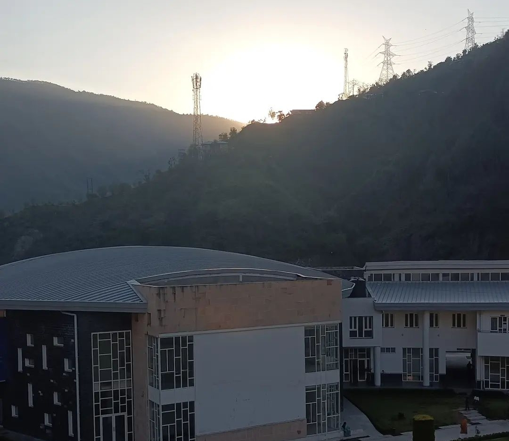
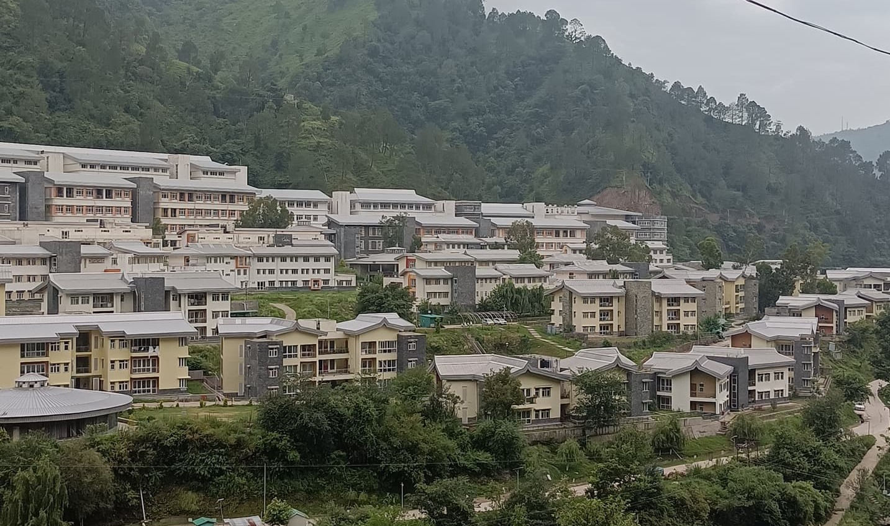
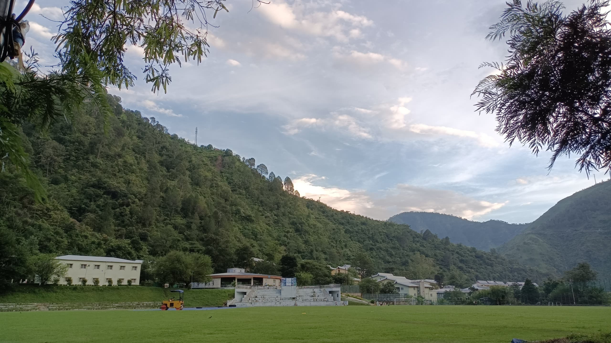
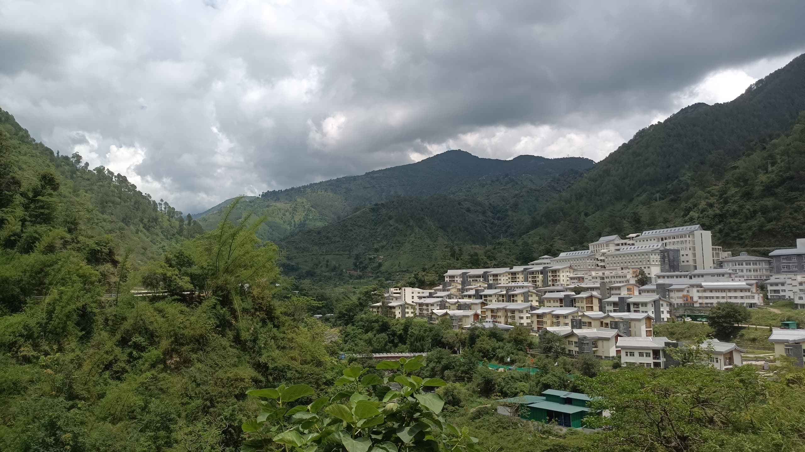

_Bro… The mess food is so good!_

Is that what you want to say, too? If yes, then IIT Mandi is the place you should travel to. 😉

Hello, fellow reader! I am Akshat, and I’m going to take you on a small tour of a not-so-small place called “Mandi”, located in the scenic hills of Himachal Pradesh. The campus of IIT Mandi is located 24 Km from the city of Mandi (yeah, that sounds like our college!), on the left bank of the river Uhl, making it really picturesque.

_How did I get the opportunity?_ Well, Dr. Janaki Ramaiah forwarded an announcement email that IIT Mandi had released for the Summer Internship Programme they were to conduct during the summer months of 2023. After filling out the form, submitting my CV to them (which looked very questionable to me back then), and sitting for a small interview with the professor, I was finally selected for the programme.

Happy? Yes, I was!

But…

After writing at least a million emails to the Academic Section to get an NOC (No Objection Certificate), I couldn’t get it due to the new ERP ATS (which they probably weren’t sure how to use yet). Soon after, I received an email from my faculty advisor, Dr. Prasanna Kumar Behera, who finally provided me with the NOC, and I was all set for the experience.

I want to start the narration with a picture of the overwhelming beauty of the campus and the place in general. I’ve personally been a great admirer of mountains since I was a kid, so being at such an alluring place was breathtaking for me (Waku Waku!). Luckily, the rain was always there to add to the beauty and recess the work, accompanied by the occasional hailstorms.

Rain is beautiful, isn’t it? Not quite in Mandi!

IIT Mandi has two campuses with a hill between them. The institute provides a shuttle service to commute between the campuses. Most academic buildings and labs are on the North campus, while most hostels are on the South campus. The beautiful rain caused beautiful cascades on the campus but also caused frequent landslides, which resulted in many workless days. This forced all the interns to work at their highest capacity, leaving them exhausted at the end of the day.

Let’s add some details about the work, though.

I worked at the “Atmospheric Chemistry and Climate Change (AC3)” lab in the School of Civil and Environmental Engineering. The research was on “Qualitative and Quantitative Analysis of Atmospheric Microplastics”, which mainly included collecting samples from different locations and analysing them using physical and chemical methods, like Fluorescence Microscopy and Raman Spectroscopy. To elaborate in simpler terms, atmospheric microplastics are plastics in the form of fragments, fibres and films, produced mainly by the degradation of plastic products like paint, clothes, etc. Some are industrially manufactured for various applications, like pellets for beauty products (primary). With the assistance of a PhD scholar assigned to me, I worked on the amount of these MPs and their types present in the air samples collected from different locations in Delhi (yeah, Delhi’s air is the best to study for this purpose). The work environment in the laboratory was supercalifragilisticexpialidocious, unlike the workload, which was chaotic. Usually, we would work 9 hours (10 AM to 7 PM), but I had to work 15 hours a day primarily due to the time constraint I had put on myself for the internship period to be only a month. Because of this, I would miss the chance to grab food during the day quite often.

Oh, but the PROTAGONIST-!

FOOD!

First, the mess food was super delicious, and the best part is that it was also quite economical. Then there are canteens with super cute names after birds (for example, Bulbul Canteen) with small but tasty menus. You could always convince your roommate to accompany you for late-night cravings whenever 😉.

I found the place to be pocket-friendly, not only regarding food. If we take an overview of all the expenses and the stipend the institute provides, you can even manage a trip to Manali during your internship period. I recommend applying for a 2-month internship; it will help you by giving you adequate time for your research. After all, who would say no to more money and travel opportunities?

I’ll attach pictures to treat your eyes (or you could just check my Instagram highlight if you follow me):

