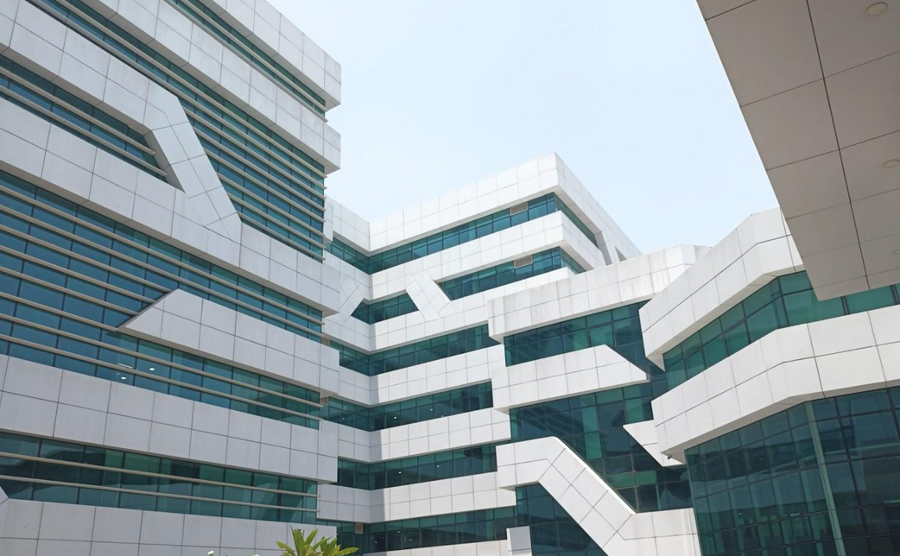

During my summer break, I was granted a valuable opportunity to participate in an internship at SeiAnmai Tech, a pioneering startup specializing in Telepresence Robots. This venture is incubated by IIT Delhi's Innovation Hub for Cobotics (IHFC). My journey commenced when I contacted Dr S K Saha, a prominent faculty member in the mechanical engineering department at IIT Delhi, who is actively engaged in Robotics. Dr. Saha also serves as the Project Director for IHFC. After reviewing my Resume and Statement of Purpose (SOP), he endorsed my profile to Mr. S Srikrishna, the Director of SeiAnmai Tech. Subsequently, Mr. Srikrishna invited me for an interview, which took place on April 30th. The interview covered topics such as my fascination with robotics, my prior experiences, and a technical assessment. My responses left a positive impression, and I received an official offer letter on May 4th.          

The focus of my project was ‘Development of TeleOperation and TeleObservance Robot'. In the initial days, I engaged in discussions via Online Meet to outline the goals of my two-month internship. This project demanded expertise in diverse areas including Simultaneous Localization & Mapping, Computer Vision, Robotics Operating System, Sensor fusion, Path planning & navigation, Python & C programming, and Control of mobile robots & robotic manipulators.

- - -

### Internship Tasks:

Formally commencing on May 15th, my internship adhered to a typical working schedule of 9 am to 5 pm, although the team's enthusiasm often extended our working hours until 7 or 8 pm. During the initial phase, the tasks revolved around upgrading the robot's framework from ROS1 to ROS2 and creating a simulation for the robot. A pivotal point arrived when I had to tackle the use of an advanced microcontroller, the Raspberry Pi Pico. This microcontroller exhibited the capability to directly interface with ROS2 through micro-ROS, although resource availability was limited due to ongoing development. Overcoming challenges, I successfully navigated the intricacies, albeit with a constraint that Pico solely supports micro-ROS programming in the C language. Despite the hurdles, I accomplished all the designated objectives for the microcontroller.

After completion of the software tasks, our focus shifted towards hardware assembly. This phase encompassed the design and implementation of a power management circuit, integration of sensors, motors, wheels, and cameras onto the robot. Subsequently, real-world testing unveiled variations from the simulation, necessitating parameter adjustments to enhance the robot's navigation.

With navigation refined, the project moved into the realm of autonomous docking. This intricate process entailed programming the robot to independently approach a charging station upon receiving a docking command or detecting low battery levels. Utilizing Computer Vision techniques and ArUco Markers, the robot would then autonomously establish a connection with the charging station.

- - -

### Experiences:

IIT Delhi's campus was an exceptional environment, replete with sports facilities and the Student Activity Centre (SAC). This center housed numerous student clubs, including the Robotics and Automobile Clubs. Observing students engaged in various robotics projects and working on an electric F1 student car was inspiring. Throughout the campus, a variety of eateries offered distinct and delightful culinary experiences. One canteen's morning samosas stood out as a personal favorite. An added benefit of my IITD internship was engaging with like-minded peers who shared an interest in robotics and aspirations for master studies abroad.

An exhilarating highlight was the Robocon National Finals held from June 15th to 18th. Hosted by IIT Delhi, this event drew universities from across the nation to showcase their robots. As a volunteer, I immersed myself in the excitement of this major robotics competition. Numerous prominent organizations such as Autodesk, MATLAB, Addverb, and Brose participated, enriching the event. I even secured victory in a quiz hosted by Addverb, earning exclusive Addverb technologies merchandise.

As my internship neared its conclusion, the final days were dedicated to comprehensive documentation, refining robot packages to retain only essential programs, and capturing videos showcasing the robot's diverse functionalities.

Overall, my internship at SeiAnmai Tech incubated at IHFC IIT Delhi was an amazing experience that allowed me to dive deep into the world of robotics, learn invaluable skills, and forge lasting memories in the beautiful atmosphere of IIT Delhi's campus.