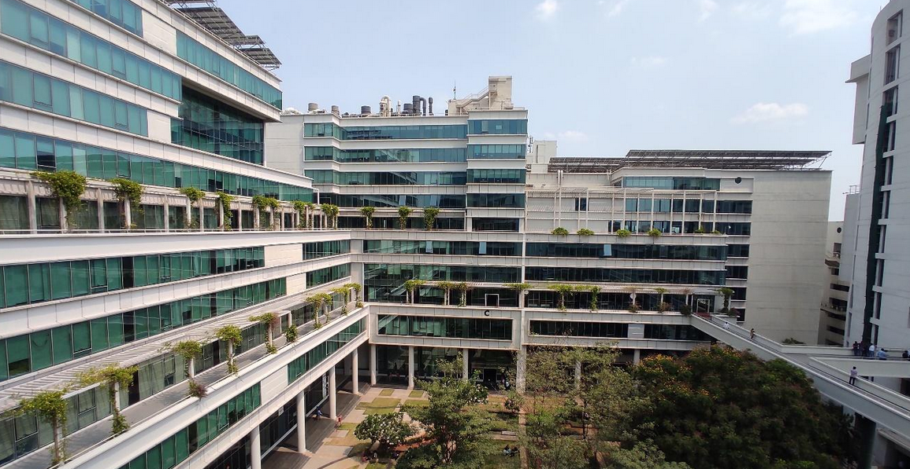

<!--StartFragment-->

### Initial Processes

I am Ram Mohith, currently pursuing a bachelor's in chemical engineering. I did my summer internship as a Data Analyst at MPM Infosoft Pvt Ltd., which is based in IIT Madras Research Park. To give a brief about the company, they are a data science team focused on making data-driven software for foundry industries. Foundries are manufacturing industries which cast different metal products. 

Although my role was that of a data analyst, the project required core domain knowledge as well since our department doesn't allow students to sit for internship recruitments other than in the chemical engineering domain. The company was called to recruit interns through one of our professors. Interested students' resumes were sent to the company, and since the number of applications is small, the company chose to interview all the applicants. The interview focused more on the student's knowledge of data science and machine learning and their projects. After all the interview processes, they announced that I was selected for the internship.

- - -

### About the Internship

My internship work is based on Production Scheduling for Foundries using optimization techniques (under operations research). To break it down, consider them as two separate entities: foundries and production scheduling. In Foundries, they use different techniques to create structures called moulds, which have empty void spaces in them. When molten metal/alloy is poured inside it and allowed to cool, the solidified form takes the shape of the empty space, our desired product. Big manufacturing companies often outsource some/many parts of their machinery/product from foundries. So, a foundry can have multiple customers, and it can get multiple orders from them at the same time. And many foundries are make-to-order foundries, meaning they will plan their production based on the orders they get. 

Production Scheduling is a common task in manufacturing units, by which all the production/activities of the unit are scheduled in a particular time frame. My work, as an intern, is to come up with an optimized production schedule for a foundry based on the orders it has to process in a given month. The production schedule should be such that it meets all the deadlines with minimal delays. Now, if you are someone who is familiar with linear programming optimization problems, this is essentially minimizing a linear objective function relative to a set of linear constraints. Since some of the variables involved in my project are strictly integers (for example, the number of components produced), it is a Mixed Integer Linear Programming (MILP) problem, which is the most widely encountered optimization problem in industry. 

Since optimization was outside our core curriculum (it was offered as a department elective after the 6th semester), I had to learn all the basics before my internship started. And since the foundries domain doesn't really come under chemical engineering, I had to get familiar with the process and terminologies involved in foundries for the first two weeks at the company. One of the professors from my department constantly mentored me and overviewed my progress. My main objective is to provide the company with an initial feasible optimal solution for the scheduling. We did a literature survey and found out similar research works are already being done in foundries. After thorough study, I picked one of them and tried to formulate and implement the same for the company’s problem. 

I used Python to model the problem and solved it using SCIP solver, an open-source constrained programming solver. It yielded a valid optimal solution with minimum lateness.  

- - -

### Remarks

Overall, the internship was a very nice experience. IITM Research Park is a tech hub for research and innovation, with many companies and startups trying to solve in-demand problems in various domains. Working in such an ecosystem is a great boost, which motivated me to work on my project. I had a chance to interact with a very brilliant and supportive data science team. I got to know more about the respective projects they were working on, which helped me understand the industry standards and assess my skills. Although there was little scope to apply core chemical engineering principles in my project, the regular courses covered in the curriculum have helped me build intuition on approaching and tackling real industry problems. There was this particular Applied Process Engineering course (a 1-credit course present in 4 semesters) where we had to solve an industry-level problem, which helped fill the so-called gap between what is taught in college and what is applied in real industries. 

I have learnt the importance of knowing mathematical techniques/numerical approximations and being aware of the available computational techniques irrespective of the branch/domain one works in. Coming from a core background, I often see people ignore this part, which is interdisciplinary in nature. Lastly, another important thing I have learnt is the art of searching (googling) for things. There is a thin gap between the things you can actually search on your own and learn and the things you need to ask your superior for guidance, which is important when you are working in an organization. To conclude, it was a lovely and productive time I spent doing my summer internship.

<!--EndFragment-->