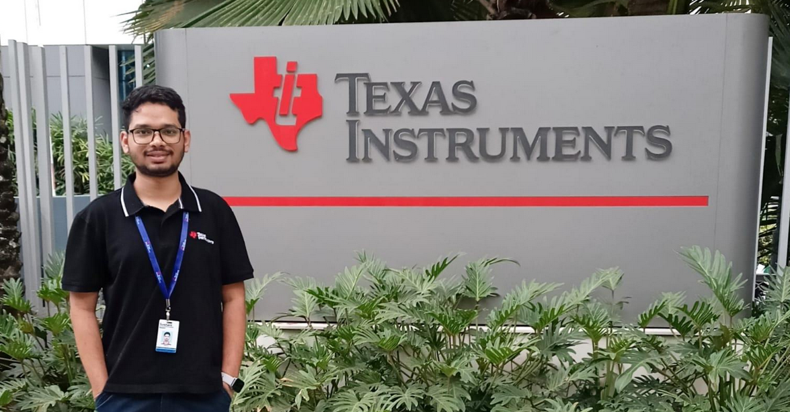

<!--StartFragment-->

### Preparation 

Let me start the story by telling you about preparation before the internship season. The calendar had flipped to September's first week when the notification came about Texas Instruments. After going through the internship roles, I decided to apply for the Embedded Software Intern and Digital role. Back then, Texas Instrument came for analog, digital and embedded profiles. I was sure analog was not my interest area. Life has not been easy when non-linear devices were introduced into the circuits. After the screening test, I got shortlisted for the interview round of the embedded software role. One thing that helped me to clear the interview was Texas Instruments had mentioned broad topics they would expect an interviewee to know. I thoroughly reviewed them and practised questions on pointers, endianness, RTOS, etc. The results were out at the end of the day, and I was selected out of 6 shortlisted students. I still remember how my friends and I had a warm dancing session followed by a party on the same day.

---

### Pre Intern Preparation

Two months before the internship, I was assigned a mentor who was a system engineer with 15+ years of work experience in Texas Instruments. I contacted him by mail and asked a few questions my curious mind wanted answers to. A few days later, he called me after I reached my hostel room after a day-long drone workshop. We were introduced to each other, and when he learned I worked on UAVs, he got very excited. He started enquiring about drone motors, their type and their specification. Soon after, he told me my team would be Brushless DC Motor, a team under the umbrella of motor drives. He explained my work would be in the bench testing. I was sceptical about this because it was not what I was expecting to work as an embedded software intern and was not what I was preparing for. So, I told him about my expectations, and he was very patient to hear this, and he reassigned me to a different mentor.

---

### Internship

I had an on-site internship in the Texas Instruments office in Banglore. On the very first day, we were given a welcome kit followed by an orientation session, which went on for a complete day. The next day, I was introduced to my new mentor and the project I will be working on. I was put on the validation team of Brushless Motor (BLDC). A Brushless DC (BLDC) motor is an electric motor that employs electronic commutation instead of mechanical brushes for switching the current direction in the motor windings. This design offers several advantages over traditional brushed DC motors, including improved efficiency, reliability, and longevity.

My problem statement was “Automation development for FOC Algorithm”. A Field-Oriented Control (FOC) algorithm is an advanced control algorithm used in electric motors, including Brushless DC (BLDC) motors and Permanent Magnet Synchronous Motors (PMSMs). In the FOC algorithm, the magnetic vector generated by the stator and the stator is always maintained at the right angle. This way, the torque experienced by the stator is the same maximum possible value at all times. This control technique is essential for achieving smooth and efficient performance, especially at low speeds and under varying load conditions.

During my internship at TI, I had an opportunity to get hands-on experience with things that were taught as part of theoretical courses. I learned many things in general and a few things specific to the semiconductor industry, like the effects of ESD on chips and communication protocol. I was given access to TI’s vast knowledge bank of resources, which I used to learn new things I came across during the project. I would strongly recommend an offline internship to all the juniors out there because the experience and exposure you get in a company and new cities teach a lot about corporate life. It changes the perspective, and you can see the real application of mathematical equations and formulas you were tortured with for 20 years.

Here are a few tips for juniors to keep in mind during an internship. Your mentor never expects you to know everything. But they expect you not to give up easily and keep trying even when you encounter problems. Stay in contact with your mentor, keep him posted about your progress and remember to take feedback regularly, which will not only help you in your project but also as a person. Keep an open mind and enjoy your journey. You will definitely learn a lot.

<!--EndFragment-->
