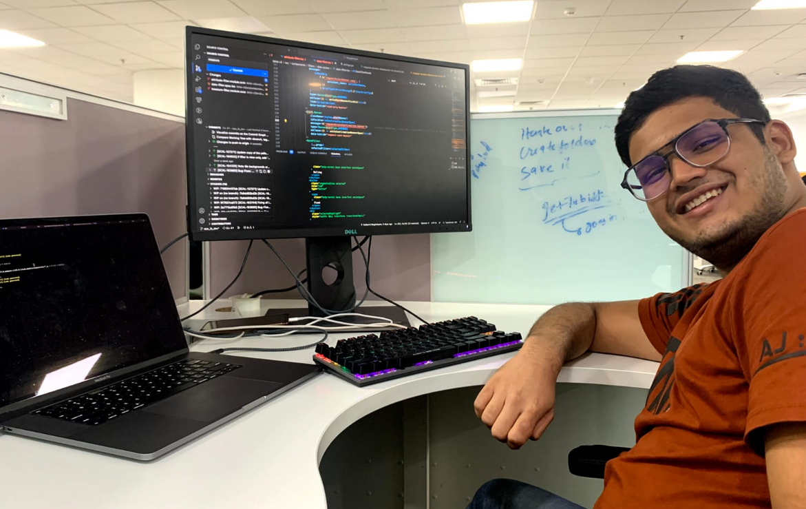

<!--StartFragment-->

What’s better than a concise job description? Especially in trying times like the internship season at IIT Tirupati!

Here is a no-nonsense tale of my internship experience at ThoughtSpot.

### Company Details:

ThoughtSpot is a business intelligence and analytics platform that enables users to search and analyze their data using natural language queries. It empowers organizations to make data-driven decisions and gain insights from their data quickly and easily. It is a product based Software company and I worked on one of their products called LiveBoard. My internship was in-office and the location was Hyderabad.

---

### How to get there?

ThoughtSpot hired on campus for the role of Engineering Intern. The first screening was a coding assessment followed by two rounds of technical interviews. More focus was on fundamental concepts of Data Structures and Algorithms and problem solving.

---

### Roles and Responsibilities:

As a part of the LiveBoard team, I got the opportunity to work on several issues and a couple of major projects. I worked on building and enabling two key features on the frontend of the product which made their way to production in due time. Apart from these, I was also involved in day to day issue solving, bug hunts and other activities.

Knowing that the code I am writing will eventually make its way to production was one of the major motivating factors for me during the internship. Also, I was fortunate enough to have an amazing team and supportive manager. There was enough responsibility on my head. I wasn’t just a mere intern.

---

### Advice….

- Before getting selected:

  - Work hard on your problem solving skills. Have a couple of good projects on your CV.
  - Give your interviews well

- During your internship:

  - Work hard, embrace challenges! GET OUT OF YOUR COMFORT ZONE!!
  - Show genuine interest and ask meaningful questions. Get things clarified.
  - Never shy away from learning and applying new technologies. Explore as much as you can.
  - Learn from everyone, everywhere and all the time!
  - Network, Network and Network.
  - Work on your communication skills. They matter. Period.
  - Take initiative and try finishing stuff on your own. NO ONE HAS THE TIME TO SPOON FEED YOU. Below is a message from one of my seniors to give you an idea.

---

### Some interesting stuff, a few personal touches and thanks:

The team I worked with followed the agile-scrum methodology with a weekly sprint where we met every Monday to decide on what was to be done the following week and met daily to sync up with each other’s progress and issues.

I worked on bugs initially and learnt so much with respect to code quality working on the go, collaborating with multiple teams and working on the pipeline to get my code merged. All thanks to the amazing code reviewer I had!

By the time I had resolved my first bug, my partner, Vaibhav from IIIT H and myself were tasked to extend a feature on one of the USP’s of ThoughtSpot, the LiveBoard. Again, not getting into the details, we successfully implemented the feature, not only according to the product team’s requirements but going a step further and implementing an extra sub-feature. After this I worked on a backend project which got called off. Then, I was allotted another feature. I was nervous but somehow, I ended up pulling it off on the last day before my presentation with my code getting merged almost at midnight.

One of the most rewarding aspects was knowing that the code I was working on would eventually find its way into production.

I want to acknowledge the fantastic team and manager I had. They were incredibly supportive and treated me as a valuable member of the team rather than just an intern. I was entrusted with real responsibilities, which made the internship even more fulfilling.

Almost a week after writing this article, I was contacted by the TS team and they offered me a Pre Placement Offer to join them as an MTS (Member of Technical Staff) at their Hyderabad office. A big thank you to alll those who supported me in this endeavor. Special shout out to my family and friends, my Mentor, my Manager and the CDC for providing me with this opportunity!

I couldn’t have asked for anything better than this.

PS: I got a MacBook Pro! (Not to take home! Just work…Duh!)

<!--EndFragment-->
