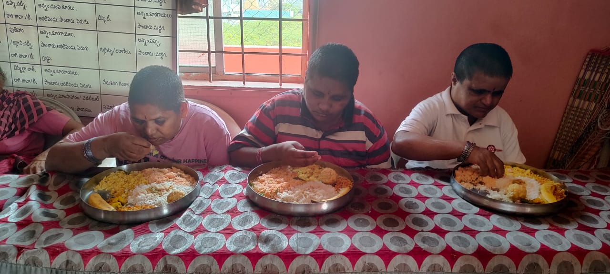
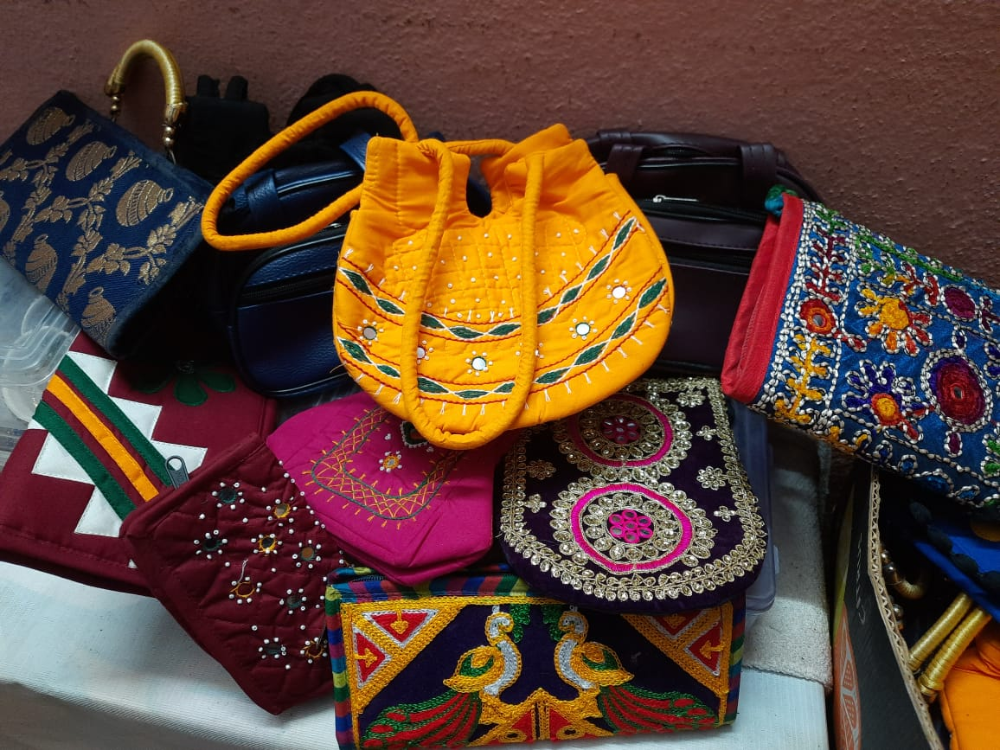

*As the sun dipped below the horizon, we entered a three-storey building, a resilient peach in colour, a beacon of hope. We walked in to be received by a woman with the kindest voice, excitedly conversing with a man who worked at a local hotel and his wife. They both had eyes sparkling with joy and fulfilment - they had sponsored a meal for the residents of Abhaykshatram that day.*

***Abhaya Kshethram*** is a home for physically and mentally challenged orphans, destitute women and aged people in Renigunta, located about 15 kilometres away from our IIT-T campus. The shelter home houses over 200 residents and is run in the spirit of *serving God through serving humanity*. The residents are housed in three buildings that are well managed by Dr Thasleema Sultana and team, who take care of all of their daily needs - ensuring nutritious meals on a daily basis, clothes, medications, etc. It is run entirely on contributions from individuals, small-scale local companies and Hope for Humanity (HFH) foundation. Recognised by the Central Government under the Indian Trust Act, the shelter is exempted from tax under Section 12A [^1] of the Income Tax Act. 

Pranjal Shukla, one of the graduates from the pioneer batch of our institute, currently pursuing a PhD here, brought to our notice the existence of this noble organisation and how from 2015 onwards, the student body has been celebrating Diwali among the residents of Abhaya Kshetram. Many students even celebrated their birthdays there. Unfortunately, due to COVID-19, when the interaction between college seniors and juniors was disrupted, this tradition did not continue. In fact, it won’t be surprising that many of you are hearing of Abhaya Kshetram for the first time. 

When we visited the shelter home, we had the chance to interact with the residents, thanks to the founder, Dr S.A.Thasleema Sultana. She started Abhaya Kshethram in 2007 on the occasion of the birthday of Mother Theresa. Her profound commitment and selfless service towards the inhabitants of Abhaya Kshetram is evident and truly remarkable. She has an excellent academic record, having been conferred a PhD in Special Education from Sri Venkateswara University, Tirupati, for her thesis titled “Attitude of parents, teachers and students towards children with special needs in normal and integrated schools.” 

Her selfless dedication to society has been recognised and appreciated on several occasions, and rightly so. She has been presented with several awards, including the 100 Inspiring Women award, which was given to her by then President of India, Shri Pranab Mukherjee, at the Rastrapathi Bhavan in  2016. Additionally, she was awarded the Devi award in 2016 by the then Vice President of India, Shri M. Venkaiah Naidu. In 2010, the Ministry of Woman and Child Development, Govt. of India, honoured her with the Rajiv Gandhi Manav Seva award for her services to orphaned and mentally disabled children.

Thasleema Ma'am has consistently aimed to provide volunteer services to all individuals in need, irrespective of their caste, age or disability unlike regular Government funded institutions that have specific criteria for selecting inmates. 

> In 2002, our organization began with just two children. I had earned a PhD in special education and psychology and was a gold medalist at the university. I took a job at the Department of Education in Hyderabad for two years, but I realized that it wasn't fulfilling my intention of serving society. I felt a strong desire to serve others. So, I resigned and returned home (Renigunta) with a plan to serve those in need. Before starting the institution, I observed other institutions and learned about the theory of running such a facility. I wanted to provide a unique service that didn't limit those in need based on their age, caste, or other factors. I wanted to provide services to anyone deserving and destitute. That's why we took in anyone who came to us, and our organization grew from two students to 200 students.

Having a strong support system from family is crucial for personal growth and success. Dr Sultana sings high praises of her father, who taught her the importance of giving back to society.

> My father, who is a tailor, taught us the importance of service by using leftover clothes to stitch and donate. He encouraged us to start sharing and donating whatever we had and believed that God would pave the way. This principle of giving and sharing has been ingrained in us from an early age, and even today, we continue to practice it in our lives.

Abhaya Kshetram is an organization that operates on a voluntary basis, and Dr Sultana intends to keep it that way.

> If the organization is a government entity, they have separate rules and regulations to follow. However, our organization is voluntary, so we have the freedom to admit deserving individuals regardless of age, caste, or any other category. Other organizations may be mandated by the government to cater only to specific age groups or castes, as seen in OBC hostels, SC hostels, OBC-SC hospitals, and similar institutions. In contrast, our voluntary service is open to all deserving individuals without any discrimination based on caste, age, or other health issues. Our goal is to help those in need in whatever way possible, and we do not consider any categories or distinctions. We accept anyone who is deserving.

In Abhaya Kshetram, every resident is called a student. Each student has a unique story behind their admission, with extreme cases ranging from being raped by family members or being neglected and abused by their own children. The organization provides a home for people in need, including those who are mentally or physically challenged, victims of acid attacks, or women from abusive households. Dr Sultana provided information about a few individuals who are currently residing in Abhaya Kshetram.

> For instance, we have one student who developed skin cancer and was left by her family. Another student from the Warangal district, who we admitted during the second wave of Corona, is now an expert in preparing bangles. We also have a mother of two from Karnataka who was abandoned and raped by others. There are many other cases as well, including an elderly person who was left here by their family, a mother of four who was brought to us by locals after being depressed and wandering around, a wife and husband who were beaten by their own son. Each student has a unique story that led them to us, and we provide them with the care and support they need to thrive.

She also elaborated on the standard operating procedures (SOPs) that are adhered to when admitting individuals into the organization.

> The usual procedure involves admitting people from various public places with the assistance of the police. After taking a photograph and creating a file, we record why they have come to us and take their statement. Later, we conduct medical tests to identify any health issues or disabilities that they may have. In case of suspected health issues, we conduct blood tests and maintain separate medical records for each patient. We also maintain a record of the medication they receive, as different medical conditions require different treatments. For patients with epilepsy or other behavioural problems, we provide medication and specialist follow-up care. Thus, we keep two records for each patient - one for admission and the other for their medical history.

Abhaya Kshetram not only provides a safe haven and a sense of community to its residents but also offers vocational training in various areas, such as making bangles, bags, candles, agarbattis, and envelope covers. This training helps the residents to develop new skills and readjust to a new environment both socially and economically. They prepare these items seasonally as well as on other days, and the products are mainly sold to visitors of the organization. During Tirutsava last year, they set up a stall on our campus. We hope to set up similar stalls on campus on multiple occasions, particularly at the upcoming Tirutsava 2023. This year, as a gesture of appreciation to the housekeeping and security staff on International Women's Day, we gifted them bangles and bags made by the residents of Abhaya Kshetram.

Having a dedicated and committed team is crucial for the successful functioning of an organization like Abhaya Kshetram. The team at Abhaya Kshetram consists of individuals who have faced neglect, unfaithfulness, or difficult situations in their personal lives. These staff members include widows, single mothers, and others who have been marginalized. Dr Sultana explains that when these individuals arrive at Abhaya Kshetram, they often express that they have lost everything. However, the home provides them with a new beginning, starting from scratch and helping them to develop a sense of responsibility. As a result, they become much happier and are able to lead a new life.

Dr Sultana encouraged us to speak with some of the staff members at Abhaya Kshetram to gain insight into their experiences at the organization. A former resident at Abhaya Kshetram, who was diagnosed with a psychosomatic disorder, has made significant progress and is now caring for other residents. She has been at the organization for eight years and is now very content with her life there.

During our conversation with another caretaker, she revealed that she had joined Abhaya Kshetram due to mistreatment from her husband. Her son is currently in the 7th grade, and her daughter is in 2nd grade. Funded by Abhaya Kshetram, they attend a nearby English-medium private school along with the other inmates of the home who are well enough to attend school. She expressed heartfelt contentment with the organization and the care provided by Dr Sultana. 

The team at Abhaya Kshetram plays a vital role in providing emotional support, counselling, and vocational training to the residents. They also help in managing the logistics of running the organization and maintaining the facilities. Furthermore, the team members act as role models for the residents, demonstrating how they can turn their lives around and rebuild their self-esteem and confidence. Their presence and support enable the residents to feel like they are part of a community and give them the courage to face their challenges and move towards a better future.

Funds are crucial to run an organization like Abhaya Kshetram. The organization heavily relies on local contributions from donors such as the Barber Association, Auto Union people, Tailor Association people, fruit vendors, local labourers, and auto drivers. The management of the institute relies entirely on the continuous support and contributions of local people, with donors often returning to provide ongoing aid.

We asked Dr Sultana about ways in which students from IIT Tirupati could be of assistance to Abhaya Kshetram.

> There are many ways to help, and since I am not familiar with your resources, any kind of support is welcome. Students can contribute by helping to conduct medical checkups and blood tests, such as testing for blood group, sugar levels, thyroid, and cholesterol. This can be done through NSS activities or medical camps. Additionally, students can collect old clothes, bags, and footwear and donate them to the organization. Encouraging the residents' vocational activities by purchasing their handmade items like bags, bangles, or candles can also be a great way to help. Rice bags are also much needed to support the food needs of the residents. If students are not interested in these options, they can contribute money as a last resort. These activities will not only benefit the residents but also provide opportunities for students to develop their skills and make a meaningful impact. If you have any other ideas, please share them with us. We have a large number of students and staff who can benefit from your contributions.

Abhaya Kshetram is a remarkable organization that is devoted to aiding and uplifting those who require assistance. Dr Sultana and her team's hard work and commitment have enabled numerous residents to rebuild their lives and find purpose and contentment. Witnessing the positive impact that Abhaya Kshetram has had on countless individuals is heartwarming, and it is evident that the organization will continue to make a difference in the future. As outsiders, we can do our part by supporting Abhaya Kshetram in any way we can, whether it be through *donations, volunteering, or spreading awareness* of their work. Overall, this organization is a shining example of how one can make a difference in the world and bring hope and healing to those in need.

*A special thanks to Pranjal Shukla, Debeshee Das, Sneha M S, Siva Sanjay and Pranav Panicker for visiting the shelter home and helping put this article together.*

[^1]: Under Section 12A of the Income Tax Act, 1961, non-profit organisations like charitable trusts, welfare societies, NGOs, religious institutions, etc. are entitled to tax exemptions.