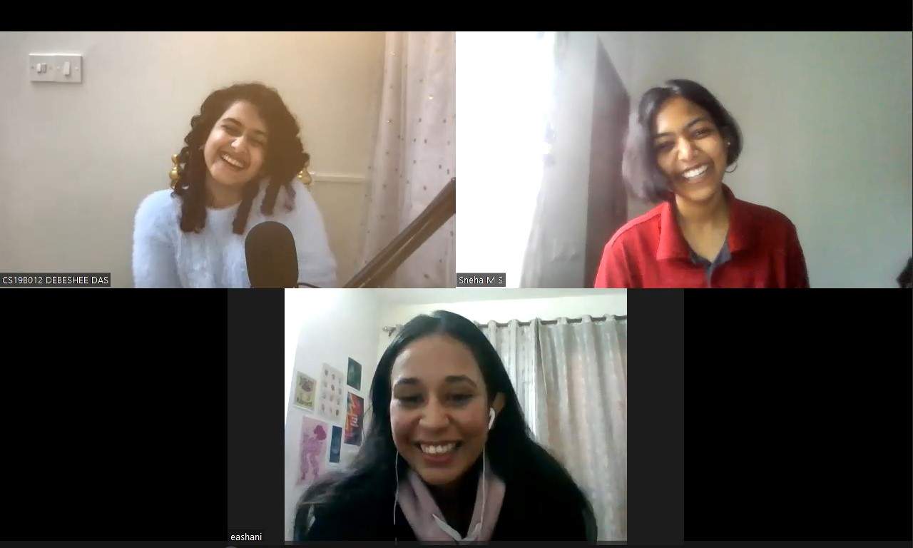

<!--StartFragment-->

*“My mom will love that statement. Westernisation is not modernisation.”*

If we could list the top twenty things that make us go “OH MY GOD!!! SAME TO SAME!!!”, you’d find all of them in these two wonderful books by [shortgirlbigbook](https://www.wattpad.com/user/shortgirlbigbook), who also goes by her real name, Eashani Chettri. In this first-of-its-kind **book review x author interview**, we got together for a much-awaited tea-time chat with the author of the book ‘Did You Get Your Period?’, and its sequel, ‘Periods, Pyaar and Patriarchy’. 

‘Did You Get Your Period?’ is, in short, the story of a girl named Shweta. But don’t let the apparent simplicity mislead you. The beauty of the book lies in the incredibly “regular” setting of an Indian girl with a doctor for a mother who goes to school and then college like most substantially privileged Indian girls who get a fair ticket to education, and its candid characterisation of everything we’re only too quick to turn our eyes away from. From periods to pregnancy scares, perhaps falling in love while having a quarter-life crisis, boyfriend drama that tests your relationships with your parents and best friends, the practical struggles of discipline and the nuanced tendrils of patriarchy that belie nearly everything, Eashani boldly addresses the ‘read-between-the-lines’ of most modern-day real-world girls.

Some of you might have started getting a whiff of the unmistakable “F” word by now. 

*Feminism*. 

Surprisingly enough, these books aren’t an elaboration of feminist ‘gyaan’ but a realistic description of some very real and relatable people in whom you’ll be able to see yourself, your sister, your mother and your grandmother! The protagonist, Shweta, is a bold and spunky 18-year-old who doesn’t hesitate to live on her terms. This doesn’t always work well for her, nestled in a typical Indian family, a little conservative and forcefully loving. The sparks really start to fly when she loses her virginity to a boy who isn’t even her boyfriend. Not yet, at least. To top it all off, her period goes missing.

*Stage Left. <enter: The mother>*

<!--StartFragment-->

Her mother finds out. So does her grandmother, and her other grandmother, and a lot of interesting people who adopt a similar epithet. Everything seems to fall apart. Every relationship that mattered - her best friend, her mother, her sister- is tested to a breaking point - over a boy who’s decidedly worth more than seventeen truckloads of drama. Chapters and chapters of beautiful character arcs that gracefully flow by, intertwining with thickening plot lines about the characters that never actually show up on stage; the book is a rollercoaster ride interspersed with sunny afternoons spent reading poetry on the grass. And Shweta’s period is still missing.

The second book picks up at the end of Shweta’s college graduation. Everything is different now, and everyone is older. Shruti, her sister, shows up with shocking news of her own. And then Shweta does the unconventional again - she insists on taking a drop year after college to take time out to figure out what she wants to do next. Her mother convinces both daughters to go to yoga classes. She makes friends with a 21-year-old in a wheelchair. But something feels horribly, horribly wrong. Sometimes your life changes in a flash, but sometimes the most painful things unfold slowly before your eyes while you watch paralysed. There is no escape but to work through it while you continue to grow, continue to figure out what to have for breakfast every single day, and continue to fight the absence of loved ones lost.

<!--EndFragment-->

<!--StartFragment-->

> [Wattpad](https://www.wattpad.com/) is an online platform for storytellers and readers, forming a global community of over 90 million. [‘Did You Get Your Period?’](https://www.wattpad.com/story/194018252-did-you-get-your-period), and its sequel, [‘Periods, Pyaar and Patriarchy’](https://www.wattpad.com/story/235015690-periods-pyaar-and-patriarchy) by [shortgirlbigbook](https://www.wattpad.com/user/shortgirlbigbook) are available on Wattpad.‘Did You Get Your Period?’ by Eashani Chettri is also available as an [audiobook](https://www.audible.in/pd/Did-You-Get-Your-Period-Hindi-Edition-Audiobook/B09GS9YKM3) in Hindi on audible.

<!--EndFragment-->

<!--StartFragment-->
**********

### Getting to know shortgirlbigbook

Eashani, from Darjeeling, West Bengal, is pursuing her final year in Organic Agriculture at Amity University Noida. Diving right in, we asked, “Could you please tell us a moment from your life that you’re proud of?”

> Oh, wow. Suddenly your mind's blank! It was very surprising when I got the audiobook for, ‘Did you get your period?’. Suddenly I got a message from the Wattpad CEO asking if I would be interested in this, and that was definitely a moment of, “Oh my God, this is happening! Awesome!”

A hardcore Swiftie and champion of Hozier’s music, Eashani gives the honour of ‘favourite author’ to Khaled Hosseini for his book ‘A Thousand Splendid Suns’. “He really touched me”, she says. We took a moment to solemnly acknowledge that one must never mess with a Taylor Swift fan before moving on to the next question.

Who would you say is the most influential person in your life so far? 

> I would definitely say my mum. All of the reading, love for literature - everything - the fact that I wanted to write - started from her because she's very supportive of all these things. She gives me enough space to experiment with things and be wrong about things, which is rare when I look at people around me. I'm very grateful for her influence in my life. 

How did your journey as an author begin? 

> I have loved writing since I was tiny. I would write these silly stories at the back of my notebook. I started reading on Wattpad when I was in my teens, like most of us do. My friends were into it, so I was also dragged into it. I mean bad boy stories and werewolves were the thing!

<!--EndFragment-->

<!--StartFragment-->

While all three of us burst into chuckles that stem from a pure “I sooo totally relate to that” moment, Eashani went on to describe the experience:

> I realised that you could write something of your own! I started experimenting with writing on Wattpad. I originally had another account which had stories of an experimental nature, which were not very relatable to the Indian audience, or particularly for myself as well. Obviously they did not do very well. So I decided that the next time I write, I’ll write something seriously. 

How did the entire story of Shweta materialise?

> I remember sitting down with myself thinking about what I would write, if I were to write. But there's this quote that says, “Write what you know”. I remember asking myself, “What do I know?” And I was like, I don't know anything! I was thinking about all possible stories that would do well on Wattpad. I remember thinking maybe I could write a book about, you know, this bad boy who falls in love with this good girl. But that hasn't happened to me. 
>
> I do not *know* that. 
>
> And then I remember thinking, what's the one thing about me that maybe other people don’t have? At the time, I was having a rough time with my menstrual cycle. I remember thinking, how do I make it more interesting? That was when it started happening. I think I got very excited about it because this was a novel idea I hadn't seen anywhere. And it was easy for me to write as well because it was definitely something I was familiar with.

<!--EndFragment-->

<!--StartFragment-->

We couldn’t agree more. The book comes off as very authentic, probably why we loved it so much! Moving on to the next question, we asked, “If you wanted someone to read your two books, how would you describe it and motivate them to read it?”

> I would probably say if you're mad at your mother, read the book. Which is a pretty bad marketing statement, but I think that's the best I can come up with right now.

We think that's a great marketing statement! I mean, we're all upset with our mothers at some point or the other - that temporary fight that lasts until dinner time! <more chuckles of whole-hearted agreement>

What about the people around you? In your college, your family - what is their response to these books?

> Oh, I think it was quite embarrassing for me initially. I didn't say anything to anyone for about a year until I told my friend about it. She pestered me until I told her the name of the book. She liked it a lot. She found it pretty relatable. And once the audiobook thing happened, my parents started getting a bit serious about it and wanted to read it. I think my parents were pretty proud of it and ended up sending it around to people, which I thought was surprising because periods were and still are a pretty taboo topic. But I was also very pleased by the reaction. 

<!--EndFragment-->

<!--StartFragment-->
*******************

### Relationships, relationships.

For Indian girls, talking to parents about relationships is still incredibly complicated. Not to mention different for the boys; it's just not as commonplace as it is in the West. We were surprised with how this was handled in the book - It's a pleasant experience overall with Shweta and Shruthi. The initial reaction from their mother was very different from what happened at the end. How do you see this evolving in modern society? Do you have any personal experiences that you based this on? 

> I based Seema's reaction on what I feel like my mother would respond like if I were in the same situation. Initially, she would come across as this very protective person who's out to destroy anyone who so much as breathes in my direction. But later, she would be a lot more open when she calms down. And I think it's the same for most parents because we live in a society with a rigid set of rules and standards, cultural norms. If any of us were to defy it by an instance, our parents would certainly be against it and find it difficult to come to terms with. But once the ball is set rolling, maybe they’ll come around. Again, it's not the same for everyone, but when it comes to parents who are a little bit liberal, a little bit modern, and a little bit willing to listen, I think that is how it would work for most of us.

<!--EndFragment-->

<!--StartFragment-->

One of our favorite things about the book was the growth of Seema as a single mother of two young adults navigating some of the most terrifying phases of their lives. Of course, she was just incredibly strong and inspiring in the beginning. But the part we loved the most was her evolving courage to believe in her daughters and overcome the instinctive overprotective response she'd always had. So what is the inspiration behind this aspect of the book? Do you have any thoughts on how parents can work on building courage in this difficult phase as well? When they see their daughters getting more independent, making big decisions, moving to different countries and navigating different difficult relationships.

> I definitely based it on how I feel like my relationship with my mother is like. Even if it's a small thing, she initially gives a very strong reaction, and then she slowly calms down. With regard to moving to other countries or pursuing something that's very different, I think parents do come up with a very strong reaction. But once you manage to get through them with a little bit of logic and maybe a little bit of crying <laughs>, it works out… because that's how it works for me. Like, you know, crying on the phone. “Like, are you going to listen to me?” “Like, ok, yes, fine, I'll listen to you now.” Once they start listening, I think they understand if something means a lot to you. So even though it's difficult for them, I think they will, for the most part, allow you to do it. I think I tend to be optimistic about these things so maybe it comes across as a bit idealistic. But yeah, *I do believe*. I think my mum is pretty open-minded when it comes to learning stuff, even if it's uncomfortable for her. That is something I greatly admire about her, and that is something I would want in myself when I am completely grown up and like a proper adult with a set of rules in my mind; I still want to be able to change and grow. I wanted Seema to have that. I think she would have to have developed an open mind because of all the unexpected things that happened to her, so it fits into a character arc.

Do you have any thoughts, or let's say *gyaan* to other parents - Do you have any pointers on how they could navigate this? Because they're doing this for the first time as well, right? 

> Oh my goodness! I do not feel like I'm qualified to answer. When my mother happened to read the chapter with Seema’s mother giving advice, she called me up and said, “You have a lot of *gyaan*”, and I remember just dying on the inside. Because I'm not at all qualified. *Choti muh badi baat*, but I would still suggest that please try to have an open mind. I understand that you might have concerns. Maybe give them some freedom, a little at a time, so you can build up on that trust. It makes sense that it is an uncomfortable experience for them. But growth is uncomfortable, so you can't really do much about it. 
******************

### Let’s talk about PCOS!

PCOS, or Polycystic Ovary Syndrome, is a hormonal imbalance that can range from mild symptoms to developing serious ailments in severe cases. While it cannot be cured, its symptoms can be managed. UNICEF says that one-third of menstruating women suffer from PCOS. 

*“Whether it's PCOS or PCOD, one cannot argue that both have a sense of social stigma and misinformation surrounding them, especially in Indian society. They’re such common disorders, yet they're treated as something shameful to keep under wraps, as are all things related to periods.”*  - UNICEF

We loved how Eashani brought out PCOS through a very realistic lens in the book, highlighting the real-life, extremely relatable struggles without blowing them out of proportion like the PCOS awareness videos often do. 

Do you think it's important to have more conversation about and around PCOS and why?

> Yes, I think it's definitely important to have more conversations about PCOS, mostly because I was diagnosed with PCOS at a very young age, thirteen. At that time, there was no literature available that was easy to understand for me to tackle on my own. PCOS is ultimately a lifestyle disorder, right? So these are changes I have to make by myself. I cannot keep going to a doctor to put me on different pills because that doesn’t solve the problem.
>
> We do need a lot of awareness when it comes to lifestyle disorders because these are changes you must make in your diet, workout, and how stressed out you are about things. When I went to the doctor, the only thing that I was told was, “Get on a treadmill and start running, and you'll get your period”. And that was very unhelpful because I was thirteen and pretty skinny then. It did not make sense for me to get on a treadmill and keep running without understanding how any of this worked.
>
> After a lot of time, I started reading [Rujuta Diwekar’s book on PCOD](https://www.rujutadiwekar.com/book.aspx?bid=9). Understanding what a holistic diet should look like is when I began understanding how blood sugar works, what food I should take, and what kind of workouts I should do. Most doctors would just tell me that I'm lazy or don't work out without specifying what type of workout I should be following. They would just be like, “Oh, go do a cardio session”. And I followed cardio sessions religiously for like a year, and it didn't improve anything. It ended up making matters worse. And then I started adding, you know, different kinds of exercise, maybe a bit of yoga, a bit of Pilates, and you know, switching up my diet, like cutting out sugar. I started doing all of these things on my own. It took me a very long time, and it did not have to be like this. I started at thirteen, so it took me almost eight years to get it back to normal. So I would definitely say that we need a lot of conversations about it but not conversations that are misleading. There's also this thing on the internet where people say, cut out the white bread, cut out white rice, cut out everything, and then survive on what? Survive on air after that? It's not helpful at all. I think the key is not to scare people but tell them that you can have balance and ultimately find a routine that works for you. 
>
> And another aspect of PCOS that I don't think we talk much about is how it affects your mental health. And again, when I was thirteen, it was 2013, so there was still not a lot of awareness regarding mental health. So when I had extreme mood swings, I would not understand what was happening without realising that this reaction was happening inside my body. I was just pinning the blame onto myself and being like, “Oh, there is something wrong with me as an individual!”. It's also necessary to consider this when it comes to PCOS. Because it's a lifestyle disorder, it affects almost every aspect of you. 
>
> Sometimes, you can also find out about PCOD because celebrities have started making a point to talk about it - it helps people get diagnosed. Many women deal with a lot of weight gain, but for many women, it’s not related to weight gain. I have lean PCOS, which made it extra unhelpful when the doctor said, “Do cardio”. So there are different types as well. We need to have a lot of casual conversations about this and be completely open about it because it can help so many people! 
******************

### The F word

What is your interpretation of feminism?

> For a long time, I thought of feminism as something very rigid, with a set of rules, no compromise, and this rebellion against men. And I was very inspired by the idea of feminism being something like that. But the older I grew, the more I realised that feminism as a concept for me is very fluid. It comes with a set of compromises and a set of places where I will not bend. I like to think of feminism as something we are handed down by our mothers, and it grows stronger every time we hand it down.
>
> The places where my mother compromises are a lot less than the places where her mother compromised. And there are places that my mother compromises that I will absolutely not. But because this is life and it's, you know, real, there are places I will grow to compromise as well, and hopefully pass on the baton to be something stronger, something brighter to my daughter someday in the future. And sons also. I think we should include everyone in the conversation of feminism.
>
> It’s something that's fostered by female friendships, for sure. It is feminism that protects our voices and ensures that we can have this conversation today. It's very crucial as a part of our democracy as well. 

If you think about it, without feminism, would we be able to talk to each other like this so freely today? Meeting over the internet and talking about women, women's bodies, and what we face? Most probably not…anyways, here’s a fun fact: one of the primary reasons women couldn’t enter the workforce for a long time was the lack of washrooms in the workplace!

> I think the way we experience life in itself is very different from how men do. I read an interesting article about how this is a world that caters to men, even in the littlest of things. You know how many jobs start from nine to five, and for women, nine to five is not really the ideal time, right? Imagine if you're a mother and expected to take care of routine domestic work, you would need a little bit longer than that to complete all of your work at home before going to work. So, when you think about it, even a nine-to-five caters to men inherently.

How would you respond to people, often women, who proudly walk around, saying that “I'm not a feminist”?

> I think most people who say they're not feminists are the ones who don’t really understand it and think it’s some very angry rebellion against men. Or they think of very angry women who like to complain about everything.
>
> My first question to them would be, “What do you think feminism is?” And most people would say it's something that women take on to complain about men, which is not true. *Feminism releases both men and women from the pressure of living in a patriarchal society.* It's just that the name is Feminism, which leads people to assume that. I've seen people who say “I'm an equalist, but I'm not a feminist” or “I'm a humanist, but I'm not a feminist.” What do you think feminism is? It's about equality. It's about respecting each other as human beings. 

Don't you think people have taken power away from the term ‘feminism’? With all the pseudo-feminism and craziness surrounding it, many people are scared to say they're feminists. Can we bring power back to the term, or do we just pick up a different term and go forward with it? Is the term tarnished beyond help?

> I don't think it's tarnished beyond help. It's like giving a dog a bad name and hanging it. Ultimately there's no shame in calling ourselves feminists. Although feminism has a bad name, it also has a good name. Taking away the term feminism would erase its good aspects. There is so much incredible feminist literature! Can we replace the term with “Humanist literature” or “Equalist literature”? There are a lot of new terms, but I think the name is trivial when we compare it to the ideology behind it. And for a topic that's as vast and intersectional as feminism, there will always be misconceptions about it. We'll have to take that along with us, as we go on. There are always going to be people who take advantage of it. They're a huge problem. I think that gives feminism and women, in general, a bad name.             

Speaking of misconceptions around feminism, STEM fields are usually dominated by men, and as a result, various companies hire women specifically for better representation. Some people feel this is unfair because someone “less competent” gets hired. But people need to understand the reason behind these programs without which they create negative, misconstrued notions around feminism. 

> I think, you know, it boils down to equity. Women do deal with a very different set of problems. We will have fought a lot more when we ultimately reach the workforce. Not for all of us. Many of us come from privileged backgrounds. But many women will have already fought a certain degree of battles that other people will not have. Because it is equity, it's fair to give them that representation even if they need to be more competent because they have a whole history of battles behind them.

As girl students at an IIT, we also struggled with this ideology. Both of us recounted our experience with understanding the supernumerary seats for women at IITs that started in 2018. 

*“I had a week-long fight with my mother about how I could take up this seat when I advocated for equality, myself. It is very difficult to understand the concept of equity when you look at it from inside the system. My mother and I researched it thoroughly, and in the end, she convinced me by using the example of NDA. I was highly interested in writing the NDA exam, but at the time, I was not allowed to because I was a girl. She highlighted how equity is about trying to balance things out in the big picture, trying to correct things that are currently skewed - when you think about it carefully, we do need measures like this if we want to improve anything”* - Sneha

*“I had the same struggle - I didn’t want to take up the IIT seat because I felt I hadn’t earned it fairly. I get that some girls deserve opportunities like this, but I had a lot of support. I wanted to go to IISc instead because I had earned my seat there, fair and square. But if I didn’t take up the IIT seat, another girl who is “less deserving” (with less deserving in quotes because we’re only considering JEE rank here) would get the seat instead. I will not make even a scratch in the system; forget about making a dent. I realised that I couldn’t fight the system from mindlessly rebelling and that I needed to learn more to understand why this was happening.”* - Debeshee

The focus should definitely be on women of less privilege. But when these programs affect women of a certain privilege, there will be a moral struggle. The best way we who get to avail these opportunities can help is by using our voices as representatives and making the field more suitable for more women to come to it - eventually in a more normalised manner instead of through special measures. This is our sacred duty and something we can actually help with. 
***********************

### Our favourite part…

What is your favourite part of the book?

> Oh, I think my favourite part of the book is Shruti. Even though she's a background character, I have a soft spot for her. I really feel when I write her parts, especially parts where she opens up. I was proud of myself when I wrote the conversation between Seema and her mother. I added this part when I re-edited the book after two years. Shweta is an interesting person and very different from me. I made sure she had a voice very distinct from mine so that I didn't take over the book and make it about myself. That was important for me. 

Something that we loved about the book was that it was not preachy at all. It was not - “Heyy, this is feminism, and this is patriarchy, and this is wrong, and this is right”. It was not like that at all! It was just a description - just a realistic description of these people, and that's so much more powerful than debating about ideologies. It was a fantastic way of putting it across. 

*“I like these conversations that the sisters have. I have a younger sister, so anytime that happens in the books, it resonates with me - I love a good depiction of bonding between sisters.”* - Sneha 

*“Oh, I loved everything! I loved the characters of the naani and the daadi, and those very oddly specific details about them. The whole conversation about self-pity with both Seema and Bhavya - I loved how he deals with self-pity and everything around that because I feel like self is a very complicated thing again. How do you deal with self-pity as a purely privileged person and as someone who probably has the right to feel self-pity? I don't know. When do you have the right to feel self-pity?”* - Debeshee

> I think all of us have the right to feel self-pity. We do feel bad about things, and I think that's normal. But there's a very thin line between where you should pick yourself up and where you just fall down in a hole and decide you're going to spend your life there.

You introduced this entire concept of tarot cards. Do you have any experience with something like that? 

> I feel like it's a really nice way to get to know yourself and be introspective about things. A tarot card reader would explain it better than I do, but they relate all your past, present, and future in a way that will resonate with you. Maybe it's my bias inside my head that also allows it to resonate with me. It opens up new doors for me to think through. 

Is there going to be another book? What are your plans for Shweta? 

> A new story is definitely in the works, at least inside my head. I tried writing it. It hasn't come out the way I wanted it to, and I need it to be completely done and dusted before I think of publishing it. When it comes to, ‘Did you get a period?’, I want it to be a trilogy with this perfect ending. But I have no idea what it's going to be like. I think I need to grow as a person before I write that because I want to present a fresh perspective.

What is the community of Indian readers and authors on Wattpad like? How is that flourishing? 

> I think Wattpad writers these days, particularly [wigglysubu](https://www.wattpad.com/user/wigglysubu), who wrote [Under the Mango Trees](https://www.wattpad.com/story/243075992-under-the-mango-trees) and [DelhiBelly](https://www.wattpad.com/720002565-the-best-of-wattpad%E2%99%A1-the-love-riots-noora-zaroon), who wrote the [Love Riots](https://www.wattpad.com/720002565-the-best-of-wattpad%E2%99%A1-the-love-riots-noora-zaroon), are all phenomenal writers. Their unique voice and writing precision just hits the right spots. When it comes to readers on Wattpad, I did not expect my book to have a community. It was very surprising when some of my readers used the comments sections of the chapters as a place to meet and have a fun conversation. It feels nice to be a part of all of it. The Wattpad community is growing, and it's great that readers have this space to meet like-minded people. It's incredible!

Do you think Wattpad writing will become a profession? Does Wattpad monetise?

> Yes, they've got this paid stories program that just started recently. They've been encouraging writers to write more and try to pay them more than just their social following, which is great. At the same time, I think there may be a stigma when it comes to Wattpad writing. We may not be considered serious writers. We are not going around in turtle necks with a hoity-toity degree in literature and talking about Sylvia Plath and things like that. We're talking about small things, but you know, there's this quote by Richard Price that I love that says,
>
> *“You don't write about the horrors of war. No. You write about a kid's burnt socks lying in the road.”*
>
> You work off that resonance from there. That was something that stayed with me, and I hope to be able to do that as a writer. I think the most important duty of literature is to ensure it's accessible to everyone. And I would much rather want my writing to be accessible to 13-year-olds. I want them to be able to understand and like the book. I'm happy with that.

And then the conversation ran away with us as we excitedly exchanged Wattpad book recommendations, sharing moments of pure joy and understanding over words, verses and chapters strung together by absolute strangers, bringing us together on a random Monday evening.

<!--EndFragment-->

<!--EndFragment-->