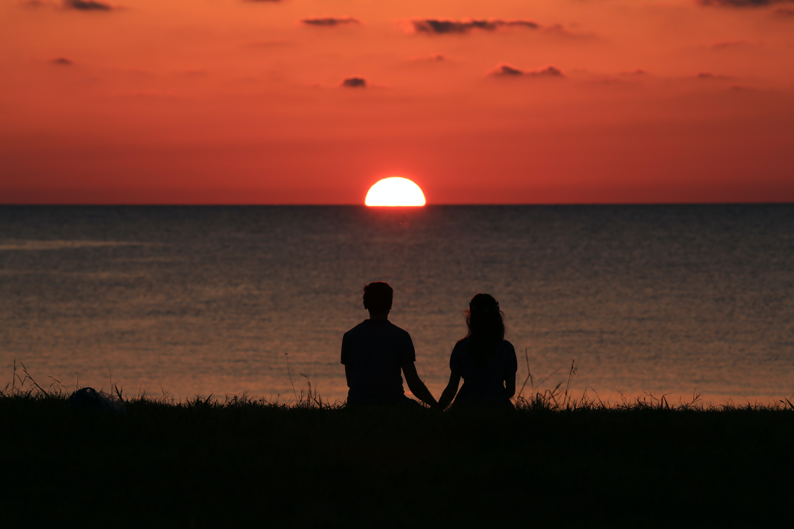

जब गगन के धुंधले दर्पण में, 
संध्या का स्वर्णिम दर्शन हो, 
सागर की मचलती लहरों पर, 
नौका का रूप प्रदर्शन हो, 
मन के भीतर निर्जन वन में, 
तेरी ही यादों का गुंजन हो, 
हर बार यही बस दुविधा हो, 
छुपते सूरज का ना क्रंदन हो, 
क्यों मन तेरे सपनों का आदी है? 
अब क्या होना बाकी है?

तेरे साथ गिरकर और संभालना अभी बाकी है, 
तेरे दीदार भर के लिए तेरी राह में भ्रमण करना अभी बाकी है।

पता है मुझे, तू बस मेरी है, ये बार-बार सुनना अभी बाकी है, 
तेरे लबों से अपना ही नाम, बार-बार सुनना अभी बाकी है।

तू है किसी चाँद सी, इस बड़े से आसमान में चमकती हुई, 
मेरा तुझे देखकर किसी तारे की तरह झिलमिलाना अभी बाकी है।

तुझे हँसते हुए देखकर हर बार, मेरा मुस्कराना अभी बाकी है, 
जैसे कि कुछ ख्वाबों का नींद से लिपट जाना अभी बाकी है।

कई शामों का ढलकर रात हो जाना अभी बाकी है, 
बातों का अब हसीं मुलाक़ात हो जाना अभी बाकी है।

बहुत कुछ बाकी है जान, क्या कहूँ कि क्या अभी बाकी है, 
ऐसा लगता है मानो, ज़मी हूँ मैं, और आसमान अभी बाकी है।

