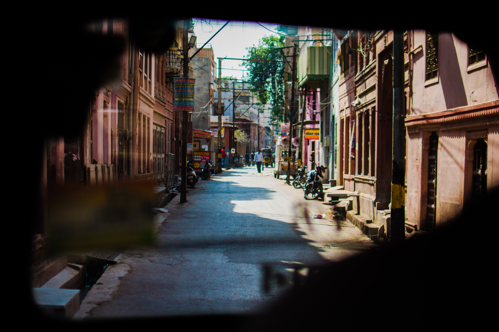

### PRELUDE

Raj walked in, sliding the creaky door that led down the dimly lit hallway. His grandpa was bedridden for quite some time now. Though he could speak, his body had worn down. He was no longer Mr Mohan of DD News, a revered name in the media industry.                     
                 
Raj watched with his eyelids rather heavy as his granny fed the old man porridge. He had never witnessed a silence this loud.             
                
The old couple puzzled him at times. He was doomed with questions that made him ponder over another road of thought.                      
                                         
What made his granny keep up with the tiring circle of food, drugs, hospitals, and repeat? What kept the fire of commitment going?                                                           
                        
*He could feel the pain in their eyes,*                                 
*An aroma of a long tale of love,*                                    
*A super strong commitment,*                                                         
*…Maybe a red-thread concept, after all.*                                          
                                                                           

I want you to look right into my eyes. 
To tell me you love me, to be by my side 
I want you at the end of my life. 
I wanna see your face when I fall with grace. 
At the moment, I die. 
Is that alright? 
Is that alright?
       
                    
The love story started way back in 1974, for it was a captivating tale spun with wasps and roses all along. In the streets of Pune, love blossomed between Dr Meera; an anatomist and part-time starry-eyed romantic with a sense of noble love, and Mohan; a journalist who covered the local news for DD. It was love at first sight. Within the tick of a clock, the relationship had bloomed, and the couple devised a plan which eventually worked out. Their parents were more than happy to get them married - which is how Mohan married Dr Meera in 1976. Their marriage had been a blissful one, much to the joy of their families.                     
                        
Until the storm arrived, knocking at their doorstep. 
                                              
********************************   
### INTERLUDE              
                        
It happened one twilight.                    
On her way home from the clinic.                         
On a crowded bus.                         
She wasn't alone.                         
A group of men had touched her. Groped her.                            
Unafraid. Unashamed.                         
                  
She tried to jostle them away and yelled for help, but the others on the bus remained mute spectators, their faces pale and numb, their bodies trembling in a state of helplessness.                     
                   
The men got off at the High Court stop.                             
                  
That's when one of the old ladies sitting by the aisle told Meera that those men were politicians with a powerful influence in the Shivajinagar area and the whole of Pune.                
                            
So what mattered now was to keep quiet and let it die down.     
                            
Gulp the shame and ignore the injustice.                           
                                   
But neither Meera nor Mohan would keep quiet.   
                       
Filled with an uncontrollable fury, Mohan erupted upon learning the unsettling truth. He used all his power and influence in the media world to let the world know about the crime that had been committed in broad daylight. An FIR had been filed against those men who had the backing of the MLA, Mr Vikas.                               
                             
It seemed like their bond was immune to whatever was happening.Mohan and Meera were perceived as two very educated, liberal, and progressive thinkers, and their out-of-the-box approach was idolized in their friend circles. But, this limelight was short-lived.                              
                                         
Why?             
                           
Because it hadn't taken long for Vikas to learn about the journalist's relentless endeavour to expose him. He was livid and frustrated. Determined to quash Mohan's just efforts, he ordered his team to devise a plan to silence the honest couple once and for all.                         
                                          
A few weeks later, as Mohan was driving his Ambassador down the University Road, he spotted a man, grievously wounded with his bicycle shattered, lying in a pool of blood just outside a nearby bar. Mohan halted immediately and rushed to help the injured man.                         
                                     
But what followed was beyond his imagination…                              

                                
In a startling turn of events, a convoy of police vans arrived at the scene and swiftly restrained Mohan in handcuffs. The officers claimed to have witnessed him exceeding the speed limit and striking down the driver right before their eyes.                     
                    
Confused and dumbstruck, all Mohan managed to say at that point was, “HUH?”                      
                       
Gradually, it became clear to Mohan that Vikas was undoubtedly involved in orchestrating the accident. He suspected that the bigshot politician might have bribed the bar owner to testify against him and had manipulated the police officers to ensure he was locked behind bars, wanting to bury the sexual harassment case along with it. Mohan’s suspicions may have been right, but there was no way he could have suspected the bottomless pit of darkness and corruption he was about to fall into. Trapped amidst false accusations and deceitful testimonies, Mohan could see no way out.                                  
                                                    
The unfortunate demise of the cyclist within a few days added a sinister and unsolvable dimension to the case.                                                 
                            
Even with a lawyer, Mohan found himself helpless.                 
                                  
The bar owner was the only witness, and he had no intentions of walking a righteous path.                              
                            
Mohan was sentenced to 10 years in prison.    
                        
His life was unjustly derailed.
            

Oh, I love it, and I hate it at the same time, 
You and I drink the poison from the same vine. 
Oh, I love it, and I hate it at the same time, 
Hidin' all of our sins from the daylight 
From the daylight, runnin' from the daylight…
                 
                                 
This was all Raj knew. His grandparents hadn't revealed anything more than this other than that Meera had seeked solace at her sister's place in Mumbai during those tough times. Despite his curiosity to delve deeper into their story, he found himself uncertain about how to broach the subject directly with them.                   

But that day, there was a different energy in the air. As if reading what was going on in her grandson's mind, Meera began,                                      
                                           
"We fought against more than just bars and prison walls. It was a battle against an unjust system that favoured power and money over truth and justice. They thought they could suppress us, silence our voices, and break our spirits. But they underestimated the strength of our love and our unwavering belief in what was right."                    
             
Her eyes met Mohan's, and in that moment, an unspoken understanding passed between them.                               
                          
Mohan cleared his throat, his aged voice carrying the weight of memories and untold stories. The room fell silent, filled with anticipation as Raj leaned in, his eyes locked onto his grandfather, ready to absorb every word.                            

***************
### DRINKING TRAUMA

“How could I forget…cell No. 15, 4th Block, Yerwada Prison.”, Mohan began in a relieved yet scared voice. “The first few weeks were tough. The other inmates were cold and distant, so socializing was a challenge. The place was dirty, not dusty, but filled with the scum of society and their pastimes - bribery, robbery, substance abuse and violence. All I could do was settle in for a completely different journey and brace myself.”                    
                                 
“The months went by. The days would repeat without change. Slowly. Monotonously. Without purpose.”, Mohan shuddered. “All I had to distract myself were menial inmate jobs. My career felt like a dream from a long time ago. I spent my days lost in thoughts, smoking cigarettes, and longing for my family. I gazed at the stars each night, hoping that destiny had other plans."                                        
                      
"The prospects of bail dimmed, and my lawyer's spirits were crushed. However, a glimmer of hope emerged when he sent me a letter," Mohan revealed. "He wanted the DD to independently investigate the accident and Meera's harassment case, hoping that public knowledge would expose the politicians' wrongdoing."                     
                   
The room fell into silence, the weight of Mohan's words settling upon them. The letter held the promise of a potential turning point. Mohan's gaze shifted to his grandson, Raj, conveying a silent message - the tale was not yet over, and there were further revelations to come.                    
                                    
"I followed my lawyer's instructions diligently. I reached out to every media contact I had, pleading with them to delve into the issue and uncover the truth, holding onto the hope that justice could be served."                            
                        
He continued with a far away look in his eyes.                     
                   
"The following two months were filled with uncertainty. DD diligently pursued the case to determine if my Ambassador had indeed collided with the bicycle. Not so surprisingly, the car remained untouched, raising questions about the circumstances surrounding the accident." His eyes glistened.                 
                          
"They also interrogated the bar owners; the records were meticulously examined to identify any individuals present on University Road that night. A witness came forward, reporting the presence of people connected to MLA Vikas. Coincidentally, the investigation also shed light on the sexual harassment incident on the bus a few weeks before the accident. The bus conductor and other passengers were scrutinized and intensely questioned."                 
                         
Taking a croaky breath, he continued,               
                    
"All seemed to be in our favour. But we were sadly mistaken. The brains behind the entire fiasco were smarter than we had expected. Sensing the situation getting out of their control, they used all their influence to puppeteer the jail authorities and the wardens. Let me put it this way. You play Chess, don't you?" he asked.                        
                 
Raj nodded.                     

            
                                                                           
"Then you must know there's no luck involved in the game. It's all strategy and skill. Think of the queen as money, its beauty granting it unlimited power and influence. In this analogy, you are the king, burdened with responsibilities, making cautious moves, one block at a time, navigating through life. Your family, the rooks, bishops, and knights, are there to support you. But when the opposing queen launches a powerful attack, they can become helpless, unable to withstand her influence.                                                                    
                                  
Now, imagine the pawns as your pieces of evidence or your Plan B. Move them forward slowly, strategically, and keep them safe until they reach the end of the board. With diligence and perseverance, they can transform into the queen.               
                                
But here's the twist, before our pawn could reach the end of the board, theirs did. They now had two queens in action, and it was no longer a fair game of chess.”                                    
                       
"Very soon, a disturbing rumour spread like wildfire; The false claim from the wardens asserted that 'Mr. Mohan, the inmate in cell 15 of block 4, was mentally unstable.' Then even went as far as to produce a fake medical certificate that diagnosed me with PTSD and bipolar disorder. They tried everything they could to ruin me." Taking a slight pause, he continued.             
                       
“Since the jail authorities lacked the power to transfer me to a mental asylum based solely on a falsified medical report, their plan was to manipulate my fellow inmates into witnessing and reporting behaviour that would serve as grounds to remove me from the equation. The investigations conducted by DD regarding our case lost momentum as Vikas, the mastermind, had devised another scheme; A money laundering accusation was hurled at the chief editor to silence him."                   
                        
"My poor Meera spiraled into depression. She made the difficult decision to resign from her job, unable to bear the weight any longer. Fear silenced her. The frequency of death threats only intensified. She was trapped in a state of constant anxiety and distress. What else could she have done?Her family was her only solace."                      
                               

Hey, what's up, it's been a while 
Talking 'bout it's not my style 
Thought I'd see what's up 
While I'm lighting up 
It's cold-hearted, cold-hearted
   
                                         
The old man took a deep breath, his voice filled with a mixture of vulnerability and reflection. "Son, there's a saying - if you ride like lightning, you'll crash like thunder. Remember that," he cautioned, his words laced with a sense of radical vanity.                                         
                                                        
"The following months were the ones that molded me into the person I am today," Mohan continued, his voice betraying the heaviness of those experiences. "It felt as though every breath was a struggle. I lost my privacy, my confidence. It felt like there was nothing at times. My inmates kept their distance, watching my every step carefully. Their gazes pierced through me, stopping me dead in my tracks. But I couldn’t do nothing either, for they would come to check up on me. I couldn’t dream, I couldn’t be at peace. I was being watched. Always.                                   
                                            
"Simple tasks, like washing plates, became an ordeal," Mohan confessed. "The person beside me would monitor my every move as if questioning my every action. If I dared to protest or show any signs of anger, their attention would intensify. They exchanged knowing glances, silently communicating their self-assuredness while shaking their heads in disdain."                               
                              
“For one whole month, I lived in fear. No other horror of that jail could possibly hold a candle to that one month of my life. I could not live anymore, all I did was exist.”                     
                                      
“For the first time since I was thrown in jail, I felt imprisoned."

                                                                                                                        
"I found myself in an unnerving position, being treated as someone special – mind you, definitely not in a positive way.                                                    
                         
I had lost the right to enjoy or complain about the food without being labelled mentally unstable.                              
                
I had no right to express anger or raise my voice.                    
                         
I lost the ability to shed tears out of the fear of being labelled mentally weak.                             
                         
Every single action and emotion was scrutinized with great detail to determine my mental state.                              
                           
I tried my best to remain unaffected. But it's not that easy.                        
                                                                                                 
Gradually, I felt a growing rivalry with my mind, attempting to act 'normal' while constantly being watched and judged from all sides.               
                                                              
The friendships I had formed within the prison walls began to crumble, not that there were really many. In their eyes, I was already a mental patient."
     

Feel my blood runnin', swear the sky's fallin' 
How do I know if this shit's fabricated? 
Time goes by, and I can't control my mind 
Don't know what else to try, but you tell me every time 
Just keep breathin' and breathin' and breathin' and breathin' 
And oh, I gotta keep, keep on breathin'
       
                             
"But I couldn't continue breathing normally, not for long," Mohan continued, his voice laced with resignation. "Within a few months, a notice arrived. I was to be transferred to the nearby Kirkee Mental Asylum. A handful of inmates claimed to have witnessed supposed symptoms of my mental instability and had betrayed me. Not that they owed me anything. Money makes anyone do anything, I guess."                       
                               
"I was at a loss for how to respond," Mohan confessed, a sense of helplessness seeping into his words. "The wardens, mere puppets under the influence of MLA Vikas. In a shockingly short span of time, I found myself transferred to the asylum, all orchestrated through a fake medical report issued by the jail committee, under the control of Vikas and his cohorts. They would stop at nothing to bring me down, to silence my voice."               
                    
He paused, a tremor of uncertainty lingering in the air. "But little did I know that this was just the beginning," Mohan continued, his tone heavy with foreboding. "They weren't finished with me yet."                
                            
Raj's eyes were filled with tears. He knew his grandparents had been through a lot. But this was way beyond what he had imagined. He now understood why they were always reluctant to dive into the details. His grandfather continued, his voice tinged with despair.                                             
                                                      
"In the confines of the mental ward, I found myself under the control of a psychiatrist responsible for the tests and medications. I was involuntarily committed, stripped of my right to discharge myself without the doctor's consent. Everything seemed bleak."                                                   
                                    
"My case was deemed severe, or so the doctors, swayed by bribes, claimed," Mohan explained, a touch of bitterness colouring his words. "They spoke of shock treatments, using procedures like ECT, which sent shivers down my spine."                                                                          
                       
"Unfortunately, it turned out that their words were not empty threats but a grim reality. ECT became the only option, as per Vikas's twisted desires."                          
                             
Raj's hair stood up. He wanted to make this person suffer. His grandfather shouldn't have gone through all that.                                                      
                            
"If there was one person in the room who truly understood the deadly nature of corruption, it was my psychiatrist. I can vividly recall the look on his face, with deep wrinkles etching his forehead and furrowed eyebrows, revealing the burden of guilt and helplessness that weighed him down. It was a stark reminder that life isn't always fair, and in my case, cruelty overshadowed every good deed I had ever done.                
                           
My memories following that point are fragmented, but the first thing that stands out is the fierce struggle with a group of doctors who forcefully dragged me towards the ECT room. I was utterly helpless, feeling more powerless than ever before. The technicians, devoid of any mercy, beat me with sticks and tightly bound me to the bed using ropes. I desperately tried to break free, but my attempts were futile and clumsy at best.                  
                                      
They affixed electrodes to my scalp and forcefully inserted a mouth guard. I fought back by biting, scratching, and pinching, but it proved to be in vain. The doctors had been paid handsomely, to the point where they didn't even bother administering anesthesia prior to the ECT procedure. The last thing I remember was the intense jolt that coursed through my body, causing my jaws to collide with the mouth guard, while my saliva flooded against my cheeks."                   
                                       
Listening to all this, Meera couldn't stop the tears. Mohan held her hand, reassuring her that they emerged victorious from that ordeal. Raj was also shattered. This was too much. But he had to know. Why was the universe so cruel? Why were his grandparents subjected to such inhumane treatment? What had they done to deserve such adversity?
                                                                  
"The next thing I remember was waking up with a nauseous feeling. A week had passed. My head was heavy; the world around me seemed hazy, as if clouded by a fog. The pain in my jaw was intense. Although I was no longer bound to the bed, I discovered that I couldn't move a single bone. Everything was painful. My neck ached, and when I attempted to speak, my voice was barely audible. There was dried saliva on my cheeks. My temples kept throbbing for no reason. It was almost like my brain would implode at any moment. I could sense the darkness that had descended on my entirety without even looking at the mirror. That was no ECT. That was human torture."                                       
                                 
As the story unfolded, Raj found himself overwhelmed by the horrific details. The vivid descriptions of Mohan's experience after the ECT procedure left him shaken to the core. His mind struggled to process the physical and psychological torture his grandfather had endured. He felt his own heart pounding against his chest. A rush of blood surged through his ears, amplifying the intensity of his emotions. Why were humans so cruel?                           
                                                
Mohan continued, his voice filled with a mixture of resignation and detachment.
                                         
"During the following years, I was transferred to a rehabilitation centre, where efforts were made to improve my mobility. While there was some progress in these physical aspects, my memory remained clouded; Even today I can't remember everything that happened in that torture chamber." He sighed.                     
                                   
"I became withdrawn, rarely engaging in conversation with others. I didn't want to think of the past. I just couldn’t bring myself to."                                             
            
Raj felt profound admiration and respect for the person sitting before him. His grandfather, who had initially chosen to shield him from the depths of his painful past, had reached a stage where he was sharing the immense trials he had endured. His heart swelled with a deep sense of gratitude and a desire to become the kind of grandson that would make his grandfather proud.                              

 
                                        
"Meera had endured immense mental strain during those years. Still, she was my lifeline. I wouldn't be what I am today without her. The weekly letters we exchanged became our lifeline, the only flickering embers of hope that remained in our lives. After a long and arduous two years, I was finally released from that madhouse. Returning to familiar surroundings, I couldn't help but notice the pensive gazes from people around me. Their silent judgments and unspoken questions only added to my already burdened self-esteem.                               
                                            
But amidst it all, your grandmother's eyes shone with a different light. Instead of pain, they overflowed with tears of joy. At that moment, I realized I should have presented her with a simple flower to express my love and gratitude. Yet, how could any flower compare to her beauty and grace?                                  
                            
I yearned to begin a new life. Meera deserved nothing less than the utmost devotion and care, and I was determined to provide that for her."                                    
                

Past lives couldn't ever hold me down 
Lost love is sweeter when it's finally found 
I've got the strangest feeling 
This isn't our first time around 
Past lives couldn't ever come between us 
Sometimes the dreamers finally wake up 
Don't wake me I'm not dreaming 
Don't wake me I'm not dreaming….
       
                                                          
"Perhaps justice took a detour, a path we did not expect. Maybe the forces of greed and power prevailed, tearing apart my life and career. Maybe Vikas's actions left a trail of destruction, shattering not only my dreams but also those of my wife. Yet, amidst it all, there was one thing that money and power could never conquer – our love for each other. Love is a pain worth experiencing once in a lifetime. They tried to break us, but our bond grew stronger each day. Love became the foundation upon which we rebuilt our lives, brick by brick. And here you are, Raj, listening to our story."                            
                        
As Raj glanced into their eyes, he could still sense the lingering agony and pain. But alongside the turmoil was an undeniable presence of love, like an intoxicating elixir that continued to envelop them. It remained as potent as ever, defying the test of time and the hurdles they overcame.                                    

> Edited by,
> Sneha, Akhil and Chaitali
