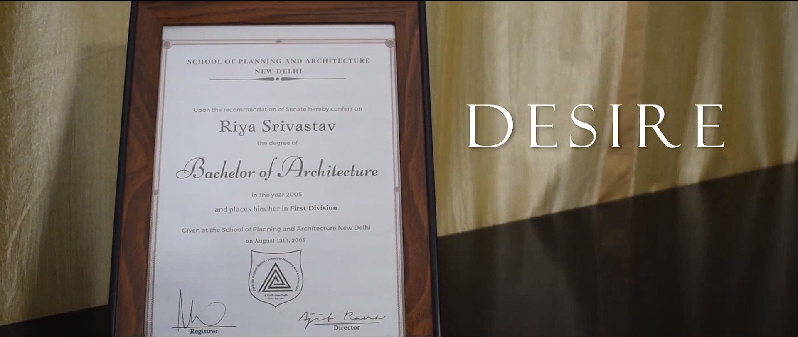
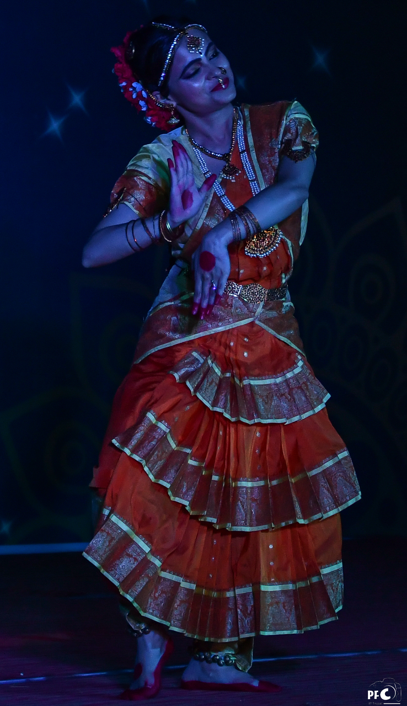
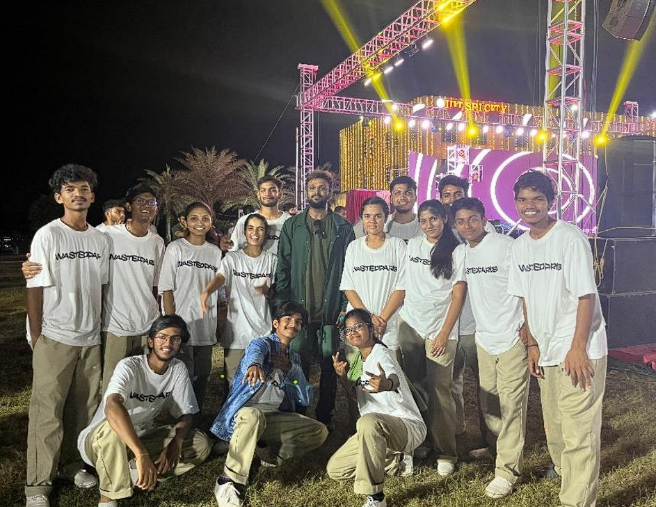

--- 
title: "Student Clubs - Outlets of Expression"
category: "Campus News"
date: 2023-07-14T12:30:00.393Z
desc: "Another year to look back to what our clubs achieved, and the fun we had. With so much going on, it's difficult to keep up with all the news. So here's a not-so-brief article to help you catch up with everything our clubs been upto."
thumbnail: "./images/clubActs.jpg" 
authors: "Ram Mohith, Swathi, Bineet Barman "
starred: true
abio: ""
alt: "clubacts"
---

With the arrival of the first fully offline batch after the Corona pandemic, club activities have been steadier than ever before. This was also the year when Inter IIT Cultural Meet was resumed - which is a sign of the even livelier times to come. Here are some highlights of all the work done by our student clubs in the preceding academic session.                                       
                                                           
Beginning with the culturals: On the occasion of Independence Day of 2022, **Actomania** started their year with a stage play on **‘Ahimsa’**- promoting Gandhi's principles of non-violence. Going forward, they also lit up the stage with monologue performances for the Freshers' Night. As a part of Intra IIT, the club also came up with two activities: A monologue event where the participants had to deliver a dialogue with their own theme or background and **‘Witty Comedy’**,
a spontaneous play contest where the participants were given a situation and were asked to construct a play and enact it spontaneously. Both the events were creative in their own ways and attracted many participants from the contingents. The participants had a lot of fun, and it was a nice interactive session. Post-winter break, a stage play was performed on the importance of voting and choosing a proper leader for the greater society. On International Women's Day, a gripping stage play was presented on the importance of women empowerment by showcasing the darker side of prostitution. All these thought-provoking stage plays made a long-lasting impression in the audience's minds.                                                                               
                                                        
                                
               
                                     
**Artista** camp also had a packed academic year with a plethora of events. For Independence Day, the club conducted **‘Freedom to Depict’**, a contest to celebrate the work of Classical Indian Artists. As a part of Freshers' Week, the club conducted a costume design contest that saw many out-of-the-box outfits, leaving the spectators in awe. For Dussehra celebrations, the club crafted a 10-foot effigy of Ravan for Ravan Dahan. Rangoli and Diya painting events were also conducted as a part of Diwali celebrations.                                                             
                
|  |  |
|:-:|:-:|
||                  
                
Various workshops were conducted by the club such as on Clay Ganesha modelling, Acrylic painting, and Perspective drawing basics. As a part of Intra IIT, the club conducted events such as **‘Art'Scape** - Still life sketching, Canvas painting, Live sketching, and Charcoal art. The performance of the participants in these events served as criteria to decide their spot in the Inter IIT, where the students who participated in the Charcoal art competition secured 5th position. For Republic Day, they conducted an online event on "Indian National Monuments''. The team devised a unique activity for Freshers’ Week where participants were encouraged to participate in pairs and switch their canvases every 15 minutes to create 2 artworks per pair, each of which would be unique. For Tirutsava, the club hosted the Character design contest, which was held online and saw good student participation.                 
                                  
As usual, **PFC** team members were seen running around the campus trying to capture most of the on-campus activities with their lenses which include major events like Tirutsava, Ethnic Night, and various other festivals like Dussehra, Diwali, Sankranthi, etc. As a part of Intra IIT, apart from covering the events conducted by various clubs, the club conducted quite a few interesting events, which include **‘Depict’** - Photostory competition, **‘Photoverse 2.0’** - Photography competition, **Featurette Making** - Short film making, **‘Lorem Ipsum 2.0’** - Brand designing. **‘Desire’** is a short film that was shot as a part of an online short film competition at the Inter IIT Cultural and Literary meet and won 6th place and was posted on the club's youtube channel.                
                   
            
                             
It expresses the themes of gender roles, societal expectations, and the importance of pursuing one's passion. The upcoming videos from the team include the 2019 batch video and a sequel to **‘Lost in Flow’**, which would contain a timelapse of construction and scenery at our permanent campus. Alongside these activities, the club designed posters for various programs conducted by the institute, helped the Public Relations Department in the making of the 2023 Year Calendar for IIT Tirupati, and designed the institute's New Year Greeting Card for 2023, as requested by the respected Director sir.                      
                                             
People at **Sargam** had a busy academic year with numerous enthralling events. The students' favourite radio nights were conducted in hybrid and offline modes alongside online mode. The club practised and performed on occasions like Independence Day and Ganesh Chathurthi. Karaoke Night was organised by the club to keep up with the spirits of the freshers, which saw noteworthy participation.          
                  
                                  

Sargam also organised various events for the Intra IIT 22, namely Solo Singing **‘Vibrato’**, Solo Instrumental **‘Concerto’**, and **‘Pair on Stage’**. 
          
|  |  |
|:-:|:-:|
||              
           
On account of Christmas, the club compiled a list of popular Christmas carols across various languages and released a youtube video named **‘Choral Carols’**. As a part of Inter IIT, the club selected eligible candidates for events like Solo Singing, Classical Vocal Solo, and Make Your Music.                
 
  
         
The band had a few new additions and performed on various occasions and competitions, including Inter IIT cultural meet, Tirutsava, and the IIIT Sri City: Abhisarga. As a part of Tirutsava, the club conducted events such as **‘Rhapsody’**, a solo singing competition, which saw participation from various colleges in and around Tirupati, like IIIT Sri City, IISER Tirupati, and even students from schools aspiring for JEE. The other events conducted by the club include Antakshari and Alumni meet.                              
                                
Though **Rasoi**, our institute's very own cooking club, formed very recently, it made a mesmerising first impression and it never failed to create a buzz amongst the students with their mouth watering dishes. Their cookery events included setting up stalls for various events such as Diwali, Valentine's Day, and Holi, where the club set up food stalls with various dishes prepared by the master chefs of our very own campus. Their non-cookery activities include Guess the Ingredient challenge, which was held as a party of freshers week.          
            
              
            
The club sent participants for the Inter IIT competitions where it went on to grab the 2nd position in the **‘Tag Team’** event. As a part of Tirutsava, the club conducted a cooking competition, **‘Le Chef**, which saw many enthusiastic participants. With all these exciting events, the club succeeded in attracting the students towards them and set a good platform for their successors.

After completely recovering from covid circumstances, the dance club, **Xcite**, started its activities for all the pupils with high spirits. The club came up with many electrifying performances on various occasions, including Independence Day, Ganesh Chaturthi, New Year's Eve, and Republic Day.              
             
             
           
All these performances were very diverse, including classical kathak performances, patriotic performances, and performances for peppy beats like Naatu Naatu. In collaboration with Culturia, the Xcite club conducted Solo dance and Group dance events. The flash mob held by the club to promote our fest Tirutsava has been the talk of the town for quite a while.               
              
                   
                 
They conducted various workshops, including the **‘Kajra Re’** workshop, a **salsa workshop** for the most awaited prom night, a workshop on the famed **‘Kala Chasma’** song as a part of talent hunt amongst the freshers, and a workshop by a choreographer who was called from Chennai. With the help of the choreographer, the club formed a team for the group dance competition held as a part of Inter IIT. They revised the whole inter IIT group dance choreography and also performed on Tirutsava. 
                
                
                   
They participated in IIIT Sri City's **Abhisarga dance competition** with the same choreography and bagged third place.
                                       
Coming to the literary clubs, a lot of activity has been observed throughout the academic year.                                                  
                                       
The **Quizzing**, and **Debate and Oratory** clubs conducted a combined orientation session for
students on how the competitions are organised and how to experience them. The Quiz club conducted five quizzes as part of the Intra IIT, all following the same themes and standards of Inter IIT level. Speaking of which, they had sent a well-rounded group of members to
represent at Inter IIT cultural meet at IIT Madras, where the best performances came from the General quiz and the India quiz. They had also sent a team of members to represent at IIM Ahmedabad’s annual quizzing fest, **‘Nihilanth’**, in January 2023. The team also helped to conduct quiz events as part of Tirutsava 2023.

The Debate and Oratory Club conducted regular debate sessions (mostly bi-weekly)
throughout the year, which were open to all students. They conducted a few brand-new
events (**Shipwreck, Spin a Yarn, Block and Tackle**) as part of the Intra IIT. The club logo has also been redesigned and completely revamped. The team has worked towards conducting sessions to inculcate the spirit of parliamentary debate among students. They consolidated and trained a team of debaters to participate in the Inter IIT cultural meet at IIT Madras and the club, with its pseudo first experience (due to COVID) in an Inter IIT level Parliamentary Debate, is on the right track to perform amazingly in the upcoming competitions. Further along, they also helped organise the spin-a-yarn event as part of Tirutsava 2023.

**Scribbles**, the writing club, in its first term, was able to attract the attention of a good number of people. They conducted their first event, a poetry one, as part of Independence Day and they also conducted three writing and poetry events in different styles as part of the Intra IIT. They sent a well-prepared contingent to the Inter IIT cultural Meet
at IIT Madras, and the team gave their best performance in the English Creative event, which has set the base for the club’s upcoming events and competitions. They have also started using social media to post content on prose and poetry. On the occasion of International Women’s Day, the team conducted a writing activity for all the people on campus, including the faculty and their family members.               

 

**Udaan**, the student-run magazine of IIT Tirupati, now officially releases four editions a year,
The Winter, Spring and Summer editions, along with the internship special Autumn edition.
The magazine saw a particularly busy year with the largest number of articles published this
year in various categories - stories, poems, interviews, critical compilation and more. Udaan
also got its own domain name ([udaaniitt.in](https://udaaniitt.in/)) along with some significant upgrades to the tech
stack for the editors. They have also launched the institute’s first-ever podcast series, [**Udaan Untethered**](https://udaaniitt.in/podcast/), pushing the horizon of modes of expression. This series has two episodes out now!                               
                                      
That’s it with the literary wing. Now moving on, we have our sports clubs.                                         
                       
**Aranya**, the adventure club of IIT Tirupati, organised three exhilarating treks to the stunning **Talakona** and **Nelakona** Waterfalls, which drew the participation of a whopping 400 enthusiastic
students. The club’s efforts in providing such exciting opportunities for its members to explore nature and push their limits are commendable. It has been great to see so many young people getting involved in outdoor activities and experiencing the beauty of the world around them.   

                                

                
The **Chaturanga** Club had an action-packed year from 2022 to 2023, hosting various tournaments and events. These included the Freshers’ Chess Tournament, Chess960 Arena, Brawl on Board, Hand and Brain Tournament, Battle of Branches, No Castle Chess Tournament, Women’s Chess Tournament, and Intra-IIT Chess Tournament. In addition, our passionate players competed in inter-college events like AICL 4.0 and CMPL. A team of six players represented our institute at the Inter-IIT Sports Meet in IIT Delhi, where they secured the **10th position out of 23 IITs.**

The Fitness Club - **Arogya** conducted an exciting set of events for the students over the course of the year. They organised a **‘3K Run’** for National Sports Day on August 29, 2022. They also conducted a similar **‘Unity Run’** as part of Sardar Vallabhbhai Patel’s birth anniversary
on October 30, 2022, which saw an appreciable amount of participation. Other events which they organised were a Yoga Workshop, a cyclathon and a webinar on fitness. They are looking forward to conducting more such activities in the coming year.         

                                

                
The sports council conducted the second edition of **Kridan-2023**, the annual Intra IIT Sports meet. The houses were divided based on the hostels the students stay in (Kedar, Abheri, Bhairav and Malhar for boys; Sahana and Basant for Girls). There were a plethora of sports and athletics matches conducted between these houses, and each house put out its best fight to get the championship cup.             

                                

                                      
Wrapping up with sports, lastly, we have the tech clubs.             
                   
Starting with **Gagan Vedhi**, who kicked off their academic year with a lighthearted memethon contest: where students shared their original astronomy memes with the most liked post securing the first prize. This was followed by a documentary cum quiz on ‘Dark matter and Dark energy’ and then a series of collaborations by IITT and IISER Tirupati under the banner **‘Aethereum’**.            
          
          
               
Some of their events were as follows: talk show on ‘Regulation of planetary habitability by stellar processes’, talk show on ‘The Chemistry and Spectroscopy of Stellar and Planetary Formation’, workshop on ‘Gravitational waves detection’ et cetera. A trip to RSC (Regional Science Centre), Tirupati was also conducted in February with about 50 students. The students observed various space objects and phenomena through RSC’s telescope. Besides organising workshops on orbital simulation and Machine Learning for astronomy, regular sessions were conducted for recreational moon gazing and star gazing.          
                 
With focus on the already versed, **Techmaniacs** began their year with an advanced workshop on Arduino, dealing with projects such as temperature sensor, maze-solving car, home automation system, et cetera. To maintain steady interest, a beginner-friendly workshop was organised later to introduce newcomers to the basics of Arduino hardware and software under the guidance of club co-ordinators. As part of Tirutsava, **RC Escapade** was held where teams could battle out their homegrown remote controlled cars.      
          
             
            
Six teams were shortlisted from the initial questionnaire round and were given a fixed budget to design and assemble their cars. Round robin format was taken to judge the teams on the basis of their cars’ speed, handling and overall performance. The club's internal working also underwent a change: In order to better serve the diverse interests of different members, separate groups were created within the club for different domains such as Arduino, Drones, ROS, et cetera.                
                    
With great consistency, **Digital Wizards** too kept a barrage of workshops going on throughout the whole academic year. Diverse interests were efficiently covered with topics such as Competitive Programming, Computer security, Machine Learning, DSA, Web Development, et cetera. Competitive Programming and DSA were conducted in multiple sessions to build the base from the ground up. For Tirutsava, a competitive programming event **‘Code Clash’** was conducted. The club also conducted **CodeRush** (competitive programming event) and an internship/placement preparation session in collaboration with AlgoUniversity.                         
                                
Continuing towards Entrepreneurship, **E-Cell** signed an MOU with **‘IvyCamp’**, an initiative of IvyCamp Ventures: one of India’s largest homegrown Venture Capital Funds that leverages the Global Alumni Ecosystems of IITs IIMs. The club conducted sessions on ‘Innovation and Design Thinking for Entrepreneurs’, ‘Finance for Entrepreneurs’, et cetera. Meanwhile, **Ideas²** ramped up on their infrastructure and resource procurement i.e. exclusive room, new projectors and PCs, and such. Besides physical changes, the club constitution was drafted and components list for projects and fund proposals were made.                      
                                
                  
                    
They also conducted workshops on **‘Augmented Reality’**, **‘Introductory Data Analytics’** and a **‘Hands-On Drone Workshop’**.              
                              
With all that being said, we have reached the end of our annual club activities report. If you didn’t find anything interesting for you then don’t worry; the clubs are always brewing something and now or later are bound to stumble upon the next exciting venture. Plus, we have a bunch of newer clubs for the upcoming academic year so there’s plenty of things to try. Grateful for finally having an offline academic year (and hopefully continuing), we bid adieu, until next time.       
