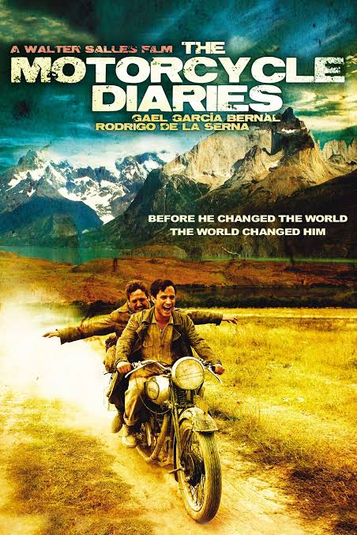

--- 
title: "Unveiling the human side of great dictators"
category: "Review"
date: 2023-07-14T12:30:00.393Z
desc: "Embark on a transformative journey through \"The Motorcycle Diaries\", where the innocence of youth meets the awakening of a revolutionary spirit. Witness the unexpected twists and soul-stirring encounters that forever changed the life of Che Guevara, challenging our perception of history's most infamous leaders."
thumbnail: "./Images/dictator.jpg" 
authors: "Rudransh Pujari"
starred: false
abio: ""
alt: "dictator"
---

There are moments when life takes an unexpected turn, leading people down uncharted paths and igniting a fire within us that we never knew existed. Such moments leave a mark on our souls, forever changing the way we perceive the world.                    
                     
That is exactly what happened to me, this summer.                   
                 
"The Motorcycle Diaries" is a  film that delves into the depths of human transformation. It explores how a single incident changes the course of an individual's life, even for those who go on to become infamous dictators.               
                   
Picture this:                         
                       
You've just finished watching, "Into the Wild," an exploration of a young man's rejection of society's expectations in search of true freedom and meaning.                         
                                 
You then stumble upon, "How to Become a Tyrant" ,  a gripping series delving into the minds of history's most notorious leaders.
                       
And then finally when your curious mind seeks the origin of evil, you find solace in the unlikeliest of places—the beauty of "The Motorcycle Diaries."                                    
                                  
Which happened to me. Precisely.                              
                                     
As the opening credits roll, you find yourself transported to a time when Ernesto "Che" Guevara was far from the revolutionary figure etched into history books. Instead, you witness a young and carefree Che embarking on a transformative journey across South America, accompanied by his friend Alberto. The film captures the breathtaking landscapes and diverse cultures encountered on their voyage. Yet, it is the internal voyage of Che Guevara himself that truly captivates the viewer. You find yourself immersed in his youthful journey, sharing his joyous laughter and the innocent pursuit of adventure.                 
                              
But then, something extraordinary happens.                           
                                
Through a series of encounters with marginalized communities, Che Guevara's eyes are wide open, revealing the gaping wounds of injustice and inequality that affect the world. These encounters plant the seeds of empathy within him, unleashing a transformation that will shape history and change the lives of us humans, forever.                                 
                              
"The Motorcycle Diaries" paints a portrait of Che Guevara's evolution from an ordinary young man to a leader of the oppressed. It presents a profound realization—that even the most feared dictators were once human beings like you and me. They experienced moments of awakening, where their conscience compelled them to confront the suffering around them. This realization strikes you like a bolt of lightning. It shatters the notion of tyrants as mere monsters, born with malicious intent. Instead, you see them as complex individuals, susceptible to the impact of life-altering incidents that awaken their sense of purpose. The film whispers a powerful truth—that the potential for both good and evil resides within each of us.                       

   
                                                     
This movie has taught me an important lesson - “Our choices matter”. It reminds us that the capacity for change lies within us, waiting to be sparked by the fire of compassion in the pursuit of justice. So, as the credits rolled, I found myself forever changed. Inspired by the story of a young man's awakening, I started my own quest to understand the forces that shape individuals and the world they inhabit. And perhaps, armed with this newfound insight, I could probably change the world a little, before I turn into ashes.                
