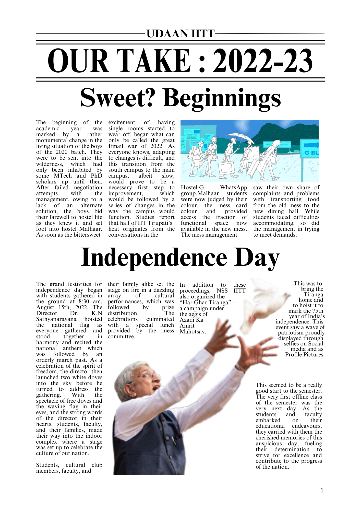
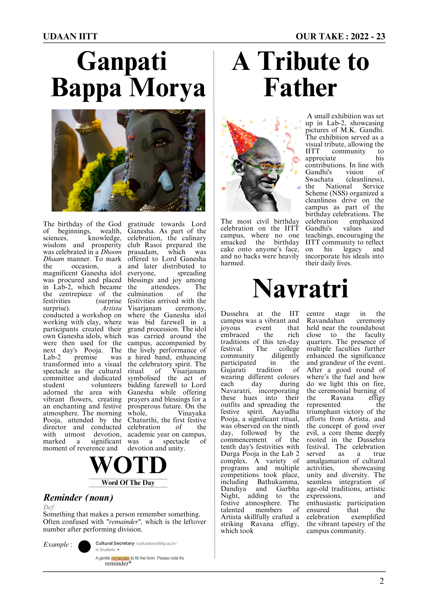
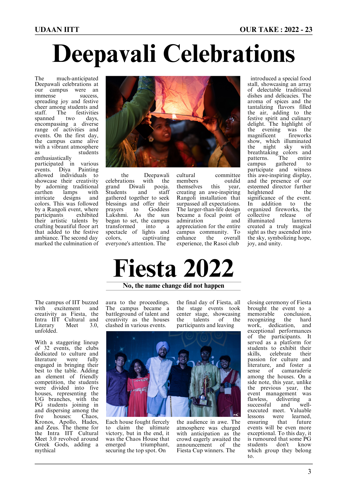
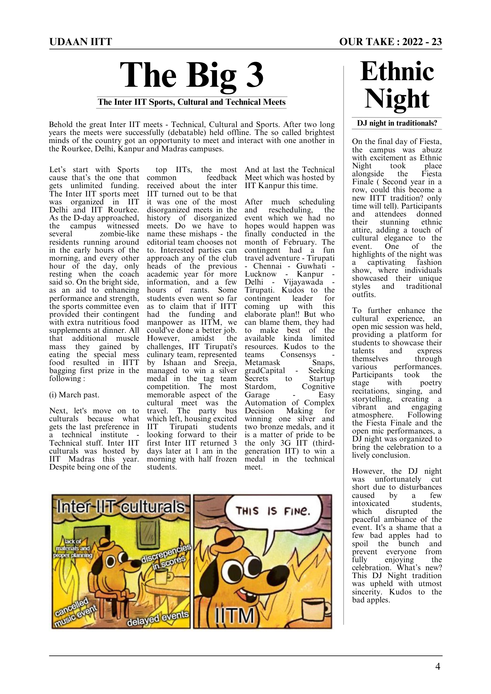
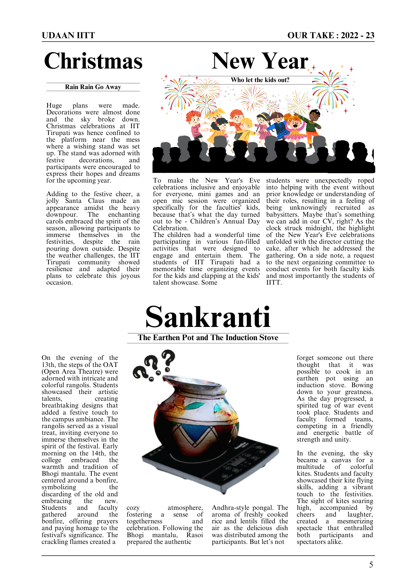
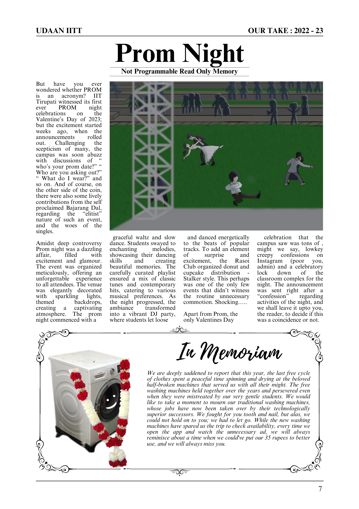
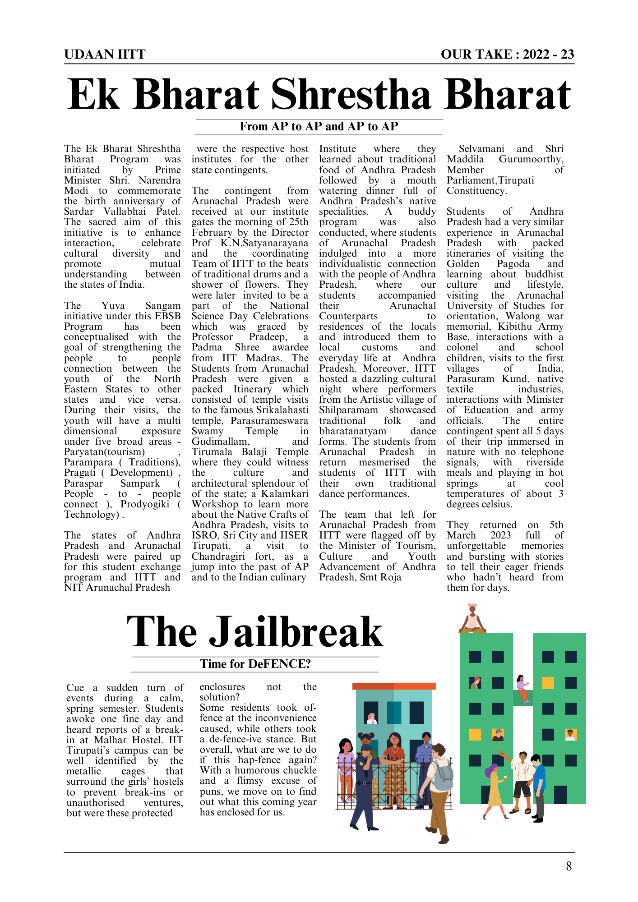
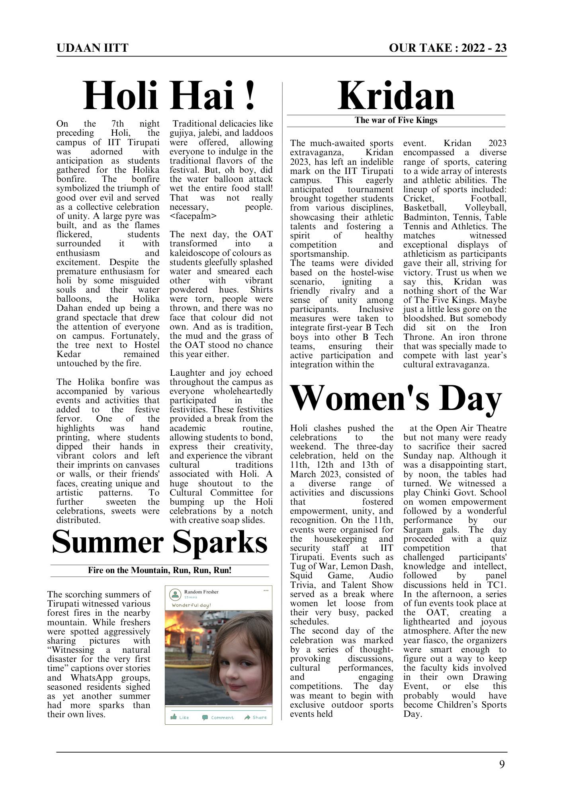
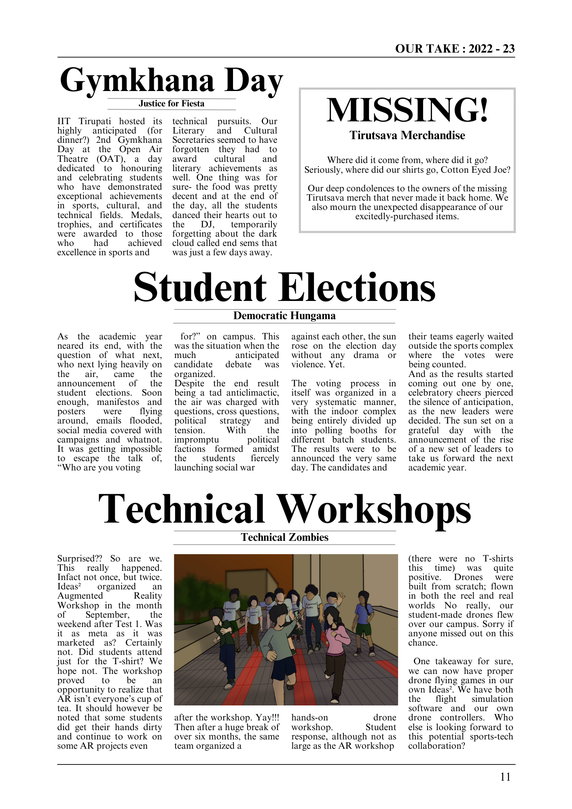
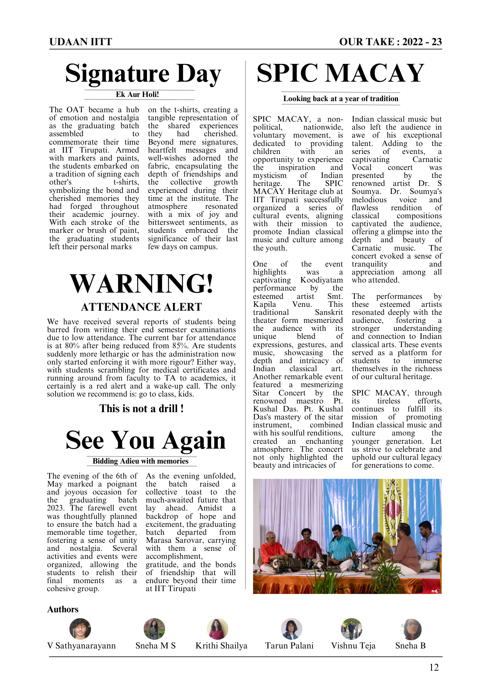

We’re sure you have your own set of stories to tell this academic year. From complaining about new blocks to celebrating culture and tradition as a family, the year has had its fair share of ups and downs. Of course there were also the monkey invasions, the rat bites, the theft issues, and so much more. Read on as we present a comical rundown of some unforgettable moments that summed up our year.                  

