Wow, what a year, huh? While some of us celebrated our first full offline academic year, some others bid farewell to their last. While some of us tried to weave through internships and placements, some others took their first steps on their journey at IIT Tirupati. And while some of us made new friends, took a million pictures, and posted aesthetic events on Instagram, some others sat behind the stage trying to do the best they could to make it all happen. It goes without saying that no academic year can wrap up without a massive shoutout to the people who wove through budget issues, organizational problems, Inter IITs, Intra IITs, space constraints, equipment constraints, and whatnot.                             

But let’s be real, what’s a tribute without a little roast? So brace yourselves for a delightful blend of tales filled with mishaps, triumphs, and the occasional dose of pure chaos. Join us as we tip our hats and share a good chuckle at the expense of those brave souls who gave us platforms to create unforgettable memories. Without further ado, let's raise the curtains on this fun little puppet show!  

******************
### Secretaries    

<b>Rohit Raj</b>

 

*Students General Secretary*

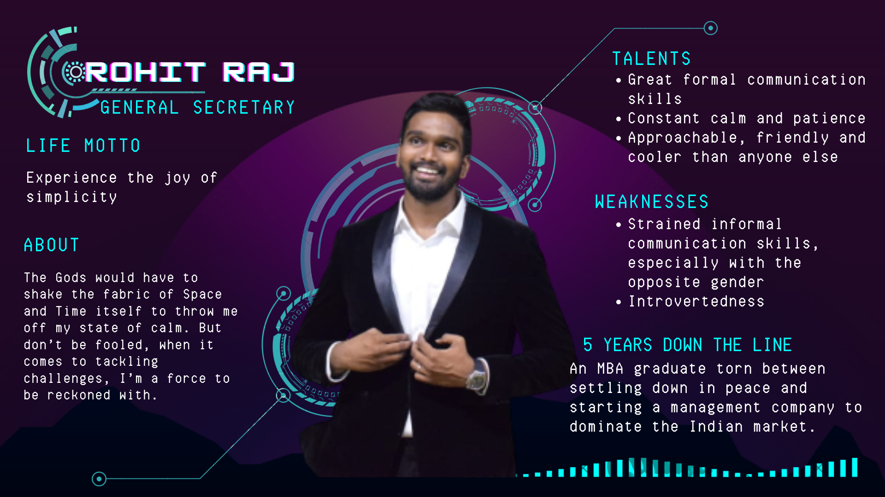

---
**Commendable Achievements from his tenure as the SGS**                                              
- Setting up bus shelters in and around the college.
- Getting approval for the new restaurant and stalls on the campus - Nestle, for instance. 
- Dodging night timing restrictions, again, after much persuasion and convincing
-----------

**Mistakes**                                                                                                  
The budget approval for this year was delayed until October. 

--------------

**Dear Future Secretary,**                                                              
Always follow up with the management. Many approvals and promises may be made, but the fastest way to get things done is to pester them as much as you can.                             

There are times when being polite and soft does not work. Stand your ground and stick by your decisions in such times. Ensure you convey all your decisions to the Student Body without fail.               

---------

*Thoughts and reviews from the student community*                 
                                        
>Oh, the illustrious Student General Secretary of IIT Tirupati, Rohit Raj anna! As his one-year junior, Rudransh, I have had the pleasure (and occasional perplexity) of witnessing his reign.                           
>                                                          
>You know you're dealing with a superhero when they can balance academic responsibilities, extracurricular activities, and the chaos of student politics all at once. This student general secretary had the time management skills of a time-travelling professor, juggling more tasks than an octopus with eight arms.                      
>                     
>First things first, Rohit Raj Anna deserves applause for getting the student budget approved. Not only did he manage to secure funds for all the shenanigans we love, but he also somehow convinced the authorities to increase the budget from last year. It's like he had this secret superpower. I suspect he may have discovered the mystical art of "budget bending."                     
>                                  
>Be it his brainchild, the Students’ MoM library or the Student Affairs Calendar, he achieved commendable success in every initiative he conceived of. But let's not forget Rohit Raj Anna's heroic efforts in handling the problems of G-block, the newly constructed boys' hostel, which was seemingly exiled from the main campus. It was like he became the hostel's official ambassador, handling all problems thrown at him with ease.                
>                                
>But let's talk about the IoT-based washing machines. While the idea of having washing machines with artificial intelligence may sound intriguing, it also gave rise to a few unexpected incidents. Apparently, the machines started developing personalities of their own and would occasionally embark on escapades, leaving students with unwashed laundry and an existential crisis. Who knew that the phrase "laundry day" could take on a whole new meaning in the age of rebellious washing machines?               
>                                
>In the end, Rohit Raj Anna's term as the student general secretary of IIT Tirupati was a whirlwind of hilarity and unexpected adventures. He proved that with determination, creativity, and a touch of eccentricity, even the most mundane tasks can be transformed into extraordinary feats. Cheers to Rohit Raj Anna, the master of budgets, the scribe of meeting minutes, and the ambassador of G-block. All the very best in his future endeavours!                           
>              
>*-Rudransh*

>Patience is his strength. Kindness is his weapon. Respect is his key. Confidence is his helmet. He is always loving and supportive. He is a human more than a leader. He manages people well. He can calm down the terrible situation with ease. He is always busy. People know him for his humbleness. Very easy to work with, but as he is very busy, we can't catch him easily. He handles all my uncomfortable situations with me. Had a lot of fun while working together. 
>
>*-Jose*

>For me he is a big brother who is really approachable whatever the problem is. He will try his best to provide a solution. I love his patience in handling situations. He has given his best, and according to me, he has done his job very well, irrespective of whatever negative things other students say.
>
>*-Dhanush*
--------------------------

 

<b>CNV Dheeraj</b>

 

*Academic Affairs Secretary*

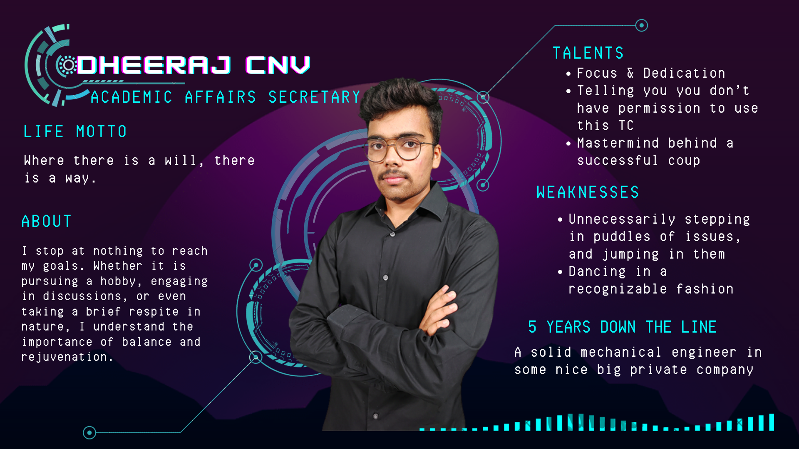

---

**Commendable achievement from your tenure as the AAS?**                   
- He pushed back the minimum required attendance to 80%. That’s 1 in 5 odds of emerging unscathed after sleeping through your alarm and missing a morning class!                   
- He oversaw the formation of two new Academic Clubs, namely the Higher Education Club and the Statistics Club. Everything was planned for, down to the last-minute, detail.                             
- He’s almost always the most informed one somehow when it comes to academics-related issues.               
--------------

**Mistakes**                                                                            
The minimum required attendance, despite much persuasion, could not be reduced to 75%.                                         

------------

*Thoughts and reviews from the student community*                 
                                        
>Bold, confident, reacts immediately, fearless, and takes risks without hesitation. He helps everyone. He manages people well. Most of them know him. And he has a huge group of people calling him 'Annaiya' or 'Anna' like fans or followers. He can also be known as a college celebrity. Always energetic so that, sometimes he disturbs even the authorities. 
>
>*-Jose*                        
                      
>One of the best seniors I have ever met. We had many academic discussions, and he shared much-needed information regarding academics. One of the best experiences I had, and that only motivated me to stand for AAS. He is my inspiration.                        
>
>*-Gopi*                    
                                   
>Dheeraj is an epicentre of all the news and information related to campus. He led and managed AAS very well and also helped other secretaries as well. Also helped me in managing Inter IIT travel as I was the contingent leader. He is kind of an ideal AAS because he arrives at meetings with points he has to discuss and then takes action appropriately. Also is great at giving any advice on literally anything you ask him.
>
>*-Sumukh*

---------------------

 

<b>Jose Enoch Kingson</b>

 

*Hostel Affairs Secretary*

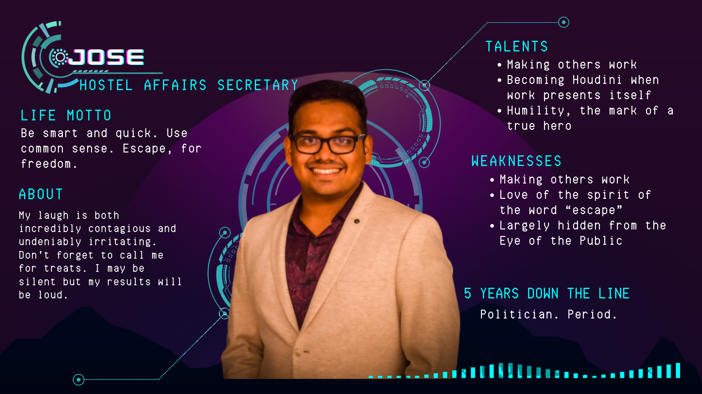

---
**Commendable achievement from your tenure as the HAS?**             
- Set up intra-institute transport with proper timings and schedules, providing respite from treading the mountain-like terrain and Sahara-like heat. 
- Initiated a complaint registry in the ERP, ensuring no complaints go unheard.            

-------------------
**Dear Future Secretary,**                                          
Don't escape from student issues. Be logical and quick.               

----------------

*Thoughts and reviews from the student community*              
                                   
>The periodic stress of impeachment and the Ignore Everything 101 class, That's the whole term. He did an excellent job solving many things, getting people to work and ignoring the things which have to be ignored in a proper way. The only thing he could have done is tell people what he did. It was just things happening and not happening but the effort he put behind them, only we know...which should have been known and boasted to everyone.        
>
>*-Kaushik*
                           
                                            
>A person who would not brag about what he is doing but has done many things and has gone through so much negativity from students. One must have a really strong personality to have done this. Really chill and very friendly. Hope he keeps up his attitude the same way.
>
>*-Dhanush*
                 
                      
>He took the HAS position right after we recovered from the COVID wave. He had a tough task to handle the transition from transit to the permanent campus which he managed effortlessly. The transportation was hassle free throughout the institute. He takes decisions keeping in mind all parties involved and comes up with a solution which is suitable for all. He is a fun person and loves to give his work to others.
>
>*-Suman*
                               
---------------             

 

<b>Maulik Bhagat</b>

 

*Mess Affairs Secretary*

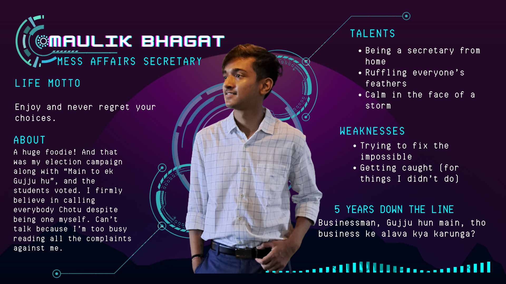

---
**Commendable Achievements from his tenure as the MAS**                                                                          
Proud that we started 2 messes in the institute during my tenure despite having to face way too many challenges.                               

-----------

**Mistakes**                                                  
*Intense ominous music starts playing*
Never get personal with anyone.
*Intense ominous music ominously stops playing*
             
--------------

**Points for the Future,**                                                              
He'll figure that out himself… :)        

---------

*Thoughts and reviews from the student community*             

>Very cool and aggressive. His two moods are everything. Mess committee generally has a hell lot of complaints to deal with. The way we manage these problems is the key. Straight to the point, there are no solutions for many of those problems. Just a temporary solution or alternative. Doing this takes a lot and few of the committee members were really good at it. They put so much effort into the work. They must really be appreciated. Blessed to have worked with such a team. Memorable forever.
>
>*-Dhanush*
            
                      
>It was a wonderful experience for me, I learnt many things such as how to deal with situations and how we can make people listen to us. We put every problem before ma'am and discussed it in the MMC meeting... We tried our best to solve problems raised by the students or the manager's side, as for a strength of 1200 people we can't make sudden changes. Some changes are quite complicated to implement suddenly but from a student's point of view, it's different. 
>
>*-Sri Lakshmi*

--------------------

 

<b>Pavan Kumar Sandaka</b>

 

*Technical Affairs Secretary*

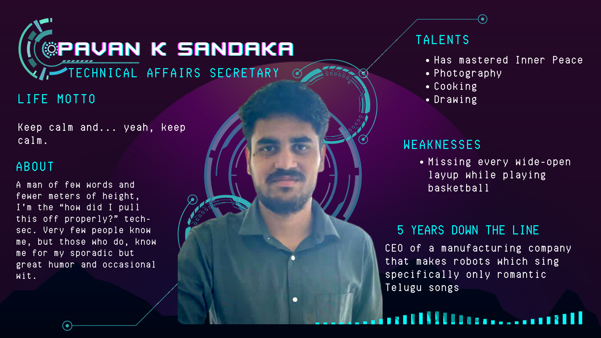

---
**Commendable Achievements from his tenure as the TAS**                                                                                                 
Inter IIT Tech Meet. Enough said.    
      
-----------

**Mistakes**                                                                                                                  
I've made mistakes, but now I don't regret them, as they taught me valuable lessons and contributed to my personal growth.             

--------------

*Thoughts and reviews from the student community*                   

>I think he might be the most lenient tech sec. He didn't force us to adhere to deadlines, didn't tell some club heads (ahem… Automobile) that they should do something with their club, but other than that he did his job well. The students who were not close to him or were not in the technical council think he didn't do anything as tech sec. But worked a lot as tech sec. It’s just that students don't know what he worked on.
>           
>As he was the previous Techmaniacs club head, too, he helped me with admin stuff related to bills and budgets. He is almost always available for help.                       
>
>*-Sumukh Porwal*
            
                             
>He helped us to get the signatures signed for the workshop directly by himself rather than assigning it to someone from his core team. He could have focused on each club's budget approval and their yearly plans from the start. Honestly, the overall experience was satisfactory. He put in a lot of effort towards the end to manage the budget for the drone workshop organized by Ideas². One thing which he missed is that my club encountered a problem regarding the approval process for the club's budget. We were primarily focused on obtaining the bills, quotations and other documents, only to discover at the last minute that the budget itself had not been approved and he himself got to know about that only at that moment. So keeping track of the clubs’ budget would have been better
>
>*-Arunkumar*
        
                     
>This year saw a boom in the technical culture of the institute. Be it the long late-night meets with the tech peeps or the elaborate plans for the Inter IIT Tech meet -- the experiences were really amazing - as if we have been carrying forward a legacy that's ingrained for decades. Well, a lot of things didn't work out for sure but the experience of venturing on new things was really worth the efforts.
>
>*-Soham Nandy*                  

--------------------

 

<b>Shamil Niyas</b>

 

*Cultural Affairs Secretary*

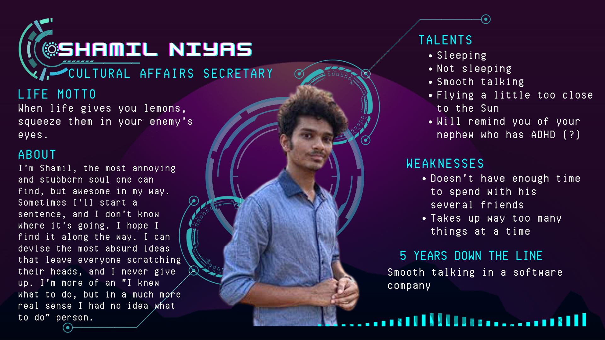

---
**Commendable Achievements from his tenure as the CAS**                  
- Leading the Inter IIT contingent for Inter IIT Cultural Meet 5.0 and bagging 11 medals. 
- Conducting a successful Tirutsava on a scale never seen before, almost quadrupling the extent and footfall from the previous year. 
- Conducting the first Prom Night. 
- Implementing the Cultural Committee constitution. 
- Conducting a splendid Intra IIT Cultural Meet 3.0 
- Starting the culinary club, fashion club and Nocturne. 
- Conducting all events and festivals in new fashions and new scales.
                                           

-----------

**Mistakes**                                                             - The preparation for Tirutsava should have started a bit earlier. We started a slight bit late. 
- Fighting with the administration. Please don't do that, they are trying to help you as well. 
- Not being able to conduct other events that were planned, like Among Us and Comicon, because of the huge time constraints during my tenure with the looming Inter IIT and Tirutsava, among other events, festivals and collaboration.
                                     
--------------

**Dear Future Secretary,**                                                              
- Do not spend your money. I have spent so much money which will never come back, like the entire Prom Night expense of Rs 12k and much other stuff. 
- Start prep for Inter IIT early. 
- If you can, try to keep a fest head for Tirutsava so that you can do more justice to culturals, it is tough having to lead both simultaneously.
        

---------

*Thoughts and reviews from the student community* 

>Right from the campaigning, to his "singing" in the debate, to forming the 40-member committee, during the ups and downs while conducting events, to conducting an awesome Tirutsava and until clicking the final committee picture, I've seen the most part of his tenure very closely. I can surely tell that he changed and learnt a lot during his tenure. He's now a little better at everything. I won't say he has been useful at all times, but his support was definitely there. With all the stuff going on in his life and work, I think he tried his best to work for Culturals as well. There were times he messed it up though. Maybe coz he couldn't give enough time or something, but overall, he raised the bar high for the next secretary, be it for the events or the fest. But it's true that if he hadn't procrastinated things a little, everything would have been a little better.
>
>In the end, Shamil's tenure may not be remembered as something revolutionary, but it was a mix of everything which people wanted, a rollercoaster of joy and memories. Cheers to an amazing tenure. He definitely did an amazing job.
>
>*-Shreya Tumma*
            
                      
>Such a lazy guy. JK. Somehow managed to do all the things well. Knows how to manage things without working himself into the ground. Clever and chill. That's what makes up a 'Shamil'. 
>
>*-Dhanush*
             
                              
>If I was to describe his tenure in one word it would most definitely be "interesting". The balance between "damn, that's impressive" and “chaos” was well-maintained, and made for some pretty entertaining stories. It is worth mentioning though that quite a few new initiatives (and traditions?) were established under his tenure, that we hope are followed, remembered and cherished. Being the academic year that was fully offline after the long break of covid, it was up to the Cultural Secretary and the clubs to truly set down some roots and traditions in this institute. The burden of setting down traditions of campus life and festivals was down on us, but it was an absolutely joyous experience despite that to be a part of the team that makes things happen. Working with Shamil was truly a progressive learning experience. There was fun, and there was work, and there was also a lot of tracking him down for signatures in approval forms. 
>
>*-Sathyanarayann*
         
                       
>Shamil has two modes - full-on hyper-active or ignoring everyone and hibernating in his room - just like the cats he loves. He is the antitheist of micro-management. Like honestly he let his 40-membered committee experiment with and get the job done with practically no intervention until absolutely necessary. He will always try to smooth talk you into doing any work and I guess that’s why the 40-member committee clicked? He and his committee have started a lot of new stuff and continuing them is the biggest challenge that stands before the next secretary.
>
>*-Sneha M S*

--------------------

 

<b>Pranav Panicker</b>

 

*Literary Affairs Secretary*

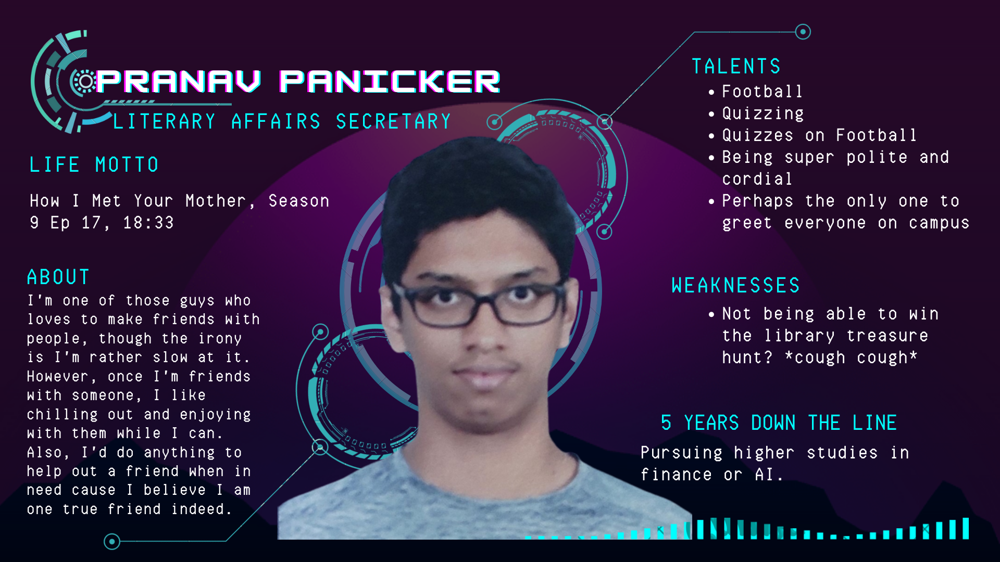

---
**Commendable Achievements from his tenure as the LAS**            
The main achievement I am proud of in my tenure is taking up the post and working with most of my team members. Being a student council member, it's always an honor to represent a certain aspect of our college and I enjoyed every bit of that. We didn't organize too many events, but I loved working with a few members of the LAC on the Hindi Pakhwada celebrations, Tirutsava literary events, Freshers week and also for our Intra IIT Cultural-Literary meet of the past year.                                              

-----------

**Mistakes**                                                                                                  
I always felt that I missed the opportunity of conducting a wide-scale event that could bring the whole literary community of the college together. Much like how my incredible predecessors managed to host such events made me feel like this was something I missed. Though it probably isn't technically a mistake, I rather feel so as this would've also been a way I could let all my team members work together as a whole collective group on something important.                       

--------------

**Dear Future Secretary,**                                                                                 
My suggestions for the next representative are for them to keep working on different areas where we all know improvements can occur. Also, keep your team's size shorter than mine (which was close to 20); that way, you'd be able to include everyone in most of the activities you'll plan for the year. Trying to include more literary events with the inclusion of multiple languages/cultures so more people become enthusiastic to participate. Maintain good track of the budget, and do push harder than I did in trying to retrieve and use most of it. Rest of it, I'm sure you'll figure it out along the way.        

---------

*Thoughts and reviews from the student community* 
                  
>His tenure, from my perspective, could be neatly summed up by a very popular quote from Ferrari's pit wall, "Copy that, we are checking! We will get back to you!". He touched upon all the requirements for the LAS, ranging from making sure all club-related documentation was taken care of to conducting literary events as and when needed. Perhaps the main thing missing was the touch of magic behind the quote, "I'd like to go above and beyond what is necessary to put out such an experience". Maybe, this was particularly highlighted due to the golden tenure of the LAS before him.
>
>*-Akhil*
                       
                            
>He was excellent at managing things, whether it was organizing events or assigning work to the members. I liked his calmness while working under pressure. Being a council member, I have organized some of the events and it was a wonderful experience while working with him. He was quite supportive and motivational whenever the work was not getting done or getting delayed. 
>
>*-Vikash*

--------------------

 

<b>Varanasi Sreeja</b>

 

*Placement Coordinator*

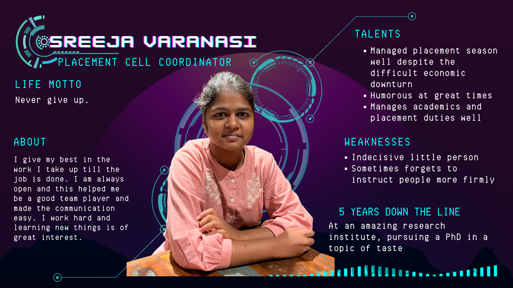

---
**Commendable Achievements from her tenure as the PC**                                                        
The placement officer's transition period has been my term's biggest obstacle. It can be challenging to juggle studies and PC responsibilities, but I did my best. The communication between the placement officer and students is now much more transparent than earlier.            

-----------

**Mistakes**                                                                                                  
More transparency could have been brought in and all the issues raised could have been communicated with all the students through the proper channels and be resolved.                     

--------------

**Dear Future Placement Coordinator,**                                                  
- Plan for the core companies at the earliest and make students aware of the situation of the placements. 
- Ensure that communication between the Placement Office and students through Public Representatives is as transparent as possible. 
- Use the available infrastructure well for conducting the drives so that there won’t be any problems. 
- The repository can be maintained with more planning with the help of the career development and guidance coordinator. 
- The core placements have to be increased and try to push for them to come earliest. 
- More transparency can be brought in and much frequent communication with students can be done so that they are well aware of all the things going on.         

---------

*Thoughts and reviews from the student community* 

>She did an excellent job of managing all of the tasks. The way she handled the placements from October to January as a student with coursework and as placement coordinator was a difficult job, but she did it very well. I am proud of her.
>
>*-Suchithra M*
               
                  
>"Ishaan mai mare wali hun", that's what she used to say every time we had a meeting about placements and internships, albeit in a comic sense. I believe she was overworked during the transition phase when there was no PO, and we were handling all the activities. But I think this was the first time such a situation was faced by the placement team, and in my view, she handled it well. It was amazing being on a team with her.
>
>*-Ishaan Kulkarni*

--------------------

 

<b>Ishaan Kulkarni</b>

 

*Internship and Guidance Coordinator*

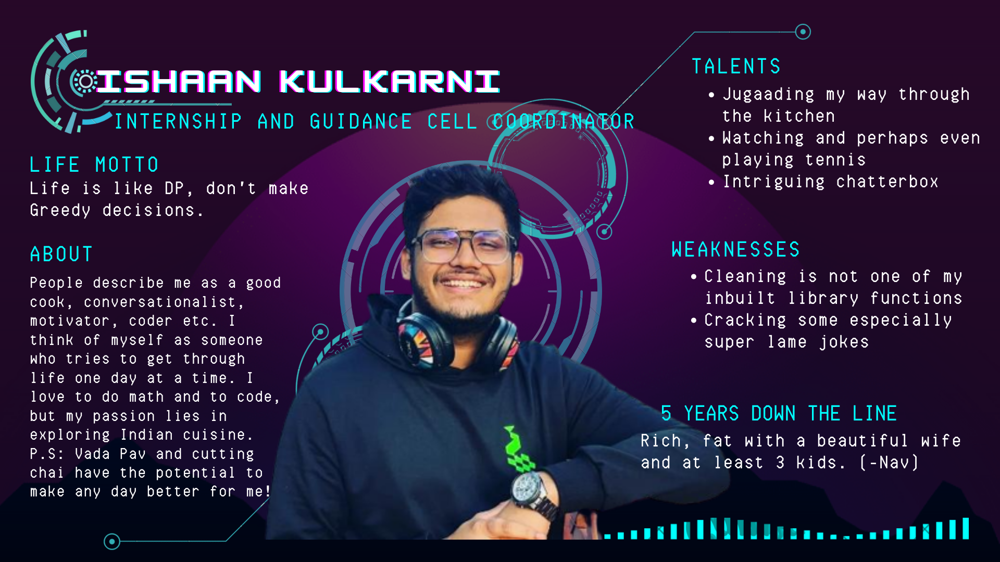

---
**Commendable Achievements from his tenure as the Internship and Guidance Coordinator**                                                                   
Not an achievement per se, but I am proud of the fact that my team and I could keep the internship recruitment process going without a pause for the 2 months between the leaving of the last PO and the joining of the new one.                   
                                        
I was blessed to have an amazing team who could keep going in these tough circumstances, actively hunting for opportunities and pestering the placement office for the same.                         
                            
If I have to point to one instance, it would be when we handled the offline internship drive for a company on campus for the first time since COVID, handled the logistics successfully with the limited infra we had at that time and ended up with 9 people getting an internship which is the second largest recruitment after CMTI.                   
                                            
More than me, I think my team was on the student front, and they faced the most pestering due to the slow influx of companies this year. I am super proud of them for the way they handled it and immensely grateful for their support.                                      

-----------

**Mistakes**                                                                                                  
(joke) I would not have become the IGC! (joke)                       
Jokes apart, it was a wonderful experience in program management and team handling. I think initially, I did not use my resources well and did not delegate enough, which increased the pressure on me. Over time, I tried to improve on that front.

--------------

**Dear Future Internship and Guidance Coordinator,**                                                                      
Delegate, delegate and delegate. If it's not absolutely important for you to be involved, do not get involved. Build a team strong enough to function on its own even when you are not around. Provide them with enough independence to make decisions and implement them, and let them come to you only when it is an absolute necessity.         

---------

*Thoughts and reviews from the student community* 

>His managing skills are very good, and he did an excellent job in handling the position. He tried to work on the complaints and resolve them. Teamwork is more required and may be better worked with being in close contact with them. Communication with him is very easy, and he is available whenever required. He is bold in his decisions. He tried well to balance both his other PORs along with being IGC.
>
>*-Sreeja*
              
                             
>Awesome work at reaching out to everyone. The way he took the problem through some annoying members was just splendid. A very patient listener, he was always with the team to provide support regarding any issue. He tried his level best to get things done at the best rate. It was an amazing experience to be a part of his team.
>
>*-Supriyashree*
                  
                        
>The team was very supportive of each other and helped others with many aspects. Although we couldn't bring a lot of companies by forcing CDC, part of the blame goes to the unplanned and unorganized transition of the Placement Officer. Even though we were frustrated by the repeated messages by students, our team did answer their questions, and only a few cases were escalated to CDC. There were many barriers like we couldn't find a common time to meet, but still we were able to do our work. Overall the team was very good and I could learn a lot from my teammates.
>
>*-Luiz Inácio*
            
                           
>Ishaan is someone who has a weird affinity to want to solve problems. “Denga main ek solution” is his approach towards anything. Irrespective of whether or not it is possible in reality. If a problem presents itself, he cooks up an idealistic solution that works perfectly in his head. Lucky for him and us, he discusses it with some people, who sometimes point out bro that’s not really what the ground reality is. His role as an IGC was no different. I saw him crack his head and lose sleep over the issues that persisted - companies not coming, students not being selected, PO changing in the middle of the internship season and all the hungama students did. Did he handle them like a pro? No, I don’t think anybody could. At the end of the day, the IGC and PC are always blamed (from the students' end) for anything that goes wrong, despite things not actually being under their control. What I would like to applaud is the shift in perspective - from accepting all blame to accepting the fact that not everything is under his control and just letting it be. Kudos to you!!!
>
>*-Sneha M S*
          
                    
>He did an excellent job in managing all the companies that overflow at the last minute and did great hard work to follow them all continuously. One area of improvement could be to give a little more support to core branches in extending their internship time duration. Apart from that he has always been a realistic and practical person.
>
>*-Anonymous*           

--------------------

 

<b>Kilani Chaitanya Sai</b>

 

*Guidance and Counselling Unit Student Head*

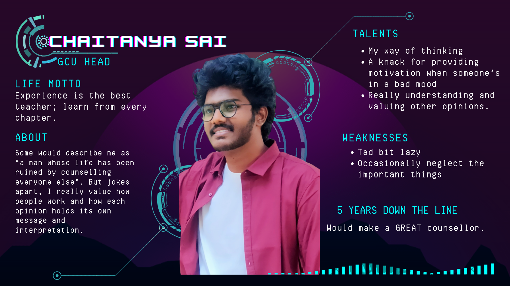

---
**Commendable Achievements from his tenure as the GCU Student Head**                                                                
- Increasing the reach of GCU
- Normalizing counselling sessions
- Getting a full-time counsellor
- Establishing a dropbox and anonymous questionnaire

-----------

**Mistakes**                                                                                                  
Could have organized more events.

--------------

**Dear Future GCU Student Head,**                                                                                                     
Do try to be more consistent with work and advancing GCU, which I couldn't do compelete justice to.       

---------

*Thoughts and reviews from the student community* 

>Started with a lot of dreams and then Tirutsava. That's the whole term. Jokes apart, He did an excellent job with the privacy of cases and created a benchmark for social media activity. I bet no one can make a council work as he did, it was never a blink he did without the council...that's how you bring productivity.
>
>*-Kaushik*
               
                               
>One of Chaitanya's standout qualities was his knack for managing and distributing work efficiently. His ability to delegate tasks and ensure smooth operations within the GCU deserves praise. Despite his love for solitude, he demonstrated excellent organizational skills and made sure everyone in the team had their responsibilities well-defined.
>
>It was not uncommon to spot Chaitanya wandering around campus with his ever-present headphones, seemingly in his own world. Some students even speculated that the headphones contained mystical powers that helped him channel his managerial prowess:))
>
>While Chaitanya's management skills were praiseworthy, there were areas where he could have improved. Given the importance of mental well-being, it would have been great to see him take a more active role in engaging with students and staff on a personal level. Building rapport, being approachable, and actively participating in events could have further enhanced the impact of the GCU on campus.
>
>Nevertheless, ending it on a positive note, his term left a lasting imprint on the mental well-being of IIT Tirupati, making him an unforgettable (probably) figure in the institute's history.
>
>*-Rudransh*

--------------------

 

<b>Chandini</b>

 

*NSS Principal Coordinator*

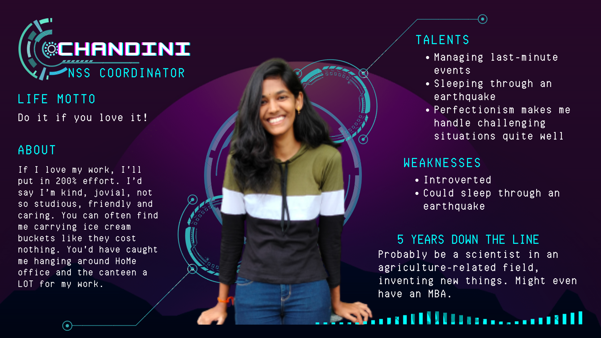

---
**Commendable Achievements from her tenure as the NSS Principal Coordinator**                                                      
- Brought back an active offline-activities culture in NSS after 2 years of calm
- Launched the NSS website
- Established new collaborations with many organizations like: Schoolmela, Love In Action Trust, Sviccar (by Tata Trust), FIAPO, etc
- Even though several activities are carried out throughout the year, there were specific ones which really reached the utmost needy persons (like the blanket donation drive, women empowerment sessions and tailoring workshop for women in panguru). The satisfaction through these simply can’t be explained in words.

-----------

**Challenges overcome**
- There’s a need to work overtime sometimes to make sure that a certain activity doesn’t crash or isn’t taking a turn for the worse.
- At the start, for the village activities, the participation isn’t very high on the villagers’ part - which was solved due to consistent efforts by the UBA and Rural Development Team in conducting useful activities without any pause.
- Making last-minute arrangements for transportation and logistics for sudden activities, but we always managed well in the end thanks to the generosity of all the corresponding deputies..

-----------

**Mistakes**                                                                                                  
- Missing out on checking the quality and effectiveness of events in the pursuit of quantity and achieving deadlines for various collaborations. - Not spending enough time to really see how things felt, which would have made a good difference.

--------------

**Dear Future NSS Coordinator,**                                                              
As the NSS LinkedIn account has been newly created, all the social media and website content should be taken extra care of and need to be updated regularly. Work on including more orphanage activities, work on providing t-shirts for NSS volunteers, and work more on mobilizing village people and increasing focus on village activities        

---------

*Thoughts and reviews from the student community* 

> A cool and dynamic leader, she is awesome with her work. Since the both of us were teammates from the start, it was really good working with her. The rapport we maintained and the trust we had while working on some difficult activities were just great.
>
>*-Ganesh*
          
                        
>She is extremely hardworking. Even during times when there was less participation, or when there were events during exams, she has still worked independently. For every event, the way she coordinated everything was awesome. I've learnt a lot working with her.
>
>*-Shreya*          

                       
>During her tenure, NSS and its fate grew just like her Hb levels. Since we were a part of the NSS team from the second year, it became easy to work with her. She was quite patient with the delays I made due to some or the other reasons. The way she led the team was great and it was super fun to work in such a team.
>
>*-Swathi*

--------------------

 

<b>Harshit Negi</b>

 

*Sports Secretary I*

---
**Commendable Achievements from his tenure as the SS**                                                         
Some of the greatest achievements of mine are before the Inter IIT Sports Meet. I was performing so well that my sports Administration chose me as the Inter IIT Contingent Leader of our institute. I was leading the team at IIT Delhi which was a proud moment for me but due to some injury on the 2nd or 3rd day, I wasn’t able to play my matches which I regret often. I am currently on the path to recovery to get back to sports.                               
                                          
I want everyone to note that there will be many ups and downs in your lives but still, you have to try your best and give your best.
               
-----------

**Mistakes**                                                                                                  
I am often a very chill guy but I must acknowledge my biggest flaw - I cannot control my anger sometimes. And to be a good leader you should learn to do that, so this is something I want to continue to work upon.           

--------------

**Dear Future Secretary,**                                                              
For the next SAS, there is the list of improvements that he could make, as I was not able to do so due to my injury. So the biggest factor where our institute is lagging is the cultural barrier between south and north, and I feel only sports can vanish this difference and bring everyone together. So whenever you conduct any event make sure people from all cultures are included, they will play together as a team which will genuinely teach them that team spirit is there in life too. This will also bring a good bonding between people.       

---------

*Thoughts and reviews from the student community*                          
                     
> Harshit had a genuine passion for sports, a team mentality, and the desire to contribute to the growth and development of the sporting community. It motivates them to go the extra mile, fosters enthusiasm among team members, and adds to the overall positive environment within the organization. But sometimes he would let things go lightly which wasn't a good quality so he had to be better in this aspect. It was really great to learn some new stuff such as how to manage in really stressful times and it kept me busy 
>
>*-Anish Kulkarni*
                 
                                           
>The super talented badminton player of our college - Harshit Negi was one hell of a contingent leader for our Inter-IIT Sports Meet 2022. Even though his badminton skills weren't of much use 😂, due to the injury he had just before the matches, his support and enthusiasm for the team was incredible and that kept us going!!
>
>*-Sanket*

--------------------

 

<b>Poornesh</b>

 

*Sports Secretary II*

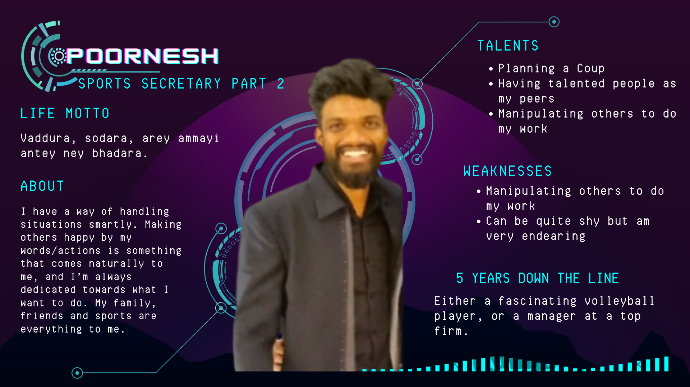

---
**Commendable Achievements from his tenure as the SS**                                              
I think my achievements can be summed up in 2 words - “Kridan 2023”. Each game was wonderfully executed with the right planning and participation from all houses. A lot of people in the student community were involved in that month of fitness, stamina and competition, and that is exactly what I have managed to achieve in this college.            

-----------

**Mistakes**                                                                                                  
Nothing much, to be honest. 

--------------

**Dear Future Secretary,**                                                              
Sincerity works out.         

---------

*Thoughts and reviews from the student community* 
                  
> Poornesh anna did an excellent job being the Sports Secretary. He was always easy to reach out to and easy to talk to at the same time, which I think is not the case with most of the Secretaries. His hardwork and commitment indeed made this Intra-IIT Sports Meet, a memorable one!
>           
>*-Sanket*
                          
                                     
>Adopted himself swiftly to the post and conducted Kridan-23 smoothly. Could have improved in the areas of planning the schedule because there were many delays and postponements during the tournament. 
>
>*-Prerith Sagar*           
                      
--------------------

      

--------------------

### Coordinators

<b>Dasari Susreesh</b>

 

*Actomania Coordinator*

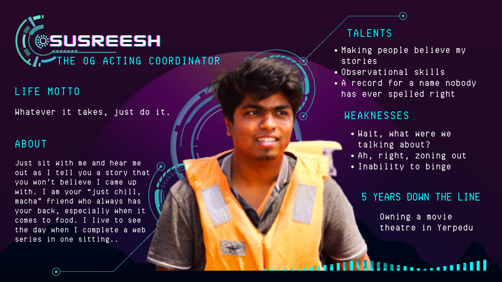

---
**Commendable Achievements from his tenure as the Actomania coordinator**                                                               
We stood at 4th place in Monoacting performed by our dear own Abhimenyu in Inter IIT Cultural Meet which was held at IIT Madras. And making a team from scratch who are new to acting is a different type of achievement which I'm very proud of. Initially club didn't have many members, now it got some attention I think I have cracked this one with the team help.

-----------

**Mistakes**                                                                                                  
We didn't have any scripts ready prior to the events. If I had a chance, me and my team would have prepared a few scripts and gotten them ready before the events.  

--------------

**Dear Future Coordinator,**                                                                           
Have some scripts in your hand prior to the events, choose the core team carefully, and search for good writers who can write something unimaginable.         

---------

*Thoughts and reviews from the student community* 
                

>Susreesh is the kind of person who loves trying new things and thinking outside the box. When he became the coordinator for Actomania, he really took it to the next level. He brought together a diverse team of people and initiated many events, like street plays. This year has been the most active and exciting for Actomania, and it's all thanks to Susreesh's hard work. He always pushed the team to do their best and came up with interesting stories for them to perform. In addition to the events within the institute, he organized many intra- and inter-IIT events with an emphasis on important issues, including gender equality, domestic abuse, homosexuality, etc. Susreesh made Actomania a lively and effective club, giving us more opportunities to improve and grow.
>
>*-Sahithi Rani* 
                         
                               
>"Bro! There is a problem!" and that's how this man begins his act of being the most over-enthusiastically responsible coordinator. Sus-reesh, the man, the comic and the romeo. He has a surprisingly interesting quality of being calm even when other clubs perform so well. Only does Susreesh know how to become a club volunteer from a coordinator. I dont know after stooping how low(jeez!), did this man get this club the highest budget. And miraculously used it to secure 4th position in Monologue in Inter IIT culturals for the first time(I know! I know! we have advertised it a 1000 times), a stage play(lets not talk about it), a street play and a mime. God! achievements! But our guy Susreesh loves respecting women(please ignore respecting) and hence he created an all-women play. He does more fun than work but when he does, we call it funny work. And this funny work made our Actomania crew so much more enjoyable and strong. We grew the most under his later-ship and I hope the future-coordinators take the path Susreesh didn't choose! Anyways Susreesh! you were the best!                 
>
>Susreesh is a very grounded person and he takes no attitude in being the head of the club. He lets everyone decide the course of action which makes him so much flexible to work with. I believe as a club, we have seen a lot of improvements the previous year, only because he was ready to do the experiments and take tough calls, which a leader should unapologetically choose to do.
>
>*-Abhimenyu*
                          
--------------------

 

<b>V Sathyanarayann</b>

 

*Artista Coordinator*

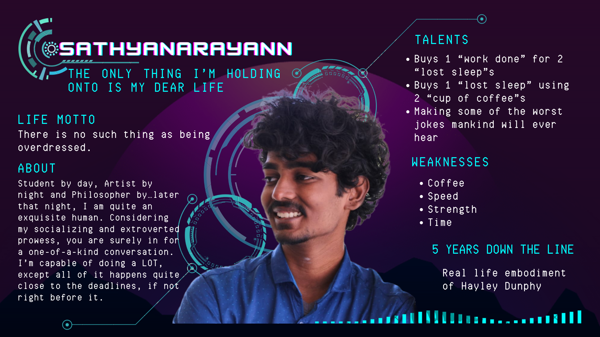

---
**Commendable Achievements from his tenure as the Artista coordinator**                                                                 
One of the key issues I wanted to address as club head was how most individuals overlook the essence of art as a means of expression and instead pursue excellence. I wanted to change that and encourage more people to explore their individuality and expression via art. I feel that the successful art workshops held during my tenure, as well as the student participation in each of them, brought out a part of everyone that wonders, "what if? "What if I can do it too?" I hope they keep it and appreciate it.                        
                                        
Another achievement I would like to mention is the consistency in our social media presence. In my tenure the social media team has ensured consistency in showing off student artworks, as well as maintaining our new informative posts series about the traditional artforms of India.                    
                                                  
Of course, the Inter IIT art contingent and their dedication to attending practice sessions and giving their all in the Inter IIT deserves a shoutout.                                    

-----------

**Mistakes**                                                                                                  
- I don't make mistakes.
- Start planning events and activities a tad earlier.

<we get it Sathya, you can’t make mistakes. When you’re a mistake>

--------------

**Dear Future Coordinator,**                                                              
Firstly, get budget approval done as early as possible. make good use of the amazon and flipkart offers when they come so that you can stock up a good inventory of art supplies. Conduct more workshops. Do not trust the students of our institute to participate actively in art contests, unless its ultra simple. Even your friends won't participate sometimes :)         

---------

*Thoughts and reviews from the student community*                     
                              
>Somehow while appearing to be the friendliest person in the room, Sathya can get you to do many things. Probably he uses that rangoli art he makes (black magic?). Also, he made so many tasks that seem impossible, possible. If there is anything, it's just that he had to let go of some of his pre planned events because he didn't want to disturb students during busy times. When we started as a team and discussed our plans, many of us were skeptical about some ideas. But during execution we never felt the drag because of how fun they were. That's how good his organization was! He was the centre of the club. It was like Artista was his surname. All while being a part of so many other clubs! Cool leader, amazing person. He's a combined package of fun, talent and responsibility. I learned a lot from him.
>
>*-Vishnu Teja* 
              
                                  
>Let's give a round of applause to Satya, the shining star of the Artista Club! As a member of the Artista Club, I've had the pleasure of witnessing Satya's incredible talent and dedication first hand. Satya's ability to handle the club while organizing various events, both within the Artista Club and in collaboration with the cultural team, is nothing short of remarkable.
>
>*-Aman*

>Working with sathya is definitely fun, anyone who worked with would say the same.  He's the one who says "Bro, I Have no clue" but at the end he's the one sorting the things out at the right moment. Despite being busy with N number of other works yet he never left the club dangling. Though there were many last moment rushes, we as a team managed to pull of things before its too late. His omnipresense during Inter IIT preparation is worth mentioning, being a master of multiple arts he was just running like a machine giving individual tasks to each team, tracking their progress, coordinating with cultural secretary for updates, getting art supplies etc. His feats at the account section for modifying and  adjusting the budget before and after every event needs a special mention.
>
>*-Sanjay*

                    
>Sathya, my Golden boy! His daring and experimental sartorial aesthetics has always been inspiring to me. From the quick-wit to razor sharp sarcasm, to the goofiness and the wholesome conversations, it has been wonderful to see Sathya grow and thrive. All the times he stood up for himself, challenged the set toxic norms inside the campus, he truly made a mark. To one of the most genuine, wholesome guy who puts out his heart to everything that he does, the way Artista set a benchmark speaks for your dedication and hardwork.
>
>*-Malavika*
                  
                                  
>Add a pinch of laziness to a pool of talent and how can I forget? coffee, you get Sathya; From organizing workshops, to casual sketching sessions, to the dedicated Inter IIT preparations - he is one of the only few club coordinators who did complete justice to the role he took up. He made us a little annoyed during the Inter IIT Debate preps with his constant Artista mother hen anxiety. But, I guess it was worth it; The fashion show performance they put up at Inter IIT and the charcoal Art piece they made stand as pillars of proof. I should however mention that dude went a complete 360 from “I won’t take any responsibility other than Artista this year.” to “Is there anything I didn’t sign up for?” I’m genuinely curious as to how long Sathya will stay true to his new resolution - “ I’ll sit back and watch the fun in my last year.”
>
>*-Sneha M S*

--------------------

 

<b>Prasanna  M S</b>

 

*Photography and Film Club Student Head*

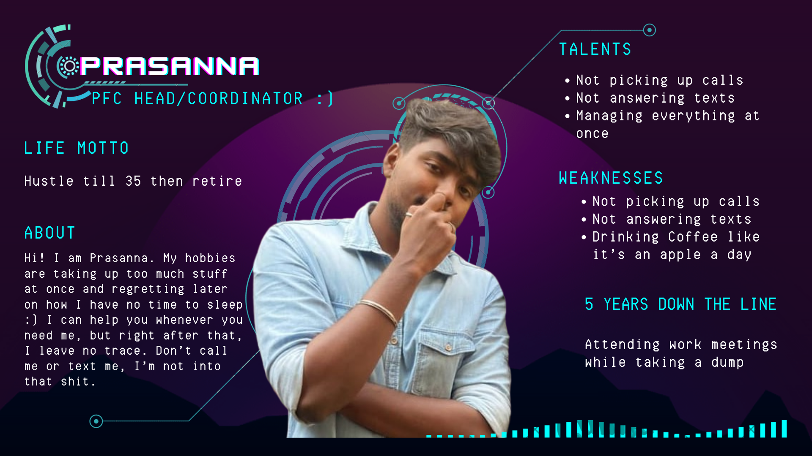

---
**Commendable Achievements from his tenure as the PFC Head**                                              

As the head of the Photography and Films Club, I take immense pride in the achievements of our team. One of the most memorable experiences was leading the team during the prestigious Inter IIT meet, where we showcased our skills and creativity on a national platform. Despite most of our team members being relatively inexperienced, we delivered substantially well.                           
                                
Additionally, our coverage of Tirutsava, our college fest, was a resounding success. We captured the spirit and energy of the event through stunning visuals and engaging videos, leaving a lasting impression on participants and spectators, throughout the entire fest that lasted 3 days.                     
                         
Apart from these marquee events, we undertook numerous projects, each with unique challenges and triumphs. I am particularly proud of establishing a dedicated design wing within the club, which has provided a platform for creative expression and further elevated our artistic endeavors.                        
                               
These achievements stand as a testament to our team's passion, dedication, and growth, and I am honored to have been a part of such remarkable endeavors.                 

-----------

**Mistakes**                                                                                                  
Reflecting on my journey as the head of the Photography and Films Club, I recognize a few mistakes that I wish I could change. One such mistake was the tendency to accept last-minute event coverage requests that did not align with our club's purpose. While it initially seemed like an opportunity to showcase our skills, we realized that these impromptu events often needed more substance and contributed significantly to our growth. In hindsight, I would have focused more on organizing impactful projects and workshops that could benefit all students and foster a creative community.                                 
                                            
Another area where I could have improved was budget management. There were instances where I underestimated certain expenses, leading to unnecessary financial strain. Learning from these experiences, I now understand the importance of thorough planning and accurate cost estimation to ensure a smoother execution of projects and activities.                              
                                       
By acknowledging these mistakes, I have gained valuable insights that will guide me in making more strategic decisions and optimizing our club's resources in the future.                                        
                      

--------------

**Dear Future Coordinator,**                                                              
For the next representative of the Photography and Films Club, I would suggest focusing on the following points of improvement:                              
                                  
1. Purposeful Event Selection: It is crucial to carefully evaluate event opportunities and prioritize those that align with the club's goals and objectives. Avoid taking on last-minute event coverage requests that may not contribute significantly to the club's growth and instead focus on projects, workshops, and collaborations that have a meaningful impact.                            
                           
2. Budget Planning and Management: Develop a comprehensive budget plan by considering all potential expenses and allocating funds accordingly. Pay close attention to details and ensure accurate cost estimation to avoid financial strain and unexpected budgetary challenges.
                             
3. Emphasize Project and Workshop Development: Shift the club's focus towards organizing more impactful projects and workshops that benefit all students. Create opportunities for skill development, collaboration, and fostering a creative community within the college.
                                  
4. Streamline Communication and Collaboration: Strengthen communication channels within the club and foster collaboration among team members. Encourage open dialogue, idea sharing, and active participation to maximize the team's collective potential.                   
                                      
5. Evaluate and Learn from Past Experiences: Reflect on achievements, mistakes, and lessons learned to continuously improve and refine the club's strategies and operations.                                
                                        
6. Take a proactive approach to identify areas for growth and implement necessary changes for future success.                          
                            
By addressing these points, the following representative can build upon the club's foundation and drive it towards even more remarkable accomplishments and positive impact within the college community.
       
---------

*Thoughts and reviews from the student community* 

<Pls Prasanna we made a deal with these people to promise you wont kill them for what they write>

>"Prasanna is always busy with a lot of things. So he took his time to understand when to do what in the club. But after the initial curve, he grabbed onto things pretty quickly. He was impressive at firing up the junior team also. He’s one of those people who get waves of super motivation and it’s great to work with him when he’s in that zone and pushes things ahead. Fortunately, these waves always came up when we really needed them.          
>         
>One of the things I think could be better was our priorities of things. We kept adhering to requests of covering events thereby sacrificing and delaying our own projects. We started avoiding this towards the end and it had a great productive impact on the team as well."
>
>*-Anant Tyagi*
           
                             
>Nice job at giving out work (I mean really 👁👁), and at telling me "ay you do this okay" in his distinct voice. Also we went for our first inter iit so yayyy, wasn't disastrous atleast. We make things happen...somehow. I don't know how, I don't know who pushes but it happens at the end. I wish we could have made more things happen
>
>*-Keshav*      
                                       

>PFC is that one club that has found itself in the middle of several accusations from the very beginning. Working with Prasanna and Anant for the last two years, or even just watching them learn to deal with people, fail at it, try different methods, and find a balance, has all my respect. Prasanna is that one person who knows when to disappear and when to promptly save the day. A textbook introvert who takes too much work and then drowns in coffee and takes it out on his sleep. As a friend and as a head, I think there has been plenty of times where he’s considered my responsibilities and tried to work a way around it. Especially as the design wing was severely understaffed, there were even moments in Inter IIT where he pulled out his laptop last minute and started learning illustrator to get things done xD. I think a lot of stuff that he puts an effort into remains unseen as it does not essentially have a visible output, and he definitely deserves a huge shoutout for that. An absolutely eventful experience working with him and seeing them get things done, one step at a time.
>
>*-Krithi*

--------------------

 

<b>Krithi Shailya</b>

 

*Sargam Coordinator*

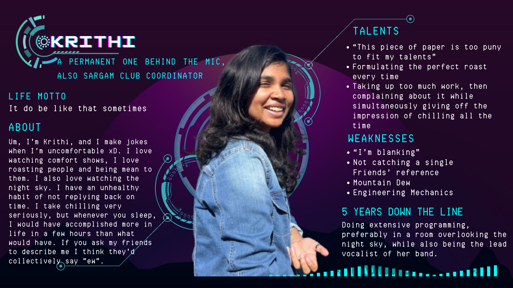

---
**Commendable Achievements from her tenure as the Sargam Coordinator**                                              

The year by itself was quite challenging since it was a proper offline walkthrough after all the previous ones of zoom and discord calls. Sargam as I'd known since my first year was mostly over a screen, and to bring that to life and to also continue the offline tradition which I personally have no experience with was something I took quite some time to learn. One of these was the Sargam band as a whole. We took time to free up our schedules and get together, but I'm proud of the entire band, the pure talent, the goofiness, the exposure to new music, and the effort. I love you all ❤️. There was also one incident where a bunch of people from IIIT had come over and the band along with one of our awesome alumni sat together and jammed to good old hits. This was something I wanted to do in the club, to make people smile and hum while listening to music, and that moment felt like a win. The club also acquired several new instruments this year, and balancing the fine line between making them accessible to managing them was quite a challenge throughout. Overall it was a wonderful experience with Sargam this year and I hope we can bond over music just as much in the upcoming ones!         

-----------

**Mistakes**                                                                                                  
It was quite a learning experience with Inter IIT and the bubble that we envisioned it to be. We did not anticipate all the delays and the messiness in Inter IIT, and the clash between sports and cultural. This deterred a lot of practice schedules and also the experience of Inter in itself. Hopefully, in the coming year, we can find a balance to tackle this and also be prepared for all the last-minute delays and canceling. Another thing was the equipment, which I really wanted to do something, but I couldn't find a perfect window where everything was returned. Hopefully, the system can hold much tighter this year and the dedicated committee can put things together. (By the way, Shamil, where's the Behringer?)             

--------------

**Dear Future Coordinator,**                                                                                         
Please find a way to simplify the financial procedures and save yourself some running around. The club and the team will eventually evolve into something pretty supportive and rewarding, so it does not need much work. It would help to acquire talent early and analyze schedules to find out how busy the semester is going to be and plan sessions accordingly. Most importantly, please ensure you don't lose your own love for music along the way in trying to make the club reach greater heights. 

---------

*Thoughts and reviews from the student community* 

> Other than being a very chill person to talk to, she has set an excellent example for the smooth functioning and management of SARGAM. After a long interval of online operation, it was more challenging for the club to get back on track than she made it look. It's always been enjoyable to work with her as she respects everyone's role in the process of decision-making.
>
>*-Akshat*
             
                               
>To be honest, my first experience being in a team with her was not entirely memorable, for reasons not entirely in her control. But I cannot deny the level to which she has improved now. Krithi has always been one of the few go-to people whilst wrapping up any Udaan edition. She does a good job of breaking the ice among teams. It is very astonishing how she gets a pending task completed and perfected to the last t within a night. To be fair, most of the time it is just her pushing last-minute edits to the repo:)) 
>
>*-Chaitali*

>Krithi was able to keep the band spirit of sargam alive by pushing us to come to the sargam room to practice different songs and by allowing us to experiment with our intruments without interfering much. My experience with sargam was absolutely fantastic. During the semester when everything gets hectic and I had a lot of work to do, Sargam was the place I liked to be at to calm myself down and enjoy a bit while also getting things done.            
>
>Apart from her weird and iconic thumbs up which we got as a gesture of appreciation and/or sarcasm from her whenever we did something right/wrong she always had the funniest things to say to keep us going. Due to me being the only drummer in the band I got a special pass from the usual core member duties to focus mainly on my skills which helped me grow a lot as a drummer. P.S - She even saved me from my PFC duties to help me squeeze a little more time into drumming, which I am really thankful for.                
>
>Overall I think krithi was the kind of "boss" who never felt like one.
>
>*-Abhinav*
              
                            
>Everything was consulted with everyone. Equipments, instruments, and practise - all was dealt with fairly. Krithi is chill and easy to talk to so progress was smooth. Traveling to locations and stay was also handled well (IIIT Sricity was a rollercoaster, oof). All in all, a competent person! The jam sessions were always a blast! Figuring out how the parts should be arranged, multiple retries and then finally nailing it was all part of the fun. And to Krithi, I'll be always thankful for also trusting me with keeping in my room, one guitar, because goddamn it helped with my boredom (and allowed me to practice more of course!)
>
>*-Bineet*
        
                 
>Her overall term has been nothing short of chaotic beauty. From taking the first offline steps after crawling in lockdown for two years, roping in a bunch of freshly second years into the club and ever so subtly always pushing them to do that thing they're good at, bringing back a talented Sargam Band (albeit, with one too many guitars that run on electricity and one too less pianos that don't run on electricity) and performing Pasoori on the Inter IIT Stage all the way to pulling off a nerve-racking performance at Tirutsava, every bit of Sargam this year has been just that extra bit special. Definitely, there has to be something just that extra bit special about the coordinator too right?
>
>*-Akhil* 

>It’s now or never. Coz I’m not sure there will be enough space to accommodate all your testimonials in our yearbook. Krithi has mastered the tactic of ‘Everything, Everywhere, All at Once’. From day one she has been one of the only few people whom I have been bumping into at all places. Literary - check, Debate - check; Udaan - double check; Tirutsava - yes; Culturals - present there as well; Sargam tho - do I even have to mention? Our working styles are far from being similar but I greatly admire the way she always gets the job done. A perfect any-situation handler and boy am I relieved she’ll be co-parenting(?) Udaan.
>
>*-Sneha M S*

--------------------

 

<b>Kajal</b>

 

*Xcite Coordinator*

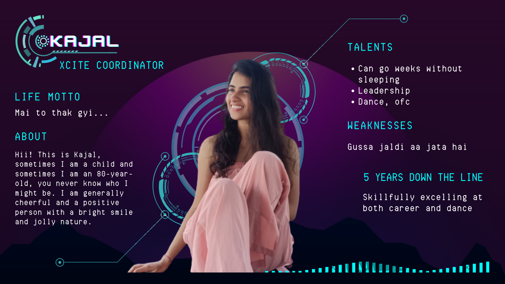

---
**Commendable Achievements from her tenure as the Xcite Coordinator**                                                              
Inter IIT 🥴. God, I remember that one month was full of challenges and stress. Those workout sessions of early morning and late night practice and the stress of costumes at the last moment of the event. We couldn't get the budget on time and still arranged costumes for the whole crew. Our crew was the best, .they always stood by us, supported us, and did all the hard work which was required.                     
                                    
But challenges didn't finish here for me. Two members (including me) got sick the day before the competition and had a 101° fever on the main day. Took paracetamol and danced with those heated bodies. After the group dance, I went blank. My fever increased and guess what, I was having a duo dance in the evening🥴. Again took the tablet, took some rest, and got back to the practice, and performed. But in the end all those hard work, all that unity, all that teamwork, all the sweating, and all those paracetamol paid off🤩🤩 We secured 7th position (Out of 23 IITs) in group dance✨                       
And 4th position in Duo dance🥂.                         

-----------

**Mistakes**                                                                                                  
We couldn’t get all the information about the process to get the budget earlier, so we couldn’t arrange costumes earlier and could pay all the bills earlier. Each time we initiated the budget process, we came across some new information, and it delayed the payment by quite a bit. 
                            
--------------

**Dear Future Coordinator,**                                                              
Don’t let the culture of dance go down. After COVID, it took us a lot to start this culture again. Try to keep it going, and increase it even further in the coming years. Make sure to get all the information about the budget process and funds at the earliest and keep all the crew members engaged in some work related to the club.                        

---------

*Thoughts and reviews from the student community*                   
                       
>She's gifted with leadership skills and when it comes to hardwork she can go weeks of sleepless nights working non stop.
>
>I and my batchmates witnessed an amazing dance performance at that very first meeting with the club, and yes, it was by her. Our super-talented very straightforward leader. She is super passionate to learn and taught us different dance styles. She always wanted girls to be treated equally to boys, especially in dance. we will definitely make that happen this year.
>
>*-Vinay*
                 
                      
>She believes in working together and I, being part of the crew have seen her fighting for our opportunities in dancing. She supports each and every one and encourages us to dance and push our limits. She worked very hard for our inter IIT. I enjoyed a lot by being a part of the team as family. In tough times we divided the work and worked as a team. I have learnt many things from the team. It was a good experience working with the team.
>
>*-Sai Chathurya Bheemoju*

--------------------

 

<b>Dhruti</b>

 

*Rasoi Coordinator*

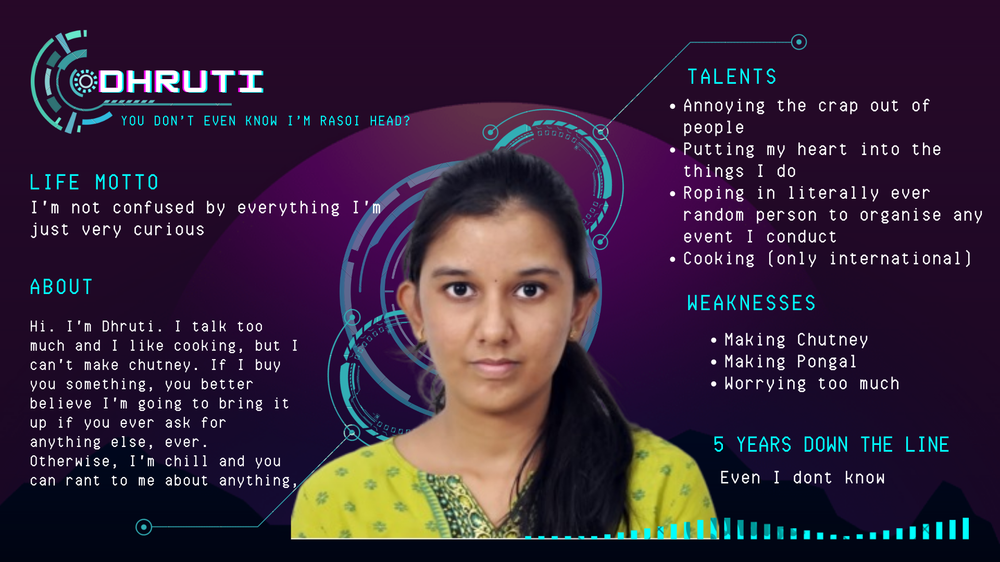

---
**Commendable Achievements from her tenure as the Rasoi Coordinator**                                                                
Being a newly formed club, we faced several challenges in starting various aspects from scratch. This included drafting the constitution, forming the core committee, experimenting with new activities and events, and launching our social media page. However, with the support of a dedicated group of core members, we envisioned and implemented fresh and enjoyable events, both in the realm of cookery and non-cookery. We also planned educational posts to enlighten the student community. Additionally, we introduced new initiatives such as food stalls, dessert studios, and cultural diversity promotion stalls within the college.                                      
                                               
One of our club's major achievements was our participation in the Inter IIT cultural meet. Despite not even completing a year and lacking proper workstations or cooking facilities, our best efforts led us to secure the 2nd position among the 22 other IITs. This is a significant milestone and the highest standing ever achieved in IIT Tirupati's history.                                                        
                                                      
Furthermore, we successfully collaborated with the Indian Culinary Institute and organized a program where our enthusiastic cooks had the opportunity to visit the institute and explore various cuisines. Our cooks actively participated in an event conducted by the institute.                                         

-----------

**Mistakes**                                                                                                         
I am extremely pleased with how the club was functioning, and honestly, I have no regrets whatsoever. My entire team was eager to introduce a student-run café, which is a popular concept in foreign universities. This initiative involves students coming together to serve new and creative dishes every weekend as part of a café project. The objective is to promote culinary arts, learn essential life skills, and preserve family recipes. Unfortunately, due to budget constraints and a lack of culinary equipment, we were unable to launch the weekend café at full capacity. Apart from this activity, we explored numerous other events and successfully met the expectations of the student community.                                       

--------------

**Dear Future Coordinator,**                                                              
I would like to offer a small tip to the future coordinator: forming a core committee is one of the crucial aspects for the success of the club. As the club head, I encourage you to actively seek thoughts and ideas from the student community. Last year was immensely successful because we incorporated a lot of input and experimented with various events. So, please consider taking numerous suggestions, ensure you check the assigned tasks of your core committee, and most importantly, ask for feedback from participants after each event. Additionally, when it comes to the INTER IIT aspect, I suggest starting preparations one month before the event and maintaining regular contact with the ICI chefs, as their input can be incredibly helpful         

---------

*Thoughts and reviews from the student community* 

><joke>Dhruti can be called Ms. I don't think we are winning. Cause thats what she said after our ICI competition. We ended up winning the first prize lol <joke> I believe her's was an amazing term. First year of the club and we ended up getting our first Inter-IIT medal, celebrated various festivals on campus and also planned and executed an event in Tirutsava. I would call her a visionary who lacked confidence at times but made sure that stuff happened. The way she got us budget, cooking apparatus and organized stuff, it's just commendable. And apart from all this, she is definitely a great cook. It was great teaming up with her in Inter-IIT and in the ICI cooking competition. "
>
>*-Ishaan Kulkarni*
                  
                
>I was promised by the Editors that no harm would be caused to me by Dhruti. I think she should have headed the Debate club. She can fight with anyone and anything. One day I saw her complaining to a stone about a lost spatula. Oh my bad! that was IITT authorities. Dhruti was raised in Mumbai because somehow she brought back(did vasooli) of all the cooking utensils and hardware. Once she told me that she will be the HR of a big firm, why? Because she wants perfection without doing anything. Nothing impresses her! But she was the perfect choice as a coordinator of the Rasoi club, she knows everything about(except) cooking. I meant management, planning and execution( Really Dhruti's friends were great at it!). She started a new culture in our college-Advertisement! I cannot even tell how many times I have seen this club hail Ishaan and Sreeja for Inter IIT, every story and every post. And stalls, how we can forget about them? But Dhruti did forget about them everytime! And she forgets to take tension which made the whole team so much carefree and fun. Her energy(a total chaos) helped IITT's sweet, little and new club grow into a gigantic teen of success in such a short period of time. She is clearly great at raising!
>
>When it comes to any event, Dhruti is the one with so many ideas and lists. But she never autonomously took any decision. She was always open to ideas and included everyone. She gave every person in the club a chance to come forward take a lead. She always used to be the event's backbone. And she was never ashamed of taking help. She could call anyone to help and people always turned up which shows how good a friend she is! From a settled hardware to so many achievements and events in a year, IITT couldn't have asked for a better coordinator for Rasoi.
>
>*-Abhimenyu*
           
                       
>To put it in a few words, Dhruti is an extremely enthusiastic individual who took up the club in its infant stage, while she herself was in her infant stage and grew along with the club. I watched her freak out about sending forms, buying ingredients, conducting events, managing money, asking for budget and what not, and somehow manage to pull it off eventually (ofc cuz I was there). One thing she could do effortlessly was to somehow get so tensed that everybody else calmed down and got work done. She could rope in the most random people who showed the slightest interest in Rasoi or even by any chance uttered “If you want anything let me know” (Been there). But of course through all this, she managed to make the club take its stand after being shut down multiple times for being a new and growing club that needed more time.        
> 
>*-Krithi*

--------------------

 

<b>Akhil Krishnan</b>

 

*Debate and Oratory Club Coordinator*

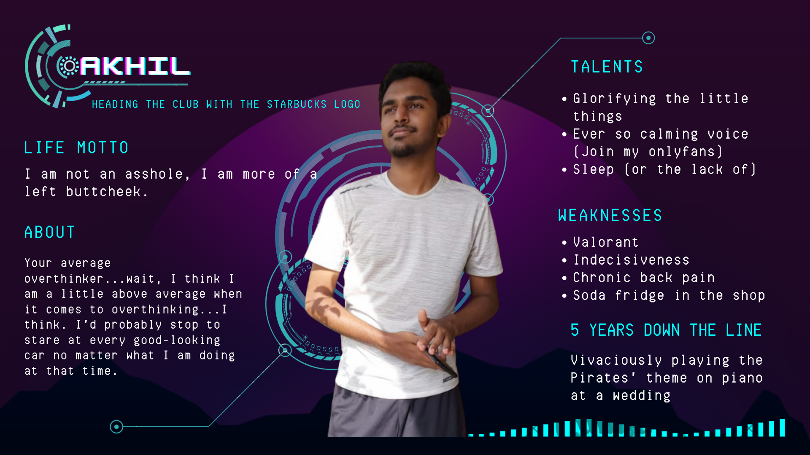

---
**Commendable Achievements from his tenure as the Debate and Oratory Club Coordinator**                                              
One that would hold a special place in my heart is being secretly told by the organizing committee head that I was the top adjudicator at Inter IIT Parliamentary Debate. Another is the very first time someone walked upto me after a session only to say, "you have a way with words"

-----------

**Mistakes**                                                                                                
I learnt the formal financial procedures very late into my tenure, meaning I could not make effective use of the budget allotted for me. A bit of extra initiative from my end could have opened up a few extra possibilities for the club and debaters.          

--------------

**Dear Future Coordinator,**                                                                       
Sort out your core team, your lean, mean team of sheer will and purpose. They'll save you in times when you wouldn't even know you needed saving.                               

---------

*Thoughts and reviews from the student community* 

>"To the icosahedron that is Akhil, there are just too many facets that we've lost count. Your life would be easier if you figure out the science behind multilocation. Knowing you, you might actually succeed in that as well. Kudos in getting our Debate and Oratory Club some semblance of a logo - although it looks like a cafe house. Accomplishments - everything he's been involved in. No doubt there. Where could you have been better? Probably learn that until you master the aforementioned talent, you can't possibly accept so many responsibilities. I know it's kinda ironic? coming from me. But there's honestly nothing else I can think of."
>
>*-Sneha M S*
          
                          
>Akhil's a gamer, so I do know he ought to be pretty competitive. That, combined with his great oratory skills? It just simply showed in the way he was always at it to improve his fellow club members and those who participated in events and for us at the inter IIT. He was really great when it came to managing weekly-biweekly events and tried his level best to help raise participation. For someone as experienced as him as the debate club coordinator who did his part really well with full responsibility, I really can't find or pinpoint any areas where he could've done better than he and his team did. 
>
>*-Pranav*
       
                 
>“Akhil is your not-so-average motivational debater who starts sessions with “So, what is debate?”. With a slightly strange sense of humour combined with an entirely unique perspective on every concept that he comes across, he manages to leave anybody who joins these sessions with something to take away. Despite a slight pinch of body-crushing indecisiveness, combined with a slightly bigger pinch of a little too much thinking, the hopeless romantic took up one of the most underappreciated fields in our college, literature and oratory, and managed to pull together a term with a little bit of everything. “
>
>*-Krithi*

--------------------

 

<b>S Vignesh</b>

 

*Quiz Club Coordinator*

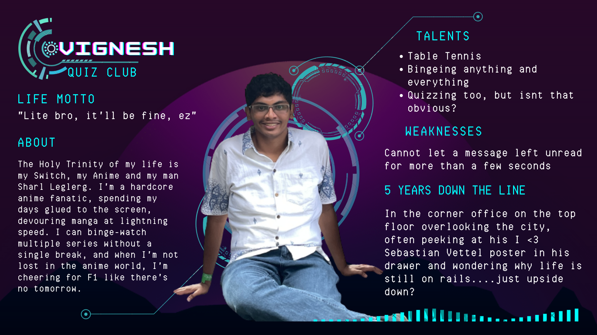

---
**Commendable Achievements from his tenure as the Quiz Club Coordinator**                                                            
One of the biggest challenges ever since I joined the club as a core member was finding out people who are interested/ actively participate in the quizzing events. I never really had a huge contingent who were regularly into quizzing and interested enough to go participate in outside competitions. This year, however, through the events conducted, I was able to scout some real hidden talent to work with.
With this enthusiastic team, quizzing was fun and we were almost able to reach the finals of multiple quizzes in Inter IIT.          
                                    
This team will be a good base to start with next year to take the club to greater heights so I’m proud of discovering and nurturing this team.

-----------

**Mistakes**                                                                                                  
I feel I didn’t conduct many events and the planning and timeline of these events could have been better.         
                               
Apart from this, I failed to bring up the social media presence for the club, and due to this many people are simply not aware of the club’s events. So the revival of the Instagram page and the discord server should be done asap.
 

--------------

**Dear Future Coordinator,**                                                              
Well congratulations for becoming the next QC head. Try to keep an active social media handle for the club, and make sure that the fire of the contingent doesn’t die down. I hope you can conduct more events and take the club to greater heights!                                  

---------

*Thoughts and reviews from the student community* 

>I didn't know there was anyone who didn't know what Kobayashi Maru and Ozymadias were, but there apparently are :) It was a pleasant experience. He's a much more egalitarian leader than I am used to. His willingness to experiment and see what worked and what doesn't definitely helped us in the quizzes we attended.
>
>*-Arvind Srinivasan*
           
                             
>Vignesh and his fellow club members are all brilliant when it comes to quizzes. From planning them to hosting, from India to General to Sports to MELA, they are always up to date with their own knowledge, hence making it great to see them develop our quizzing culture really well. With the promising juniors that Vignesh has helped and supported throughout his tenure (especially for the Inter IIT meet), I have no doubt that they'll continue to be excellent in representing our college in the next few years too. Being a member of the quizzing team, I enjoyed all of the interactions, sessions and preparation meetings we used to have with all the core members and participants. I was good to see Vignesh and Co carry on a similar approach as the core team this year, like our previous years' equally great quiz teams. I would've hoped for and expected them to conduct more events than they did, however, it was a great start that Vignesh gave to the club as the coordinator directly after we moved on from the COVID phase. Things will only improve with time for the club's future coordinators and core teams.
>
>*-Pranav Panicker*

--------------------

 

<b>S Ram Mohith</b>

 

*Scribbles Coordinator*

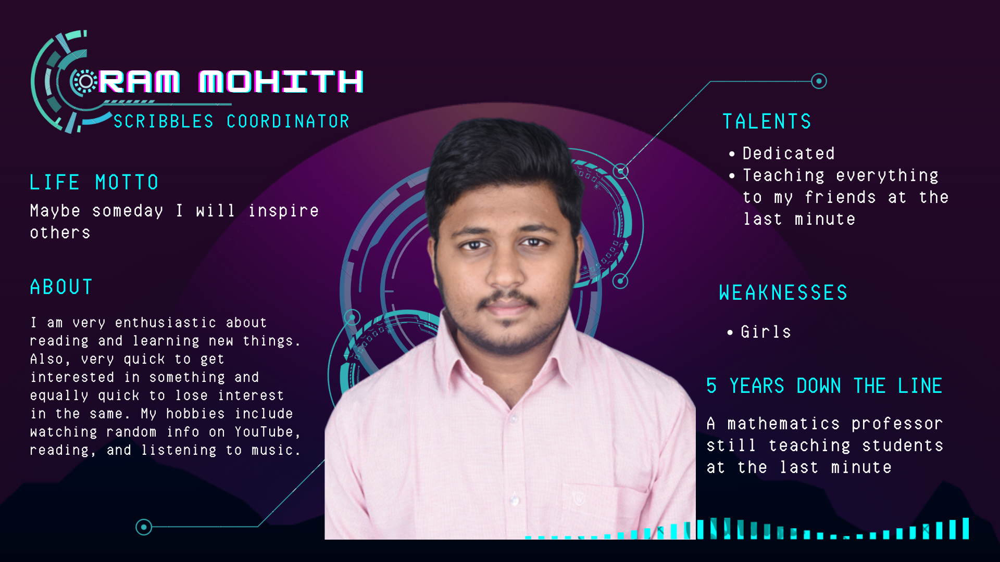

---
**Commendable Achievements from his tenure as the Scribbles Coordinator**                                              
Being the head of a newly started club, there are quite a few things that are difficult to face. One such challenge is the reach of the club among students, especially given that this is a literary club. Thanks to Intra IIT competitions we were able to attract quite a good number of people into our events at the very beginning. 
 
-----------

**Mistakes**                                                                                                  
One thing that didn't go as I expected was the budget planning. I felt like there were many gaps in making the club budget. I should have studied more in what area will I require a budget for the club and plan accordingly. Another thing, which I don't call a mistake, is that I didn't get enough time to look into the club in the even semester since I had to manage my role as head of a Tirutsava committee. But still, I could have given my core the task of looking into these things. Apart from these, there are a few more things which had dynamically shown up (especially while conducting events) due to some mistakes, but I was able to handle them with the help of my team.                   

--------------

**Dear Future Coordinator,**                                                              
Make sure you regularly conduct activities/events (which can be recurring) so that more people will get to know about the existence of a writing club. By doing so, people will slowly get interested in showing up for club activities. Although this number may not be big, don't get discouraged and continue working. Make a good core team who are enthusiastic towards working for the club. And finally, never make assumptions that things will always go out as planned and make sure you look into all possible ways something can go wrong while planning an activity.          

---------

*Thoughts and reviews from the student community*        
                 
>Mohith should've learned from his predecessors and could've done better smh (jk it was the first year of the club he started off lol). On a brighter note, Mohith was the perfect fit for being the first coordinator of our newly formed Writing Club (Scribbles). I love the way he handled the team and paced out the few events they conducted over the year. Events could've been more in number to help increase interest and participation, but for the beginning, it was nothing short of a great job that his team and he could pull off. He's worked hard to plan a good structure for the club which can be followed for years now, and I'm sure the club will continue to grow in a similar manner because of the direction and foundation that his team has helped lay for the club.
>
>*-Pranav*
               
           
>He is the cool guy, who is good at organizing and managing events, he is good at moving things from talk to action. He is always nice to others. Working with a team of different kind of people, who aligned on the interest of promoting the writing has been good, even though we don't know each other very well, we knew the work they did as a team. 
>
>*-Venkata Tarun*
          

>Mohith has always been that calm and composed individual either as the events head for Tirutsava or with Udaan, or as the Scribbles head. Since the first Udaan meeting where he introduced himself smiling, I don't think I have seen Mohith in a different expression anywhere else. He steps in when there’s work that needs to be done and handles that also in a very composed way. Working with Mohith has definitely been one of those “Okay he’ll take care” experiences.
>
>*-Krithi*

--------------------

 

<b>Soham Nandy</b>

 

*Digital Wizards Coordinator*

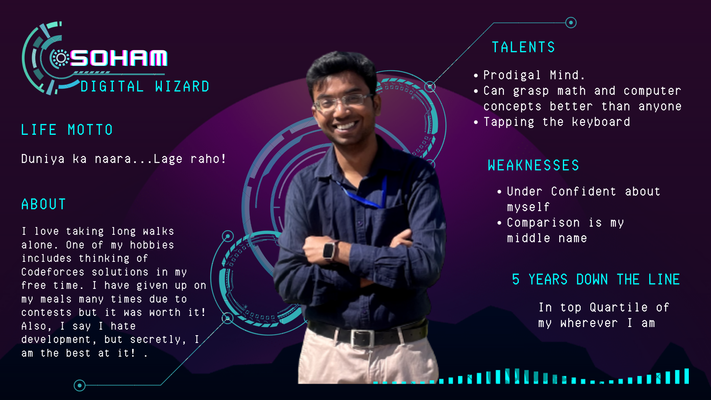

---
**Commendable Achievements from his tenure as the Digital Wizards Coordinator**           
- The college for the first time witnessed its name on the list of ICPC Asia-West Finals, a dream come true for all yesteryear's coordinators

- In InterIIT 2022 , the college got its first silver medal in Inter IIT tech meet - and witnessed the best ever overall performance.

- This year breaks the previous year's record of the number of sessions/workshops conducted/supervised by the club - taking the new count to 30.

- The club for the second year in a row, could touch all the domains under it - either by organising a workshop or by bringing a guest speaker - this includes the 2 newly opened domains of Web3 and DSA

- The club witnessed its highest ever number of participants in an offline session (Fresher's introduction to the club) - with estimates lying around 220- 250 participants

-----------

**Mistakes**                                                                                                  
- We could have worked on building a better coordination amongst the core team - this could have smoothened the operations of the club.

- The club could have executed the plans for the Intra-IIT events in a much better way. A lot of factors played in since it was the first edition of the event.

- The club hasn't witnessed any deployed project this year - something which we all have envisioned during the starting of the AY

- Again the club couldn't cater to all domains in depth- though we tried putting up introductory sessions for all of the domains
 

--------------

**Dear Future Coordinator,**                                                              
Keep up the culture and try to supersede the current expectations of the club!         

---------

*Thoughts and reviews from the student community* 

>He was a calm and composed presence, possessing extensive technical knowledge. His leadership skills enabled him to effectively guide the team. He always has a well-thought-out plan and approaches tasks with a perfectionist mindset.                   
>
>*-Pavan Sandaka*
                 
                   
>The club kinda prospered under his leadership. More of a no meeting fella, he saved his and everyone's time. CP flourished and we were able to garner interest in the freshers. Great work I would say.
>
>*-Ishaan Kulkarni*
      
             
>As the head of Digital Wizards, Soham exhibited an unparalleled aptitude for navigating the intricate and ever-evolving coding realm, assuming his role with the confidence and finesse of a seasoned programmer. With unmatched enthusiasm, he led the club in organizing enlightening sessions that motivated all who participated. Soham consistently delivered many brilliant ideas that drove the club's growth and unlocked new potential trending technological domains. Admittedly, like any complex code, occasional bugs necessitated attention. Communication, at times, veered into the mysterious depths of the virtual void, perplexing club members and fostering a sense of bewilderment. Undeniably, Soham's indomitable spirit and tireless efforts established him as a remarkable club head, committed to his mission to cultivate an environment of growth and learning and propagate the coding environment in our college
>
>*-Sameer Ranjan*

--------------------

 

<b>Sumukh Porwal</b>

 

*Techmaniacs Coordinator*

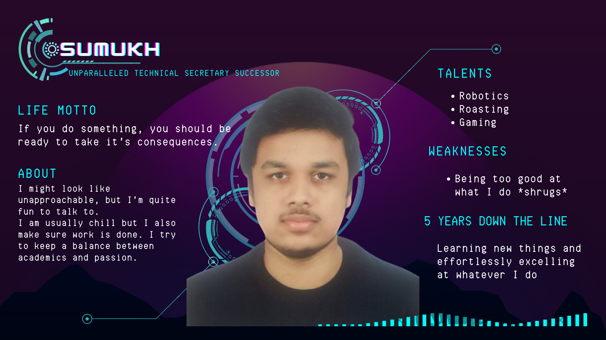

---
**Commendable Achievements from his tenure as the Techmaniacs Coordinator**                                              
Organised the most expensive techmaniacs club competition, approximately costing 65K. I guess I was able to spark interest in many students as we saw a good spike in the no. of interested students.               
                              
One of the challenges were students were not willing to invest their time in robotics, to boost I just made issuing components as simple as just use whatever is available with us in ideas² room after my consent but it is not a good way if more students are interested. So I suggest not to do it again 😅.                  
                                
-----------

**Mistakes**                                                                                                  
Should have chosen a better core team for club.🙃                                

--------------

**Dear Future Coordinator,**                                                              
         
Continue the spark we generated in the students last in electronics and robotics to make robots which can make us proud.
               
---------

*Thoughts and reviews from the student community* 
    
>This semester the club did phenomenal. We increased the participation almost 10 times. We learned a lot about microcontroller and 3-D printing. More focus can be done towards the ROS side. 
>
>The most interesting part this year is preparing for the workshops and Inter IIT. The enthusiasm and support from all the team members and attendee was much better than expected. "
>
>*-Arpit Gupta*
                        
                                    
>Throughout his term we tried to cater every domain's needs. Before taking any step he used to take our (co-coordinators')views which brings in transparency in the club. Also, if we needed anything for project he tried to make it available to us as soon as possible. 
>
>*-Chirag Kotian*
                   
               
>He has a fun and dynamic character. He is a focused and hard-working individual. He always encouraged and supported active participants in the club. He values people who follow through on their commitments.
>
>*-Pavan Sandaka*          

--------------------

 

<b>Pranav Sutar</b>

 

*Gagan Vedhi Coordinator*

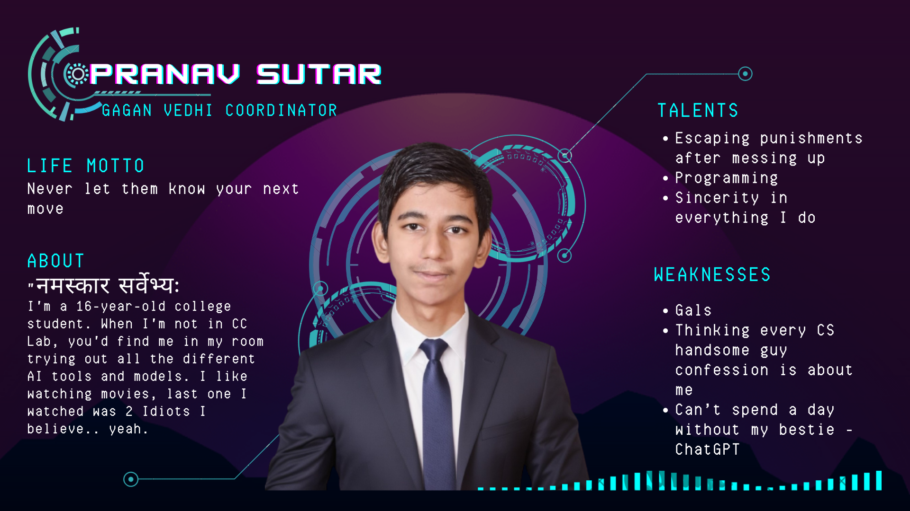

---
**Commendable Achievements from his tenure as the Gagan Vedhi Coordinator**                                              
                
During my tenure, I had the opportunity to collaborate with IISER, which I consider a significant achievement. It marked a promising start and holds potential for future collaborations. This collaboration was well-received and appreciated by our Faculty Advisor, PC Deshmukh Sir, and the Director. We planned several collaborative events such as the Astronomy Treasure Hunt, Sci-Fi Story Writing, Astro-Debate, Astro-JAM, Hackathon, and Astro-Art. Although we couldn't complete all the events as planned, the experience made me familiar with IISER students' culture. The students of IISER are quite determined and passionate, and there are many aspects which we can learn from them. It was overall an enriching experience.                  
                        
Towards the end of my tenure, I and Devansh took the first lecture on ML for Astronomy, and it was personally fulfilling due to two reasons. First is that Gagan Vedhi started an activity that has a small incentive in terms of placement prospects too, and the second is that I finally took my first ever session at the end of my third year in B.Tech.                    
                                                         
Arpit and Manas got 2nd prize in the Shaastra Space competition, which is the first significant achievement other than Inter IIT of our club. Documentary Quiz, which was a brilliant idea given by Akash Bhaiyyaa(the third coordinator of our club), was implemented this year, enhanced with the help of an app called Sync Buzzer(suggested by Arpit), which made the event more interactive and enjoyable for participants.  I strongly believe that conducting the Documentary Quiz multiple times would be a great idea, as it requires less effort but receives significant participation.                           
                                              
In a nutshell, this year was an insightful journey of learning and fruitful collaborations, making the club even stronger. I hope it would have helped the club to be an inch better.                        

-----------

**Mistakes**                                                                                                  
Never rely blindly on an uncertain person or situation. You need to put in your own efforts in something if you are going to be held responsible for it, or at least put in efforts to get such people who will do it perfectly. I did this mistake twice, and I regret that.                             
                                    
I wanted to conduct an Astrophotography Workshop, purchase a new and better Telescope and Conduct a Rocket Modelling Competition, which I couldn't. Also, I could have taken the students of 2022 batch in the Core Team in their first Semester itself.                    

I think these are some of the mistakes which I wish I could change.                       

--------------

**Dear Future Coordinator,**                                                              
                                                                                               
This is an important and responsible post, and is not solely a platform where you can gain experience and learn from your mistakes. It is fine if a few mistakes happen, but I advise you to be doubly alert about each and every decision you take. Avoid conducting things just for the sake of doing something without meaningful outcomes.                       
                                         
Also, try to gather talent, which is required for a good delivery that gives meaning and recognition to the club. If there is less talent in our institute, you need enthusiastic people in our institute who can call and accommodate talented guests, and that's necessary!                                              
                                                                           
Regarding Club participation, I feel that there are only two ways -                                  
i)  Enjoyable cum Technical events (like Telescope and Rocket)                                           
ii) Events that give a Resume Incentive.                                                                  
                                                                                     
I insist you to think about this while planning the Collaboration Astrofest. The planning should be in such a way that Astrofest becomes famous throughout the Institute. The events arranged from our side SHOULD be aligned with the IITT mindset, providing value and appeal to our audience. And I leave the brainstorming to you.                                                            
                                                                           
Do take the 2023 B.Tech students after they arrive, don't wait for the academic year to conclude. Keep the club active, use multilple platforms like Insta and Linked In. Choose the core team wisely.                                               
                                                             
That's it for now. I won't unnecessarily interfere in your tenure, but at the same time, I will be available if you need anything.                                        
                                     
All the Best!                                         

---------

*Thoughts and reviews from the student community* 

>Pranav is the perfect amalgamation of an astronomy enthusiast, a coding splasher and a team leader. Apart from being a flamboyant personality, one will find Pranav, a calm and pacifying person to talk to. With these qualities in the pocket, he has successfully discharged his coordinator duties. From meme-marathon to machine learning workshops, Pranav has excelled in managing all the activities this year. Apart from nailing at his job, one thing Pranav is good at is that he is always open to everyone’s opinions and immaculately executes them.
>
>*-Abhishek Kulkarni*
                  
                                            
>The moon watching sessions were pretty neat. Sadly, despite our efforts, few people came for the talks. We had a nice time coming up with content for the astronomy posts and I had a nice time giving that one talk :)
>
>*-Arvind Srinivasan*               
                 
                           
>He had conducted various visits which in previous term were not made, Various workshops as well as collaborative Astronomy Fest between our Institute and IISER Tirupati were done which is also a great feat. Overall he was a very good Club Coordinator.            
>                  
>It was a great experience working with him. It helped to build my communication skills as well as how to manage events and organize materials for them.                     
>
>*-Nilanjan Samaddar*

--------------------

 

<b>Jeyasitaram</b>

 

*Winged Voyage Coordinator*

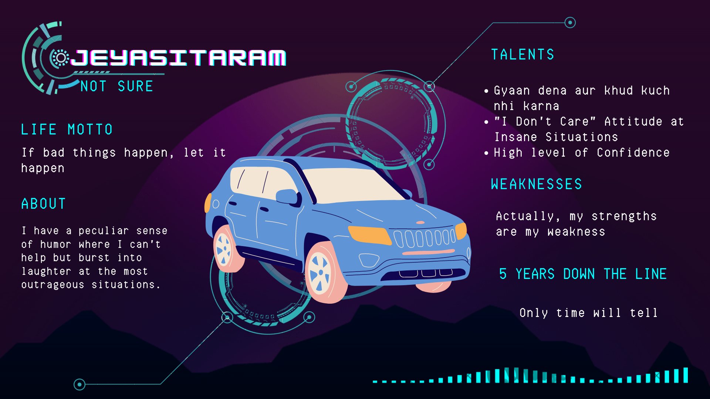

---
**Commendable Achievements from his tenure as the Winged Voyage Coordinator**                                              

We hope Person of Interest has valid reasons for ghosting the editorial team. The Editors would like to acknowledge the possibility that their silence may indicate a lack of content to contribute. Please understand that a response would have been welcomed, without any intention to offend. Thank you!!!               

-----------

*Thoughts and reviews from the student community* 

>The Automobile Club is quite different from the other clubs. It does not have club sessions. It has no room for short-term goals and easy victories. It is born of visions and dreams, and managing such a Club is by no means even a moderate task, let alone easy.                     
>
>After the Lockdown, the Club was left with nothing to its name. No progress, no designs, no visions. Just a few tens of kilograms of rusting steel pipes, someday intended to form a race-spec chassis. Now comes the role of Club Coordinator. To be thrown into such a position, given the circumstances, is Hell itself. Combining that with a lack of experience in leading a work-heavy Club and an acute shortage of interest in motorsport and racing, all hopes of a thriving Club are washed down the drain. On top of the aforementioned, the absence of an interested team (understandable, considering the state of the Club itself) and unavailable funds put down the already stunted growth of the Club for good. Perhaps Jeyasitaram’s tenure is a grim reminder that being in the wrong place at the wrong time is a very real thing. He may be cut out to work in a Race Engineering team, but leading a team of toddlers who are just learning to say their first words in Automobile Design is a whole another deal. ”          
>
>*-A once hopeful core member*
                      
              
>I wanted to take a moment to express my heartfelt gratitude for your exceptional mentorship and guidance during your tenure as the Head of the Automobile Club. Your leadership has been truly inspiring.        
>
>*-Aman*
          
             
>He is highly focused and exceptionally talented, channeling his efforts into tasks with unwavering determination. He sets a high standard for himself and expects the same level of dedication from his team members.
>
>*-Pavan*

--------------------

 

<b>Sri Vibhav J</b>

 

*Aranya Coordinator*

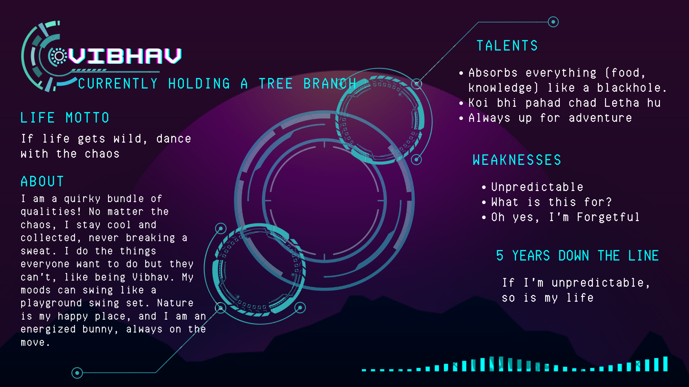

---
**Commendable Achievements from his tenure as the Aranya Coordinator**              

Okay! The first achievement is that I got Gopi inside the club as a core member (Coordinator to be honest). Aranya is a club that needs to get through a lot of permission stuff to do one trek or even an event, and you do all that, you still have the weather conditions and trek place situations ready to disappoint you. Even with all the mood swings the weather had in my tenure (I don't know what wrong I did but that black cloud just comes out of a clear sky when I say that there'll be a trek), we were able to pull out treks (to the same old place ahhh anyways) and tried to accommodate as many people as possible. Also, the club requires a lot of people interaction right from talking with students regarding their interests and their free-time to talking with secretaries, our core team, with the authorities, transportation, mess management and talking with the forest officials, guides and so on, there'll be a lot to talk and do with people and co-ordinate things between them. I'm so proud that we were able to do that successfully. There are also so many on the go decisions needed to be taken as a part of treks and events organised, which our team was able to execute perfectly everytime. The fact that there were very few treks in Sandesh bhaiya's tenure due to covid and we were able to do three of them is something I'm happy about. I'm happy that I was able to uphold the trekking culture in our campus.                        
                          
To summarise, I could really say that I learnt to better deal with people and monkeys.                                           

-----------

**Mistakes**                                                                                                  
They're not mistakes, but we had a lot planned up, but we weren't able to perfectly execute all of them due to so many reasons (mainly that black cloud). So, I still have this regret that I (being a local guy and knowing a lot of places around) wasn't able to show people the things I planned for them.                     

--------------

**Dear Future Coordinator,**                                                              
Udeesh!!                           
I recommend you to try out varied types of treks and trek terrains instead of restricting yourself to just one day treks to places that we already had gone to. Try to do more sunrise treks and camping treks (good luck with the permissions btw).                
                                        
You can also try to take people out for adventurous activities near Tirupati like kayaking, rafting.                                   

---------

*Thoughts and reviews from the student community* 

>Sooo many... We have planned many things, and all failed due to budget and bad weather conditions. We have called a person called Birdman daily for bird watching for 1.5 months, and the event got canceled more than three times. But again, he never gave up, and he always tried to conduct treks to make students get out of relax and enjoy nature. He went to Talakona and Nelakona more than five times in one semester, and no other person could do it. The way he planned and organized treks were simply superb. He conducted it smoothly and cared for each member who came to trekking. The perfect trekking club coordinator. He also tried to make everyone laugh who came to trekking and ensured that no one was getting bored. One thing is he would have conducted treks to different places, but due to permission from forest authorities, it didn't happen. This is one thing he could have done better. Others are simply exceptional.
>
>*-Gopi Krishna*
             
                            
>Everytime we plan a Trek/event, it used to get postponed for some or the other reason , be it permission from the management or weather conditions. Students became so tired that they started to call Vibhav, A prankster.                       
>                 
>Maybe should have planned everything a bit earlier and organised few more events in the odd semester.It was a very great experience working with them. The team stepped up when it mattered the most.     
>
>*-Chakradhar*         
            

--------------------

 

<b>Sanket Wathore</b>

 

*Chaturanga Coordinator*

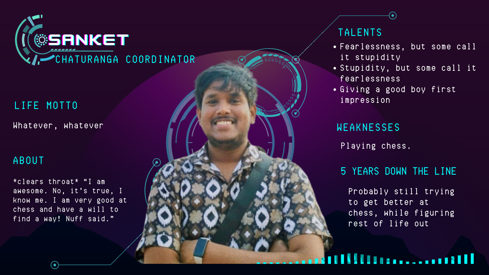

---
**Commendable Achievements from his tenure as the Chaturanga Coordinator**                                                                                                              
Being the head of the Chaturanga Club in college has been an absolute blast! It's definitely been one of the most fulfilling experiences of my time here. When I took on the role, we were in the midst of the pandemic, and all our club activities were happening online. But I was determined to bring back the fun and excitement of in-person events.                                       
                                                
Transitioning from virtual to offline activities was no easy task. It was a whirlwind of planning and organizing, but thanks to the incredible support of my core team, we managed to pull it off. I owe them a huge debt of gratitude for their dedication and hard work. Together, we made this year unforgettable for all the club members.                                                      
                      
One of the highlights of our journey was representing our college at the inter-IIT Chess Tournament held in IIT Delhi. It was such an honor to compete against top players from other IITs. And you know what? We held our ground and secured the 10th position out of 23 participating IITs! Can you believe it? Beating some of the older IITs was a proud moment for our relatively new institute.                                                           
                             
But our achievements weren't just limited to the tournament. We also came up with some exciting new initiatives this year. For instance, we organized a women's chess tournament to encourage more female players to join us. The response was fantastic, and it was heartening to see the enthusiasm and talent on display.                                                                        
                                               
We didn't stop there, though. We wanted to involve the faculty and staff too, so we arranged a chess session for their kids. Seeing those little faces light up as they played the game was pure joy. It added a whole new level of enjoyment to our club activities.                                                   
                                      

--------------

**Dear Future Coordinator,**                                                              
As my time as coordinator comes to an end, I'm filled with mixed emotions. On one hand, I'm proud of what we accomplished as a team. We brought the club back to life, competed at a high level, and created inclusive events. On the other hand, I'm sad to say goodbye. But I know the club is in good hands as Teja takes over. I wish him the best and hope he takes the Chaturanga Club to even greater heights. Let the legacy live on!                

---------

*Thoughts and reviews from the student community*              

>He tried to make all of us interact and conduct different variants, which also helped us get out of stress. He also started running tournaments for children of faculty. He tried to make women play Chess which was a good initiative. He also tried to conduct regular tournaments so that the habit of playing Chess won't get reduced and the people would stay connected. He is simply superb, and his leadership skills are fantastic. Photography skills, too. The way he handled Inter IIT selections is incredible. No person other than Sanket could take it in such a good way, even when there are fights.                                             
>
>*-Gopi*
          
                    
>An interesting point is how the team seemed more interested in playing than anything else, and funnily enough that seemed to work 😂. I think the team did an excellent job overall and I would say best in conducting tournaments, to keep everyone in the community active in this regard.           
>                     
>*-Vishrut*
                         
                  
>He was the glue between the novices and the veterans in the team. He listened to all our suggestions, regardless of who we were. Under his leadership, we organized a workshop/session for the kids of faculty/staff and they really enjoyed it(so did we). Ofcourse, as is the case for everything in life, there was room for improvement. We could've had more fun events engaging the majority of people who're like, "We know the rules of chess but nothing more than that and it's been long since we played a game of chess." That group must be our target audience.
>
>*-Dhananjayan*         
             
                   
>Always able to bring in all guys to tournaments, but not the seniors! Beware of his sweet talks, they are not just compelling ;) . He is a charismatic and energetic person, and always keen to bring in more people to take interest in chess and take the culture to a new level. Also, he took matters easy and that made our core committee a nice and friendly team.                          
>
>*-Sunandan Gad*

--------------------

 

<b>Sameer Ranjan</b>

 

*E-cell Student Head*

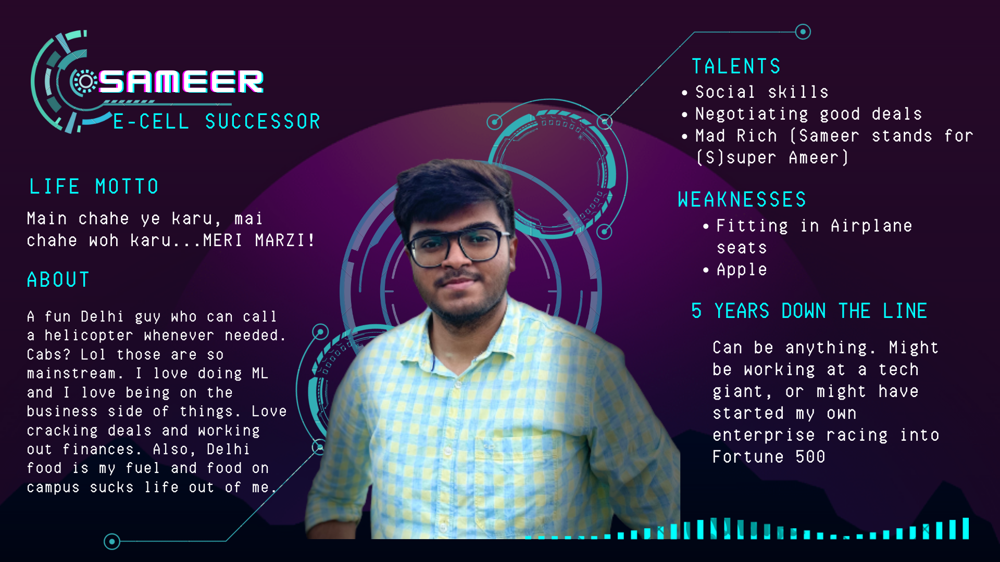

---
**Commendable Achievements from his tenure as the E-Cell Student Head**                                                                  
It was an excellent experience connecting with some successful entrepreneurs and startups through E-Cell and inviting them to our college for events while negotiating the dates. Still, unfortunately, it got canceled last minute. Managing the logistics for any occasion was challenging, but thanks to our events management committee, it went through smoothly.        
                
-----------

**Mistakes**                                                                                                                 
I wish I had organized events with better planning for the student interested in entrepreneurship at a better frequency and invite successful entrepreneurs in our college for some ted talks.              

--------------

**Dear Future Coordinator,**                                                              
Try to improve student participation in entrepreneurial events and increase the frequency of these events.                           

---------

*Thoughts and reviews from the student community* 

>He, as a club head, has been phenomenal when it comes to making connections with external markets. Overall the club head as well as the whole team was quite supportive and managerial. The one thing that I think could be improved is the work distribution among committees.
>
>*-Vaibhav Mishra*
                   
                    
>He's a quiet and methodical worker, always having a plan in place. With his determined approach, he consistently completes his work efficiently and effectively.
>
>*-Pavan Sandaka*          

--------------------

 

<b>Arunkumar</b>

 

*Ideas² Student Head*

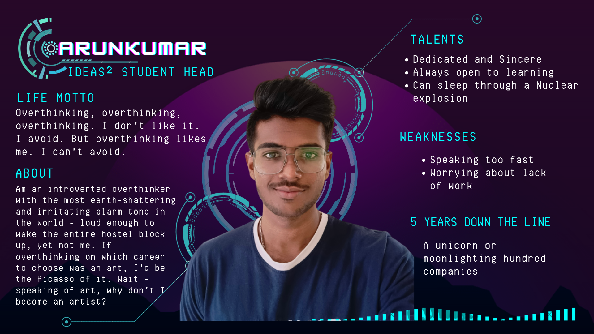

---
**Commendable Achievements from his tenure as the Ideas² Student Head**                                              

Despite not receiving a budget due to some issues, this year, we managed to host three workshops, with over 70 registrations for the AR workshop and 45 registrations for the drone workshop. It was a challenging task to lay the groundwork after the pandemic, but we made a good start for this club on its way to become a tinkering hub. Organizing external events taught me the excitement and difficulties involved, from funding to seeing them through to completion. Despite facing various challenges, such as transportation, room bookings and other arrangements for the instructors and students, our team overcame them through proper coordination. I am also thankful to my team and co-head Sneha for their support throughout the year.        
                  
-----------

**Mistakes**                                                                                                  
I should have kept an eye regarding the budget approval for this club from the first. Also I should have conducted biweekly meetings within the team to keep this group alive at all times.                         
                                       
Apart from this I had a lot of fun the whole time while setting up the room and also organizing the workshops. This really is such a new experience.                                
 

--------------

**Dear Future Coordinator,**                                                              
Get the budget sorted first and try to keep all the documents well organized. Also try to keep multiple meetings with your team to keep the club spirit active. When organizing a workshop, split the work if  needed and also be open minded and free to suggestions from others                                             

---------

*Thoughts and reviews from the student community* 

>I guess he was kind of idealistic, like he didn't think what would happen in real life, but as time progressed he learned to be better. He was a pain in the ass initially but improved his behavior with time as head. He did good job kick starting ideas² and organizing the workshops
>
>*-Sumukh Porwal*
                 
                   
> He was a really good Captain, he handled the club and it's activities really well especially when the club is at its initial stages.      
>
>*-Ganesh Chandra P*
         
                  
>Arun is an interesting person. Jolly kinda personality who is committed to work. Always have to be 2X more attentive while interactions because the pace with which he speaks is 🚀. Enjoyed working with Arun!
>
>*-Sushant*
         
                  
>I don’t know how else to put this. But I saw Arun grow as a person. The childish enthusiasm he had at the beginning metamorphosed into practical thoughts and actions based on ground reality and implementation challenges. Not that he lost that enthusiasm (that is what makes him, him), but I guess the childish idealistic world view changed. We were a good team - someone who thought everything will go well and another who was always like what if it doesn’t and these discussions helped us avoid many hurdles we would have had to face otherwise. My erratic scheduling of stuff that semester low-key irritated him and rightly so. I sincerely apologize for all the delays and disappearances from my end. But you really handled it like a pro. Arun is a wonderful human being with big dreams. Mind you those are the dreams which APJ was speaking off - those that don’t let you sleep. And I really hope they all turn into reality.
>
>*-Sneha M S*
          
                       
>He is a diligent and dedicated individual who combines hard work with a sense of fun. With keen observation skills, he absorbs information effortlessly. When he is passionate about something, he exhibits an unwavering commitment and is willing to make sacrifices to achieve his goals.        
>
>*-Pavan*

--------------------

 

<b>Sneha M S</b>

 

*Ideas² Student Head*

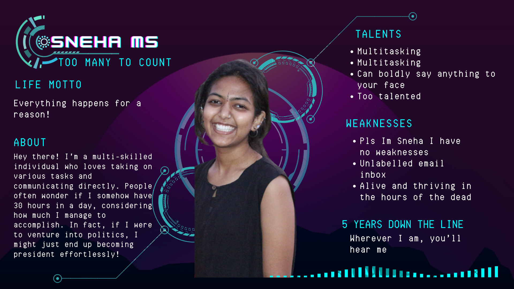

---
**The Good, the Bad and the Ugly**
- The fact that this role exists in our student body is an achievement. All credits to Natesh. This was required.                 
                        
- We successfully (ahem!) kicked out the research scholar cubicles from the room. Not really our achievement but the institute’s for giving them their own dedicated space. Victory to us all, I guess.                  
                              
- We conducted 3 workshops without spending a single penny from Ideas² coffers. I guess that is an achievement. But honestly, thanks to IITTNiF (thanks to Roshan sir) and the Technical Council (thanks Pavan) for funding the workshops. Note to the next head, Ideas² funds cannot be used for conducting workshops. It’s solely for infrastructure set-up. We realized this the hard way and had to do some kinda jugaad.               
                         
- The Dream is to make Ideas² like the innovation center from [Big Hero 6 -"The Nerd Lab"](https://www.youtube.com/watch?v=GzOroyFxUj0). I believe we lay the groundwork for this to become a reality one day (I like to think so, atleast).  Enthusiastically, we got all the plans, proposals ready but when it came to on ground implementation we had to face a lot of hurdles. We were not really informed about how the Ideas² funds and budget works and by the time we got to the point to place order, we realized there’s a lot of procedure that needs to be initiated in the beginning of the academic year. Because of the COVID break, not anyone was really sure how to access these funds, and months went away just trying to figure that out. I mean we have done the grunt work, the next heads should be able to sail through smoothly, at least with respect to accessing the funds.                          
                                              
- The team did a wonderful job managing the events. A shout out to all of them. You all stepped up at the right time and our workshops were pretty good, I guess. Either way I had a blast working with all of you.                     
                                                  
- Special thanks to Artista and PFC (have to mention Sathya and Shreya) for getting the wall posters ready. They are beautiful and have captured the true essence of what Ideas² is. I really hope to see them on the walls before I bid IITT goodbye. Sudhakar, make note. ;)                                        
                         
- Another shoutout to PFC; Despite the confusions and forgotten reminders, they covered every single event we conducted. We have photos to document these milestones. The first workshops from Ideas² side. Thank you.                          

- One regret I do have is that there was this one rocket modeling project I was really interested in taking forward. I should have gotten that started in the beginning itself. But we would have ended up with the budget problems along the way anyway coz we had not yet sorted that out. But this was a point where I had to prioritize Ideas² collective interest over my own. There were two other really interested students who wanted to join me. But I did let them down after the huge project proposal I gave. I sincerely hope they do explore the field and probably let me also join the project if they are taking it up this year.                        
                                     
- Last but not the least, this was an amazing experience working alongside Arun. Bouncing ideas off our heads, shooting them down, the discussions we would have before meets; I'll never forget these moments. This role helped me grow as a person. We were able to come up with better solutions because of the conversations we had and I sincerely believe an entity like Ideas² must have two people at the helm. They might not agree on all points and that’s required - together you’ll come up with the best possible ways to implement anything.                                          
                                                                
-----------

**Dear Future Coordinator,**                                                              
- With great power comes great responsibilities; But what we don't get from this line is that with great responsibilities comes sacrifices. I learned this in action; But I want you to know this upfront, You can’t make the club’s goals align with yours. You must align your goals with the club’s.                         
                                
- Get the budget files sorted and have a layout of all the expenses from the beginning. We had done this too, but we faced the hurdle of not knowing how to access the funds (coz nobody else seemed to be aware of it as well ); Speak with the tech sec and the Ideas² committee and get this sorted before anything else.                        
                            
- Have a solid team who are interested in watering the roots of the Technical Tree. Any random dude who joins just for your sake or PORs sake will not really help you much. The team should be such that in case you’re not there, they should be able to manage things on their own.                      
                         
- Lastly a request, get those beautiful posters printed and make Ideas² look like Ideas².                             

---------

*Thoughts and reviews from the student community* 

>No words to mention, she is dynamic as always. The meets we had while organizing the activities, I really liked working with her.            
>
>*-Ganesh Chandra*
                 
                                
>Sneha is an amazing person and a leader. She is always enthusiastic and full of energy. We always have to be on our toes when it comes to work. I think she was the best person to handle the very first Ideas² head position.
>
>*-Sushant*
                 
                 
>She is fun and has a vibrant presence wherever she goes. Her communication skills are top-notch, with clear and confident speech. Her dedication and hard work are evident, and she possesses a remarkable ability to quickly grasp new concepts.
>
>*-Pavan Sandaka* 
               
                 
>Sneha is one full package! From writing to culturals to taking up any position whatsoever, she makes sure to leave her own little touch there. Working with her on different fields throughout the years has been an amazing experience, and has never been a question of lack of commitment or dedication. Her honest opinion on anything she’s presented with just makes it all the more easier to get things going!
>
>*-Krithi*
               
                 
>She's a pro at handling multiple tasks at once and she never loses track of any information. Whenever she has a plan, she flawlessly puts it into action. On stage, she's incredibly confident and can speak with boldness. When she makes a decision, she puts in the effort to ensure it's the right one and works hard to make it a success. If you hand over the work to her, you can rest assured that she will complete it. Plus, she's great at persuading people too! But I would like to mention, If a meeting is planned, please attend the meeting on time.
>
>*-Arun*

--------------------

 

*************************

That's all folks. For those wondering why half the editors are on the cards themselves, we can assure you, we played fair and made sure the other half had a chance at roasting us. That being said, we conclude this comical tribute to our student representatives, hoping that you found it as enjoyable as we did. Kudos to all the amazing secretaries and coordinators who worked all year to establish several foundations for years to come. Congratulations to the new student body, and we at Udaan are ready with our cards to see what's in store for the next year. We extend our gratitude to everyone who participated in curating this article. A special shoutout to *Anant* and *Sathyanarayann* for their exceptional work in helping with the design of the stunning profile cards.

******************************