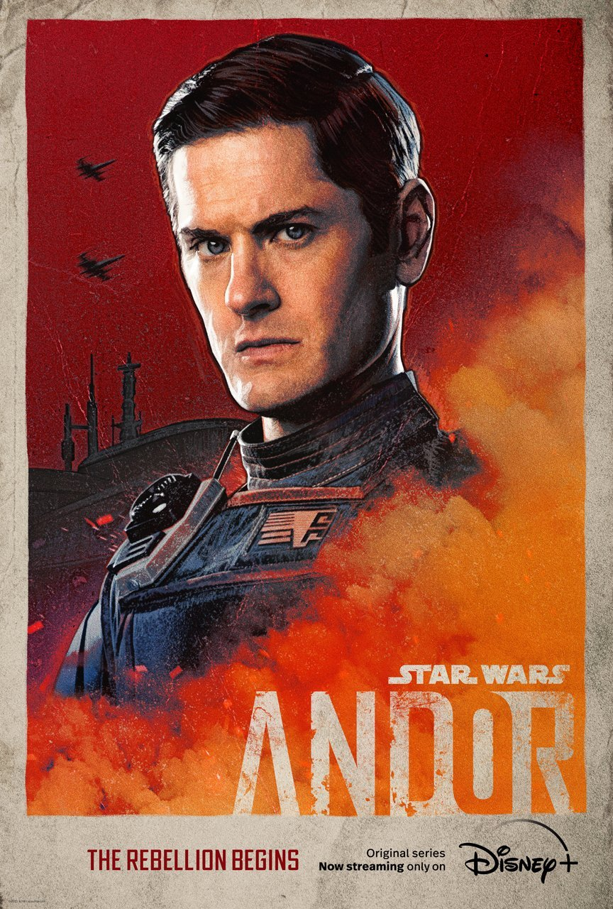

Andor is unlike any Star Wars media which came before it. While most other Star Wars media focus on grand narratives of good and evil, with stakes spanning the whole galaxy, Andor tells a more intimate story of the radicalization of one man – Cassian Andor. Andor does not deal with grand prophecies, ancient religious orders, pan-galactic wars or supernatural forces, instead presenting a much more grounded view of the galaxy. By lowering the stakes of the conflicts, the show manages to capture the attention of the viewer better than stories where the fate of the whole galaxy is at stake.                
                           
The narrative does not focus purely on Andor; the show manages to weave together several different plot-lines and manages a large cast of characters. From the opulent halls of Coruscant to the rolling green hillsides of Aldhani, from the grimy mining colonies of Ferrix to the uncontacted settlements of Kenari, the story takes the viewer across the galaxy and paints a vivid picture of daily life under the empire.               
                
Andor differs from other Star Wars shows in another major way; while other shows tend to be spin-offs of existing media with several cameos from characters in the wider universe, the plot and cast of Andor is almost entirely original. Not once does a well-known character make an appearance just for fanservice (with the exception of Mon Mothma, who was a side character in the original universe which Andor fleshes out by exploring her inner motivations for supporting the rebellion). The refusal to engage in overt fanservice greatly improves the quality of the story-telling and helps new entrants to the Star Wars saga remain immersed in the show.                           
                                          
Among other things, Andor is both an instance and a subversion of the classic hero’s journey. Though Andor broadly follows the steps of Campbell’s monomyth, it subverts it in places. After the heist, where one would expect the traditional hero to sign up to the rebellion and accept their call to adventure, Andor refuses and runs away to enjoy himself. He is caught and thrown in prison only because of a trivial incident completely unrelated to his previous crimes. This scene shows the arbitrary nature of the imperial justice system – being in the wrong place at the wrong time is enough to get a heavy sentence.                           
                                        
The call to adventure is subverted since Andor is not called, but forced to flee as a result of his own actions. The temptation is partially subverted when Andor, who works as a mercenary, refuses to aid the rebellion any longer and demands his payment before leaving. This leads directly to the abyss, instantiated here both metaphorically and literally by the prison on Narkina, which is a large chasm in the ocean in which dissidents are worked to death. The return of the hero is bittersweet, since Andor comes home to Ferrix to find it under imperial authority - a direct result of his earlier actions.           
                  
Andor sheds light on a question debated by Star Wars fans since the first film came out - Does the empire meet the definition of fascism?            

The empire is shown to be forward-looking, since the past is dominated by the Jedi. The birth of the Empire was painted as a natural consequence of the Jedi attempting a coup d’etat against the republic during wartime, which, by Chancellor Palpatine’s logic, necessitated the reorganization of the republic into an empire and the extermination of the Jedi. The empire does not have any glorious past to look backwards to.               
                  
Palpatine, who went on to become the emperor, was in reality a Sith lord (which is not a widely known fact in the galaxy, which believes the Sith order to be extinct) who orchestrated the entire war to weaken the Jedi and seize power. Though there existed a Sith empire in the past, most Sith understood the flaws of the Sith empire and knew that its destruction was necessary for the survival of the Sith. The tension between the hyper-individualism of the Sith and the demand for political subjugation to an empire could not co-exist, which resulted in a destruction of the empire by internal dissident.                        
                  
Though the emperor may have been a Sith, the empire was most decidedly not. The emperor’s personal beliefs did not matter since they were hidden from the public so effectively that they did not significantly affect imperial policy (except perhaps the policy of exterminating the Jedi). The philosophy which the empire operated under was one of “stability”. The galaxy had been deeply scarred by the chaos of the clone wars, and there was popular demand for a strong authoritarian leader to take over and put an end to the fighting.                 
                   
The empire’s policy with existing traditions is not one of glorification but of suppression and elimination. Local customs and culture present an obstacle to assimilation, and thus the empire is eager to stamp them out. We see an insidious example of this with Aldanhi culture. The empire realizes that violent suppression will result in further rebellion, thus they use subtler tactics to suppress it. We hear the whole story contained in just a few lines of dialogue between two imperial officers - an example of how well Andor uses its runtime to flesh out the universe.                   
                         
The fascist need to make everything match the aesthetic of the dominant culture is explored in Andor, which contrasts the sterile white rooms of the ISB offices with the colourful chaotic environments in Ferrix. What little colour existed in the republic army uniforms is entirely removed by the empire, which uses a grey-black-white colour scheme. This need for galactic homogeneity is further touched upon by a few scenes with the galactic standards beaureau, consisting of a legion of beaurocrats tasked with the process of standardizing measures across the galaxy.                   
                            
The empire does not have an external enemy – all enemies are internal. This is inevitable when an empire operates at the galactic scale. In a unified galaxy, there are no competing superpowers to fight endless wars against. Conflict is driven solely by the suppression of dissidents within the empire. The catalyst for the very birth of the empire was a mutiny by the Jedi order, who had come to occupy leading roles in the Republic’s clone armies.                      
                              
The empire’s reach is not universal even within its own borders – it relies on corporations to keep the peace and extract resources, in a manner which can be compared to the marriage between the corporation and the state under fascism. Andor shows us how this outsourcing of oppression occurs with the mining corporation, whose agents are given free rein to terrorize the population of the planet they are in charge of. Since the galaxy is huge, the empire’s tentacles cannot extend everywhere simultaneously.                      
                       
There is no “obsession with a plot” which pervades the empire during its initial years. The Jedi-hunting activities are restricted to specialized units within the empire (seen as as clean-up operations to get rid of the last remnants of the old order). Though the Jedi are scapegoated as the group responsible for the fall of the republic, the average citizen does not know or care about the Jedi. Andor, by avoiding all mentions of the religious conflicts between the Sith and the Jedi, frames the empire and rebellion as things which exist independent of the religious persecution of the Jedi. The show strains against the idea of “Great Man History”, where the fate of the galaxy is decided by a small handful of benevolent monks or malevolent tyrants.                    
                    
The show shows the empire’s awareness of the plot develop within the run-time of the show. When Meero suspects that rebel activities are occurring on a grander scale than previously imagined, she faces a lot of institutional pushback from the ISB, which believes that all is fine and that the empire is invincible. After the heist at Aldhani, Meero is vindicated and given free reign to investigate by the ISB, who are forced to re-evaluate their methods after a rebel raid on Aldanhi shatters the illusion of absolute imperial power across the galaxy.                      
                                      
The concept of the Leviathan as put forth by Hobbes can be leveraged to describe the empire. The empire acts as a “celestial leviathan”, an entity which spans the galaxy, possessing such vast power that resistance to it is almost unthinkable. The celestial leviathan here behaves like a parasitic being – if the galaxy is a piece of bread, the empire is a mould. There is no other mould to compete with, the only goal of the mould is to consume the bread and replicate.                        
                      
Andor shows us the various stages of imperial influence. Initially, we see Kenari, a planet which is untouched by the empire, portrayed as the closest thing to paradise in the galaxy. Andor heavily subscribes to Rousseau’s world view of the “state of nature” being corrupted by the influences of industry and technology. The first contact between Kenari and the republic ends in a genocide, which coincides with Cassian’s loss of innocence. The inciting event of a republic mining vessel crashing on Kenari followed by a reprisal against the indigenous Kenari (who are Andor’s family) subverts the trope of “empire civilizing savages”.                 
                               
We see the next stage of imperial control in Ferrix, where imperial authority is by proxy. Andor then shows how that degree of separation is removed when the corporations are forced out and Ferrix is put under direct imperial control. We also see Aldhani, the final stage of imperial occupation, where the empire has been in control for enough time to completely subsume the local culture. The empire is portrayed as a blob which consumes all that it touches.                   
                       
Andor portrays the banality of evil in three ways - the judge, the ISB, and the senators on Coruscant. For the ISB agent Meero, it is just a job. The judge who awarded Andor a harsh sentence was merely following orders. The senators on Coruscant are so far removed from the realities on the ground that they do not care about the planets they are supposed to represent.                   
                     
Andor shines not in its bombastic action sequences (though it has a few of those) but in the interactions between characters. There are certain sequences consisting of only speeches - Luthen’s monologue, the squabbling among the ISB’s top brass, Mon Mothma’s political manoeuvering on Coruscant and Maarva’s speech are plain examples of this, where the characters launch into long diatribes about their ideology, violating the generally accepted rule of “show don’t tell”.                     
                         
However, Andor manages to pull off these scenes quite well because it both shows and tells. The actors’ delivery of the lines is captivating. No character is used as just for exposition dumps; they are written in a way that is consistent with their actions and characterization throughout the show. No line of dialogue appears out of place; each word enriches the universe the show is set in. The inter-departmental conflict inside the ISB, which feels like something which should be boring in a universe with laser swords and dogfights in space, but is written and delivered so well that tension is maintained in every scene.                   
                             
Andor transcends the “rebels always good, empire always bad” paradigm of other Star Wars media by not portraying the rebels as moral paragons. Internally driven infighting among the rebels is a prominent theme in the show, with an excellent exploration of the tension between pragmatism and idealism. Luthen plays the part of the pragmatist, concerned only with the ends, willing to sacrifice personal principles for the greater good. Saw Gerrera represents the zealot who is so single-minded in his vision that he manages to antagonize other rebels as well. The issue of whether or not fellow rebels can be sacrificed like pawns on a game is the main driver of conflict between Saw and Luthen, which the show does an excellent job at exploring – the writers do not take a clear stand but let the dialogue play out.                   
                               
Another notable character is Karn, who starts out as an overzealous corporate security officer. His misplaced sense of justice and honour leads him to disobey standing orders, get his underlings killed and inadvertently cause Ferrix to be brought under direct imperial control. Karn is shown to be the architect of his own misfortunes, the logical conclusion of the imperial prioritization of stability over all else. Even at Karn’s low point of going back to live in his mother’s apartment, he does not once think to question the ideology he believes.                                

|  |  |
|:-:|:-:|
||
                       
Karn is Andor’s antithesis – While Andor starts out with no principles at all, Karn starts out being completely devoted to the corporation he works for. While Andor changes and grows, Karn refuses to let go of his delusions about the world. Andor’s extreme cynicism about how the world is is contrasted with Karn’s extreme idealism about how the world ought to be.                  
                     
Cassian Andor is not the everyman protagonist – the show goes out of its way to prevent the audience from identifying with Andor. By refusing to give Andor a consistent set of principles to operate under, the show alienates the audience from him. This critical distance between the audience and protagonist works to the show’s advantage, allowing it to explore other characters instead of centering itself on Andor.                    
                           
The show brings to fore three very different kinds of violence – the cold, surgical and precise violence of the ISB, the heavy-handed brutality of the imperial navy (which is only ever alluded to, never shown on-screen) and the mundane violence of apathy inflicted on the citizens by imperial institutions.                      
                     
The prison on Narkina is a microcosm of the galaxy at large, demonstrating how the empire holds so many star systems despite not having enough troops to occupy them all. The prison is designed in such a way that the prisoners keep each other in line, minimizing the need for security. The electric floors are a case of hostile architecture, something which keeps the prisoners in a state of constant anxiety.                     
                              
The policy of punishing the least productive team eliminates the need for the guards to force the prisoners to work; the prisoners willingly compete to outdo each other in the hope that they do not get zapped. Since the threat of collective punishment at he level of an entire floor is dangled over the prisoners, they police each other. If one sees a fellow team member slacking off, one is likely to berate that team member to ensure that their work gang is not zapped.                     
                                   
The writers also manage to make mundane things like engine repair induce tension in the viewer by repeatedly mentioning “hands off the table” as a sort of Chekov’s gun, making the viewer expect that eventually, someone will forget and get their hands crushed by a machine, maintaining tension even in scenes which consist of people just doing manual labour.                    
                          
Mbembe’s theory of necropolitics provides a useful frame to analyse the actions of both the rebels and the empire. A rather explicit case of deciding who lives and dies is shown in the case of Kreegur’s raid. Despite Luthen knowing that Kreegur will be walking into a trap, he refuses to warn Kreegur since he prioritizes the security of his mole in the ISB and wants to use Kreegur’s capture to lull the ISB into a false sense of security.                     
                            
The imperial prison on Narkina presents another case of necropolitics, in a scene where all the prisoners on an entire floor are killed en masse due to the mere possibility of a riot. Since they are replaceable and the prison is not, the imperial officers running the prison decide to value the integrity of the prison over the lives of its inmates.               
                                   
In summary, Andor is a significant departure from the typical Star Wars formula – more akin to a political thriller than a space opera. It explores complex themes in a nuanced way and respects the intelligence of the audience. Andor is a show which stands on its own, not expecting the viewer to know every piece of Star Wars lore before consuming it. Despite this break from the larger Star Wars universe, Andor keeps the interest of long-time fans by not treating the Star Wars universe as mere window dressing to tell its own story.  With a stellar first season, season two has high expectations to meet.                     
                       
