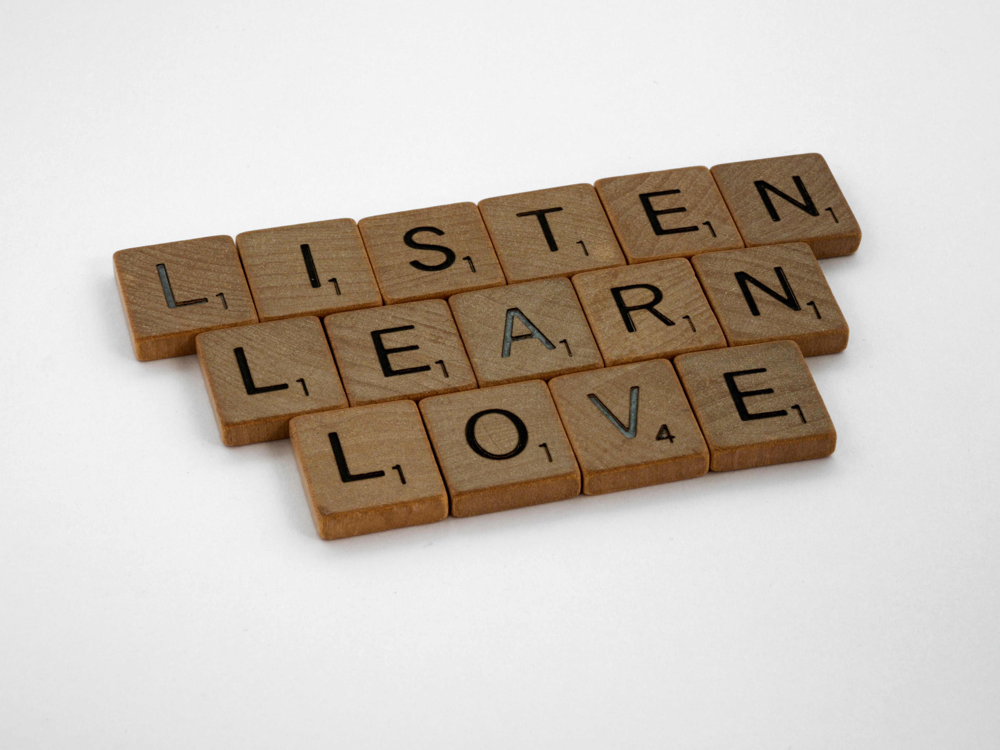

# **Index**

* [Preface](#preface)
* [Why Therapy?](#why-counseling-or-therapy)
* [Interview with Counsellor Dr. Neeraja](#_na6r04njk7f6)
* [Guidance and Counseling Unit](#_ulgusy3czki1) (GCU) 
* [It’s the Climb - Series on Mental Health](#_9qt1ugbavp24)
* [Conclusion](#_ddqej8uk3j4k)

# **Preface**

Mental health issues have always been around the corner. With multiple representations in social media posts, we’re sure you're familiar with the reel concept of mental health. In contrast to what is portrayed in popular media, mental health does not mean sitting in a corner, crying about your life, or a violent and unpredictable lifestyle. In reality, something as simple as a slow uneasiness when the teacher is distributing your marks might lead to regular anxiety, enough to significantly impede your ability to make the best of life. 

With societal and academic pressure, you are bound to find a lack of mental energy at some point in your life. Amidst all this, you constantly find yourself being pressured to "look on the brighter side" and to focus on "Good vibes only." But why? You're going through a battle, and the last thing you would want to believe right now is, "It could have been worse". Thus rises an increasing need not just to educate about mental health, but also how to help people around you get through it.  

# **Why Counseling or Therapy?**

Often, when you find yourself stuck, making progress is not easy, and you will need somebody to work with you on it. With the social stigma around counselling, it is believed to be weak to seek help. The people around you might simply try to brush things under the rug rather than encourage you to openly accept and work on your issues. The pressure to be “normal” and “fit in” might not seem to align with seeking help and regularly visiting a therapist. 

As the saying goes, "If you keep brushing problems under the rug, you eventually start to trip over those lumps". Trying to suppress your emotions is as good as forming these lumps which hinder your progress in healing and overcoming problems. Accepting your feelings gives you room to recognize that whatever you're feeling does not make you defective. And a psychologist helps you with precisely this: dealing with your emotions in a healthy way. 

To clear the air on various myths related to counselling, we at Udaan, sat down with [Dr. Neeraja ](https://www.linkedin.com/in/dr-neeraja-padigapati-a3917218/)[Padigapati](https://www.linkedin.com/in/dr-neeraja-padigapati-a3917218/)**,** our campus’ Counseling Psychologist from the [Guidance and Counseling Unit (GCU)](https://www.instagram.com/sarathi_gcu_iitt/?hl=en). Dr. Neeraja is a very fun and interactive individual who has years of experience in helping people win over their inner battles and unleash their true potential. The interview gave the team a chance to discuss the behind-the-scenes of counselling and talk about various causes of mental health issues in today’s lifestyle.

# **Interview with Dr Neeraja**

> *To begin with, can you clarify for our readers the difference between Psychiatry, Psychotherapy, and Counseling?*

These are commonly used words in universities. A psychiatrist is a medical professional with an MBBS. After an MBBS, they do an MD in psychiatry, after which they typically treat mental health diseases or disorders since they are allowed to give medicines.

Psychotherapy is a program that is usually done for people on a completely different spectrum. Everyday mental health issues, like academic stress, relationship issues, homesickness, anxieties, mild to moderate levels of depression and so on, can easily be handled by a counselling psychologist.

There is one more term called Clinical Psychology. A counselling psychologist will decide whether to send the person to a clinical psychologist or not. If we find something that requires medical intervention, we would initially send the patient to a clinical psychologist to gain an understanding of what exactly the problem is via psychodiagnostics. If a clinical psychologist thinks that medical intervention or pharmacological treatment is required, we send the patient to a psychiatrist.

> *One common misconception is that mental health issues are essentially caused by chemical imbalances in the brain. So usual treatment for such issues must involve drugs and medications. How do you think that communication will help in treating such issues?*

Not all mental disorders are caused only because of chemical imbalances in the brain. Psychology has this concept of *nature versus nurture.* A lot of mental health issues are majorly because of lifestyle. It depends on how you eat, how much time you sleep, how much you overthink, and a lot of other things. ***Not all the issues are because of chemical imbalances.*** Although a majority of mental disorders like depression and anxiety are caused by chemical imbalances of the brain, I would say a large chunk of issues can be overcome through talk therapy or counselling. That is why I am here now as a counselling psychologist. If anybody has any problem, they can feel free to just come and talk to us, I will try and help them out. If the problem persists, then I will send them to a clinical psychologist.

It is absolutely not suggested to take non-diagnosed drugs for simple cases of stress, anxiety or even panic attacks, because they have their own side effects. Counselling psychologists do different therapies (majorly talk therapy). We also give certain tools and techniques which will help them to handle their everyday issues. 

> *What do you consider one of the leading causes of these mental health issues we face today, especially students?*

Till plus 2 or 12th, you are in your immediate home, usually in your hometown. Then you come out to a bigger place. ***It's like a fish jumping from the river to an ocean; new environment, new expectations.*** Maybe that triggers some people. 

Apart from this, there is screen time; digital health is very important. Then we have procrastination and relationship issues. Particularly in these four years of B-Tech, you make friends forever (and maybe foes forever). These are some common, simple issues - academic stress, social anxiety issues, the feeling of “All my friends are being paid, I'm not getting a good placement”, CGPA - and so on. ***On the other hand, it can also be as simple as “I'm missing my mom's food”.***

> *We have seen so many TV series with counseling sessions, usually between the patient and the counselor. The counselor usually goes along the lines of “I won't give you the solution. I will only listen to what you say. It's for you to figure out.”*
>
> *In general, is it an accurate representation of counseling? If so, how does giving a place for the person to vent out their emotions, to gather thoughts and speak out what they want to, help them find the solution?  What will your role be in guiding them to get a solution?*

There are four very tricky terms: training, mentoring, coaching, and counselling. Training is a form of transformation that gives you new skills. In mentoring, we give you examples -”This has happened to me - that time when this happened, this is what I did.”

Coaching happens when you have academic issues; to help you unleash your potential. When you have mental health issues that you are not able to handle all by yourself, then you come to a counselling setup or a centre. We give you certain techniques for knowing your potential to help you understand yourself better. You will know where you’re making mistakes and make better decisions.

***The important thing is to trust that you will get a solution.*** It is also useful to prioritize who to trust. You should trust yourself that “Yes, there is a solution within me, I can hit it off, and I need some help”. That help will be given by a professional who will listen to you in a non-judgmental way. There are no conditions, so no filters attached.** *You can be as open as you are in front of the mirror since whatever information you share with any counsellor is usually kept confidential*** unless you're harming yourself or somebody else.

> *Can you walk us through your approach before, during and after a session? When a student approaches you with a particular problem, what is your process of trying to understand them?*

Every individual is unique. The experiences and coping mechanisms of each individual, the ways they see and the ways they are brought up, are different. 
When clients approach me, I try to build a solid rapport, something which I believe is very important. ***The trust component between counselee and counsellor is given utmost importance here in Sarathi.*** 

Most people just want to vent it out, but a few people don’t want to open up. So we use a lot of techniques to break the ice. We ask certain questions so that we can try to understand the root cause of the problem. In a few cases, we will know in the first session. In other cases, we might have to dig a little deeper for three to four sessions. ***You're fighting with an enemy we can't even see.***

> *What about your mental well-being? What do counselors do?*

I strongly believe that only a happy person can make the other person happy. When we teach techniques and tools, it is very important for us to learn them first. We say practice what you preach. [^1]

Having a routine to dissipate the negative energy is a technique that a therapist should know. Cultivating habits to overcome the impact of hearing out people and trying to empathize with their issues helps ensure that you maintain your calm amidst your work life.               

I am a certified yoga therapist. I love doing yoga, and I see it as a form of art. I'm a trained Bharatanatyam dancer, so I dance it out. But most importantly, after I get home, I have a son and daughter who make me happy all the time. So I have mechanisms and my armour ready.           

> *Apart from institute-provided services, there are a lot of therapists outside who charge by the hour. How do I distinguish good therapy from a therapist working on financial goals?*

There are some psychologists who give a lot of *gyaan* \[knowledge]. This might not work as a psychologist essentially listens to you. People, problems and techniques are unique. However, check your progress and observe. ***Seek feedback from people***, which I observe is something that rarely happens in any case of a patient since they don't even disclose that they are going to a counsellor. Wait and see at least for five to six sessions. One is to see how much you can trust them as a counsellor. The other is to analyze how your initial session was. Did it give you some sort of happiness? Some kind of relaxation? Or maybe, did the counselor ask you a few questions to ponder? 

***There should be some kind of positive feedback; inner feedback for yourself, some change in inner dialogue***. [^2]

> *What general advice do you have for the student community at IITT?.*

Everyone knows that these four years are very important for an undergrad student. Till 10th, people will say “This phase is very important, once you do this well you can be free”. Then in plus one, plus two they will say “These are two crucial years where you have to focus on studies. Once you go to college, you're free”. In college, the same story continues. 

Every year is important. ***Every day is important.*** Apart from your studies, pick up some form of art; involve yourself in some clubs. You can learn an instrument, music, Zumba, Fitness now that you have a lot of things available online. You have mandala therapy, this therapy, that therapy! One other thing you could do is to start teaching. Start helping your juniors, maybe in their academics or anything you love. 

> *You mentioned that people don’t openly talk about therapy or even mention that they go to therapy to other people. How do we dissolve this hesitation to tell others “I need help” or “I am not able to manage it by myself”?*

This has to be a group effort; everybody needs to have this understanding. The basic thing is that we should be able to create an environment where people feel that “I have a problem, I need to go to the therapist”. Why do you think people are scared and don't want anybody to know that they are going to a therapist?

> *There is this fear of being seen as weak.*

Who is going to see them as weak? People in the environment.** *Change should come in the environment, and we should be able to create that change.*** It should be a normal consequence to go to a counsellor if you need some help. You, as individuals, should create that environment. The GCU plans to work on that this year. We should go where people are, where students are, right? Please help me in creating a culture of mental health awareness where you give importance to mental health. There should be a spread of information. People should know that there is a counselling psychologist Dr. Neeraja, of Sarathi, in room F-007. Keep talking about it. 

***Keep interacting with new people - say “Hello” and “Good Morning” to five new people every day, people who are absolute strangers.***

# **Guidance and Counseling Unit (GCU)**

Slowly but steadily, the importance of mental health is gaining light, especially in institutions and schools, with students going through significant phases in their lives during these years. IIT Tirupati has a dedicated committee, the Guidance and Counseling Unit (GCU), to help students overcome various battles they face with their mental health and emotions. We asked the former student head at GCU, Aasim, for his insights on the purpose of GCU and what it does. 

> *Raw emotions are the beginning of the small snowball which starts to fall from the mountain and before it becomes a giant, it has to be stopped. It's not always easy to share what we’re going through but it is crucial, something which science has still not progressed to measure the intensity of.*
>
> *This is where the Guidance and Counseling Unit of IIT Tirupati steps in. Driven by the purpose of creating a culture of peace and happiness on campus, GCU strives to ensure that mental health is given no lesser importance than physical health. Organizing smooth and completely confidential counseling sessions, webinars & talks on mental health topics, activities and initiatives such as the UG Buddies which lay emphasis on our emotions and bonds are mainly the key works done by GCU.*
>
> *Given the element of health, the GCU relies on experts and empathetic and dedicated students for its existence. There are in-campus psychologists, an online 24/7 service from YourDost, a Faculty Advisor, a student head who is selected from a panel interview, and indeed a backbone for the smooth running, Student core, and coordinators are the creme de la creme for the functioning of GCU.*

We also talked to the current student head of the Unit, Chaitanya, about how the GCU functions today and what a student can do to get help. 

> *GCU has been instrumental in balancing students' mental health and mood swings since its inception. With experienced mentors like Prof Samiullah, Mrs. Neeraja, the team brings in many years of experience dealing with such issues, and having them on board is a blessing. They provide you viable guidance without compromise in your privacy. Please don't hesitate to book an appointment and help yourself deal with hard times and face anything life brings.*

With a team of wonderfully talented and supportive individuals, getting help is merely a door away! You can contact the representatives of GCU if you need help with anything. They are also always available to reach you through any of their social media platforms [here](https://linktr.ee/GCUIITT). 

**Counsellors**

Dr. Neeraja: 9533599699

Prof. Samiullah:  9440163145

**Student Representatives**

Student Head GCU:   Chaitanya sai ( [gcu_studhead@iittp.ac.in ](mailto:gcu_studhead@iittp.ac.in)/ 7207768351)

UG Representative:   Pujari Rudransh ([me20b032@iittp.ac.in](mailto:me20b032@iittp.ac.in))

Female Representative:   K Rajeshwari  ([ee20b017@iittp.ac.in](mailto:ee20b017@iittp.ac.in))

PhD Representative:   Aditi Palit ( [cs21d001@iittp.ac.in ](mailto:cs21d001@iittp.ac.in))

PG   Representative:   Umang Rastogi ([me22s001@iittp.ac.in](mailto:me22s001@iittp.ac.in) )

# **It's the Climb**

The first step to battling an emotion is accepting it. By forcing yourself to stay happy and positive, you fail to give yourself the space for validation and self-compassion, which are essential for mental health. This series, “It's the Climb,” aims to be a stepping stone in raising awareness of various mental health issues. The goal is to encourage people dealing with such issues to take a step forward and help everyone around them learn how to take that step. 

# **Conclusion**

Any journey takes time and patience, and counselling is no exception to that. We thank Dr. Neeraja for taking her time out to raise awareness on various aspects of mental health. If you or someone you know is going through a particularly difficult time, visit a psychologist. You will get a new perspective on your issues, and it will help you deal with your emotions better. Even if not for that, it will serve as a simple reassurance that, at the end of the day, you are not alone. 

*A special thanks to Krithi and Sneha M S for conducting the interview.*

[^1]: Every practitioner that provides therapy is required to undergo therapy on a schedule under a supervisor or colleague. The process of training that one undergoes to become a counsellor requires a lot of internal reflection, value training and bias resolution.

[^2]: Here is an example of change in inner dialogue: "I have not finished this assignment yet, I do not deserve to have lunch. Only when I finish this can I reward myself with food", this person is equating their productivity with self-worth. By not eating, they are in fact reducing productivity, but because they may have come from a background of earning their rewards (hypercompetitive environment) they cannot shift. And on the surface, it works. The assignments get done. But this is affecting their health, because they are not eating on time. 

When this dialogue shifts to "I have not finished this assignment, I will quickly finish lunch and get back to work", a healthy way of coping with it, the person will know that therapy is working.