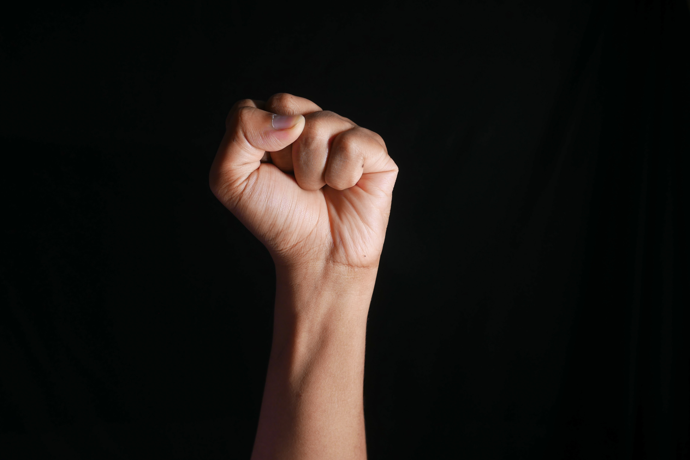

The writer of this particular article would like to inform you that this piece of work is neither a composed essay nor a comprehensive poem. She requests you to leave your shoes with respect at the doorstep as you venture to read ahead, and welcomes you into six particular rooms of her mind. 

Put together as acts, these are six separate glances from 2022 into the revelations and perhaps-too-strong emotions of a girl who finally made it away from home. These are the stories of a girl slowly blossoming into a woman, who found her self-worth, strengths and weaknesses, and most importantly, what it is to be a woman.

**P.S.** the writer is aware of the usage of capital letters but prefers her writing style to be humbled, hoping to reflect it in her lowercase musings.*   *

### **ACT I - LONGING**

i find morsels of it in every conversation and i find traces of it in my cup of over-sweetened coffee and in my bucket as i take a bath away from home and echoing around my ears in people’s laughs / they’re all so sweet and rich and i find a pillow in one laugh and a blanket in another and an arm to cuddle up against in one more and they all sound so perfect and so easy to sink into but i stay awake and birth an insomniac - 

i gently brush back the hair of my inner child / i cradle my feelings like a mother / i adopt them as my own and whether i have the caliber to make this statement, i do not know but i respect single parents more than ever / and i coo to sleep my many undone works and responsibilities, singing them lies of quenching their hunger when they wake up tomorrow and i repeat this on every night / so am i a bad mother if i am simply too crippled to find rations to feed them with - 

but i have it all / i have water, i have food, i have air that occasionally blows a gentle breeze to recreate my mother’s touch, and i have electricity to wake me up when it gets cut off suddenly on a scorching afternoon, and i have people that remind me in bits and pieces of what home’s arms felt like, and i hold onto that and collect those morsels that i find in every conversation.

*\- on recreating a home, from a bedroom to a dorm.   *

### **ACT II - HOPE**

i have visions for myself-  
i see myself vulnerable again, 
loving unapologetically, 
not turning towards bed each time anxiety stabs, 
sitting with my people in the open-air theatre, 
waiting for a frog to jump close enough to fight my fear, 
being able to cry in open arms if need be, 
the kind of sobs that break out to signify 
a renewing rainstorm after a desert drought, 
the kind of tears that  
wash away the blood and sterilise the wound. 

i see the sun breaking out behind the clouds-  
the rain maintains a light drizzle now, 
the walls stay down, 
the laughs ache in a good way, 
i look into someone’s eyes and don’t put up a fight, 
i’m able to smile and hug them warmly, 
and listen to them and make their day, 
the art of making someone happy lies in my palms 
that are holding their face and telling them they’re loved. 

and i’m able to accept the same. 

*\- a simple post-storm fantasy.   *

### **ACT III - SELF-WORTH**

and i'll be out again, i'll come out again, i'll spill it all in words and i'll weave you a tale of times / i'll spin together gold and white and make you wonder if there's blue and black hidden between the lines / and when it hits it will crack your chest open and rip through the flesh and veins till it reaches your heart / and you will wonder whether the panic and pressure settling on your chest is yours or mine. / maybe i've cracked your code, maybe i've written down the things within you / that you fear will be leaked, snatched straight from your hands intertwined in a prayer position / and i will stare straight into your eyes. unblinking. knowing. smiling. / and i will brandish a story so brash and bare you feel your sins being laid out in the open for the eagles to circle around. 

but of course the story's mine, why would i know anything about you?

you knock on my door, you knock on my door and you warn me of eviction / you speak threats of breaking down my humble abode / you curl your lips and look down upon me and prepare your hammer for collision. / i see you look at me and you see the power you believe to hold over me / you recount the things you know about me and how to wield them to break my bones / you make a list of my weaknesses and shortcomings and polish your brash knife of sharp words but how could i blame you when the only destruction you've witnessed me exhibit was toward myself?

every individual fire ignited, every injustice let loose - they’re burning a path up my windpipe / they’re roaring and pulling against their chains / their bared teeth are only a snap away from the throats of the blurry population and what a delicious scent their veins offer / i’m blazing down the meadows where we laughed / the fire is licking my heels / i’m channelling the core of the earth and the magma is heating the bronze of my skin, and oh my goddesses - i feel the rage, i feel Kali awakening within me with a hunger after her endless slumber. / every home has its protector, and they say what you do behind closed doors is between you and the Lord / but i know about every month-old bone you hide in your closet. 

*\- she did not ask to be awakened.   *

### **ACT IV - HEARTBREAK**

it’s anger, 
it’s so much anger and  
for someone who doesn’t really feel anger it feels monstrous -  
it feels like you’re going to yell until you cry and 
it feels like radioactivity and  
every breath you take contains the neutron that’ll set you off and  
maybe the people around you will leave and  
maybe they’ve left and  
you just don’t see it behind those blood-tinted glasses and 
so you tell them every day that you love them just in case and  
you shower them with hugs and 
show them you’re grateful for them 
just in case. 

it feels like living with a family member that’s gone batshit crazy and 
you don’t recognise a thing about them, 
but still, you hold their hand and leave food on their bedside table and 
you try not to cry as you leave the room and 
burst into tears on the couch from where they can’t see you and 
silently mourn how the past seems like a dream that you didn’t deserve to have forever and 
you nurse them back with no hope of full recovery 
but you try; you must. 

it’s seeing the worst side of yourself and 
choosing to stick with it and  
heal it and 
it’s choosing to live with the ugliest version of you, 
knowing you’re putting it out for everyone to see and  
attempting to keep a strong front nevertheless. 

*\- if only it were easier to abandon yourself.   *

### **ACT V - NEW LOVE**

what does it mean 
to have two stars meet? 
the web teaches me two things: 
when slow, the two merge to form a straggler: 
a new, brighter star. 
when fast, they collide to leave behind 
nothing but a cloud of hydrogen gas. 

i can see it happening- 
rushing things, 
hoping we make it on day one, 
fretting over why your face isn’t in my hands yet, 
anger at the world for the stretch and strain, 
until we’re horribly aligned 
and everything is off-axis 
and we dissipate into nothingness- 
and we can’t look at each other  
or sigh in relief at accidental contact 
or watch the bubble in our chests grow as we sit across each other. 

so please, approach me slowly- 
let us dance around each other  
one day at a time 
barely acknowledging but consistently showing up 
one week in, i’ll hear of your name and your hobbies 
a month in, you’ll listen to me complain about the sun on a hot day 
three more in, i’ll smile right above your face wishing i could kiss you 
half a year in, you might have me around all day not more than five feet away 
one year down, we might have our arms around each other 
writing a story for the decades, 
leaving behind light brighter than either of us could produce alone. 

*\- the universe isn’t going anywhere.   *

### **ACT VI - WOMANHOOD**

and to those who mock a woman 
and berate her and misuse her kindness 
and rip away her modesty and shred her of innocence 

a woman shall be your downfall. 

a woman so fearful her shadow shakes your weak heart 
a woman with power that makes you fear for your life 
a woman who screams "death" with every step she takes towards you 
a woman who lets you know that Kali Mata is a man's last sight as he takes his dying breath 

*\- Kali is here, and she shall be paid in blood.   *

### **Author’s note:**

1. If you’ve made it this far, I have much respect for you. I hope you take whatever you’ve picked up from this page with care, and I hope you’re able to interpret it closely to how it was written. The expression of emotion here was as raw and unfiltered as could be, the message being: “You are made up of infinite stories, each one as significant as the previous.”

2. And to my professor who claims to have read some of my general writing on this website- thank you for letting me know. It really gave me the extra push to put this out there and it makes it that much more special.
