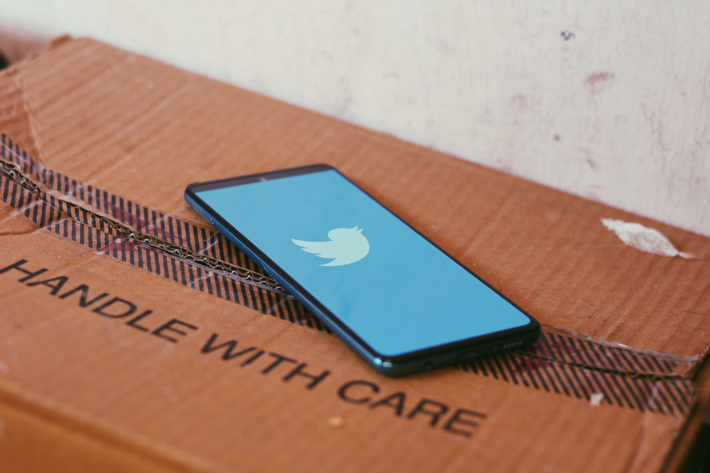

## Table of Contents

* [How would an alien react to seeing Instagram for the first time?](#how-would-an-alien-react-to-seeing-instagram-for-the-first-time)
* [Okay, but what's your point?](#okay-but-whats-your-point)
* [What do you remember, and how much?](#what-do-you-remember-and-how-much)
* [Are we forgetting to read?](#are-we-forgetting-to-read)
* [Would you trust yourself if you were being mentally manipulated?](#would-you-trust-yourself-if-you-were-being-mentally-manipulated)
* [My opinion that no one really asked for](#my-opinion-that-no-one-really-asked-for)
* [Conclusion](#conclusion)
* [References](#references)

> *DISCLAIMER: The following are my personal views and are not affiliated to any other person/entity. I do refer to other sources but note that the inferences I make from them are mine alone. Feel free to disagree with me in your head. Or you could share your frustration with me directly via email at pace577 \[AT] protonmail \[DOT] com. I would love some feedback (especially negative feedback!). Also, I tend to go off on tangents every now and then, but please bear with me and pay attention to these tangents anyways. Otherwise, you might not fully understand what I'm saying and I'll feel a little sad 😢. Thanks!*

If I were to ask you the question, "*What is the biggest problem that our current generation faces?*", what would your answer be? I know you just started reading but pause for a moment. Think about it.

What do you think?

I asked this question to a bunch of people from different age groups and received interesting answers, but they all had one theme in common - social media.

To me, that's very surprising. Why? Because problems are personal things that stem from the unique way in which one perceives the world, which in turn is shaped by one's habits, lifestyle, and circumstances. So, two different people are unlikely to have the same set of problems, and the *biggest problem* is even more unlikely to be similar. But different answers from different people still had the same theme! That made me wonder, does social media affect us all in different ways?

Thinking about that seemed like a fun thought experiment, and the result of that experiment is this article. I hope this article adds value to the way that you view the world and makes you think about new perspectives that I haven't discussed. I also made a lot of references to Instagram (IG), and I hope you understand them to a reasonable extent. Most importantly, I hope you have fun reading this article. Without any more delay, here goes!

## How would an alien react to seeing Instagram for the first time?

Let's go through a cute little scenario. Imagine you're a guy. One fine morning, an alien (let's call her Ali) who looks like a human and knows English knocks at your doorstep. She tells you that she has been sent on a mission to learn more about human society and asks you to assist in her mission. You immediately accept her request (obviously). You ask her to accompany you to the mess for breakfast.

Both of you walk into the mess, and you notice your friend Abhijith watching Instagram reels while having his breakfast. You walk over to him to say hi and introduce Ali to him. But Ali isn't paying attention to you; she's observing something else in the mess she found interesting. After briefly looking around, she turns to you and asks you an unexpected question. *"Why are all these people staring at those tiny things?"*

"What tiny things?" you ask.\
"Those thin boxes everyone has in their hands. What are those things? Why is everyone staring at them intently?"\
"Those are mobile phones. Don't you have them on your planet?"\
"No, we don't. I initially had a hunch that our societies were similar, but I have never seen such strange behaviour! Why are people staring at those boxes?"\
"They are most probably watching Insta reels or Youtube shorts. You want to see them?"\
"Yes, I do! I'm curious to know the reason for this peculiar behaviour."

You realize that you forgot your phone, so you borrow Abhijith's phone to show Ali some Instagram reels. "Check this out, Ali! This optical illusion will blow your mind!" you say and show her the reel. She turns the phone upside down and asks, "I don't understand; what illusion is this? All I see is a man with a microphone singing a song". Upon hearing that, you break into laughter.

"Haha, you have been rickrolled, Ali!"\
"What? I don't understand."\
"That means you have been fooled into thinking you'll find something important in the reel, but there wasn't anything like that."\
"So you find important things in reels?"\
"No, not really&#x2026"

*Both you and Abhijith briefly pause and ponder upon that question while having a subtle life crisis*.

"It's difficult to explain using words, Ali", you say.

"Why don't I create an Instagram account for you so that you can see and understand reels yourself?"\
"Maybe you could follow a bunch of travel bloggers so that she'll get to know more about our world?", suggests Abhijith.\
"That's an awesome idea! But Ali doesn't have a phone of her own. Can she borrow yours for today, Abhijith?", you ask. Abhijith agrees immediately (obviously), following which you create an IG account for Ali and set it up.

After having breakfast in the mess, you tell Ali that you have a class and you'll be back in an hour. "Why don't you stay in my room and check out your new account until then? If you check out the feeds of those travel bloggers I followed using your new IG account, I'm sure you'll learn a lot in very little time."

She agrees, following which you leave for class. You go back to your room after class, and you see Ali glued to the phone.

"Who's staring intently at the box now?", you ask her mockingly.\
"I never knew that such a tool could exist!", exclaims Ali. "This tool shows me reels that I want to watch before I even know that I want to watch them! I can't wait to learn more intelligent life hacks using tissue papers!"  

"I'm glad you like it. But Ali, what about your mission?"\
"Oh, don't you worry! I'll get to that after I watch this hilarious dance video with no background music!"

## Okay, but what's your point?

If you stop thinking about how a girl managed to enter the boys' hostel, you'll notice that a few things present in this thought experiment hold true in real life:

1. We get better at things we regularly do. The average young adult is on social media for about 2 hours a day (<a href="#citeproc_bib_item_1">2022</a>), which implies that the average young adult is *very* good at browsing social media. It also implies that you, dear reader, are probably an expert at staring at screens.
2. Habits shape our lifestyle, and social media has managed to enter our lifestyle by intruding into our daily routine. A habit consists of three things - a trigger, a response, and a reward. To all those students in the Mess scrolling through social media, the trigger was sitting down at a table with their breakfast, and the response was unlocking their phone and pressing the icon of their favourite application. And the reward? A gentle but continuous flow of dopamine hits!
3. Social media can distract us from our goals because they are capable of changing our *mental state*. State at a particular time plays an important role in determining your actions at that time; you somehow manage to get all your stuff done on your "good" days but barely seem to get anything done on your "bad" days, don't you? I don't think any of us fully understands how to control our mental state, but Instagram can manipulate it in a certain direction with a very high probability of success: it makes you want to watch the next post. It's not that difficult to continue the previous thought experiment and eventually see Ali thinking, "Why did I start watching this again?"

You might have thought all about the things I mentioned above, but what about the following?

*Have you ever wondered if our time on social media is affecting our memories?*

There are two interpretations for the above question, one concerning the memories that we make and one concerning our ability to recollect things. I believe the answers to both these interpretations, coming from my general observations and some research studies, aren't very pleasing.

A study (<a href="#citeproc_bib_item_4">Tamir et al. 2018</a>) observed that those who haven't recorded and shared their experiences seemed to remember the experience more clearly than those who did. The practice of taking pictures and sharing them on social media has been blown out of proportion after smartphones with powerful cameras became accessible to the general public. Next time you look at that splendid sunkissed selfie from your previous trip, try recollecting your experiences on the day you took that selfie. How much of it do you remember?

## What do you remember, and how much?

Another consequence of excessive use of social media is the reduction of your attention span (<a href="#citeproc_bib_item_2">Fotuhi 2020</a>). We watch short videos that are 10-15 seconds long on average, one after another, each containing different content but more or less equally appealing to us. Anyone who watched *[The Social Dilemma](https://www.thesocialdilemma.com/the-film/)* would be aware of the addictive nature of social media. However, have you wondered how it affects your knowledge and your ability to reason?

Be it Instagram, Facebook, or Twitter, information on these platforms is shared in *pieces*. By scrolling/swiping through this information, you acquire a high volume of bits and pieces of information. Most of the time, these pieces of information are only *shown once*. What's the consequence of that?

You forget what you saw.

Tell me, do you remember all the reels you watched yesterday? Do you remember at least five of them properly? Maybe you remember bits of them, but most likely, you don't remember them well. But I'll tell you what you do remember well.

*What colour is the sky?* (What comes next? Feel free to sing along!)

That's because that particular song has been used in a variety of reels. You have heard it over and over again, and not just for a day or two. You heard it for weeks. Spaced repetition enables good retention of whatever you have learned, and IG uses that to make you memorize that piece of music. Once you have memorized it, you are practically guaranteed to like any reel made with that music because it comforts you to hear something familiar while the new content in the reel makes you simultaneously curious. I wonder, would we be addicted to quantum mechanics if these techniques were used to teach us?

But what scares me the most in this context is misinformation and disinformation. The definitions are subtly different. Misinformation refers to all kinds of false information, while disinformation refers to false information that is intentionally spread. It's not always simple to know the intention behind false information, but that's not the point of focus here.

*Given that we retain only bits of what we see on social media, will we be able to remember which information is false and which isn't?* In other words, could it so happen that we read about something and eventually learn that it's fake news but later forget that it's fake news and end up trusting it?

Adding to this problem are the eye-catching titles manufactured by the media that fail to properly summarize the full story. What if we remember the title of a news piece but forget the brunt of the matter? That is as good as reading false news!

The absence of the widespread practice of fact-checking is yet another problem; people tend to believe everything they see on the internet if they believe that it's true. This had already paved the way for the emergence of brilliant scholars from the esteemed WhatsApp university and is continuing to do so.

What could be possible solutions for these issues?

## Are we forgetting to read?

My point was that you obtain pieces of information from social media, many of which you don't remember well. But I wonder, does this affect our desire to learn from larger sources of information? Among students, there is a growing trend of watching videos instead of reading books to learn something. Could that be because videos contain more sensory information than books to engage a consumer? But that wouldn't explain why people prefer shorter videos over longer ones. Is that because people want quick resolutions to their problems? Or is it because peoples' brains aren't able to patiently wait for the information in the longer video because their brains have been rewired to crave short bits of satisfying content? Could that be the reason why we students watch videos at 2x speed, even though we sometimes understand *nothing*?

Let me tell you something that's obvious to book readers that isn't obvious to others - information in books is well connected. When it comes to academic textbooks, most of them are self-contained and also contain additional information that helps the reader understand the topic better. A Python tutorial on Decorators might teach you about what decorators are and how to use them, but an introductory Python book will also explain the concept, tell you how it works under the hood and what is considered good practice.

In that sense, I consider books to be better sources of information than other alternatives. Yet, I find myself searching for good videos online whenever I need to learn something! If social media is changing the preferred way we learn things, could it be indirectly causing *holes* in our understanding due to our new beloved piecewise manner of understanding the world?

I'm not claiming anything, dear reader, I'm just thinking about things 🤷‍♂️ .

## Would you trust yourself if you were being mentally manipulated?

For some reason, lots of strange thoughts come to me when I see people staring at phones, and here's one. When people are glued to screens, staring at content made by other people, *aren't they so generously offering their time to be manipulated by people online*?

Maybe I didn't say it right; let me phrase it in another way. You have 24 hours in a day, and most of it is used up by sleeping, eating, and going to class. Whatever your schedule is, you will have some leisure time in a day, during which you engage in your favourite pastime activity. Let's say you have two options to choose from: stare at social media or do nothing.

So which one would you pick? Stick to the phone or stay alone? You might say, "phone, duh!", but it's not that simple, dear reader. Because today, even if you open your phone to do something, it's highly likely that you'll be presented with something that you never intended to do in the first place. Notifications from various apps distract you, each talking to you in its own tone. You open a YouTube video, but you are shown 2-3 advertisements before you get to the video. You open WhatsApp and get bombarded by a million messages from a million groups, and after replying to 23 unread messages, you wonder, "What exactly did I want to do here?". You open IG, and you see a reel, and then what do you do? You swipe up, connecting your mouth to the pipe from a perpetual food-making machine that instantly makes you content but never fills your stomach.

But I want to focus on the bulk of the junk today - advertisements. And boy, such incredibly innovative forms, they assume! Before we get to advertisements on social media, why don't we pause and take a moment to appreciate this engineering marvel?

Oh, are you wondering why I called it an engineering marvel? Because an advertisement is engineered to tamper with your head, of course!

I stumbled upon this wonderful article (<a href="#citeproc_bib_item_3">Hallam 2022</a>) in which the author talks about the two basic routes to persuasion - the central route and the peripheral route. The central route is associated with using logic for persuasion, while the peripheral route is associated with stimulating the senses with superficial cues. Do you remember all those teleshopping ads that painstakingly explain how you can fold a table in 196 different ways and how it can be useful in 9728 different ways? Those ads decided to take the central route to persuasion. Maybe they work, maybe they don't. But ask yourself, what is the first thing that comes to mind when a tiny girl runs to a lady, calling her "Mummy!"? That, dear reader, is an example of an advertisement that took the peripheral route. If only Calculus material also took that route, you probably wouldn't have the grade that you have now, huh?

It's not hard to realize that nearly every advertisement we see today takes the peripheral route to persuasion. These advertisements, in general, might not be very convincing, but they leave an impression that affects us at a later time. However, ads on the internet take it to the next level - personalization. These ads don't only look good; they might also be relevant for you. You are more likely to watch more random ads on Instagram than in the newspaper.

Some people like personalisation and some people don't, but that's not the point I'm trying to make here. Do you realize that you are spending a *significant amount of time* looking at advertisements that you never really asked for?

It's not just advertisements. There are people creating content and distributing it on the internet, and there are millions of people viewing that content. This content consists of memes, dance videos, cat videos, life advice, clips from movies/series, and of course, sponsored advertisements. They say "time is money", and I believe they are right. In this case, however, it's your time and their money.

## My opinion that no one really asked for

After all this, you might be surprised to read my following statement, but I assure you that it is true. I am not against social media, I love it. It has created many opportunities for people to socialize, discuss social issues, form communities, express themselves, and even make a living! However, I am against the irresponsible use of it, be it by content creators or consumers or advertisers or firms owning the platforms. I believe that consumers should be critical of the content they are viewing, and content creators must be responsible when making content, especially popular ones. Having influence over what people see doesn't mean you show them whatever you want.

However, the world wasn't that responsible, to begin with, and that had consequences in the form of a whole bunch of false beliefs. While we're on that topic, why don't we bust some myths about social media right now?

* Success in life doesn't mean making as much money as you can.
* Working hard is good, but you don't have to work hard 24*7 to be successful. You've got one life; try to stay healthy!
* In real life, people don't always look like how they look on IG.
* Waking up a 4 AM will not help you become rich, especially if you slept at 1 AM in the first place.
* Not all confessions on the confessions page are real.
* There aren't exactly three people you love in your life. Ask your single friend for proof.
* Everything wrong with your life is *not* a trauma response.

There are many more myths out there to bust! If you're a web developer and you want to take up a hobby project but don't have an idea, please create a website on myth-busting Instagram stereotypes. Alternatively, you could try your luck creating an IG page for that and become the next big influencer!

## Conclusion

Technology and social media have significantly changed the way we perceive the world around us, and it continues to do so in ways we don't fully understand. That's precisely the reason why it's so important to try and understand whatever we can about it, and the first milestone on the journey to enlightenment is to ask questions.

With that said, happy pondering!

## References
- [Average Daily Time Spent on Social Media.](https://www.broadbandsearch.net/blog/average-daily-time-on-social-media)
- [What Social Media Does to Your Brain.](https://neurogrow.com/what-social-media-does-to-your-brain)
- [The Effects of Advertising on the Human Brain.](https://owlcation.com/social-sciences/The-Effects-of-Advertising-on-the-Human-Brain)      
- [Journal of Experimental Social Psychology](//doi.org/10.1016/j.jesp.2018.01.006)