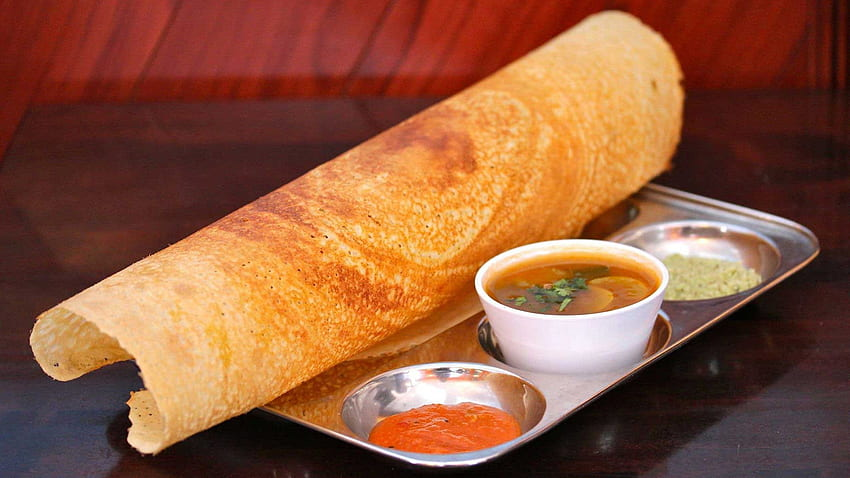

<!--StartFragment-->

You missed breakfast.

You missed lunch.

You missed snacks. (Onion Bhaji or Jeera Maggi! What else do they serve?)

You even missed dinner.

The only option is the 11 pm Maggi in South Campus. Ah! Who has the energy to make the trek?

So, Upvas today as well??

Not really.

We have a competitor on campus. A new untapped food source  – AA Cafe, or Akkula's Arena that has an entire floor assigned right atop the North Mess. It boasts a meter-long food menu and a surprisingly non-existent waiting queue. 

Sounds tasty enough?

Udaan's eagle-eyed editors have dished out a review. And here’s if you should or should not miss this Tuesday’s dinner at the mess.

AA Cafe opens its doors from 8 am to 11 pm, offering a decent ambience. There’s a big screen arranged to gather the masses on special occasions (cough.. cough.. sports). On these eventful days, special offers and combos might just be the motivation your gang needs to choose AA Cafe for your culinary escapade.

We don't want to keep you hanging like waiting for your token number at the food court. So, let's dive into some student reviews of the items we've checked out – with a touch of Udaan snark, as always.

- - -

### Masala Dosa

The masala dosa served by AA is considered one of the most affordable items on the menu as it offers high quality and quantity for the price of peanuts. The dosa-chutney combo is always GoATed, and this one has lived up to that mark (or has it?). The potatoes they put in there feel just right… right, like a lump of coal. When asked, a student said the Masala Dosa’s flavour reminded him of home (trying to get into the Udaan page with sentiments, of course :) ).

- - -

### Karam Dosa

The karam dosa served by AA instead seems to be a bit inconsistent with what it should be. Some claim the dosa to be too spicy, and some claim it to be completely tolerable. Or maybe it's dependent on the taste buds of the individual. Nevertheless, it seems like the chefs are too particular about their dosas because they aren’t playing when it comes to them. 

- - -

### Egg Dosa

Let's conclude our exploration of dosa varieties with this peculiar one – an unholy fusion of dosa and a semi-cooked omelette concocted by some eccentric food scientist.  The egg dosa served here is soft rather than crunchy, like one would expect it to be. This supposedly gets some through Saturdays (when they can’t eat non-veg), but isn’t egg non-vegetarian? Or is it not?

- - -

### Meals/Mini Meals

Presenting a platter featuring pickle, three curry variants, and crisps to complement rice. The veg thali, seemingly underrated, is adequately portioned for an individual. Despite its potential, the taste occasionally falls flat, veering towards blandness. In contrast, mini meals aren't merely scaled-down versions of full meals; they include sambar, flavored rice, and curd rice. The swift service for both options makes them a convenient choice for those on the go. Why not give these a try?

- - -

### Vegetable Biriyani

To describe this, simply describe it as rice steamed with veggies and spices. It is a very controversial dish since some claim it should be called pulao rather than biryani. What makes a biryani to be called a biryani? Coming to the one served by AA, one should accept that it is indeed pathetic for the standards it was being served. People claim it to be a mix of raw rice with some veggies. There is nothing in it; no mushroom or paneer to make it proper biriyani. Also, steamed rice + veggies is NOT equal to veg-biryani.

- - -

### Paneer Fried Rice

Hailed as one of the vegetarian favourites this dish is a part of Indo-Chinese cuisine, drawing inheritance from both countries. It is (supposed to be) basmati rice cooked with chunks of paneer and pepper. Starting off, why not describe how dry the fried rice looks? AA, we know that fried rice is supposed to be dry, but not as dry as the goddamn SAHARA. This is the most hated item for obvious reasons. People claim it requires immense patience and a sea of gravy to finish the dish. Also, the service is so prolonged for this item that it's not worth the wait. It tastes more like plain white rice with paneer.

- - -

### Chicken Fried Rice

Behold the Chinese twist on the renowned biryani, surprisingly winning hearts globally with its delicious allure. Despite its seemingly bland profile due to a shortage of seasonings (rumour has it, AA might be a bit frugal on spice shopping), it has won over taste buds, especially when paired with the accompanying gravy. Many claim that the price-to-quantity ratio is good enough. However, AA never misses a chance to troll us because there were instances of unexpected paneer pieces sneaking into the fried rice. Come on, AA, does this seem fair to you?

- - -

### Chicken noodles

Enter the realm of chicken noodles—often labelled as a guilty pleasure due to the apparent health effects it can cause. Despite concerns, this dish, commonly paired with starters, is a sheer delight to savour. A student, channelling their inner South Indian actor 'Vijay,' declared it as "vera level, vera level." This dish earns its stripes as a budget-friendly option thanks to an impressive price-to-quantity ratio.

- - -

### Paneer Butter Masala

The paneer butter masala served by AA emerges as their champion and lifesaver. Some claim it to be a celestial matter that defies description. Still, we, the writers at Udaan, like to do the impossible as we dive into this review. Proclaimed by many as a bang for your buck, the generous portion for the modest price of 75 is said to easily satisfy two individuals and is just perfect to be paired with four naans. AA should have sent the chef of this recipe to the Masterchef as he wouldn’t have returned crying. The tenderness of the paneer and how it infuses the gravy create an epicurean symphony. 

> AA:” All these bad ratings and not-so-great tastes, what do I do?
>
> PBM:”I got you homie!!”

- - -

### Butter Chicken Masala

Enter the illustrious Butter Chicken Masala, a creation hailing from the western ghats, also known as 'Murgh Makhani.' This sweet and sour gravy, accompanied by delectable meat, has garnered quite a reputation. While some enthusiasts argue that AA's rendition surpasses even the acclaimed 'paneer butter masala,' dissenting voices maintain that it falls short of expectations, labelling it as overpriced. The verdict remains divided, with the butter chicken masala struggling to outshine its vegetarian counterpart in the culinary arena.

- - -

### Chicken Biryani

The world-famous biryani doesn't require any description. It was born in the kitchens of the Nizams and Mughals. This self-entitled dish is considered the GOAT of food by some people. But, boy, is the catering time for this is extremely slow. It generally isn’t seasoned properly, nor is it a cheap item - AA didn’t put enough effort into satisfying the customers. 

- - -

### Special Chicken Biryani

Generally known as “Biryani on roids”, this famous item was invented in the back lanes of the city of Charminar. It is a flavorful dish packed with spices, chunks of boneless chicken, and basmati rice. The spl chicken biryani served by AA has the same problem as its ‘non-special’ counterpart - literally, who ruins biryani by making it too sweet? It is too overpriced for its taste and quantity.

Also, if you want to spend a lot and not enjoy anything, maybe you should give it a try.

‘Biryani on roids.’ (more like ‘Biryani on health support’) 

- - -

### Mutton Biryani

This dish is a bowl of paradise filled with soft and tender pieces of meat with caramelised onions, which packs a flavour bomb. The mutton biryani served by AA has a unique taste, unlike those you find elsewhere, but somehow it still tastes nice. It is one of the best dishes on their menu as people prefer to spend on this delicacy, despite it being overpriced, just like the other biryanis.

- - -

### Chicken Popcorn:

Named for its resemblance to popcorn, this delectable dish features boneless meat fried to perfection in rich oil and generously seasoned with a delightful blend of Italian herbs. A true taste sensation, it has the power to captivate your palate with just one bite. Affordable and designed for sharing, this dish is a great choice for friends looking to enjoy a flavorful experience together. Renowned for its swift service, this item is readily available for those seeking a quick and satisfying meal.  The meat, incredibly tender and soft, rivals the perfection of well-cooked paneer. What sets it apart is the infusion of Italian seasoning, providing a fresh and zesty kick that elevates it beyond the ordinary salt and pepper fare.

- - -

### Pizza

Lo and behold, the Pizza a beloved Italian dish consisting of a thin, round crust topped with tomato sauce, cheese, and various toppings. Its versatile and customisable nature has made it a global favourite. It seems like AA might lack the equipment to bake a pizza. Because people claim that it is like eating an expensive hard roti - Who would wanna pay that much money to get a roti? Apparently, we folks at IIT Tirupati. The reason, ofcourse, is due to the lack of better alternatives. The alleged inability to bake it properly results in an unfortunate outcome: burnt edges that significantly detract from its taste. The veggies are raw. All in all, it’d be criminal to call what they give as pizza.

- - -

### Pani Puri

Well! Do we even have to describe this item? Who can’t get the image of Golgappa on hearing its name? Yum. Opinions, however, diverge when it comes to this beloved Indian snack. Detractors argue that the use of cold water in preparing the pani disrupts the experience, while enthusiasts praise its delightful taste, especially the well-balanced sweet pani. The generous provision of both the spicy and sweet-tangy versions, enough to fill each puri to the brim, earns commendation. A potential enhancement could be the addition of chickpeas to the stuffing. All in all, this seems like a nice option to try with your friends.

- - -

### Samosa Chat

A savoury snack item featuring a delightful blend of onions, tomatoes, and fresh cilantro with the main attraction, samosa is one of the popular variants of the OG chat items. And easily, this can be your go-to snack item if you are going to AA for your evening. Although a bit overpriced, the taste is pretty good. The quantity is more than what you would expect. Occasionally (if all stars align in your favour), it might as well be a  simple chole curry, and you will be on a quest to find where the elusive samosa pieces are.  

- - -

### Conclusion

In the face of a growing campus, the demand for new infrastructure and resources is inevitable. For students, access to high-quality and diverse food options often ranks among their top priorities and rightfully so. Now, whether the food court managed by AA lives up to the expectations and fulfils the culinary desires of students is a question we won't dive into here; we'll trust you, dear readers, to make that judgment.

If, however, you were to casually approach someone on campus and ask about their preferred dining spot, what kind of response would you expect? Is it the (not) bustling food court, the (questionable) cosy canteen in the south campus, the ever-debated mess (a choice with its own uncertainties, of course), or perhaps the vibrant (only) dhaba situated just outside the south gate?

<!--EndFragment-->