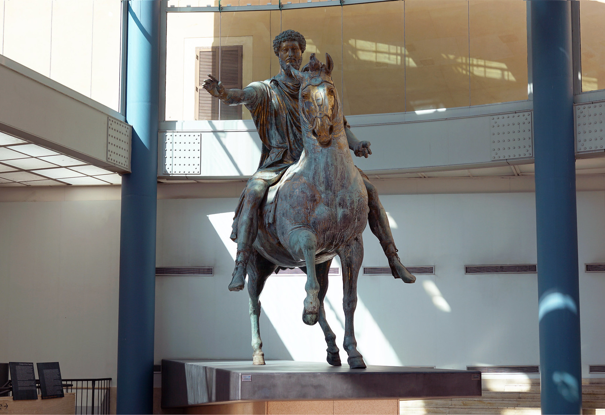

<!--StartFragment-->

Imagine possessing absolute power, the authority to shape the world as you see fit. Marcus Aurelius basically had that power. He was technically the most powerful man during his reign, as the Romans had no concept of the world outside their empire. He was unbound by money, law, custom, or ethics. Yet, amidst such unparalleled authority, Aurelius chose a path divergent from conventional authority. He chose to be a Man of Virtue even with all this power. The tale of Marcus Aurelius is one of paradoxical power and profound humility.

I know you are probably thinking, How can a person with such great power be a good person throughout his life? What reasoning do you have to prove it? Is the philosophy he pioneered still applicable?  

Known to be one of **Rome’s Five Good Emperors**, Marcus Aurelius was born on 26 April 121 AD to Marcus Annius Verus and Domitia Calvilla. His father died when he was three years old. It is speculated that then-emperor Hadrian saw the potential in Marcus and wanted to make him the emperor of Rome. In 161 AD, at the age of 40, Marcus Aurelius was made the emperor. His ascension to the throne ushered in a period of unprecedented challenges, including protracted wars and the devastating Antonine Plague. In response to the economic crisis, increasing from the war and the plague, Marcus took all the imperial ornaments and sold them for gold. He exemplified a rare blend of strength and compassion despite experiencing the loss of his nine children preceding his own passing. He chose virtue not for the sake of fame or admiration but just for the sake of being good. 

How did he not take the path of his predecessors, such as Nero, Vespasian, and Domitian? How did he not succumb to the allure of absolute authority? How did he handle all situations with a keen sense of moral integrity? It can all be explained by one thing: his **Stoic Philosophy**. 

He wrote notes to himself, something akin to present-day journaling, which is now published as **Meditations**. Meditations was never intended to be read by any person aside from Marcus himself. This book is just Marcus navigating through his life, where he grappled with the existential questions that plagued his soul. Through the lens of Stoicism, he found clarity and purpose, embracing the inevitability of mortality and the transient nature of worldly pursuits. His writings, penned in the ancient language of Greek, resonate with timeless wisdom, Through Meditations, he was preparing for the next day, clearing his mind, keeping his ego in check, and reminding himself of what was important.  

> At dawn, when you have trouble getting out of bed, tell yourself: “I have to go to work—as a human being. What do I have to complain of, if I’m going to do what I was born for—the things I was brought into the world to do? Or is this what I was created for? To huddle under the blankets and stay warm? —But it’s nicer here. . . . So you were born to feel “nice”? Instead of doing things and experiencing them? Don’t you see the plants, the birds, the ants and spiders and bees going about their individual tasks, putting the world in order, as best they can? And you’re not willing to do your job as a human being? Why aren’t you running to do what your nature demands? —But we have to sleep sometime. . . . Agreed. But nature set a limit on that—as it did on eating and drinking. And you’re over the limit. You’ve had more than enough of that. But not of working. There you’re still below your quota. You don’t love yourself enough. Or you’d love your nature too, and what it demands of you. People who love what they do wear themselves down doing it, they even forget to wash or eat. Do you have less respect for your own nature than the engraver does for engraving, the dancer for the dance, the miser for money or the social climber for status? When they’re really possessed by what they do, they’d rather stop eating and sleeping than give up practicing their arts. Is helping others less valuable to you? Not worth your effort? 
>
> (Extract from Meditations 5.1, Gregory Hays translation)

Is the aforementioned problem relatable? How is it possible that Marcus Aurelius, a figure worshipped like a god by the Romans, commanding the largest army in the world, and possessing boundless wealth and power, struggled with a common human experience like getting out of bed? This paradox underscores the fundamental truth that humans share everyday struggles and vulnerabilities regardless of their status or achievements. Humans are humans. 

The one main recurring theme in this book is the sense of mortality. The concept is called Memento Mori, meaning Remember you must Die. In ancient times, when a Roman emperor marched through the streets of Rome in triumph, a slave was appointed to walk behind him and very often whisper in his ear, Memento Homo, meaning Remember you are only a Man. It feels absurd, doesn’t it? When the whole kingdom celebrates you when you are at such great height, reminding yourself about Death? This practice is done so that they don’t feel too highly about themselves after success. An ancient Ego-check process, we could say. 

> We must remind ourselves of Memento Mori, both in success and failure. This practice prevents us from getting too carried away with success and helps us realize that failure is a minor setback not worth dwelling on. 
>
> Remember how long you’ve been putting this off, how many extensions the gods gave you, and you didn’t use them. At some point you have to recognize what world it is that you belong to; what power rules it and from what source you spring; that there is a limit to the time assigned you, and if you don’t use it to free yourself it will be gone and will never return.
>
> (Extract from Meditations 2.4, Gregory Hays translation)
>
> You could leave life right now. Let that determine what you do and say and think.
>
> (Extract from Meditations 2.11, Gregory Hays translation)
>
> To be like the rock that the waves keep crashing over. It stands unmoved and the raging of the sea falls still around it.
>
> (Extract from Meditations 4.49, Gregory Hays translation)
>
> When you wake up in the morning, tell yourself: The people I deal with today will be meddling, ungrateful, arrogant, dishonest, jealous, and surly. They are like this because they can’t tell good from evil. But I have seen the beauty of good, and the ugliness of evil, and have recognized that the wrongdoer has a nature related to my own—not of the same blood or birth, but the same mind, and possessing a share of the divine. And so none of them can hurt me. No one can implicate me in ugliness. Nor can I feel angry at my relative, or hate him. We were born to work together like feet, hands, and eyes, like the two rows of teeth, upper and lower. To obstruct each other is unnatural. To feel anger at someone, to turn your back on him: these are obstructions.
>
> (Extract from Meditations 2.1, Gregory Hays translation)
>
>  Think of yourself as dead. You have lived your life. Now take what’s left and live it properly.
>
> (Extract from Meditations 7.56, Gregory Hays translation)

In 180 AD, Marcus Aurelius fell gravely ill, acutely aware that his time on this earth was drawing to a close. Sensing the urgency of the situation, he entrusted his five most trusted friends with the solemn task of planning for the future of the empire. However, grief-stricken by the impending loss of their beloved emperor, these advisors found themselves unable to fully focus on the weighty responsibilities entrusted to them. And so, on March 17th, 180 AD, Marcus Aurelius passed away, leaving behind a profound legacy that continues to echo through the annals of history.

But what legacy did Marcus Aurelius leave behind? Why should we remember him? He pondered the significance of fame, questioning why it mattered when, ultimately, everyone would confront the inevitability of death. He urged embracing the present moment and discovering joy in life's simple pleasures. This was Marcus Aurelius and the enduring essence he left behind.

In recognition of his extraordinary contributions to the realm, Marcus was posthumously honoured with the creation of a magnificent bronze statue. This statue depicted him atop a majestic horse, immortalising a moment of triumph on the battlefield as he addressed his soldiers with unwavering resolve and steadfast leadership.

Marcus Aurelius’s enduring legacy as a philosopher-king continues to inspire generations with his profound insights into leadership, virtue, and the human condition. Through his timeless writing, he imparts invaluable lessons on resilience, integrity, and the pursuit of wisdom. Marcus Aurelius reminds us that true greatness lies not in the accumulation of wealth or fame but in the cultivation of a noble character and a steadfast commitment to moral principles. Let us heed his timeless wisdom and strive to emulate his example in our lives.

<!--EndFragment-->