<!--StartFragment-->

As we bid farewell to another cohort of student representatives at IIT Tirupati, it's time to reflect on the impact they've had and the memories they've created during their tenure. With the elections just around the corner, it's the perfect moment to pause and ponder: do you truly want to step into their shoes?

To our outgoing representatives, we extend our heartfelt thanks for their dedication, perseverance, and, let's be honest, their ability to navigate the chaos with a smile (most of the time). From budget battles to late-night meetings, from managing intercollegiate competitions to overseeing campus events, and ofcourse cancelling Tirutsava, they've done it all – and then some.

So, to those of you considering throwing your hat into the ring, take heed: leadership is not for the faint of heart. It requires courage, resilience, and a willingness to embrace the unknown. Before you decide whether you truly want to apply, take some time to reflect on the experiences of those who came before you – the triumphs, the setbacks, and everything in between.

And to our outgoing representatives, we offer our sincerest gratitude for their service. You may be stepping down from your roles, but your legacy (The good, bad and the ugly) will live on in the hearts and minds of your fellow students.

- - -

### Secretaries

<b>Rudransh</b>

 

*Students General Secretary*

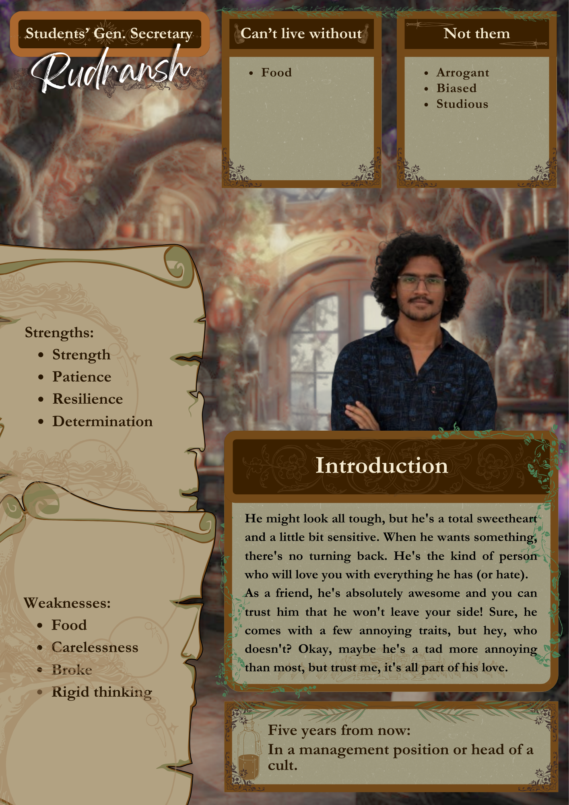

**Let’s take a look at what the student community has to say about them:**

> If I had to sum up his term in one phrase, it would be a series of blunders. It all started with a promising initiative to garner full campus support - particularly with the mess price reduction (which, in my opinion, could have been handled in a less explosive manner). But somewhere along the way, things took a turn for the worse. What began as a well-intentioned effort gradually spiralled into a series of explosive actions, one after another.                                       
>
> This whole ordeal serves as a textbook example of the harsh reality that the masses won't always support you. It's a tough pill to swallow, but it's true. And when things hit the fan, you often find yourself standing alone, realising that your own hands dug the ditch you're in. And let's be real; thinking you're always right is not really a good way to go. Sometimes, it's better to step back and reprioritise than trying to micromanage everything.                              
>\- *Sneha M S*
>
> We did not meet frequently as a General Student Council; in fact, we only convened once. He could have been a better leader, but he was very indecisive and insistent on implementing his ideas regardless of opposition. He was also quite persuasive and manipulative. As his term progressed, meetings became scarce, and the council disbanded on its own. However, earlier in his tenure, he did succeed in reducing the mess prices. At that point, I felt positive about working with him, but as time went on, that feeling gradually dissipated. Additionally, our mess quality also seemed to decline.                     
>
>\- *Divyanshu Dwivedi*

- - -

**After 4 weeks of constant pestering, we consider ourselves lucky to share with you the responses from their dearest homies, on what Mr. Secretary taught them:**

> Patience and resilience.                                                    
>\- *Raparthi Sai Harshith*                
>
> Don’t take anything too seriously. Just say “chalta hai” and move on.                                 
>\- *Tushar U*                 
>
> You can fail upwards in real life and not only in the movies.                                    
>\- *Sirish Sekhar*                                   
>                  
> NEVER GIVE UP on something which you badly want.             
>\- *Shreya Tumma*                      

- - -

<b>Gopi Krishna</b>

 

*Academic Affairs Secretary*

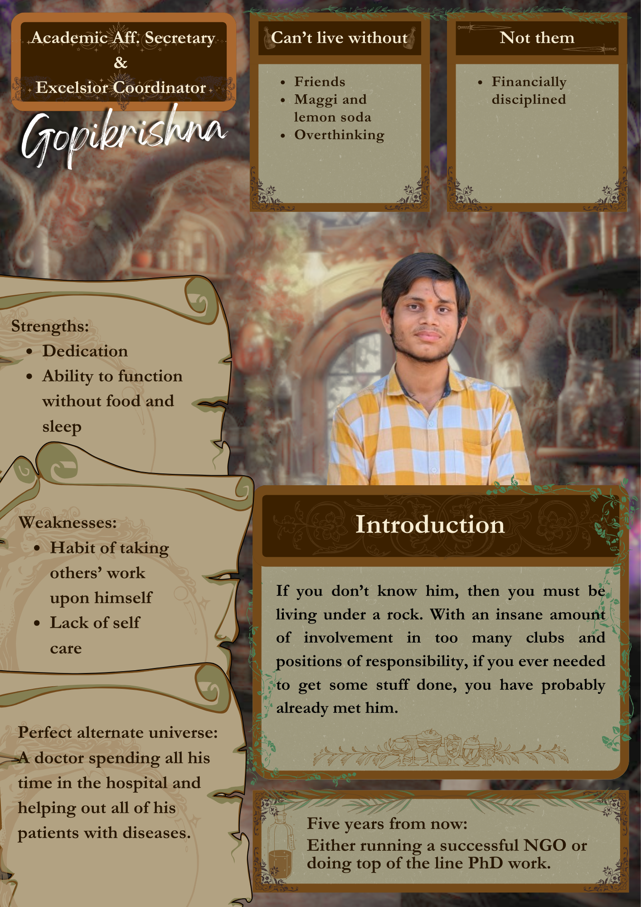

 

**How would you describe your tenure looking back at it now?**

I don't see much happening during my overall tenure. All the new initiatives still need to be approved in meetings. From supplementary examinations to maintaining 75% attendance, all of them must be adequately reviewed and approved by the faculties. Currently, I am trying for PAL, supplementary examinations, and 75% attendance, which will be discussed in the upcoming meetings. If not, then the forthcoming secretary should work on this. They agreed to a 6-month internship for 2022 batch students, and I still need to check whether they will implement it. Minors will also start in the upcoming academic year. We started a policy club this academic year, which should have been initiated in the previous academic year. Credit for finally getting it started goes to Dheeraj, Ratna Shree, and the MPP students. Faculty advisors need to assist the students correctly, and I submitted a clear report on this matter to the Dean, sir. Library timings got extended, and for that, I want to thank the Library Advisory Committee and the staff. There were many other things that happened in this academic year, and most of them were not because of me. I was not a good Academic Affairs Secretary. There are still many pending tasks that need to be completed as soon as possible.                 

During my tenure, the curriculum was changed, and the credit for that goes to the previous Academic Affairs Secretary (Dheeraj) because he had constantly asked the faculties about it.

- - -

**Humour us with some of the mistakes you’ve made during it.**

I sent a mail to the Academic Advisor - Courses regarding some issues. In the subject of that email, instead of writing Reg. (means regarding), I wrote Rey. It is a Telugu word for addressing people (not in a formal manner).

- - -

**As tradition goes, one will soon take your place. What advice would you give them?**

I need to learn how to present things, think from different perspectives and communicate with the faculties to get things done. If these qualities were there, the results would have been much faster. The academic staff and CRs can take care of the remaining work. One should know the art of making others agree by providing all the necessary information.

- - -

**Ever fancy yourself being another secretary?**

I would then want to become the Mess Affairs Secretary instead of an Academic Affairs Secretary. I want to become the Mess Affairs Secretary to work accordingly and decrease the food wastage. I want to work with the Mess people in maintaining the mess properly for hygiene, etc

- - -

**Let’s take a look at what the student community has to say about him:**

> Gopi Krishna gives equal attention to every request or query, no matter how trivial it may sound. Despite being involved in so many activities, he has always patiently listened and resolved several queries and requests. He is always reachable and quite approachable too. He is a fair leader and has, on several occasions, managed entire events single-handedly. He doesn't like conflict and finds it better to let things pass over rather than confront them. I feel he should take a stand no matter what other team members might feel.                
>
> Once during EPICS Mobile Science Lab - NSS activities, he helped me out with procuring stuff from AB2 even though he could have easily asked someone else to do it. He is quite helpful and mostly knows whom to call to get stuff done. (If he doesn't, he makes an effort to fix it nonetheless).                              
>
> I think he did a fairly good job in starting up the Excelsior club despite the lukewarm response. He has been quite visible and approachable on campus, which is a major plus point. The interesting part is that he sometimes shies away from taking credit and confronting nasty situations. I think he has somewhere made peace with the fact that no matter what you do, participation isn't going to be great. Despite that, he makes an effort to improve things.                               
> \- *Chaitali Karekar*
> 
> Gopi, I'd say, epitomises the ideal AAS. He consistently goes above and beyond the call of duty, ensuring that everything runs smoothly, regardless of whether it falls under his official responsibilities or not. Acting as the middleman, he has greatly facilitated communication between the academic section, CRs, and students, making the entire process much smoother.               
>
> Moreover, Gopi is a genuine human being through and through. He possesses a humble demeanor, often shying away from taking credit for his contributions despite deserving every bit of recognition. I am a hundred percent confident he has undersold himself while speaking about his tenure. A prime example of his dedication is evident in the success of the Higher Education Club. Today, the club operates like a well-oiled machine, hosting regular sessions that are both interactive and informative.             
>                     
> Alongside his close-knit group of friends, Gopi has made significant contributions to various aspects of campus life. From small gestures to grand initiatives, their collective efforts have left a lasting impact.                          
>\- *Sneha M S*
> 
> It was really nice. Got to know more about him and, in particular, the sense of accountability. Even for things he is not responsible for, he feels accountable, and I don't know why. Maybe he will give me a nice answer after reading this (and I am looking forward to it). A major accomplishment would be the setting up of the Excelsior Club (a one-of-a-kind club). Everything was quite unorganised previously (related to higher studies), but now, because of the club, things have started becoming organised, and a lot of people have benefited from the various sessions conducted. One always finds him doing things that are irrelevant to him most of the time. He could have concentrated on his personal life as well rather than wholly on his professional life.                                      
>\- *Arimanda Bhavan Reddy*

***********************

**After 4 weeks of constant pestering, we consider ourselves lucky to share with you the responses from their dearest homies, on what Mr. Secretary taught them:**

> How dedicated you should be if you take up any responsibility and if anyone is in need, you should try to help them as much as you can.                   
>\-*Gullipalli Neelima*
> 
> Seeing the efforts, he made me realise how important it is to have a person like him in every group/gang who motivates and helps others in every aspect (although sometimes it's not good). He is a very good person who never thinks of doing bad to anyone and this pays off in the long run.                       
>\- *Sivakoti Ram Mohith*
>
> He dares to stand up for things when they are wrong and to argue on the students' side with logical and valid reasons and takes up the responsibility even when no one is watching or questioning him. He is always trying to make something better.                                                                 
>\- *Penumarthi Ramya Krishna Chandini*

- - -

<b>Charan Pullasi</b>

 

*Cultural Affairs Secretary*

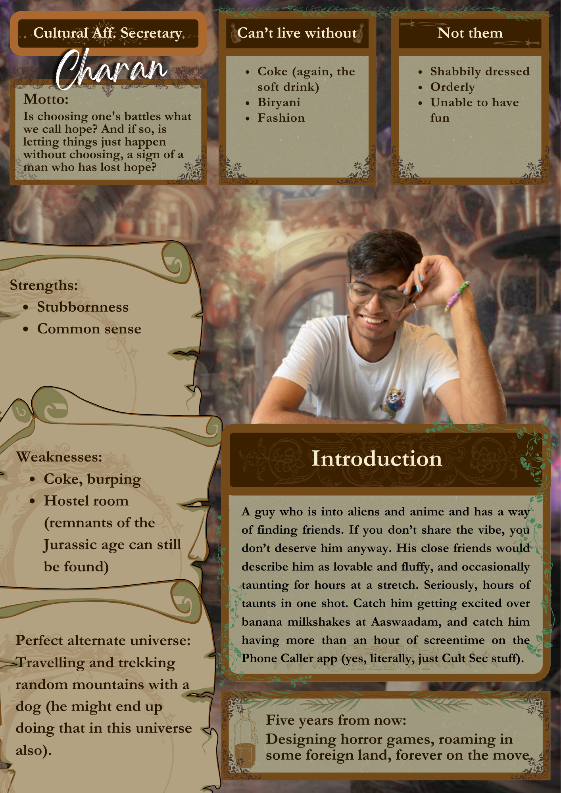
 
**How would you describe your tenure looking back at it now?**
Overall, not so bad, aside from Tirutsava. The advisor not accepting funds for conducting events was a massive hurdle, which downgraded the overall grandness of certain events. Inter IIT was the one thing that had so many obstacles and hurdles. It was almost impossible for us to go there in the first place, but thankfully, things went well. We achieved pretty good positions this year, too. Ganesh Chaturthi and Onam were also well-organised amidst difficulties with the budget.

******************
**As tradition goes, one will soon take your place. What advice would you give them?**           
- Living is not about trying to follow a set path in your mind and trying to get things done in that particular way: It’s more about adapting the set path along with the flow of life (basically, adapt and grow, bro). 
- Don't get demotivated about things not going the way you had planned in your head. Always leave some room for improvisation and doubt. 
- Never spend a single penny from your pocket for conducting events (I learned that the hard way). 
- Make sure that there are a bunch of people whom you can trust and who would be there by your side against odds (here, I mean getting approvals and signatures. It’s the worst part of being a secretary, and you should never do it alone).
- Handle religious events with care. People can get very defensive even if a small email sent by you hurts their feelings. So basically, be ready to face hate. 
- You don't always have to cater to everyone's needs. 
- Never let anyone apart from the TAS become involved in matters regarding Tirutsava.

********************************
**Ever fancy yourself to be another secretary?**                               
No, just NO.

***************************
**After 4 weeks of constant pestering, we consider ourselves lucky to share with you the responses from their dearest homies, on what Mr. Secretary taught them:**          

>He kind of demotivated me to become a CAS in the future.                   
>\- *Parupalli Binnu Chowdary*
>
>- Any work, any responsibility, is a thousand times better shared with someone. It's infinitely easier to vent about the nonsense at work to a friend/colleague than to walk back to the hostel alone, bubbling in frustration. 
>- Sometimes, the effort that goes into a project/execution/event goes noticed. That's right, sometimes, it's noticed. Predominantly, there'll always be people who say, "what did you even do?" to the people who actually did all the work. Those are key moments that separate the people who work out of their own drive and those who succumb to external demotivation. Neither is bad, but you need to know when to pick what.
>- That PoRs are cursed, irredeemably.                                  
>\- *Akhil Krishnan*
>
>This dude will absolutely slap facts onto your face, in a way that it feels okay. He has a really stable yet spontaneous nature which makes you think, "It's okay to feel floaty today.”                         
>\- *Sneha Battula*

******************

<b>Sumukh Porwal</b>

 

*Technical Affairs Secretary*

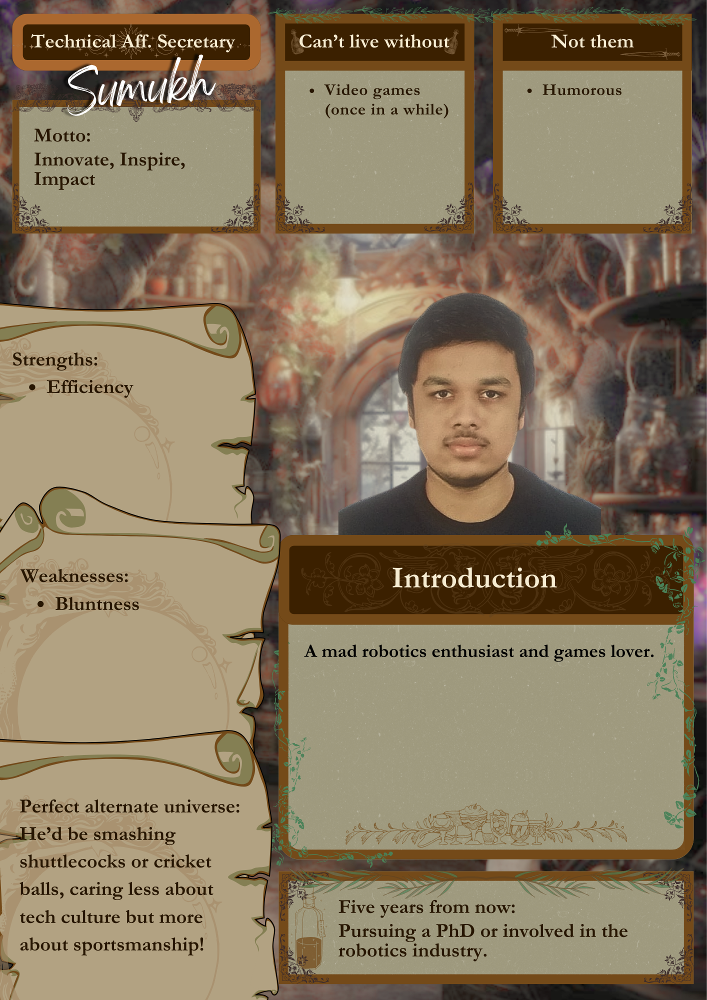

**How would you describe your tenure looking back at it now?**              
My tenure had its ups and downs. We couldn't pull off many tech events, but our clubs rocked with projects. Bagged the biggest tech budget yet, with solid future plans. Started an AI club and Google Development Student Club. Plus, we upgraded to a swanky new Ideas² room!      

***********************

**Humour us with some of the mistakes you’ve made during it.**              
Not having Tirutsava.       

**************************

**As tradition goes, one will soon take your place. What advice would you give them?**                            
There is nothing that I could have learned before which I didn't learn. But for my successor, I want him/her to know that this is majorly a management role, and that you would have to keep going to the admin block for all things, and that a significant amount of time would be utilised there.

************************************

**Ever fancy yourself to be another secretary?**
I'm all about tech projects and events. So, no other gig beats being the Technical Affairs Secretary.

*********************************                        

**Let’s take a look at what the student community has to say about them:**

>Great (experience). There not many comical situations. We were mostly serious. Sometimes, we would ask him for a party for being the Technical Aff. Secretary and sometimes it was funny when we would roast Aman, Registrar, Manas or some advisors in the club meeting.                                         
>\- *Arpit*
>
>To a generic person on campus, it might come across that Sumukh probably does nothing - but that's totally untrue. If you are able to see our technical clubs functioning, it's mainly because of his support - the seemingly invisible hand who is making things easier. Perhaps, he is one of the very few people in our batch who's been involved in the institute's technical circuit since the first year. Working with him has been a blast. He's the kind of dude who jumps on tasks as soon as they're thrown his way. No delays, no drama.                               
>
>We had ambitious plans for a technical symposium, a project that resonated deeply with all of us. Unfortunately, it seems that IITT may not be fully ready to embrace such an initiative at this time. Maybe next time, right?                           
>\- *Sneha M S*
>
>He is always positive to increase the tech culture in the institute. He managed his post quite efficiently from holding the technical council meeting to talking with the dean and home office for different club needs. He had always encouraged us to start more long term projects in the club which was not there before.                    
>
>Bhaiya did a nice job in sorting out which club should get the money from which club (whose budget was not spent fully) at last.                        
>\- *Manas Poddar*

*********************************
**After 4 weeks of constant pestering, we consider ourselves lucky to share with you the responses from their dearest homies, on what Mr. Secretary taught them:**

>Stop procrastinating everything and pay attention to even minor details.                                          
>\- *Ritwik Das *

********************

<b>Raees Pareshva</b>

*Mess Affairs Secretary*                       
                         
**Let’s take a look at what the student community has to say about them:** 

>Pareshva, in my opinion, did a decent job. I wouldn't say he did an awesome job, but at the same time, it would be very wrong to say that he didn't do anything. There were very few things that he had control over. From the students' perspective, he was perceived as very bad at his job, but being in the council, I won't agree with that completely because only we know the real reasons behind all these hardships. He is a bit lazy, and he could have been more mature in taking decisions, but it's kind of difficult to have that level of maturity without working in the council for a year, and he is still in his 3rd year of B.Tech.
>
>Though there were instances where he could have acted much better, for example, being a little more responsible while writing emails, he also didn't receive the necessary guidance from the Asst. Warden and the mess wardens. There were no experienced people in the council other than 2-3 individuals. The council lacked experience and guidance. The failure of the council in making appropriate decisions was often perceived as the Mess Aff. Secretary's failure.                                           
>\- *G Yaswanth Chowdary*

*********************************

<b>Krishna Kaushik</b>

 

*Hostel Affairs Secretary*

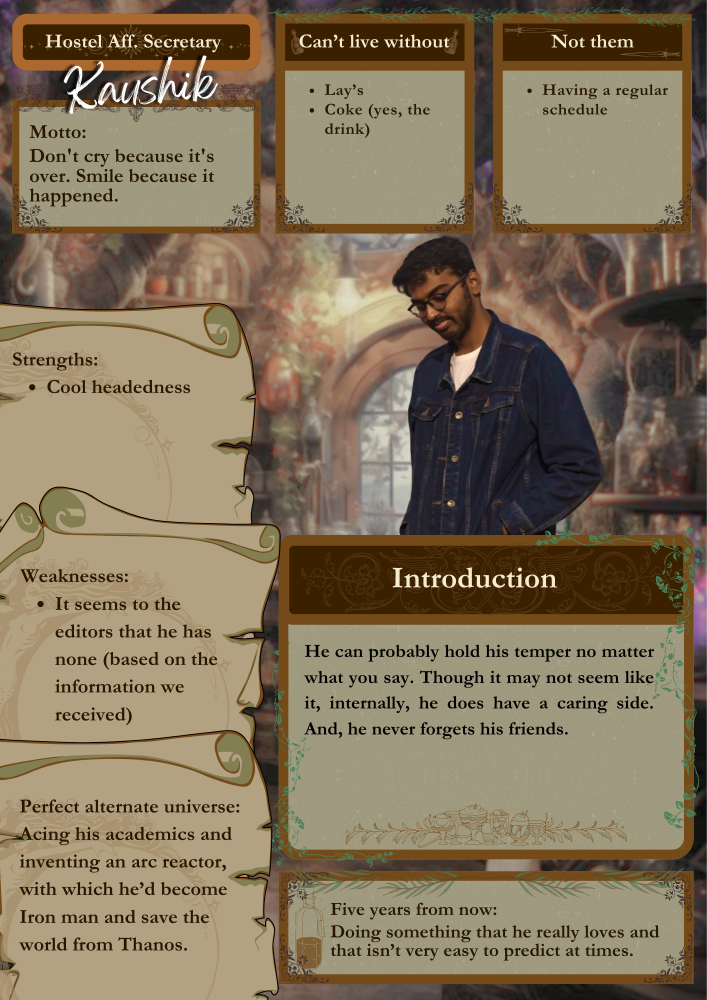
 

**How would you describe your tenure looking back at it now?** 
                          
I would rate it as good. The hostel work was tiring, but they made substantial progress this year. I wasn't happy with the transportation, mainly the removal part, but sadly, we couldn't do anything about that. I would say that the highlights of my tenure were the smooth opening of Des hostel, implementing the ERP system for maintenance issues, solving the drinking water issues, setting up culinary rooms, and maybe conducting the hostel night.

***************************

**Humour us with some of the mistakes you’ve made during it.**                    

Bringing a few of my friends and batchmates into my council was a decision I made. I mean, they work a lot, but you can't expect things to be formal when they are present. When I open my council group, there will be stickers of my face morphed with a tempo. But to be honest, I did receive unfiltered feedback from them with every decision I took, which helped me a lot.       

***********************************

**As tradition goes, one will soon take your place. What advice would you give them?**

I knew mostly everything about HAS during my council days itself, so there wasn't any trouble. But I would suggest the next secretary to understand that things take time in this college and that you need sheer patience and have to follow up on proposals until the end to ensure they don't go unattended. One more thing I would suggest is to use the council effectively because you can't do all the things by yourself.                

***********************************

**Ever fancy yourself to be another secretary?**        

I would prefer the Hostel secretary anytime. But if I remember correctly, I wished to become the Mess Aff. Secretary in my first year. Thankfully, I didn't take that seriously. If not, I'd be dead by now.            

****************************************

**Let’s take a look at what the student community has to say about them:**

>I had a good experience working with him. I guess he performed his best in doing his job.                                                  
>\- *Dhanush P*                 

************************************

**After 4 weeks of constant pestering, we consider ourselves lucky to share with you the responses from their dearest homies, on what Mr. Coordinator taught them:**

>Getting overly active about solving an issue just makes it heavier for you. Just move slowly and plan to work for the long run.                                         
>\- *Siva Sanjay*

*************************

<b>Vikash Kumar</b>

 

*Literary Affairs Secretary*

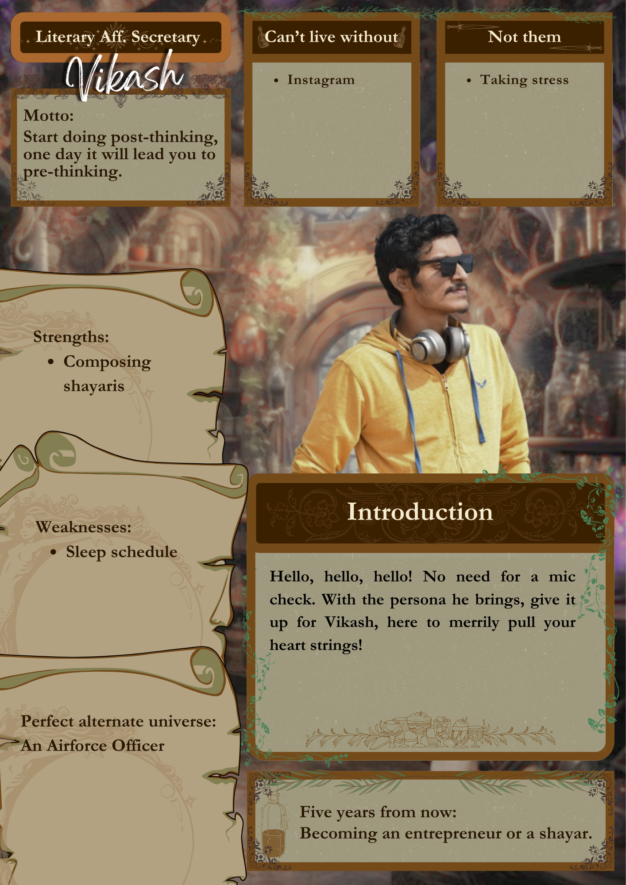
 

**How would you describe your tenure looking back at it now?**              

It was a great experience. My major highlights would include:     
- Taking care of clubs and ensuring they receive their needed items on time to function properly.
- Trying out new events with the help of council members, such as the Word event during Intra IIT and others occasionally, like poetry on Valentine's Day.
- Proper documentation of the Literary Affairs Secretary role in our college after discussing with the previous two secretaries.
- Creating a literary calendar for follow-up.
- Participating in almost all of the Inter-IIT literary events and having good experiences, which will be helpful for future events and competitions.
- Conducting almost double the number of events compared to the last year, and most of them had a good number of participants.
- Assisting in the successful organization of various national events like Hindi Pakhwada and Khadi Mahotsav.
- Assisting other clubs in conducting events wherever needed.
- Planning to conduct an Inter-IIT experience session where all the participants will share their experiences to improve literary culture and recruit good candidates for next year's competitions.
- Planning to start a student-run library and have a podcast setup during my remaining tenure.

***************************

**Humour us with some of the mistakes you’ve made during it.**

Not a mistake, but I had a funny experience during Inter-IIT. We had participated in a Scrabble word game. Though we were still new, we had practiced a lot on the Scrabble board. But when we went there, firstly, they shifted the event location from an earlier location to a godown kind of place. But the epic part was that they had given a quiz paper (which was not in the rulebook) instead of a board game, and we all got eliminated.

********************************

**As tradition goes, one will soon take your place. What advice would you give them?**

Since I got elected after a loss and had been in the LAC for a year, I knew what I had to do through the previous Secretary’s experience. But yeah, having the acknowledgement of funds approval and reimbursement procedure at an early stage of my tenure could have made my work easier. So, to the Future Secretary, I would suggest having the proper knowledge beforehand or in the first few weeks after getting elected.

****************************************

**Ever fancy yourself to be another secretary?**

Actually, I am happy to be LAS. But for this question, since it is the final year and we are going to miss our college fest "Tirutsava," I would have wished to become either SGS or CAS so that we would not have missed our fest.

***************************

**Let’s take a look at what the student community has to say about them:**

>He is a person with zero ego and comprises the full knowledge of dividing the work among the people to bring a better output. He gave me the freedom to work accordingly, and one thing I noticed is that he is very well-mannered and respectable to his fellows. The purchase of good books was a good accomplishment.                                      
>\- *Ratna Sree*
>
>As a member of the Literary Affairs Council, I have had the opportunity to contribute my perspectives and benefit from the wisdom of my colleagues. The club has organized numerous events, including those held on Freshers' Day, Valentine's Day, Inter-IIT, Hindi Pakhwada, and various other occasions. As a member of the design team, I was tasked with generating inventive concepts to enhance the creation of effective posters, thereby bolstering my design abilities. It is a pleasure to engage with this group, and I must acknowledge the collected demeanor of our secretary. Once he assumes a role, he fulfills his obligations and remains committed until the task is completed, reflecting a cooperative and team-focused approach. While the council members were engrossed in their obligations, he effectively managed the events, including the club events, showcasing his versatility.                                                   
>
>The council has efficiently established a student library and procured necessary materials for the council that were previously lacking. Additionally, Vikash is diligent in overseeing event planning regardless of council member availability. Shortly, we will be unveiling the literary calendar. It would have been more beneficial if the secretary had also taken into consideration the team members' experience in addition to their interests when making selections.                                                      
>\- *Sri Lakshmi*

*****************************

**After 4 weeks of constant pestering, we consider ourselves lucky to share with you the responses from their dearest homies, on what Mr. Secretary taught them:**

>I'm mostly dry and annoyingly concise when it comes to writing. He brought me to the emotional and elaborate side of writing.                                
>\-*Sunandan Santosh*

********************

<b>Vasu Lodagala</b>

 

*Sports Affairs Secretary*

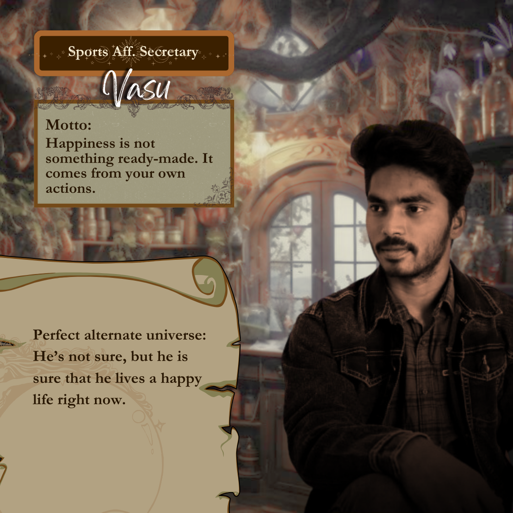
 

**How would you describe your tenure looking back at it now?**         

I’m very happy and proud to say that I started the 1st-ever invitational sports tournament by our institute (named SANYOG), and that it will be carried forward for future generations. Around 12 colleges in our surroundings participated, and the count will go higher in the future. This will be one of the remarkable achievements for me that will definitely keep my name on the wall of IITTP forever. On top of that, I worked hard to increase women's participation in sports. I’m once again happy to say that I was successful in taking women's basketball and volleyball teams to Inter IIT, keeping in mind that the future generation should feel that they already have a team so that they will feel free to come and play. Not only Inter IIT, I also introduced Throwball and Chess separately for women in the INTRA Sports meet (Kridan 2024). Apart from women, I was also successful in taking Weightlifting and Lawn tennis for the first time for Men in Inter IIT 2024. During my tenure, we secured a medal in the students’ Inter IIT Sports Meet for the first time in our institute’s history. I hope it will carry forward for future generations. A lot of infrastructure was also developed during my period.            

*********************************

**Humour us with some of the mistakes you’ve made during it.**                  

While convincing AR Sir to sign approval letters, he used to send me back to get a new letter and I used to get all the remaining signs several times for very minor corrections. I wish I could have learned how to get approvals and clear different bills in the account session earlier.

*************************

**As tradition goes, one will soon take your place. What advice would you give them?**                         

Dear future Sports Aff. Secretary, 
I hope that you never feel distressed by the work you have, but instead, think about how you’re working for the glory of the institute. Your commitment clearly reflects on the results of our institute’s performance in several events. Also, during all of this, don't forget to maintain both academic and sports performances at good levels.

******************************

**Ever fancy yourself to be another secretary?**                    

I’m capable of being nothing else except the Sports Aff. Secretary because I don't do the exact works of the other roles. However, to be frank, I feel that others have very less work compared to the Sports Secretary, with the Cultural Secretary being an exception.               

*****************************************

<b>Chetan Sharma</b>

 

*Research Affairs Secretary*

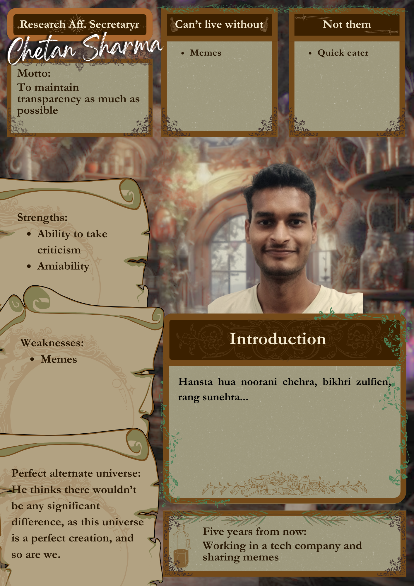
 

**How would you describe your tenure looking back at it now?**                  
           
It was a mix, as there could have been more events, but they couldn't materialise. Highlights may be the following:
1. The first-ever Research Scholars Symposium was celebrated.
2. Female SRF scholars finally got single occupancy rooms.
3. The financial support to attend the conferences increased from the max cap of Rs 1.5 lac to Rs 2 Lac (pending the BoG approval).
4. The first-ever get-together between the alumni and the scholars took place, where the alumni scholars were presented with personalised mementos.

**********************************

**Humour us with some of the mistakes you’ve made during it.**

I don't see any such thing; whatever I did as RAS was only after getting consensus from my council, which saved me from making any such mistake. One thing I can recall is the signing of the controversial document regarding Tirutsava (which I obviously didn't check with my council, as there was not much time, and I didn't feel the need to do so), but at that time, no one had expected what would happen later.       

******************************************

**As tradition goes, one will soon take your place. What advice would you give them?**

I don't see any such thing. Just one piece of advice for the successor: have a good council advising you.

***********************************

**Ever fancy yourself to be another secretary?**

I would not like to be any secretary again. However, if somehow, I am back, I would like to be RAS only. 

**********************************

**After 4 weeks of constant pestering, we consider ourselves lucky to share with you the responses from their dearest homies, on what Mr. Secretary taught them:**

>There’s no need to go all-guns-blazing all the time.                            
>\- *Pranjal Shukla*

********************************

<b>Sushant Nasare</b>

 

*Placement Coordinator*

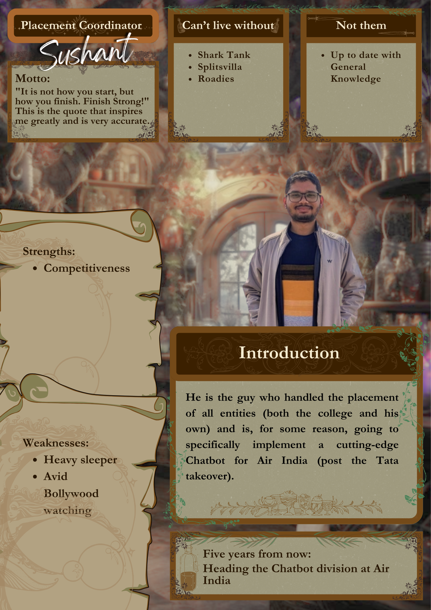
 

**How would you describe your tenure looking back at it now?**                  

Overall, the tenure was good - marked by valuable learning experiences, the formation of a good team, and meaningful interactions with many individuals along the way. One of our noteworthy accomplishments is the successful recruitment of an additional placement officer with experience in CFTIs. What I can confidently confirm from my time in office is our thorough utilization of CalyxPod. Unlike my predecessors, I have ensured that all the data entered into the software is accurate to the best of our understanding. This will serve as a valuable resource for upcoming teams whenever any statistic from the placement season of 2023-24 is required.

*********************************

**Humour us with some of the mistakes you’ve made during it.**

I sent an email to students@iittp without any subject.           

*********************************

**As tradition goes, one will soon take your place. What advice would you give them?**                    

I would like to advise my successor to excel in managing Excel sheets and maintaining data effectively. Starting next year, we may transition to using the ERP system for placement processes. However, regardless of the system used, I strongly recommend that the upcoming placement team diligently logs all data into the placement portal for consistency and accuracy.      

**********************************

**Ever fancy yourself to be another secretary?**

I am passionate about technical matters, so I would have liked to pursue a role like the Technical Affairs Secretary.               

*****************************************

**Let’s take a look at what the student community has to say about them:**

>He’s an amazing sweet guy who listens to every member of the team. He never relaxed about taking responsibility and managed all the challenges he faced during his term well. The way he managed students rebelling against the placement team during the need for a new PO and his capability to convince the officials to appoint one was just excellent. He managed it all most politely.                                               
>\- *Supriyashree S*

***************************

**After 4 weeks of constant pestering, we consider ourselves lucky to share with you the responses from their dearest homies, on what Mr. Secretary taught them:**       

>Not everything is to be taken seriously, Prioritise both work and non-work activities.                
>\- *Ishaan*

***********************************************

<b>Chetan Moturi</b>

 

*Internship Coordinator*

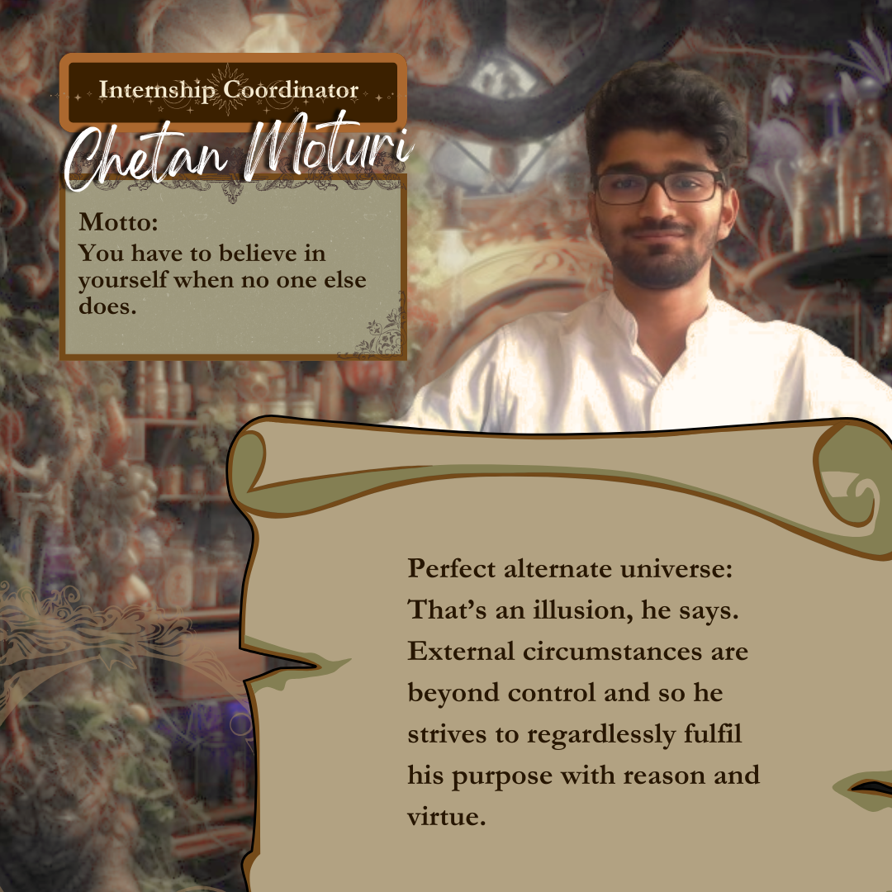
 

**How would you describe your tenure looking back at it now?**                 

I believe my tenure was lacklustre. The highlight, if it can be called so, is the job market. As it is going through a terrible time of layoffs and a global economic slowdown, the number of opportunities for freshers have decreased massively and the same disappointment is reflected on everyone's faces (including mine).

***********************************

**Humour us with some of the mistakes you’ve made during it.**                          

I sent an email with an autocorrect fail one time. Good luck finding it.

*********************************************

**As tradition goes, one will soon take your place. What advice would you give them?**                   

Some things are beyond your control. We may wish for things to happen in certain ways but mostly it will not be so. Don't blame yourself or anybody when that happens.                

**********************************

**Ever fancy yourself to be another secretary?**

CDGC. It seems a pretty chill position with organising talks, sessions, etc.

********************************************

**Let’s take a look at what the student community has to say about them:**

> Working with him was a good experience. He used to update me immediately regarding mechanical companies. Even though we didn't get many companies, whatever his work was, he did it properly.
>
>Interesting thing is that he is not like the complaining kind. What other people see, such as Chetan not responding or something of that sort, is due to the main problem that the placement officer doesn’t update anything and doesn't call back companies regarding status. It is us who push him for the updates. Chetan doesn't complain, saying that the PO is not responding. Yes, of course everyone sees the results and Chetan wasn't able to produce that result. Hence, everyone points out to Chetan that he doesn't work or something like that. But no one sees the other side of how we all work talking to companies, mailing them and all that stuff.
>
>The area where he could have been better is that he could have openly said things to everyone instead of waiting for a good thing to happen. At least then people would understand the current situation.                                                                
>\- *Adarsh Bellamkonda*

************************************************

<b>Divyanshu Dwivedi</b>

 

*Career Development and Guidance Coordinator*

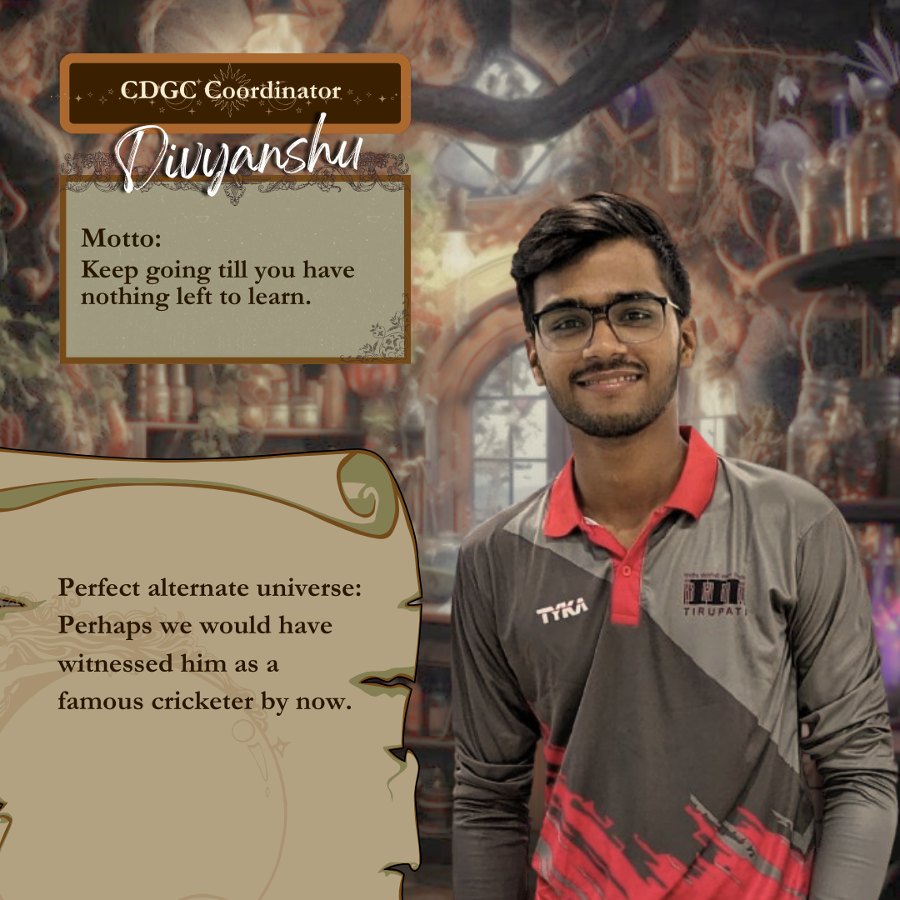
 

**How would you describe your tenure looking back at it now?**                        

The overall tenure was great though I joined in between since the previous coordinator left his position. The team and the advisors were really supportive. The worst thing CDC has to do is to go through all the resumes of the 2nd year chaps and check for any mistakes which might cost them their internships.

*****************************************

**Humour us with some of the mistakes you’ve made during it.**                    

It was my first time writing an email formally. It took me three full days for the first mail, yet I felt it was not up to mark. But yeah, it works as it's sent to students only.

***********************************************

**As tradition goes, one will soon take your place. What advice would you give them?**

Try to be strict from the start or else people won't get involved in the tasks you assign.

***********************

**Ever fancy yourself to be another secretary?**                           

I would probably be the head (coordinator) for Sargam. I felt like we could have done more this year but yeah, availability of people is an issue too in this college. Also, I felt if I would be the head I would have been heard more but yeah its secondary and that sums it up.

*************************************

<b>Pranjal Shukla</b>

 

*GCU Student Head*

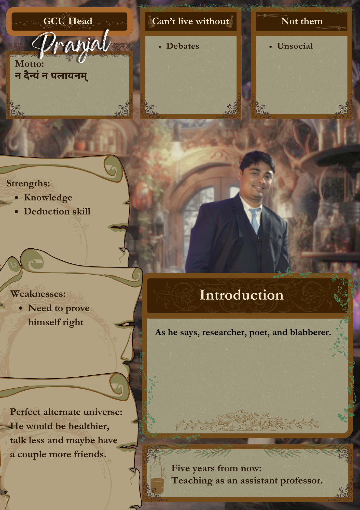
 

**How would you describe your tenure looking back at it now?**                                  

The tenure was more concentrated on systemic changes and creating SOPs to ensure absolute privacy for counselling sessions. Psychometric survey of every student getting admission in the institute has been ensured and mental health has received prominence in the Orientation program. Apart from this, various sessions with outside experts and faculties from the institute have been conducted to raise awareness and understanding. Efforts have also been made for sensitivity training of faculties and staff.

***************************************

**Humour us with some of the mistakes you’ve made during it.**                           
Hoping to get a good permanent room for GCU.

**************************************

**As tradition goes, one will soon take your place. What advice would you give them?**       
Better team management skills.    

**********************************

**Ever fancy yourself to be another secretary?**               
Academic Affairs Secretary.

*******************************

**Let’s take a look at what the student community has to say about them:**
> The overall experience was very positive. Our secretary has been very friendly with the council members and working with him has been excellent.
> 
> 1. The activities for UG Buddies in collaboration with the Aranya club improved interaction between freshers and their seniors. Inspired by the 'Have We Met Before' activity conducted a few years ago, this was the idea of the secretary which resulted in a huge improvement from last year when there had not been sufficient interaction within UG Buddy groups.
> 2. Talks by experts on concerns of mental health were organised throughout the year, although I believe the student turnout could be improved. 
> 3. The secretary has come up with several initiatives for the website and social media influence of GCU. As these are long term initiatives, they are still under process and haven't reached completion. However, the initiatives taken are crucial and are likely to show significant changes in the near future.
> 4. Overall, the secretary has good knowledge of the concerns in this area and is well deserving of the position he holds.
>               
>\- *Anvesha Verma *                   
>
>The OG IIT-T Mechanical engineer and an all-around amazing human being! Seriously, I still can't wrap my head around why he's still here. But you know what? I'm not complaining because working with Pranjal Bhaiya has been an absolute delight. He's not just a colleague; he's a friend, a TA, and basically a big brother to all of us. Need someone to talk to? Pranjal Bhaiya's your guy. Sure, the conversation might last longer than you anticipated, but trust me, you'll walk away with something profound to ponder upon.                     
>
>Coming to GCU, with him at the helm, it never felt like we were just being assigned tasks. Instead, all of us in the team felt like GCU heads, thanks to the incredible independence we were given to execute tasks and initiatives. Kudos to his team management skills! Personally, organising events from the GCU was an absolute blast. The UG Buddies initiative, in particular, was something close to my heart, and with the help of the CDC, we executed it really well.               
>\- *Sneha M S*
>
>Working with Pranjal has been nothing short of a ride where you are left feeling wholesome and exhilarated! He always has a game plan on check, no matter how little the resources are. The little brain teasers that he brings into the group truly motivate the team to think and envision beyond their limits.                  
>\- *Malavika*

*************************

**After 4 weeks of constant pestering, we consider ourselves lucky to share with you the responses from their dearest homies on what Mr. Secretary taught them:**

>Perseverance.                             
>\- *Chetan Sharma*

**********************************

<b>Neelima G</b>

 

*NSS Principal Coordinator*

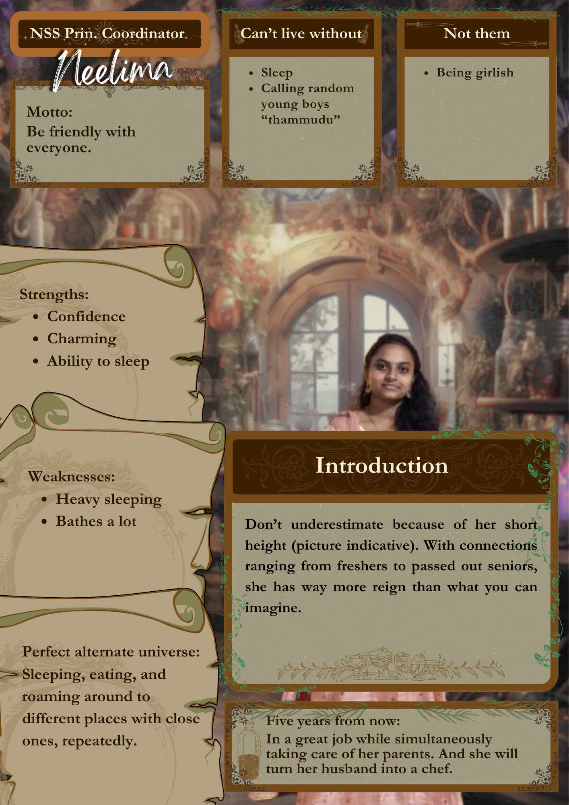
 

**How would you describe your tenure looking back at it now?**                       
My overall tenure was good and I am satisfied with the work I did. During any school activity conducted from outside, many children and teachers would come. While leaving campus, their looks of satisfaction and excitement would be priceless, and the way each and every student would say goodbye while leaving the campus and speak to us was very special. In SOS village, we conducted many doubt-clearing sessions for the 10th-grade students. This was a new initiative. These sessions were very useful for them. Village health camps are also on.

*****************************************

**Humour us with some of the mistakes you’ve made during it.**
I sent a mail to students of some other batches, and didn't check the spelling mistakes for engraving their names on the convocation mementos.

****************************************

**As tradition goes, one will soon take your place. What advice would you give them?**
The first thing that they’ll need to do is to select a good team. With them only we would need to coordinate the complete tenure. They also need to know how to balance academics and NSS work. They need to spend some dedicated amount of time on this.

******************************************

**Ever fancy yourself to be another secretary?**                             
No, I am not interested in any other secretary position.

********************************

**Let’s take a look at what the student community has to say about them:**

>Really good! Didn't have to worry about overlooking anything since she helped with everything. Even if none of the team members showed up, she would always be there to support. It was really easy to work under her. You could take any decision about conducting activities and still be sure she would help you with it (in a positive way). She had the perfect management style since she would occasionally check up on work or get herself involved but wouldn't micromanage.                                      
>\- *Shreevatsa*
>
>Neelima has been in the team for the past two years. I have been working with her since then. She started as a co-coordinator and now she is the Principal Coordinator. Throughout her journey, she has changed a lot. She was a little sceptical when she was about to take this up but as time went by, she has been an amazing head. I personally admire her for the way she manages everything in time without losing her cool. I loved working with her. Also, at this point, I actually forgot that her name is Neelima because we would all call her GULLIPALLI. She is an amazing human and an amazing head as well. As a head, she did all that she could. We have had many more new initiatives this year. She struggled a little bit in the start, but she pulled it off. Though she is in her final year, she managed it well. NSS in my final year was fun with you. Thanks for everything <3.                     
>\- *Shreya Tumma*

****************************

**After 4 weeks of constant pestering, we consider ourselves lucky to share with you the responses from their dearest homies, on what Ms. Secretary taught them:**

>Observing her as my friend has taught me how to speak with new people and continue to be in touch with them (though I haven't followed any of them), which I am very poor at. Also, good or bad, she has a strong say whenever she has to make decisions.                     
>\- *Sivakoti Ram Mohith*
>
>Once you take up something, no matter how tough things get, go stand for it and do your best.                    
>
>Also, she stopped sleeping a lot during the day and woke up early in the mornings (I mean, 6 or 7 am) just to manage NSS activities. That dedication of hers shocks me at times. Being stubborn and strict when required, and social and outgoing when needed with the team, is a special quality of hers which is well appreciated                          
>\- *Penumarthi Ramya Krishna Chandini*

- - -

### Coordinators

<b>Kushal</b>

 

*Actomania*

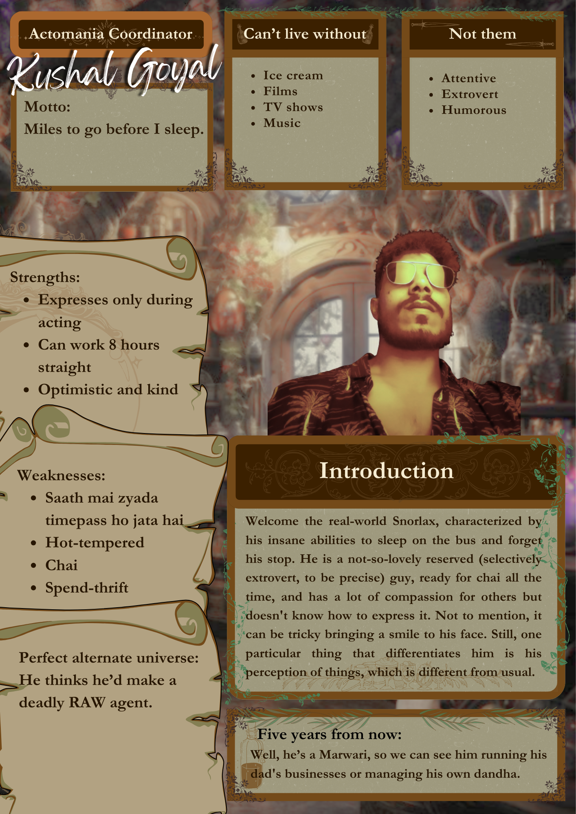

    

**How would you describe your tenure looking back at it now?**

It was a good experience overall, with plenty of learning opportunities and a few mistakes along the way. Securing 10th place in Inter IIT for street play was an unexpected achievement.   

- - -    

**Humour us with some of the mistakes you've made during it.**   

One incident that stands out was when I sent an email announcing that one of my core team members was leaving. Some people misunderstood it as a public humiliation, but my intention was simply to show respect. It turned out to be a bit amusing, despite being unintentional. On a more serious note, a less humorous mistake was hiring an irresponsible group of people in my core team.    

- - -    

**As tradition goes, one will soon take your place. What advice would you give them?**   

Sharpen your time management skills before taking up this role.   

- - - 

**Ever fancy yourself to spearhead another club?**   

Nah, I'd still choose Actomania.   

- - - 

**Let’s take a look at what the student community has to say about them:**

>Kushal demonstrates several commendable qualities such as dedication, hard work, supportive and understanding nature and, of course, good acting skills. However, there are areas where his leadership could have been better. One aspect is his communication style and his approach to teamwork. For instance, if I had to point out something specifically,  he sometimes becomes a little frustrated and argumentative, which detracts from a positive team environment. By improving communication, fostering a positive team dynamic, and recognising the contributions of all team members, Kushal has the potential to become a more inspiring leader.                            
> \- *Yuv Raj*
>
>It's been a pleasant time working with him. His ability to promote new ideas and give new opportunities to new talents deserves a round of applause. The best thing about him is that he’ll work in the background- like a silent killer. Kushal is the one who motivates us when we are not in the flow. Well, sometimes motivation can be in the form of a few harsh words, but I think it’s alright because managing a team of actors is not an easy task- you never know when they are acting and when not.               
> \- *Yuvraj Mhatre*

- - -   

**After 4 weeks of constant pestering, we consider ourselves lucky to share with you the responses from their dearest homies, on what Mr. Coordinator taught them:**    

>I learnt a lot about many web series and movies from this movie maniac.                                                          
> \- *Prince Kumar*
>
>Sometimes, it's okay to take a few steps back, go outside to eat, and get some 12 or so hours of sleep.                                                 
>\- *Utkarsh Dhar Dubey*
>
>"Love for Dramatics as an art" is something he taught me during his tenure.
>*Vaibhav Mishra*

- - - 

<b>Vishnu Teja</b>

 

*Artista*

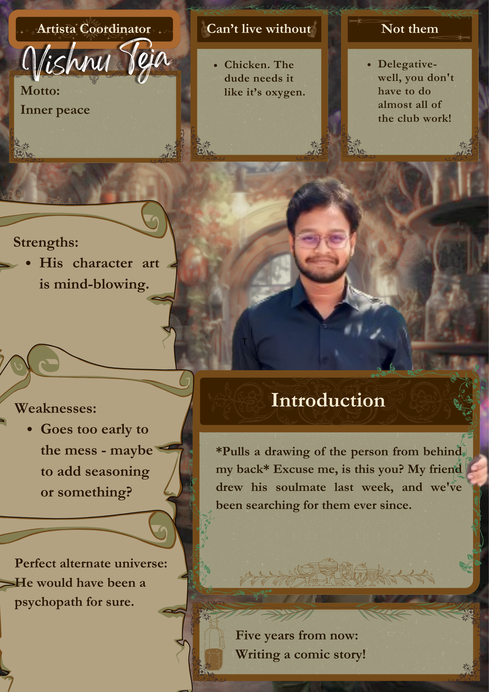

    

**How would you describe your tenure looking back at it now?**

Fun fact: I never used my assigned budget to date. I have to get it once it hits a prominent amount. My super cool team is why we could work around the things we had at hand. Overall, I would say it was a great learning experience. It was so much fun when people would come forward to listen to me (before becoming coordinator, I had to scream to be able to be audible).   

- - - 

**Humour us with some of the mistakes you’ve made during it.**

I should have planned the Ravan cutout better for Dusshera, LOL.

- - - 

**As tradition goes, one will soon take your place. What advice would you give them?**   

One crucial requirement is to have connections from all parts of the student community. The second is to start as early as possible with any task. And the final one is not to take up more than what you can handle. My suggestion for my future coordinator is that they should be close to their team and accomplish tasks with the team’s effort. Utilise the opportunities that arise from time to time effectively. Teach the participants basic art skills so they can understand how valuable and enjoyable art can be. (It's a whole different world!)   

- - - 

**Ever fancy yourself to spearhead another club?**

THE SCRIBBLES CLUB!!! I would hold tons of book-reading sessions!

- - - 

**Let’s take a look at what the student community has to say about him:**

>Collaborating with Vishnu Anna has been nothing short of a delightful experience! Vishnu is the epitome of serenity; he navigates through tasks with an air of tranquility that would put a Zen master to shame. Working with him is like taking a serene stroll through a garden of perfectly organized tasks, where chaos dares not rear its head. Vishnu effortlessly dispels any inkling of confusion, leaving no room for the pesky gremlins of uncertainty to sneak in. His approach is as cool as a cucumber in a freezer – not a bead of sweat in sight. I've often wondered if he has a secret stash of calmness tucked away somewhere; perhaps he's the keeper of the legendary Zen Garden of Productivity. However, in the spirit of full disclosure, there have been instances where Vishnu's calmness has left us questioning if he's secretly a robot programmed never to panic. I mean, a slight panic every now and then keeps things interesting, right? His commitment to responsibility is so stellar.                                                 
>\- *Akilesh*
> 
>Working with him is like the most peaceful job – he doesn't use too much force to make people do the tasks, and his smile gives us enough motivation for it. He tries his best to plan everything in advance to minimize any last-minute hassles, though such changes are inevitable sometimes, and knows whom to assign the right task. He's a good persuader for roping in people for work, but he should have been strict sometimes, or else stuff won’t go as fast as it should go.                                     
>\- *Siva Sanjay*

- - - 

**After 4 weeks of constant pestering, we consider ourselves lucky to share with you the responses from their dearest homies, on what Mr. Coordinator taught them:**

>They’ve taught me that my drawing doesn't always have to look good.                                                          
>\- *Chandradithya*

- - - 

<b>Amulya</b>

 

*Celeste*

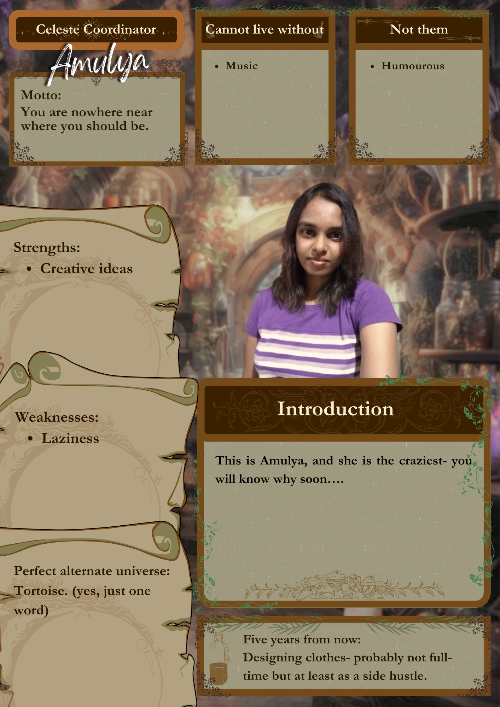

    

**How would you describe your tenure looking back at it now?**

Nothing much to describe, to be frank.

- - - 

**Humour us with some of the mistakes you’ve made during it.**

Nothing funny to mention. (Team Udaan tried their best to make more out of this, but we’re grasping at straws.)   

- - - 

**As tradition goes, one will soon take your place. What advice would you give them?**

The participation rate is less so you must design the programmes according to that.

- - - 

**Ever fancy yourself to spearhead another club?**

Nope, none. Celeste, anytime, anyday!

- - - 

**Let’s take a look at what the student community has to say about him:**

>She is the best Celeste club head to date, in my opinion, because she has previous experience in the fashion field. Moreover,  she is so understanding and kind, but also strict about her duties at the same time.  Amulya planned and welcomed the ideas of club members, even mine - and motivated us to take over her post after she was respectfully out. She did an excellent job in assembling our ideas; she hustled by leading our team to fifth place in the Inter IIT 2022, and now leaping to 9th place in 2023. And not to mention, her model walk is out of the world- I heard it from the fashion girls and even saw it. Last but not least, don’t GIVE HER CAFFEINE EVER.                                
>\- *Yuvraj Gowtham*
>
>It was a mix of fun, craziness, stress, regrets, disappointments, brainstorming, accomplishments, learnings and many more. One thing that I've learnt is never to be afraid to present my idea, it might have the capability to make things a lot better. All we did this term was come up with an idea, get all excited, make a mistake out of our curiosity, and then pop up with more ideas to fix it up, which would sometimes even change the whole plan- this time, thinking it over, and making sure we do our best.                                                 
>\- *Sunidhi*
>
>It definitely was a great time working with her; you never know what kind of work you will end up doing while you are working on her team- the ideas she proposes look ridiculous at first sight, but only when the work starts the clarity start hitting your mind, though sometimes they turn out to be lessons. We need to be active with her while doing stuff  *whispers*. Ah, yes, you wouldn’t wish to witness her other side. A lazy cat with sudden bursts of energy (thumbs up energy), and suddenly she starts running here and there to do work and annoy people.                        
> \- *Siva Sanjay*

- - - 

**After 4 weeks of constant pestering, we consider ourselves lucky to share with you the responses from their dearest homies, on what Ms. Coordinator taught them:**    

>To not overthink things before even starting the work. In other words, to have the confidence to believe that we will figure the way out ourselves if something goes wrong.                     
>\- *Sunidhi

- - - 

<b>Mohit Kumar</b>

 

*PFC*

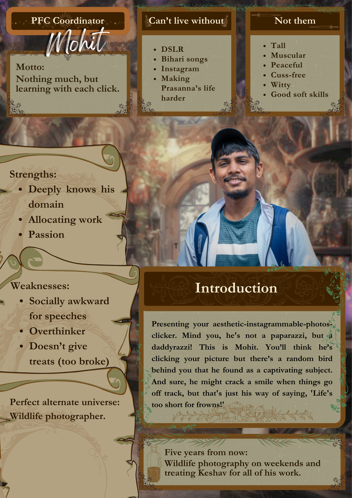

    

**How would you describe your tenure looking back at it now?**

Firstly, I never thought that I'd be the PFC head and handle this much stuff, and this was definitely a cherished tenure for me. I thought everything would go smoothly since the people there were experienced. It all started during summer vacation when there was a project underway. Initially, as a club member, I wasn't working on it, but after becoming the head, the problem started with me feeling like I knew nothing and now needing to manage all of this. That was the first headache I got. And that, kids, is how I met my tenure!        

Actually, I can say my whole tenure was akin to a roller coaster or even better- like the Ekta Kapoor TV shows where one problem followed another. However, these challenges provided valuable learning experiences. When people around you are supportive, it feels less daunting, and you can easily tackle them. Fortunately, there are supportive members in our club who helped me a lot in difficult phases.        

The one thing that disappoints me the most is the lack of interest and enthusiasm among people. I feel there is a lack of enthusiasm among individuals here. It's possible that my expectations are higher because I am personally more interested in these activities, or perhaps our peers and seniors share a similar sentiment.         

Talking about highlights, then Inter IIT was undoubtedly a big highlight; it was a wonderful experience. To be honest, I was impressed by the level of energy and enthusiasm that I saw in people during Inter IIT, which I always hoped to see in club members. We had never experimented with photography in the way we did, going from place to place, trying new things, and exploring. Despite having few resources and personnel, we tried our best in graphic design, and the film we delivered was one of the best entries. It was one of the best short films we've ever produced. I witnessed a remarkable energy among the team members, and it filled me with immense pride to see the dedication and effort put into our work during the Inter IIT. Unfortunately, we were unable to secure any standing position, but what I trust more is the hard work we put in, and I can say we definitely delivered our best, which we could, and that was the best part of the Inter IIT.        

- - - 

**Humour us with some of the mistakes you’ve made during it.**

Recently, in a WhatsApp group, a girl posted about a lost umbrella, asking where to drop it off. Accidentally, I replied with "room" instead of texting someone else. Instead of telling me, my friends burst into laughter in the group chat! Later, the girl messaged me privately, and I quickly deleted my comical mishap. *(Team Udaan still has no clue how it is related to the tenure in any manner, but found it endearing nonetheless!)*     

- - - 

**As tradition goes, one will soon take your place. What advice would you give them?**    

There are actually a lot of things I wish I had learned before taking on this role. Some of them are filmmaking or graphic design. I was more into photography from the start, so I didn’t give much time to either of these two things. I believe if I had done so, my tenure could have been better, and I could have contributed more to the club.        

So, dear successor, things are not linear, and they don't always work out as you expect. I learned this while managing people, something I had never done before this role. Remember to ask for help when you need it; there are some excellent people here. Try to take things and people lightly. Plan your things properly. Just remember, you can't do everything alone because the club functions with its members, not just its head. So try to teach people and then assign tasks. Yes, this will be a challenging task, but it's how the club works.             

- - - 

**Ever fancy yourself to spearhead another club?**

I think I could be the Artista Coordinator, as I do sketching, which I don’t know why I am good at.  But I would prefer not to be a club head again because it comes with many responsibilities- and I am not the best at managing people. However, I am still learning and trying to do my best, that’s about it.     

- - - 

**Let’s take a look at what the student community has to say about them:**

>Working with Mohit Bhaiya has been a truly rewarding experience for me as a core member. He is the type of person who always emphasizes completing things on time. We often have multiple responsibilities besides just clicking and editing photos, which can sometimes result in delays in completing the work of the club, and this is something that he understandably finds displeasing. I first met him during a Lightroom session, and initially, I found it quite boring and came out of the session. Little did I know that I would end up working with him for the next year. I've learned many things from him, especially navigating through events while ignoring people who constantly ask for their photos to be taken and insist on receiving them promptly. His iconic dialogue during every core member meeting was, "Just exploring with the camera during event coverage doesn't accomplish anything.”                                                 
>\- *Satyam Singh*
>
>Mohit Kumar is exceptional in his role as Club head. He conducted core meetings on time & encouraged us to engage and try new things with the beloved ‘camera’. You just have to call or text him whenever you need a camera. Our club has only 3 cameras, but somehow, he provided us with them when in need. He has a creative approach in every shot and emphasises more on improving photography skills rather than editing. By the way, the one thing I wanna ask you: when are we getting our club merchandise? Ever since I joined the club, it has been delayed. I personally feel that the videography team did well this time in Inter-IIT, but we are lagging behind in the Graphic & Design part.                                   
>\- *Rajan*
>
>It was fun working with them. Haha, you think so? He’s the coordinator, so of course, you can expect him to ask you to do a lot of work, but he’s good at what he does, not gonna lie. He did manage to keep track of every team in PFC, say videography, photography or the design team and managed to grab good positions in the Inter-IIT Culturals this year.                                   
>\- *Binnu*
>
>Tiring but fun. Bro is an amazing photographer and knows how to divide work nicely. Sometimes, he's not very assertive but that is also reflective of his friendly demeanor. (I don't listen to him).              
>\- *Keshav*

- - - 

**After 4 weeks of constant pestering, we consider ourselves lucky to share with you the responses from their dearest homies, on what Mr. Coordinator taught them:**     

>How to give juniors work.                                              
>\- *Keshav*
>
>We have frequent productive discussions related to Photography where we learn new things together. That’s helpful because when an art form is your passion, you need like-minded people around you to expand your knowledge.                                                                                           
>\- *Anant*
>
>Not a single damn thing.                                              
>\- *Kushal*
>
>I am sure I underestimated you as a leader when you started and imagined you lesser than what you have become today; not that you have filled my shoes as the club co-ordinator yet, but certainly I can pass out of college knowing the club is in good hands.                                                                               
>\- *Prasanna*

- - - 

<b>Akshara</b>

 

*Rasoi*

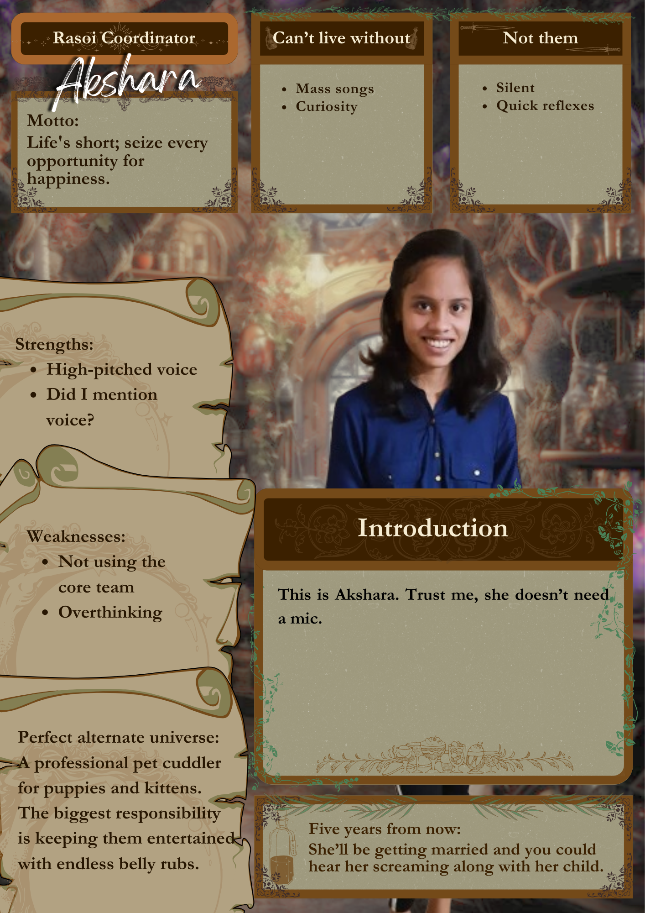

    

**How would you describe your tenure looking back at it now?**

My time as the head of Rasoi has been full of joy and unforgettable moments. I learned a lot about leading a team, managing tasks at the last minute, and improving my communication skills. I also met many new people and strengthened my bonds with them. One of the best parts was setting up food stalls, where everyone, including my friends, pitched in to help. I'm grateful to everyone who supported me along the way. A major highlight was participating in Inter IIT at Kharagpur, which was a memorable experience. Despite being a new club, we successfully organized many events, and I'm proud of how well we did. That's why I feel satisfied with my performance as the club coordinator.        

- - -

**Humour us with some of the mistakes you’ve made during it.**

While making chocolate syrup, I accidentally poured hot syrup on my hand while tasting it during the Valentine's Day food stall. It was so hot that I couldn't help but shout out, causing everyone in the mess to turn and look at me. It was a bit embarrassing at the moment, but thankfully, it wasn't anything serious.          

- - -

**As tradition goes, one will soon take your place. What advice would you give them?**       

To the future coordinator, here's a helpful tip: Make sure to select your core committee members carefully and distribute tasks evenly among them. Avoid overloading one person with too much work while giving another person less. Plan your events at least 10 days in advance to avoid last-minute chaos. If you're unsure about something, don't hesitate to seek advice from experienced individuals. It's also a good idea to communicate with chefs for valuable insights. Remember, Inter IIT is significant, so make sure to practice thoroughly for it.       

- - -

**Ever fancy yourself to spearhead another club?** 

Actomania. I pretend to listen to the class while actually dozing off.

- - -

**Let’s take a look at what the student community has to say about them:**

>Akshara’s really chill and cool to work with.                  
> \- *Preetha Selvakumar*
>
>My experience was really great working with them- we have conducted so many events and set up several stalls and everything turned out to be successful. There are no negative points I can think of.                                         
> \- *Sai Nikshith*
>
>Akshara deserves sincere appreciation for her outstanding dedication to the cooking club. Her unwavering enthusiasm, hard work, and expert management of events have significantly enhanced the club's experience for all members. Through her inclusive approach, she ensures that everyone feels involved and valued. Akshara's role as an inspiring leader has contributed to making the cooking club a vibrant and enjoyable community. She was very quirky in planning different events, which helped the core members push their limits and expertise to learn new skills.                                       
> \- *Ashutosh Pandey*

- - - 

**After 4 weeks of constant pestering, we consider ourselves lucky to share with you the responses from their dearest homies, on what Ms. Coordinator taught them:**    

>How to pretend to study at home and do nothing.             
> \- *Mahalakshmi*
>
>She’s shown me how to vibe with whatever I do.                           
> \- *Sunidhi*

- - - 

<b>Akhil</b>

 

*Sargam*

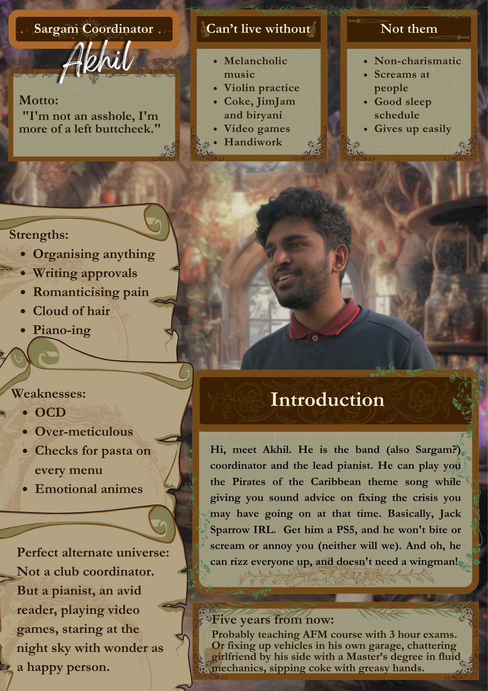

    

**How would you describe your tenure looking back at it now?**

My tenure was quite an adventure. I've learnt loads about working with people, dealing with the inevitable, letting go of the illusion of control, learning where to work hard and where to take it easy and how to get things done. I'd definitely attribute some philosophical growth, too, things like, "Is it really worth all of this effort?”, and, "What's really pushing me to work, even if no one else is interested?"       

Some of my favourite highlights include - 
1. Setting up the stage - It's always a blast fiddling with settings, mixers, wires and instruments until you get that perfect tone, sound and feel that you want from the band.          

2. Inter IIT - An event that I was quite afraid of, which started off with exciting possibilities and ended in heartbreak; words cannot describe the adventures. From squeezing out every last bit of practice time to getting two keyboards ready, to getting a double bass pedal and better drum membranes, to getting a secondary guitar on rent just the day before we left for Kharagpur, it was a wild ride. The excitement didn't stop there, with a chaotic sound check on Day 0 and some extremely serious monitor issues during our performance on Day 2, all with a group of people who learnt how to work with each other and made sure to look after all of our equipment and each other. I'd have to say, an important *sigh of relief* for me would be the fact that we did not donate any of our stuff to IITKGP like we did last time at IITM.            

3. Setting up another band - Watching a freshly put-together band take its first steps and reach that level of confidently playing on stage is something that I enjoyed a lot.           

4. Equipment handling - Throughout my tenure, we've had various moments of "Oh, this is but a simple fix,” and, "Oh, we can get this working,” and, "Oh yeah, I can fix that." Sargam's equipment has been in great shape ever since. There's still one black mark (or white mark, I should say) hovering above the equipment; that is the one Ibanez that somehow never pops up at the right time.           

5. A special kind of therapy - There have been a few days, during Band Practice or during jamming sessions, where it all feels worth it. All the uphill climbs, all the solo runs in the Administrative Building, and all of the late-night work, were worth it. There's a moment when everyone's just lost in the music, laughing, enjoying, happy. I think those are moments to work for, and, dare I even say, live for.            

6. Mastering the Paper Chase - The administrative building is 'Hell in a Cell'. Worse than most banks and definitely worse than last year, this building has single-handedly ruined club morale. Nevertheless, to win a fight with this building, and to come out victorious and pockets full of reimbursed money is a glorious moment indeed.         

- - - 

**Humour us with some of the mistakes you’ve made during it.**

Off the top of my mind, I recall the incident with the combination lock, originally intended to make life easier for Sargam and Culturals and access equipment freely. But of course, we can't have nice things, and someone went and changed the password, leaving me with a locked cupboard and a bouquet of disappointments. Another secret one is the fact that the Silver Keyboard needs to be twisted ever so slightly in order for all the keys to produce sound, because what can you expect from a curious child with three screwdrivers? Another one I recall was dropping our snare drum very similar to how ice cream falls out of a cone when you bend down. The silence that followed was so strong it could have stopped a nuclear explosion. The screaming that followed could probably send back said nuclear explosion.         

- - - 

**As tradition goes, one will soon take your place. What advice would you give them?**

Something I'd really like to have known beforehand was the changes in the procedures for Club Funds and the shifting of Administrative Affairs to the new building. I think these two pieces of information would've saved me some (-_- ) moments and definitely some (T_T ) moments as well. Apart from that, considering a lot of the stuff I've learnt, the special thing about them was that I learnt them along the way. I think the essence of it would be lost if it were all simply given to me at the start of my tenure. 

However, if you're anything like me, and you like the concept of (plan -> execute -> perfect), learn how to deal with uncertainties because there will be a lot of them. The simplest way you can do this is to take it one mishap at a time. As someone once said, Sargam is more of an, "Oh this happened, now what?" club than an "Oh, this can happen, how do I stop it from happening?" club. If you ever fall into the spiral of the second question, you'll never get off the ground. 

Lastly, be prepared to work your ass off. And, have a bicycle; it'll save you an insane amount of time (even if it means spending a little more energy).

- - - 

**Ever fancy yourself to spearhead another club?**

I think if things were a little different, especially around the time Club Coordinators were selected, I might have become the Automobile Club Head. *"Because to some people, cars are nothing more than a big hunk of metal, glass, wires and rubber, and a viable alternative to walking. But you and I know cars are more than that. They represent the very essence of power, performance and noise. They mark the way by which we define and remember decades. And they have a soul. Irrefutably, undeniably, every car has a soul. And it calls out to our own, and that is something only you and I know."* ~quoted by Jeremy Clarkson, because who else can fuel a passion for cars like this man?

- - -

**Let’s take a look at what the student community has to say about them:**

>My experience working with him was nice. The club allowed me to perform in various events that improved my overall stage performance. The club head always tried to encourage us for various performances and helped us to practice by giving us the required permissions. It could have been better related to the permissions area for the Sargam club room and the key management. Additionally, the transportation system for the instruments for any performance requires serious attention.                                        
> \- *Prakhar Gupta*
>
>Working with him provides an interesting take on how informality paves a path to getting the job done. I have never had that in my life before. He is that person who you would feel very comfortable to work with. Well, he is like the mom in a house. He orders, we do it, and the job gets done; he orders, we don't, and still the job gets done. He never hesitates to spend his own money for the club's sake. The one thing I want him to change is the idea of "do it by yourself if no one else does it for you".                             
> \- *Mukilan*

- - - 

**After 4 weeks of constant pestering, we consider ourselves lucky to share with you the responses from their dearest homies, on what Mr. Coordinator taught them:**           

>Taught me how to get things done even when you have the most irresponsible teammates.                                       
> \- *Abhinav*
>
>Taught me how not to write an approval letter (it was a two way learning experience).                                        
> \- *Charan*
>
>Taught me how to be an asshole without regrets.                                                   
> \- *Keshav*
>
>Taught me to be selfish in the most necessary ways. To pick myself over and over and be happy. Also, how to see the magic in small moments when I forget how to.                                       
> \- *Sneha Battula*

- - - 

<b>Vinay</b>

 

*Xcite*

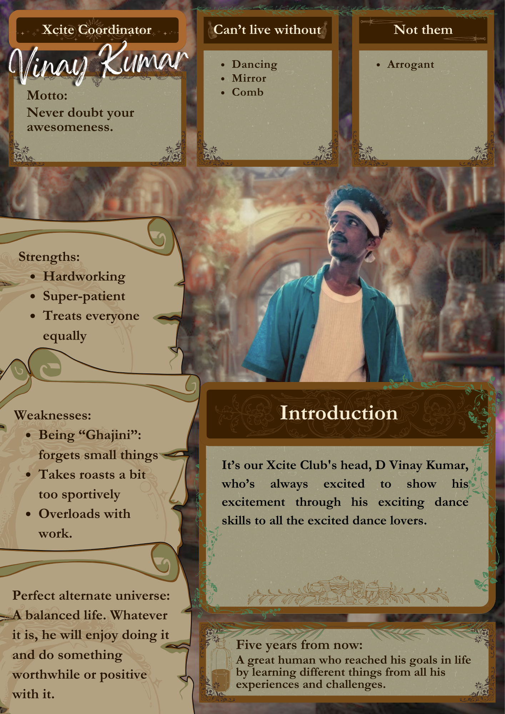

    

**How would you describe your tenure looking back at it now?**

It was beyond awesome! I have a super supportive core team, super enthusiastic freshers, and an awesome diversity crew and what else do I need? We did so many things – we conducted workshops for everyone to learn to dance, we conducted a special jamming session for freshers and we even made them perform on stage for Freshers’ Week, we conducted auditions for crew selection for Inter IIT and the crew got a Top 10 position in Group Dance and one Top 5 position in Street Battle by defeating many 1G and 2G IITs at Inter IIT, and finally the performances that we gave on stage for everyone was everything for us.            

- - - 

**Humour us with some of the mistakes you’ve made during it.**

I neglected my studies. I thought I could manage somehow, but I totally messed up. It's more like a regret for me than a mistake, and I know it’s not as funny :/       

- - -

**As tradition goes, one will soon take your place. What advice would you give them?**       

I tried to do or solve everything by myself, due to which I struggled a lot. I suggest my successor not to do that – take the help of your team and don't make decisions on your own. Discuss with your team and decide.       

- - -

**Ever fancy yourself to spearhead another club?**

Other than dance, I am interested in football and kabaddi. If there were clubs like a football club or a kabaddi club, I would have picked them.        

- - -

**Let’s take a look at what the student community has to say about them:**

>It was a good experience working with him. He chooses humorous songs that are very different from others when having a serious discussion. He fought tooth and nail for our accommodation in the dance room and great job in managing all the stuff required for Inter IIT 6.0. I personally feel that he could have managed his studies better, along with the responsibilities he had.          
>
>It’s really a lovely experience working with him. He is very dedicated to dance. He always tries to learn new styles. And always motivates us to work better. He did an excellent job during Inter-IIT Culturals 6.0. Even though he was new to it, just like any of us, he handled that phase very well.                                              
> \- *Kowshiki*

- - - 

**After 4 weeks of constant pestering, we consider ourselves lucky to share with you the responses from their dearest homies, on what Mr. Coordinator taught them:**

>Determination, patience and his sincerity towards work.                                             
> \- *Baini Santhosh*

- - - 

<b>Arvind</b>

 

*Debate and Oratory Club*

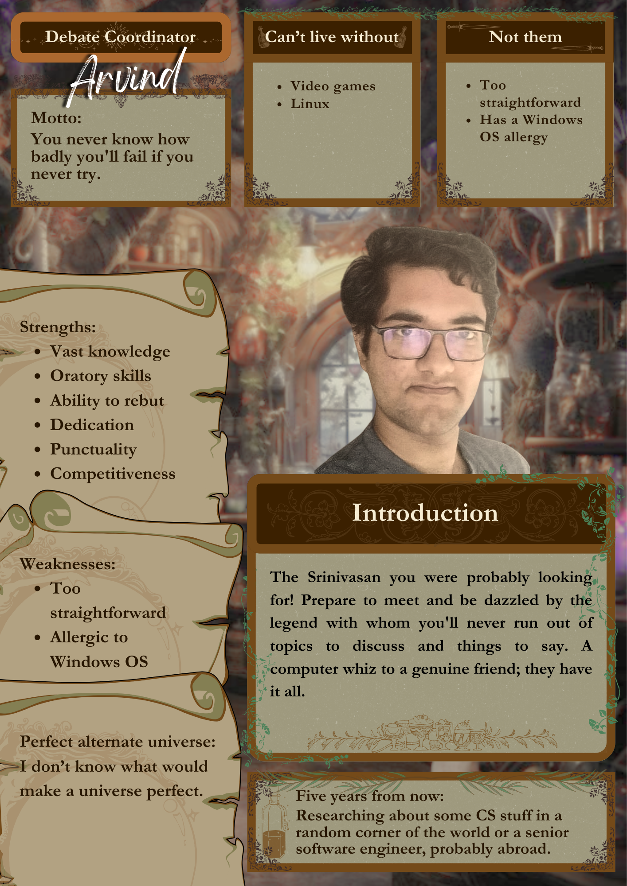

    

**How would you describe your tenure looking back at it now?**

Nothing much in particular - but I'm glad people were fascinated enough to turn up to many of our events. I think we tried to balance simple and complex topics to keep our events interesting to old and newcomers, but I can't tell if we succeeded.                       

- - - 

**Humour us with some of the mistakes you’ve made during it.**

I didn't know enough juniors to reliably put people in the club who could carry on the stuff we all knew.                      

On the funny side, there was an event where I wasn't part of the OC, and we ended up with some of the wackiest rules. It wasn't a very balanced event, but it was hilariously unbalanced.    

- - - 

**As tradition goes, one will soon take your place. What advice would you give them?**                        

It's a solo job, the core isn't particularly useful. Also, it's hard to get people to go to external events.                      

- - - 

**Ever fancy yourself to spearhead another club?**

Quiz Club – it would've been more straightforward.

- - -

**Let’s take a look at what the student community has to say about them:**

>Under his leadership, our debates weren't just clashes of opinions, they were Shakespearean dramas unfolding on a stage of logic and rhetoric. He pushed us to dissect complex issues, think critically, and articulate our views with the eloquence of a seasoned politician (minus the questionable hair choices, hopefully). First things first, props to Arvind for keeping things spicy! He managed to turn our club meetings into must-see events, with topics ranging from the profound to the downright goofy. Whether we're dissecting the meaning of life or debating the superiority of cats over dogs, there's never a dull moment. But hey, nobody's perfect, right? While his passion for playing devil's advocate keeps things interesting, there have been moments where it's left us scratching our heads. I mean, questioning the existence of free will during a debate about whether pineapple belongs on pizza? Talk about a mind-bender!                                                  
> \- *Jacob Panicker*
>
>There was work? I think he was pretty serious about the club's performance at Inter IIT and wanted new people to take part in the activities. He couldn't devote much time and energy into the thing because of other commitments.                                               
>
>Although it was only for one semester, I still had good time working with him. He handled his position well. It would have been better if he could have sent one debate team to Inter IIT.                        
> \- *Vikash Kumar*
>
>Arvind is undeniably a remarkable orator; He qualified for the final round of adjudication in an inter-collegiate Parliamentary Debate. That's no small feat!                                              
>I'll admit I had my doubts when Arvind first stepped into his role. But you know what? The term was not that bad. Events were organised and debates were held. This was possible because he had a nice close-knit team that kinda took over the reins and conducted sessions when he wasn't able to do it; But the catch here was that our regular participants (core team) ended up predominantly as organizers, leaving us with a deficit in participation.                                                         
>
>Towards the end, I found myself grappling with conflicting thoughts. I still do. Why did you take up the responsibility when you can't see it through its completion? On the other hand, it's good that you recognized you were not being able to do justice to the PoR and made room for someone who could. I really don't know where to go from there.                                                 
>
>As for his writing, Arvind is a skilled wordsmith in his own right. I've had the pleasure of working with him in Udaan, and let me tell you, his articles are top-notch. They're informative, engaging, and have that unmistakable "Arvind" flair. He's got a unique style that he fully embraces, and that's what makes his work stand out.                              
> \- *Sneha M S*

- - - 

**After 4 weeks of constant pestering, we consider ourselves lucky to share with you the responses from their dearest homies, on what Mr. Coordinator taught them:**                          

>How to not lose focus of your ultimate goal in pursuit of optimality.                           
> \- *Shreenivason*
>
>Being yourself is awesome.                                                   
> \- *Arup Biswas*

- - - 

<b>Shreenivason</b>

 

*Quizzing Club*

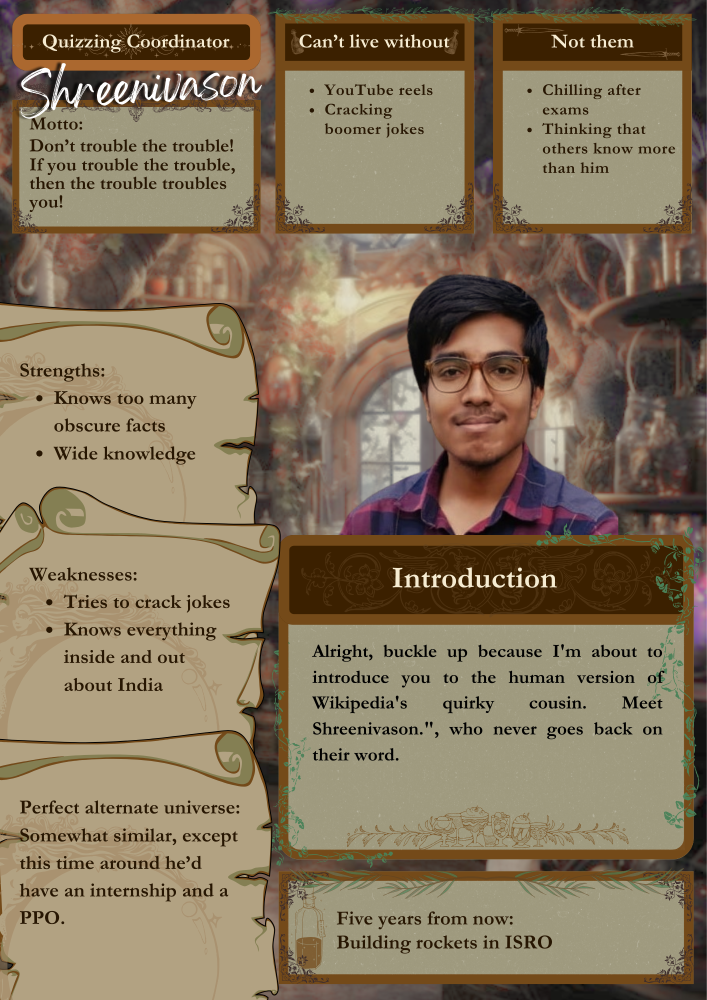

    

**How would you describe your tenure looking back at it now?**

7/10. I tried to perform to the best of my capabilities, but could have done better. The lack of participation in inter-college events is something which I hope to see rectified by future club heads. Otherwise, I believe that my tenure has been satisfactory. We were able to organise all FIESTA events successfully on short notice. We witnessed constant and consistent engagement from the student community in independent quizzes, and hope to continue the same in the future. The club now has 14 members, compared to just 4 when I joined. We have some exciting events planned for the rest of the term as well!                              

- - - 

**Humour us with some of the mistakes you’ve made during it.**       

I did NOT do my paperwork in a quick, efficient, and foolproof manner. Consequently, it took me 2 months to get funds dispatched to the respective stakeholders. 2/10, do not recommend, especially in EE 5th semester.               

- - -

**As tradition goes, one will soon take your place. What advice would you give them?**                 

I wish I had learned to take initiative in planning and executing various tasks, from sending a small message to organizing quiz events for FIESTA ‘23. I was fortunate enough to have a dedicated and competent team who were as integral to the functioning of this club as me. Another aspect I feel should be introduced is a long-term plan/roadmap, which I failed to make. 

My advice to the next club head: Recruit early, and recruit well. This will go a long way in reducing your stress and workload. Also, paperwork is part and parcel of your life. Learn to do it quickly, efficiently, and in a foolproof manner.

- - - 

**Ever fancy yourself to spearhead another club?**

Quiz Club, yet again. No doubt about that.

- - - 

**Let’s take a look at what the student community has to say about them:**

>My experience with him was amazing, he's an incredible leader, and it was a blast. Intra IIT, in particular, was awesome. I have nothing but positive things to tell about Shreenivason anna. He played his best with the cards dealt to him. Although there were some points, such as Inter IIT and Tirutsava which were out of his control, Intra IIT was handled pretty well. Some areas that could've been better executed were the weekly quiz practices, though. Overall, it was a good tenure.                                                  
> \- *Krishna Sameer*
>
>His reign as Quiz Club Head has been a memorable one. He challenged us, made us laugh, and proved that trivia can be more than just brain food – it can be a full-blown comedy course. His ability to weave fact with fiction, current events with pop culture, and obscure trivia with side-splitting humor had us all shouting, "Aha!" (or more often, "Huh?"), in equal measure. So thank you, from the bottom of our laughter-filled hearts, for the memories and the mental gymnastics. Now, if you'll excuse me, I have a sudden urge to Google "longest river in the world"... just to be sure. He's the Yoda of trivia, minus the green and the questionable grammar. He crafted questions that were like riddles dipped in sarcasm, served with a side of "wait, what?". We learned more obscure facts than a team of Wikipedia editors on a sugar rush. Who knew the mating call of a narwhal sounded like a dial-up modem? (Thanks for that mental image, by the way.) His events were like well-oiled trivia machines, except instead of spitting out gum, they spat out knowledge bombs and laughter fits. Every night was a party for the brain! His meticulous planning and engaging personality made each event a delight. You never knew what to expect, except that you'd leave feeling smarter and happier. And we all appreciate a good pun, but some of his were so groan-worthy that they could power a small village. Maybe invest in a thesaurus for synonym-sational punchlines instead? Just saying, our funny bones deserve better.                                                            
> \- *Jacob Panicker*
>
>He was quite punctual and dedicated in his work but as the college internship scenario hasn’t been good, it has affected the work he would have liked to show. But while being Quiz Club Coordinator, it doesn’t suit to attend tech meets and then ignore your responsibilities.                                         
> \- *Vikash Kumar*
>
>It was good working with him. Hardworking and sincere, he has a serious personality, but also a fun side when there is a need for it. You could tell he really cared for the club and wanted the best for it.                                          
> \- *Akshay M*
>
>Shreenivason leads the club in a very systematic way, with multiple fixed agendas before every meeting, ensuring to cover every point and/or update incomplete agendas from previous meetings. His meetings are perhaps more organised than the GBMs and BoS meetings in the college. While he appears strict on the surface, he is flexible on deadlines and gives almost everyone an equal chance to contribute and host quizzes. This approach is beneficial for grooming new members of the club and benefits the club as a whole. Additionally, he meticulously works towards creating quizzes on topics not typically covered in college quizzes, making them interesting for both the question setters and the targeted audience.
>
>I have witnessed his growth and evolution from a rookie club member to a hardworking core member and now a great coordinator, and it has been a pleasure. A quiz coordinator’s role primarily involves planning quizzes, hosting them as a quizmaster, and ensuring no malpractice occurs. When planning quizzes, Shreenivason adopts a relaxed approach, providing guidance and setting flexible deadlines. As a quizmaster, he exudes charisma. However, when invigilating during someone else's hosting, he becomes the strictest invigilator known to humankind. The sheer look of terror on his face sends chills down your spine, deterring any thought of Googling answers. This method has proven effective, as the Quiz Club has had several successful quizzes under his leadership.
>
>One minor regret I have is that more events could have been conducted this year instead of meticulously planning every event and considering everyone's opinion. Simply going with the flow may have led to more events, but I have no complaints regarding the quality of quizzes conducted thus far. Rushing and overcrowding them into more events would have likely diminished their quality.                
> \- *Vignesh*

- - - 

**After 4 weeks of constant pestering, we consider ourselves lucky to share with you the responses from their dearest homies, on what Mr. Coordinator taught them:**                 

>What I learnt was communication and teamwork matter, and also, “Too many cooks spoil the broth.”                                    
> \- *Jacob Panicker*
>
>Not taking authority figures for granted.                              
> \- *Shreevatsa*

- - - 

<b>Sunandan</b>

 

*Scribbles*

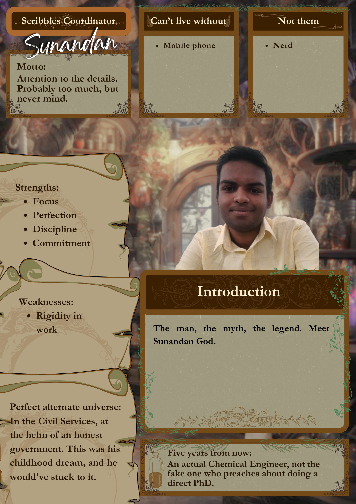

    

**How would you describe your tenure looking back at it now?**

I raked in good participation, handling the club as the second head. Some initiatives are planned and will get going at the end of my tenure (when writing this, those are in their initial phases). The fact that the Intra-IIT tournament significantly boosted participation in writing events was pleasing.                        

- - - 

**Humour us with some of the mistakes you’ve made during it.**

As a writer, I once forgot that every word is essential, and some things are even beyond words (probably better not to explain further, you know). Also, white text on a blue background sucks. I don't know why I did that on nearly every rulebook in the first half, but the more you know, the better.                        

- - - 

**As tradition goes, one will soon take your place. What advice would you give them?**                    

I should've gained some concrete information about writing clubs and the activities of other IITs to lay down the foundation for the future. For the successor, having catchy and groovy topics would draw huge numbers, even though it may go down as walking on a tightrope.                    

- - - 

**Ever fancy yourself to spearhead another club?**             

I would like to be the coordinator of the chess club, Chaturanga. I've been actively playing chess online for four years now, and I could've overtaken some juniors in the race (obviously, speaking this on a lighter note – you're doing marvellous, Teja!)                             

- - -

**Let’s take a look at what the student community has to say about them:**

>Working with him is a great experience. He’s very supportive as a club coordinator.                                       
> \- *Varun Khillare*
>
>It was good to work with him. “Are ho jayega,” he says whenever I ask him to do something. He was good at making things happen properly. In one sentence, he’s a perfectionist. Yeah, it would have been great if he, or other coordinators also, had searched for more inter-college events.                                                     
> \-*Vikash Kumar*
>
>I wasn't part of the core team of Scribbles for the current term, but I had the opportunity to interact with Sunandan both during the interview process for club head selections and the core team selection. He possesses an excellent vision for the club and approaches things with meticulous planning and clarity. Sunandan understands the requirements of the club well and plans and executes accordingly. He is highly knowledgeable and talented, not only in writing but also in other aspects. Sunandan is my batchmate, and having known him since our second year in the same branch, I can attest that he gives off the vibe of a top performer in academics (which he actually is) and is an avid enthusiast in literary arts, particularly writing.
>
>Regarding his term, Sunandan has performed admirably, garnering significant participation and attention from various on-campus events and inter-IIT competitions. The writing community in our college is still in its early stages and has a long way to go. Sunandan has contributed to sustaining the culture and laying the groundwork for a robust club. One area for improvement could be conducting regular events and fostering collaborations with other clubs.                                                                       
> \-*Ram Mohith*

- - - 

**After 4 weeks of constant pestering, we consider ourselves lucky to share with you the responses from their dearest homies, on what Mr. Coordinator taught them:**                           

>Sunandan showed me how to be focused.                                                
> \-*Vikash Kumar*

- - - 

<b>Arpit</b>

 

*Digital Wizards*

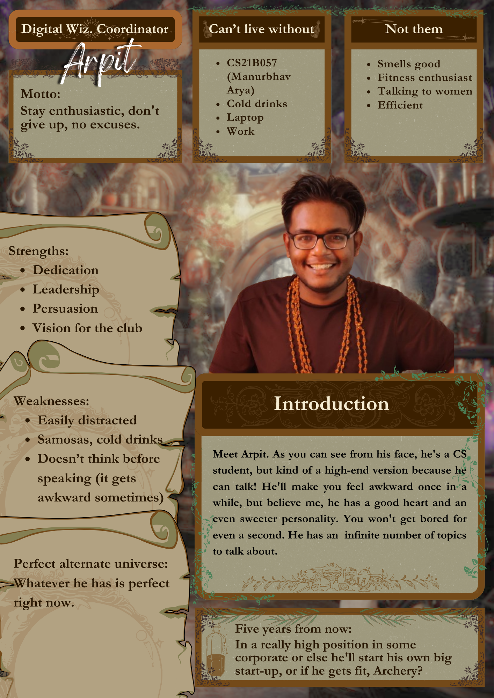

    

**How would you describe your tenure looking back at it now?**

Working with my friends to bring in GDSC. Re-starting project culture. Innovating the game again.         

- - - 

**Humour us with some of the mistakes you’ve made during it.**       

Sending a ChatGPT-generated mail, without proper editing.  

- - - 

**As tradition goes, one will soon take your place. What advice would you give them?**           

Don't do it for a POR. If you really want to learn leadership and start leading projects, join in. It's more of a management role than that of a coder.                   

- - - 

**Ever fancy yourself to spearhead another club?** 

Techmaniacs because I have knowledge of IoT and stuff, and Gagan Vedhi because I enjoy physics and astronomy.               

- - - 

**Let’s take a look at what the student community has to say about them:**

>I had a great experience as a core member of Digital Wizards, and it's all because of the great efforts put in by all the members of the team and the excellent guidance by the coordinators. He always encouraged discussions and improvements, which is a good quality. I believe he is a great coordinator and served his best in terms of both technical aspects as well as management.                                          
> \- *Jaimin V*
>
>A splendid experience, indeed. I was able to make improvements in the current coding culture of our college under his guidance. Witnessing Arpit Bhaiya effortlessly juggle numerous facets of the club simultaneously, from overseeing various domains to meticulously managing budgets, has been truly inspiring. The seamless coordination of such an important club to achieve success is a testament to the exceptional leadership skills he possesses. Here's to hoping for continued excellence under his guidance.                                                     
> \- *Sayan Kundu*
>
>Pretty good, no cap. I learnt that he can lead well because he can make my lazy self do some good work without making me despise him, LMAO.                                            
> \- *Niraj Kumar*
>
>In one word, simply fantastic- both in technical areas and in coordination.                             
> \- *Umakant Sahu*
>
>He did a great job as the DW head. He had a plan on the events to be conducted throughout the year and this year we saw better participation in the workshops and events organised by Digital Wizards. Also, the GDSC team formed this year, along with DW led by him, were able to organise events in collaboration with Google. Overall great job and no complaints from my side.                                                     
> \- *Sumukh Porwal*

- - - 

**After 4 weeks of constant pestering, we consider ourselves lucky to share with you the responses from their dearest homies, on what Mr. Coordinator taught them:**

>To always work hard and dedicate everything, regardless of the result. Brother likes to send referrals of random apps to people so that he can earn money. He likes to try out new jokes on me and hear my reviews about them (he desperately wants to become a stand-up comedian I guess).                                             
> \- *Shafi*
>
>Jugaad, roasting, and saying something technically wrong with full confidence. Despite his laziness, his occasional body odour, and his fondness for lame jokes, he manages to be anything but boring. Even if he pulls off some tricks during exams, being angry with him is a challenge only true friends would understand. It's the kind of charm you grasp only by being part of his circle.                                                                   
> \- *Manurbhav*
>
>Consistency is key.                                         
> \- *Chetan Yadav*
>
>How to talk to get people to work for something.                                               
> \- *Abhinav*

- - - 

<b>Manas</b>

 

*Gagan Vedhi*

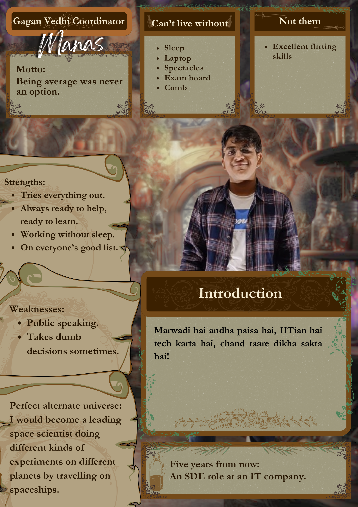

    

**How would you describe your tenure looking back at it now?**

It went pretty decent. Initially, there were some difficulties in getting funds for the Astrofest. I had meetings with the IISER coordinator twice a week. When the Astrofest came near, for the whole week before it, we literally used to call each other 40-50 times every single day, but things got executed really well, and the two-day fest was a success.                       

This time, I was also able to pull out the funds to buy some equipment for the club during February so that the following year, the crowd could expect more frequent gazing sessions.                                          

Though I organized regular documentaries and quiz sessions less but was able to start some good projects under the club. Currently, two projects are in progress under the club, one that we have set a deadline for April 2024 and the other one being a long term project on rocket modelling. The Rocket Modelling project is going at a very slow pace due to funds and space, but I think by next year, we will be able to make a workable physical model.                       

Also, there were times when I thought of resigning when the load was too much to handle, but I managed to get things to work out and will be able to leave the club with a significant contribution. Also, this year, I gave the club its personal website, which I think is a vital component for every club.                            

- - - 

**Humour us with some of the mistakes you’ve made during it.**

None (my personal opinion).     

- - - 

**As tradition goes, one will soon take your place. What advice would you give them?**             

I was not able to allocate work properly to my team and took an unnecessary workload on myself. However, I think it's my weakness and not every coordinator will face this. 

My message to the next coordinator will be to organize the Astrofest (Athereum) in a more grand way with banners and better marketing, A-Z. Form separate teams for sponsorship, events management, website team, etc. Take care of the ongoing projects and start parallelly by flagging off new projects. Also, you can find the list of tasks in the drive, just like GitHub readme.

- - - 

**Ever fancy yourself to spearhead another club?**

I can't really think of any because my sole interest is in astronomy.  

- - - 

**Let’s take a look at what the student community has to say about them:**    

>Working with him was such an enriching experience. His mentorship has always provided me valuable insights, fostering a deeper understanding of Celestia and space and it enhanced my passion for astronomy further. His performance is really good as he has excelled in promoting a collaborative and learning environment. His passion for astronomy has made the club a vibrant hub of celestial exploration and enthusiastic learning.                                                         
> \- *Aniket Johri*
>
>Working with Manas Bhaiya was truly an enriching experience. The star gazing sessions he organized were not only fascinating but also showcased his dedication to promoting Astro culture. Despite the current lack of enthusiastic Astro lovers in our college, he tirelessly worked towards creating a positive change, and I am hopeful that his efforts will bear fruit in the coming years. Being a part of the organizing team for the Astro Fest, Athereum in collaboration with IISER under his guidance was a valuable learning experience. It gave me insights into event management, teamwork, and various other aspects.Adding on, his leadership style encouraged a collaborative and inclusive environment, making the entire process enjoyable and educational.                                         
>
>I am grateful for the opportunity to work alongside him, and I believe that the skills and knowledge gained during this period will serve me well in my future endeavours. Here's to hoping that the Astro culture in our college flourishes under the influence of such dedicated individuals like him who tried his best to improve the Astro culture in our college.                                                          
> \- *Satyam Singh*
>
>Hey Manas, kudos, man! Its quite delightful to see the level to which you have uplifted the club. In times when your batch was (is) suffering due to the scary internship recruitment scenario, you worked gracefully on your portfolio as well as taking the club to new heights. Significantly, the Astrofest was a stellar success. Despite challenging times, your dedication to enhancing the club’s profile has not gone unnoticed. I admire your efforts in making the website for the club. The events which the team wasn't able to conduct during the previous tenure, were successfully conducted in yours. You made the Astro Treasure Hunt possible! Astrophotography workshop, and yes, I wouldn't forget the AstroJAM! It was pretty funny and enjoyable at the same time. I hope this collaborative fest between IISER and IIT keeps growing every year, and I will really, really miss it the next year. Do keep me updated about it, I will be eager to know about it. Thanks for purchasing the new equipment for the telescope, please try to get a new telescope as well. Few faculty members are always there to back you. There are many things I want to say, yet I would like to pause and congratulate you and your proactive team! The strong bonds you’ve established with your subordinates are truly impressive. I am surprised by your leadership skills that drive the members to work hard with their hearts and make the unexpected possible.                   
>
>I remember your sentence - "Bhaiyya aap logon ko daatate nahi the, mein daatata hu to meri sab sunte hain." Very true, "Mujhe tumhe bhi daatana chahiye tha… LOL". You are lucky to get such a team; the team is lucky is have you, and I am lucky to see the club flourishing in your tenure! The Star Pattern Recognition Project is going well, and even the Freshers are putting up their sincere efforts and developing their skills. I am happy from the bottom of my soul that Gagan Vedhi is adding value to the technical genius of the students.                                            
>
>The things which could be better, well- I am still waiting for Documentary Quiz. Also, verify the mistakes in the mail before sending. I wish to see a telescope on our campus via which we can see nebulas and other cosmic objects. And yes, I want AstroJAM once again! But I am pretty happy with your performance and thankful for all you did. Keep this up in all stances in your future. I wish you the best, my champ!                                                                                              
> \- *Pranav Sutar*
>
> It was great. The astronomy club continued to organise the AstroFest, collaborating with IISER Tirupati. This year, we saw more students participating than the last year, thanks to the better promotion by the club. The club also started a long-term Rocket Modelling project, which was due for a long time in the club. One point I’d wish to raise is that I wish there were more workshops and events in physics and on the ML side of astronomy.                                                            
> \- *Sumukh Porwal*

- - - 

**After 4 weeks of constant pestering, we consider ourselves lucky to share with you the responses from their dearest homies, on what Mr. Coordinator taught them:**                  

>Try everything and simply keep trying. The branch doesn't matter. Studying on the last day can still let you win. It doesn't matter if someone in your team is working or not, you gotta finish what you started.                                                      
> \- *Arpit Gupta*

- - - 

<b>Aman</b>

 

*Navgati*

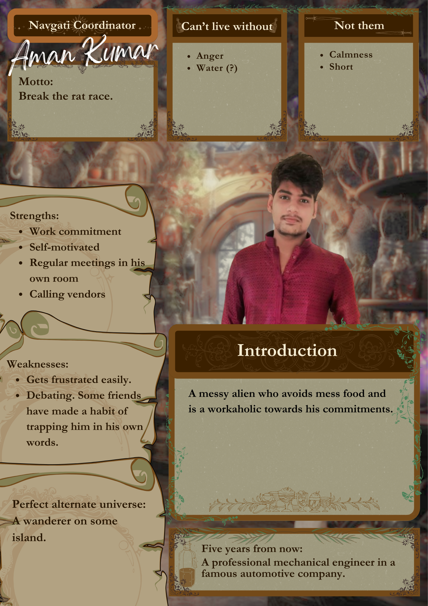

    

**How would you describe your tenure looking back at it now?**

How do I start…? I took charge of the automobile club against all odds, as the club was not functioning. It was a challenge to revive it from the dead. It’s the 2nd year students that are full of curiosity to learn and work whenever I call them. Sometimes, I was criticised for this “dictator behaviour”. As the day ends, I can't help but envision a bright future for the club. It has been our dream to build our own formula kart, a dream I believe will come true before I graduate.                    

- - - 

**Humour us with some of the mistakes you’ve made during it.**           

Not so funny, but I have a very bad habit of forcing the juniors to push themselves.          

- - - 

**As tradition goes, one will soon take your place. What advice would you give them?**               

My successor? You should be aware of the fact that our club has been trapped in the vicious cycle of rebooting every year. I tried my level best to break it this year and hope the vision of the club will continue through you.                  

- - - 

**Ever fancy yourself to spearhead another club?**           

Hala Navgati ...y nada más!              
*(Team Udaan translates this to - Go Navgati… and nothing more!)*

- - - 

**Let’s take a look at what the student community has to say about them:** 

>He is a workaholic and tries to bond the team together. He could work a bit on his technical knowledge, but overall, it was a good experience reviving a dead club and making some hands-on progress. It is very difficult to manage a club that had done no work prior to us and do something that we could show for. Aman played a key role in getting funds approved for us when other clubs weren’t able to. Also being able to even start such a big project is a feat in itself for which his efforts should be appreciated.                                             
> \- *Raunak*
>
>He is hardworking and honest. Aman tries his best to keep us fuelled up. But I personally felt that he was a little bit indecisive. At times, people don't take him seriously, which pisses him off. Summing up, he managed to get this club to a stage that the previous club heads couldn't and that's commendable.                                                     
> \- *Ayush*
>
>Fun. Working with him is fun. Despite my lack of time to work in the club, he maintained my input to be crucial in key moments. And in those key moments, we had fun. With plenty of "Oh crap ***smacks head***", "Uh oh, I don't think that's right", "Oh, we probably shouldn't have done that", "Nooo, how will that even work?", his tenure is definitely one full of stupid fun. As for building a car, well, it's taken mankind 116 years from the first mass-produced automobile to today. The chances of us doing it within a year are pretty damn slim.                                   
>
>The Club has always been about two points in space. Point 1 - where we're standing. Point 2 - our goal/where we want to stand. It may actually be a straight path, but only those who know about cars, know the chasms and the valleys and the lavapools and the deathtraps that lie on the road. There have been many moments where there's a LOT of determination to get to Point 2 with absolutely no bloody idea on how to get there from Point 1. Thus begins the search for plausible paths. Infinite in number and all separated by skills, understanding, time and patience, it's a hard choice again.                            
>
>The path to building a car, even if it isn't very fast, isn't easy. Sometimes it's important to realize that screaming, "I've told you guys to get to Point 2 for the past two months, why haven't you done it?" while having no concrete idea on which path to take is a futile exercise.                      
>
>That little blemish apart, his strongest achievement is definitely the team. It doesn't feel like a club, or a group or any of those standard things. It feels like a garage. And what happens in a garage? Well, you get screamed at for losing the 16mm spanner and you are thrown under the car to work on a leaking oil pipe, but it's your garage. You know you belong there and you know it won't let you down. That's where the team is today. The team may not be Adrian Neweys and Toto Wolfs, but they sure are people who'll stick together and get stuff done.                                                                  
> \- *Akhil*
>
>Talking about Aman, well, he is one of the most determined club heads I have ever seen. He genuinely wants to do something new for this college, and being a part of his team aligns with the same dream I have. Working with him has been an incredible journey. The Navgati team calls him ‘Mukhiya’ (Chief), as he is usually just giving orders. The team loves him a lot. However, he fails at assigning work to the team adroitly, decreasing the team's efficiency.                                                    
> \- *Shubham Ahirwar*
>
>I have seen three automobile club coordinators during my time in college here, and I guess Aman is the one who had a sound-knit plan. I have seen him and his team working hard on the project. He could have planned everything a bit earlier, as his plan was completed after student budget approval. I couldn't give him the budget required, and now we had to arrange the budget from all the leftover parts from the technical budget.                                                                                 
> \- *Sumukh Porwal*

- - - 

**After 4 weeks of constant pestering, we consider ourselves lucky to share with you the responses from their dearest homies on what Mr. Coordinator taught them:**                                         

>Will to commit to something no matter what the situation/circumstance is.                                              
> \- *Manas*
>
>Cleanliness. Bro mopped the whole 5-roommate room during Diwali. Cobwebs were also cleaned that day.                                                                
> \- *Bineet*

- - - 

<b>Chirag</b>

 

*Techmaniacs*

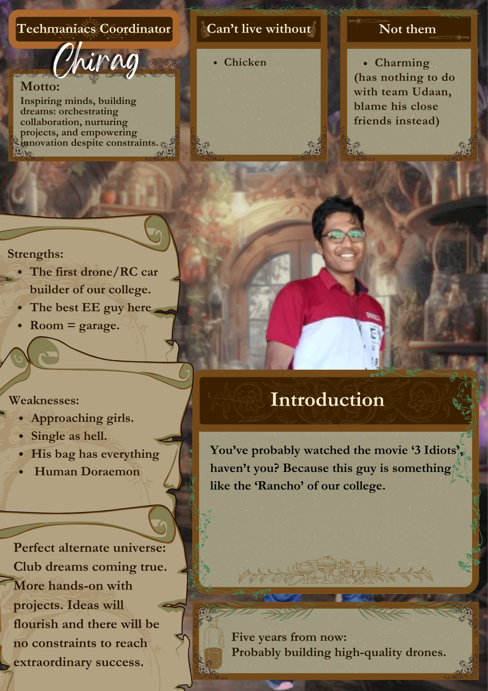

    

**How would you describe your tenure looking back at it now?**

I believe my tenure as a club head in this club was a good one as I was able to give this club a structure and organise the way it works, conduct more workshops than anyone previously, organize regular club meets, and start a few good projects in the club. 

Highlights of my tenure: We showcased all of the club interest groups to our alumni which was a hit, made a community for our club on WhatsApp with more than 350 participants, found contacts with vendors for cheaper purchases of components, and collaborated with a similar club from California State University, Chico.

- - - 

**Humour us with some of the mistakes you’ve made during it.**

For the alumni meet, we planned to make some projects and the funds would come from the OIA. That's what I spoke to officials about but when the time came for ordering the components, we came to know that OIA wouldn't be giving us funds, but they would just make it faster for us to use our funds for their event. So, we ended up procuring components from our funds, and the money didn't get wasted as the components we ordered were essentials for our club, and the event also ended up bringing our club to the attention of our alumni.                                       

Also, we got lucky here as after this event, the new registrar enforced his new rules and clubs struggled to get their budget and due to the procured components, we were able to continue to do some work in the club.                       

- - - 

**As tradition goes, one will soon take your place. What advice would you give them?**

Things I wished I learned before taking up this role:  Don't try to be a perfectionist, don't care much about the skills of the team but rather see who has more enthusiasm, and DON'T BELIEVE IN ONLINE INTERVIEWS.                          

Tips to my successor: Keep your budget planned beforehand and try to use your budget as soon as possible; if you are from 3rd-year B.Tech Electrical (like me), you are not going to enjoy the initial part of your tenure, but don't give up; you can handle it, as Sem 6 is way better than Sem 5. Don't try to change or take up many things at once; do one by one anything but make sure to complete whatever you start. Lastly, be rigorous with finances.                       

- - - 

**Ever fancy yourself to spearhead another club?**

If I could rewind time, I'd still choose to be the club coordinator of Techmaniacs. Since I stepped foot on campus, this club has been my anchor. I cherish every moment, for it's here that I honed the skills that define me today. This club is more than just an extracurricular; it's the cornerstone of my journey.             

- - - 

**Let’s take a look at what the student community has to say about them:**

>The year was fantastic as the club allowed me to take/host the workshops and be a team lead for two projects. Additionally, I was entrusted with the responsibility of conducting interviews, which contributed immensely to my personal and professional growth. The club head is very supportive, and he always tries to give us extra knowledge, for instance, which project we should aim for so that it becomes beneficial to get internships and crack interviews. He could have done better in leadership as he was not able to gather up all the participants of projects and make them work.                        
> \- *Prakhar Gupta*
>
>For someone who comes across as a wide-eyed dreamer, you cannot find a person who is more grounded in reality than Chirag is. He has led a commendable term as the Techmaniacs coordinator and a pretty successful contingent for the Tech Meet 12.0.  What sets him apart, in my eyes, is his unwavering commitment to ethical principles; he maintains clear boundaries that he refuses to cross. It was delightful working with him. I am genuinely excited to witness Chirag's future endeavours, as they are unlikely to be anything less than significant. Alongside his small team of friends, he has singularly shouldered the responsibility of nurturing the technical culture within our institute. This achievement is nothing short of monumental. My only hope is that a new group of individuals will step forward, ready to uphold and advance this torch of excellence.                                                                    
> \- *Sneha M S*
>
>He is very knowledgeable and good at guiding. Also bro, please find a way to get budgets passed.                               
> \- *Divyam Tiwari*
>
>This year Chirag was able to collaborate with the California State University students club to work on the Autonomous AI-based Drone Project. I know that they couldn't start the planned projects because of a delay in budget approval, but he should have encouraged students in the club to start working on simulated projects, as this would have kept the club projects running. Other than this, I don't have any complaints with him as he was the one who was the acting TAS on my behalf, helped me with Inter IIT as the contingent leader and did a great job being the Robotics Club head.                                     
> \- *Sumukh Porwal*

- - - 

**After 4 weeks of constant pestering, we consider ourselves lucky to share with you the responses from their dearest homies, on what Mr. Coordinator taught them:**

>How to push harder, how to handle sleeplessness, and how to do it for the fun of it.                                             
> \- *Arpit Gupta*

- - - 

<b>Udheesh</b>

 

*Aranya*

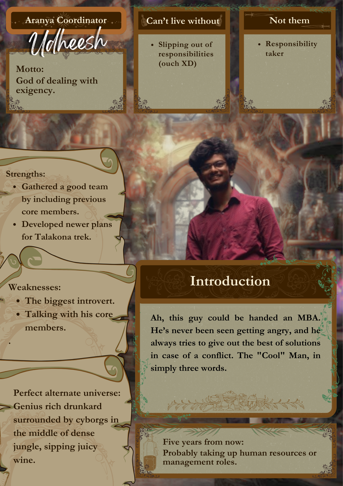

    

**How would you describe your tenure looking back at it now?**

Aranya Club is itself an adventure sports promoting club; as it's name suggests, my time in Aranya has been the most adventurous time in my college. At the initial stage, all I did was conduct games like "Treasure Hunts", "Squid Games", "Lagori", and "Tug of War", and the entire club got exhausted from these minor activities. So, later, when he had our first Trek to Tada, the club members (including me) got overwhelmed. It was our first big event. I started by scouting with one of the club members, and at first, we were afraid about the availability and management. But after the scouting, things seemed easy as when the plan was made, all I had to do was to take some students there along with me. We started making arrangements for that trek, taking permissions, required stuff and arranging buses. Then the trek day came and it was really hard to handle those 250 people; all of them were so excited for the trek. But finally, when we reached there we saw it wasn't really that hard. The best part is when the people compliment us for the hard work we put in for all the adventures they experienced. This was how I made my proud moments, along with the support of my best crew of all time.                      

- - - 

**Humour us with some of the mistakes you’ve made during it.**

I laugh during profound moments, especially when I am giving a long detail about any event during the times of meetings. During Squid Games, we were facing problems in conducting a few activities, so we had to modify the game and it turned out to be much more enjoyable.                                   

- - - 

**As tradition goes, one will soon take your place. What advice would you give them?**                              

I wanted to learn how to handle stress in peak times as there will be challenges at every step in an unpredictable club, and so did I. I want the future club coordinator to have many collaborations with external agencies and companies so that the club grows along. I want to push the boundaries to new levels set by previous coordinators as every one passes on. Let all the club members get the freedom to start a new idea in the name of this club.                                     

- - - 

**Ever fancy yourself to spearhead another club?**

I’d choose to be the coordinator of the Fashion club, cause I like fashion and modelling. People in that industry seem awesome.                                   

- - - 

**Let’s take a look at what the student community has to say about them:**    

>I just want to say that it was really a pleasant experience to be a part of this club, which came with such a friendly coordinator and a fantastic group of people with whom we organised every activity, from indoor campus activities (Treasure hunt and Fresher's Event) to trekking sessions (Tada Falls, Talakona and Nelakona Falls). Despite the obstacles we've faced during our adventures, we've tackled them together with laughter and camaraderie.                                                  
> \- *Tanvi Gupta*

- - - 

**After 4 weeks of constant pestering, we consider ourselves lucky to share with you the responses from their dearest homies, on what Mr. Coordinator taught them:**                

>To stay cool is something that can surely be learnt from Udheesh.                           
> \- *Vibhav*

- - - 

<b>Teja</b>

 

*Chaturanga*

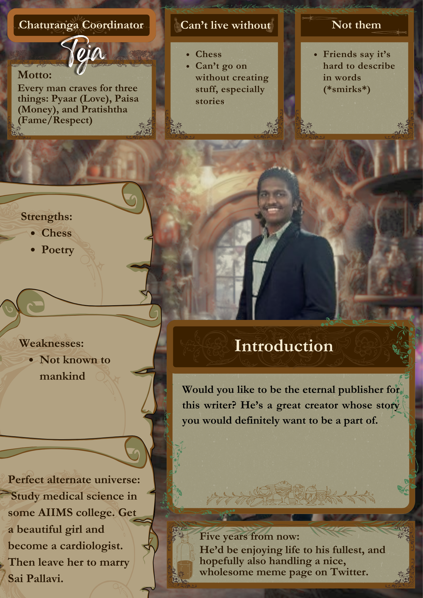

    

**How would you describe your tenure looking back at it now?**

I don't know what to say. Everything went pretty smoothly (had to lie here a little). I don't know how much the players enjoyed playing tournaments, but it was fun for me to plan and organise them. All thanks to the really amazing core team I have, who always contributed their part and more whenever required and never gave a second thought whenever we wanted to try something new; they were always ready for whatever came. Also, much thanks to all the students of our college who were always interested and excited to play this racist game of white versus black!                           

When it comes to highlights, every event stands out. Here are a few notable ones:                                         

1. AICL 5.0
2. Introduction of the chess club to the freshers (though unfortunately, we don't have video footage)
3. Aarambh '23, which attracted participation from 70 freshers (a pleasantly surprising turnout, despite some unexpected obstacles)
4. Azadi (the first King of the Hill variant of our college)

However, just like Arjun Kapoor gets a few hits by mistake in his filmography, the club also faced a few difficulties amidst the smooth sailing:                                 

1. Shift from offline to online tournaments.
2. Despite the challenges, the players maintained their enthusiasm, and tournaments continued. Personal favourites were the two children's day tournaments.
3. Recently, a puzzle event that was always in the plan has been put into action, resulting in lively debates and discussions in the chess WhatsApp group.                            

As I write this, I still have 2-3 months left in my term, providing an opportunity to explore and try many other new things, regardless of their outcomes. The next coordinator will take over and navigate through any challenges that arise. (Average politician behaviour, indeed!)                          

- - -

**Humour us with some of the mistakes you’ve made during it.**        

Well, there are a lot of points I want to mention:
1. Applying for the Chaturanga coordinator position.
2. Giving the interview and getting selected for the position.
3. Assembling a great core team.
4. Organizing new tournaments every time.
5. Getting to interact with many big brains and bouncing off ideas and interests.

The above points are just a few from a detailed list of experiences I have had. But the most important thing is that I don't consider these as mistakes. Instead, I want to relive these experiences as many times as possible. However, if I were to mention a regrettable decision, it would be: "Woh din pawn ko d6 par move nahin karna tha!!" (That day, I shouldn't have moved the pawn to d6).                                    

- - - 

**As tradition goes, one will soon take your place. What advice would you give them?**              

What do I wish I had learnt???
(Well... DSA and coding probably. I would have secured an internship by now... Oh! We only have to talk about the Chess Club, right?!)                                

So, again. What do I wish I had learned?
Nothing. I never wished for anything like that. Of course, this role taught me a lot of things, but only when I was 'ready' to learn them, not when I 'wanted' to learn them. It was a really great experience in that way. And I would advise my successor to follow the same. Wait for it to teach you. It's okay not to know anything. Just make sure you assemble a great core team. Just like mine, a team that doesn't need a leader to function.                       

And one more thing - I don't know how many people have advised you about this, but I would definitely say that this helped me a lot and will surely help you too - learn as many languages as possible. Yes, you read it right.
You will have to deal with many people when you are a coordinator. You have to own them. You have to make sure that they reciprocate the same, and what's a better way than speaking in their mother tongue to create that feeling of belongingness?                                

So, finally, I am pasting the same thing that my captain, Sanket bhai, wrote to me in his Udaan edition when I took over Chaturanga -
“I know the club will be in good hands as (one of you out there) takes over. I wish you the best and hope you take the Chaturanga Club to even greater heights. Let the legacy live on!”                                
 
- - - 

**Ever fancy yourself to spearhead another club?**

I want to be the coordinator of the Film Club because I love to write stories, and I want the people to witness my vision of my stories. A little advertisement incoming for some of my works-                           
1. I wrote ‘Bhalpaw to Kadhal’, which is a beautiful love story.
2. ‘Sweccha’ is a historical fiction love story.
3. ‘Nanna!’ is a feel-good father-daughter love story.
I’ll be coming up with a lot of other heart-touching stories, beware! (Advertisement completed. Oh, sorry, it was unskippable.)                     

I like watching my characters come to life on the screen, so I want to be the coordinator of the Film Club. The following year, when this same form is handed to me and this same question is asked, my answer would be without a doubt to coordinate Chaturanga!                       

- - - 

**Let’s take a look at what the student community has to say about them:** 

>It was a great experience with a lot of new things to learn. He managed everything perfectly, including meetings and events that followed. Regular meetings could have been conducted, and many more events could have been conducted. Still, the time constraint is responsible for all the shortcomings faced by our club. Teja, despite being low on time and resources did a fantastic job in regulating the club activities.                                   
> \- *Saket Verma*
>
>It has always been fun working with him. He is always open to suggestions, encourages all of us to come up with better ideas, and, on top of that, has a lot of ideas in mind. He has changed the way Chaturanga works; it’s not just a club that organises chess tournaments, instead, it has now become a more interactive place. We recently started a new type of arena, where we have a tournament on puzzles, not just those classical chess tournaments, and what’s better is how he announced it!  That was quite out of the box.                                            
> \- *Raghav Khandelwal*
>
>I had an excellent experience. There were jolly moments organising events with him and contributing to competitions. The exchange every time Sanket (last year's coordinator) and him faced off, no words, just pure gold.                                     
> \- *Sunandan Gad*
>
>It's good to work with him. He interacts with all core members friendly. He consistently wants to implement new ideas. As I know, he also writes stories (mostly romance), but I can't comment on them without reading them. One of the excellent tournaments we conducted was the Freshers Tournament '23. We didn't expect the large participation we saw, which felt good and propelled us to conduct a few more tournaments.                                                                       
> \- *Srishant*

- - - 

**After 4 weeks of constant pestering, we consider ourselves lucky to share with you the responses from their dearest homies, on what Mr. Coordinator taught them:**

>Punctuality, order, and when to stop thinking and start enjoying.                            
> \- *Nandhavardhan*

- - - 

<b>Vaibhav</b>

 

*E-Cell*

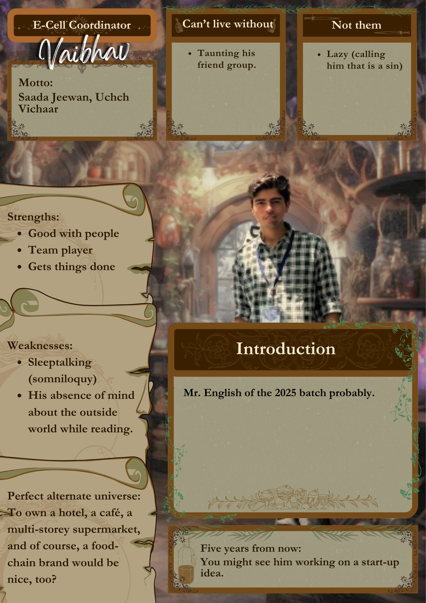

    

**How would you describe your tenure looking back at it now?**

My tenure was full of challenges and learning that comes with uplifting club activities or promoting it as a brand in the social space. As decided during the very early stages as a club head, I & my team pulled off a whole series of events by making sure that we hosted at least one event every single month.             

The visit to IITM (4th GDC symposium, Nirmaan, Ecell IITM) can be thought of as a game-changer in bringing enthusiasm to the whole team for putting in some extra effort to bring out some change.                            

- - - 

**Humour us with some of the mistakes you’ve made during it.**

Yeah, I put up an insta-booth on 14th Feb expecting a lot of couples to click pictures and snaps which would have been an indirect brand promotion, but It didn't work out as expected.                                   

- - - 

**As tradition goes, one will soon take your place. What advice would you give them?**                       

Being clear on your proposed plans or if I put it in simple words: Clarity of vision/future plans. It is one thing that I wish I learned before taking on this role.                                       

- - - 

**Ever fancy yourself to spearhead another club?**

I would love to work in the Career Development Centre (CDC) if I could return in time.                     

- - - 

**Let’s take a look at what the student community has to say about them:** 

>It was a great experience to work with him. He is a really good and composed leader. The workload was divided equally without hassle thus achieving all work/projects before the deadline. The trip to IIT Madras was one of the best things done by this club.                                                 
> \- *Ajinkya*
>
>It was a very rewarding experience working with him. His passion for entrepreneurship and dedication to supporting members' ideas and initiatives have been truly inspiring. I feel that his point of view on life is totally different from others. Apart from being a team player, I wish to appreciate how actively he encouraged collaboration and provided opportunities for everyone to contribute their unique skills and perspectives. One of his distinctive attributes was his ability to help us tackle our doubts and problems without making us feel insecure about them. I'm incredibly grateful for the chance to learn and grow under his guidance. He not only offered us the opportunity to develop new skills and leverage our existing experience but also recognized our efforts with rewards, further fueling our motivation and pushing us to excel. His meticulous planning and organizational skills were instrumental in ensuring the smooth running of all club activities and events. In terms of accomplishments, he truly shone in his ability to secure high-profile speakers and organise engaging workshops that left us all buzzing with inspiration. He conducted so many sessions with big startup leaders which felt like a great motivational kick to our upcoming journeys. Moreover, he even took the core members to IIT Madras for a symposium which was a first-time experience for many. Fortunately, I am elated that my knowledge base has broadened, thanks to him. As for areas which could have been better - well, I think he could have shared his experience about the startup journey with us, or his knowledge as it would have helped get all the members on the same line of thought.                                                                   
> \- *Saumya Sinha*
>
>His dedication and commitment to the club's success are truly admirable. His ability to communicate effectively and inspire the team members with ease has greatly contributed to a positive club atmosphere. Vaibhav's enthusiasm for our club's mission is contagious, motivating others to actively participate and contribute. Vaibhav Mishra has demonstrated exceptional leadership skills in managing our club activities. His organizational skills have been instrumental in planning and executing successful club projects like the visit to the steel factory helped us gain some insights about industrial manufacturing, and the visit to IIT Madras to attend the 4th GDSC symposium. The way he collaborated with the E-Cell of IITM truly deserves a round of applause.                                                                  
> \- *Divij Gupta*
>
>It has been an honour to work alongside Vaibhav Bhaiya during the 2023-24 academic year. His leadership and dedication have significantly elevated the impact and effectiveness of our Entrepreneurship Cell. His supportive and lenient approach has created a welcoming atmosphere within the club, allowing team members to thrive while embracing their individuality. Bhaiya’s knack for creating a laid-back yet productive atmosphere was commendable. It felt less like a club and more like a startup sleepover - Suiiiiiii (Ronaldo fans, assemble!)                                                
> \- *Subham Mohanty*
>
>Under his leadership, E-Cell was the most active club this year in terms of organising events, workshops, seminars, competitions and collaborations with other institutions. Also this year, E-Cell became a part of the Institute Innovation Council (IIC), which enabled more opportunities, and Vaibhav did a great job managing that too. I guess there is nothing he could have done better.                                                                
> \-*Sumukh Porwal*

- - - 

**After 4 weeks of constant pestering, we consider ourselves lucky to share with you the responses from their dearest homies, on what Mr. Coordinator taught them:**                                   

>How to manage people and look for opportunities.                       
> \- *Prince Kumar*

- - - 

<b>Himanshu</b>

 

*Arogya*

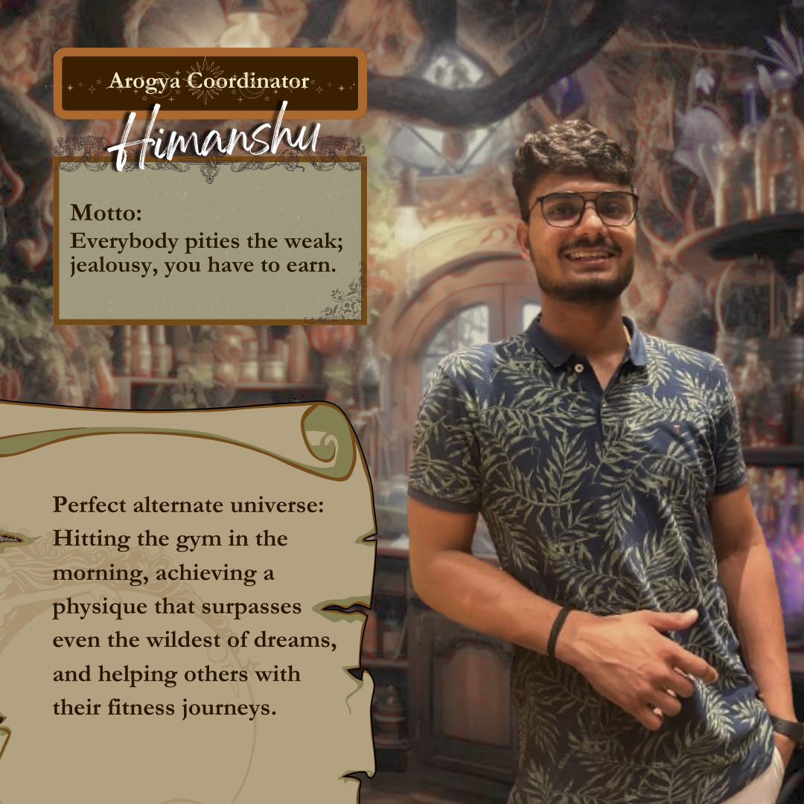

    

**How would you describe your tenure looking back at it now?**

My initial experience with responsibility served as a valuable learning opportunity for me. It involved acquiring essential skills such as effective communication and interaction with higher authorities, executing plans efficiently, and cultivating leadership qualities. This experience provided a foundation for my personal and professional growth, enabling me to navigate future responsibilities with confidence and competence.                    

- - - 

**Humour us with some of the mistakes you’ve made during it.**

During a fitness event scheduled for 6 a.m., both Vasu and I were tasked with early preparations and organisation. However, due to staying up late the previous night, we overslept and missed our alarm calls, including those from Iyappan sir attempting to reach us. Eventually, I realised the situation and hastily joined the event, albeit midway through. Upon reaching the finish line, I was caught, resulting in an amusing encounter with Iyappan sir in front of faculty and fellow students.                                 

- - - 

**As tradition goes, one will soon take your place. What advice would you give them?**                      

Having proficient public speaking skills would be advantageous in my role. Additionally, I recommend to my successor the importance of assembling a competent team to share the workload, particularly since many fitness events occur in the morning. It's crucial that team members are committed to fitness and punctuality, as attendance during early hours is essential for effective coordination. If there's a shortage of applications via the Google form, proactive outreach to talented athletes and sports professionals is advisable to bolster the team's capabilities.                                       

- - - 

**Ever fancy yourself to spearhead another club?**

Even if I got a chance to go back, I would choose the same because it’s this or nothing.                                       

- - - 

<b>Poorna & Sudhakar</b>

 

*Ideas2* 

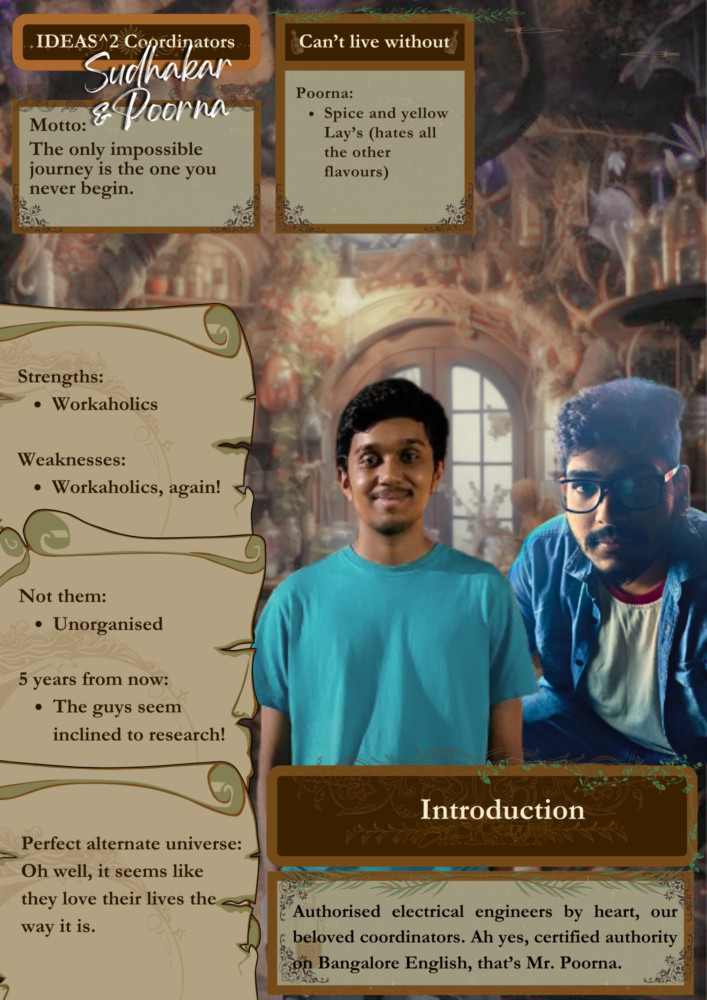

    

**How would you describe your tenure looking back at it now?**

*Sudhakar:*                     
My overall tenure was not that great. I wanted the club to be a hub where people come and work together rather than something that only conducts workshops. I wanted to set up the room properly for the same reason, but the process to get the budget cleared has been quite challenging. I have been trying since October 2023 to get the same cleared, but unsuccessfully.                       

- - - 

**Humour us with some of the mistakes you’ve made during it.**           

*Sudhakar:*             
My only mistake is that I thought that I could change stuff (yikes).                  

- - - 

**As tradition goes, one will soon take your place. What advice would you give them?**                   

*Sudhakar:*                     
I really don't know what clearly I should have known before taking this role. But I really wished to set up the room so that my successor didn’t have to suffer much like me.                         

- - - 

**Ever fancy yourself to spearhead another club?**

*Sudhakar:*               
I wouldn't want to take up the position of a club coordinator.

- - - 

**Let’s take a look at what the student community has to say about them:**

>Things were fine. This year’s Ideas² team did the least work compared to other technical clubs, and work was more demand-and-supply based; nothing was done except that, so that's why we didn't have any event from Ideas² side.                                                                                
> \- *Sumukh Porwal*

- - - 

**After 4 weeks of constant pestering, we consider ourselves lucky to share with you the responses from their dearest homies, on what Mr. Coordinator taught them:**                      

>The art of talking to people.                                              
> \- *Shreevatsa, about Poorna*

- - - 

<b>Ganesha</b>

 

*Statistics Club* 

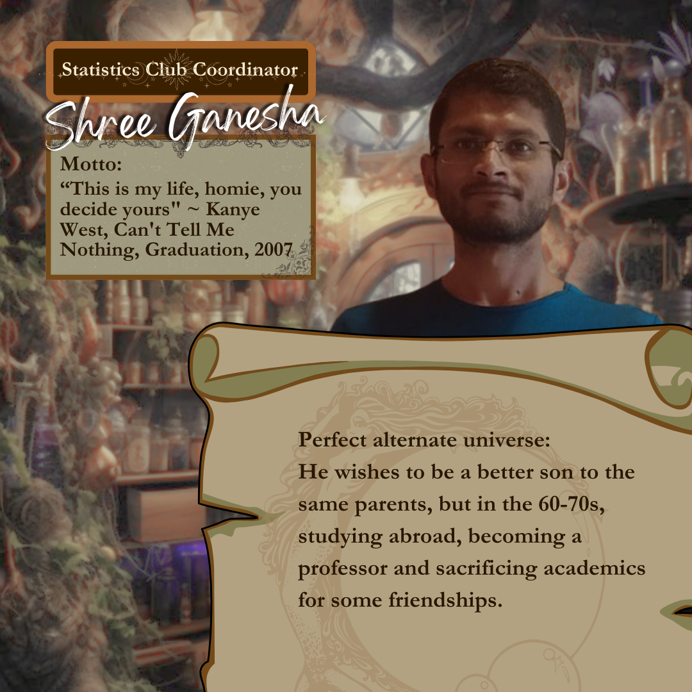

    

**How would you describe your tenure looking back at it now?**

My tenure was satisfactory! I founded the club and the culture with it and didn't run it to the ground. The series 'Puzzles in Probability' is the closest to my heart as it had a good turnout. The B.Tech students were very vocal, and came up with exceptional solutions. Next, we launched our website. I hope the club sustains itself and grows.                              

- - - 
**Humour us with some of the mistakes you’ve made during it.** 

I just realized I can write anything as an answer as long as I end it with LOL! Started on the wrong foot with the Students' General Secretary and the Academic Affairs Secretary. I need the latter's sign for almost everything. The thought of killing the club passed through my mind at least twice, but how could I do that to my baby? LOL!                                          

- - - 

**As tradition goes, one will soon take your place. What advice would you give them?**                       

1. Run your core team like it's a mafia and you are the mob boss. Have a few enforcers who get the job done by hook or crook. Have a consigliere to seek advice and peace.                                            
2. The dean's office takes an eternity to approve or reimburse funds. Apply for funds a month before you organise an event. Get used to the bureaucracy that at least five people have to approve of your decisions and that they know nothing about what you are doing.                             
3. I did not suffer because I had a good core team. Be good at delegation. As a coordinator, all you have to do is find what each of your core members is good at and assign small jobs that suit their passion.                      

- - - 

**Ever fancy yourself to spearhead another club?**

None. I'd be a better coordinator of The Statistics Club. To live and die in Stats.                             

- - - 

**Let’s take a look at what the student community has to say about them:**                

>I'll start by clarifying that I mean everything I say from the bottom of my heart. Ganesh Anna is one of the kindest and most compassionate people I've ever met. Being someone who is extremely smart and talented, he uses his knowledge effectively to be a capable leader for our Statistics Club. Being someone whom I've trusted deeply and confided in several times, it breaks my heart to realise that he will not be with me at college in the passing years. I thank him for all the counsel and guidance he's given me throughout. The first things that come to my mind about Ganesh Anna- one, he's a Kanye fan! That made me incredibly surprised and happy while at it. And another thing- while we were in talks of organising an event for schoolchildren, he repeatedly insisted on some of us taking care of the students, and when asked why, he simply grinned nervously and said, “I really can't take care of children- I find them annoying at times,” which made me double down and laugh with him after he said that. I don't think Ganesh Anna had any area where he could've done 'better' - he did an excellent job in bringing people together and also successfully conducted the events that we had discussed to happen.                                              
> \- *Ritvik Ravi*
>
>It was a good experience being a part of the core committee. I, for one, was part of the logistics and management part of the team, and I learnt the inner workings/technicalities involved in receiving funds from the institute for events. Overall, Ganesha Anna was a great leader, very appreciative and encouraging for all the little contributions I had.                                                          
> \- *Krishna Sameer*
>
>Ganesha was very passionate about statistics and gave me valuable advice about giving lectures and writing effective papers. He inspired me to apply to the core because of the sessions he conducted during 22-23. He made sure to credit the work of his club members appropriately and had a keen ear for feedback. He ensured that dissent was welcome and created an environment where good ideas thrived. Even when the core team fell short of standards, he encouraged us to improve. His core team was diverse, with a good mix of graduates and undergraduates. The club owes its existence and future success to him.                                                  
> \- *Mathew K J*

- - - 

<b>Ishaan</b>

 

*Sigma Squad* 

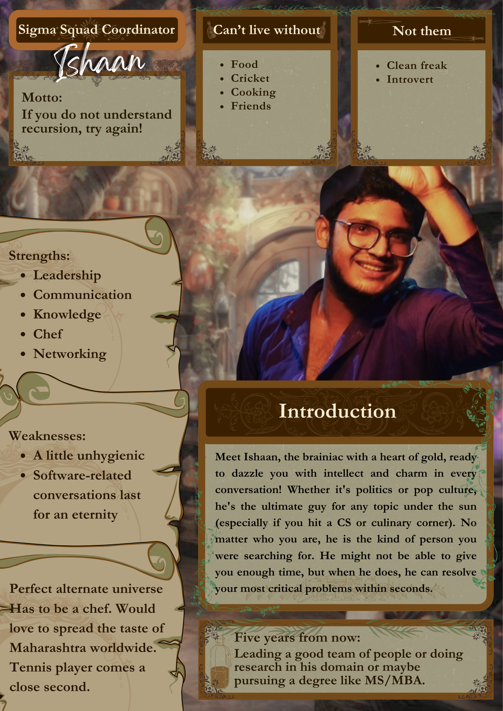

    

**How would you describe your tenure looking back at it now?**

Well, I would rate it as somewhere between average and good. We decided to split from Digital Wizards as they were more focused on Development and Algorithms as they should be. The efforts began when Deep and I took a session on the Mathematical Foundations of Neural Networks for our juniors. We realised that the penetration of AI within the minds of younger students, the freshers and the sophomores to be specific, was close to nil. Being interdisciplinary, AI can be of paramount perusal for all branches and thus, it’s not only a CS thing.                                                 

We hosted a few sessions after which we were told that the Freshers did not want more technical sessions as their academics were being affected. We paused our sessions for a while and by the time they got out of their academic trauma, we were on our way to the Inter IIT Tech Meet where we participated in 3 problem statements. The highlight of the year was when we produced results considerably better than last time having a top 10 finish in 2 of the 3 Problem statements in the first year of our operations without any funds from the institute. Also, we could engage a fresher in the team!                                             

We have strived to be a "Sessions - Second" club, where our primary motive is to hone core members for important competitions and future roles in the club. Sessions and dissemination of knowledge come later in priority for us. We wish to be the bridge covering gas stopping students from exploring the subject but at the same time, we do not want to be the entire road from start to destination as that would be detrimental to their ability to self-learning.                                                      

- - - 

**Humour us with some of the mistakes you’ve made during it.**

Well, maybe, we should have taken more sessions despite the resistance from the juniors. But again the question of participation would have remained unresolved. There’s nothing else major that I can think of.                             

- - - 

**As tradition goes, one will soon take your place. What advice would you give them?**                

1. Never expect funds from the institute or support from other clubs or secretaries. They're busy doing their thing. Run on a shoestring budget. Find ways to utilize available resources to the fullest extent. There are multiple workarounds, trust me. 
2. Create a knowledge pipeline in the club from the sophomores and freshers to the juniors and seniors to hone the students for future competitions properly. We tried doing this and were very successful. 
3. Try to have good representation from every strata of the college population but do not fill the core team just for the sake of it.

- - - 

**Ever fancy yourself to spearhead another club?**

Rasoi for sure! Firstly, I would have named the club something else XD. I would have loved to head Rasoi and win another medal at the Inter-IIT Cultural meet this year as well had I not been occupied with other things. As far as the why is concerned, the answer is simple. I LOVE FOOD. Eating, cooking, and exploring, all sit well with me.                            

- - - 

**Let’s take a look at what the student community has to say about them:**          

>It was truly a great experience getting to work with him and the team. The progress I made this year could not have been possible without the support and guidance of Ishaan Bhaiya. Really grateful for the time they had given us to hone our skills. During our inaugural year, I regarded our super seniors with an almost divine reverence. They seemed to embody some celestial powers in CS domain, leaving us mere first years utterly bewildered by their proficiency, achieved in the span of two years. We stood in awe, eagerly absorbing every morsel of wisdom they imparted. However, as fate would have it, I got to participate in Inter-IIT events and collaborative projects, granting me a privileged glimpse into their world. It was a revelation to see that behind their mastery lay not gods, but fellow humans, deftly navigating the delicate balance between academic rigor and life. It was an epiphany that resonated deeply within me, a lesson I shall forever cherish and carry forward.                              
> \- *Sayan*
>
>He gave us the freedom to learn at our own pace. I have not interacted much with him. But I have got advice passed down from others which was originally given by him. He was an inspiration among the seniors.                                
> \- *Ayush*
>
>I had a great time working with him- not to mention having a very amiable personality makes him really approachable as a person, and he sets himself an example as a perfect mentor-senior. Be it the meetings or anything informal, his body language and experience are sufficient enough to convey that he is indeed a really good leader. The main intention behind forming the Sigma Squad club was not just to primarily improve the AI-ML culture of the club but also to produce more participants for the annual Inter-IIT Tech Meets to improve the institute's performance. Evaluating his performance as plainly good, is an understatement. Being the 1st year of the club with barely ten members, he has coordinated to do a great job, as almost all of the core members took part in the Tech-Meet this year at IIT Madras. Moreover, Ishaan and Deep successfully organized sessions on various topics conducted by the core members themselves, which is also a progressive sign. The coordinators also managed to get the members in touch with Prof. Kalidas to keep him in the loop about the club activities and projects, which I feel was crucial to the club's growth from the grassroot level. To sum it up, they gave the club the head start it needed and laid the crucial foundation for the concrete that the club will architect. The responsibility of watering the seeds sown by them now lies in our hands, and hopefully, this club will live up to its potential in the coming years.                                  
> \- *Neerav*
>
>Ishaan bhaiya is a great mentor. He himself has loads of knowledge, so it feels even more great when a beginner learns under his guidance. He has good communication skills and is great at managing things. I would give the credits of the success of the Google Cloud Skills Campaign to him and his splendid leadership qualities. Even during the Sigma Squad Meetings, he always gave valuable pieces of information on important topics related to AI and ML.                                       
> \- *Aakarsh*

- - - 

**After 4 weeks of constant pestering, we consider ourselves lucky to share with you the responses from their dearest homies, on what Mr. Coordinator taught them:**

>Never mind what others think about you, but always try to be a better person than yourself.                   
> \- *Nilanjan*
>
>Academics is not everything. For a promising career, you need to go out of the way, all by yourself.  Don't care about small things and what the world thinks about you. Just be on your own way and "chill".                            
> \- *Pranav Sutar*
>
>Networking with people can get you to places you never imagined were possible.                                    
> \- *Chaitali*

- - -

<b>Deep</b>

 

*Sigma Squad* 

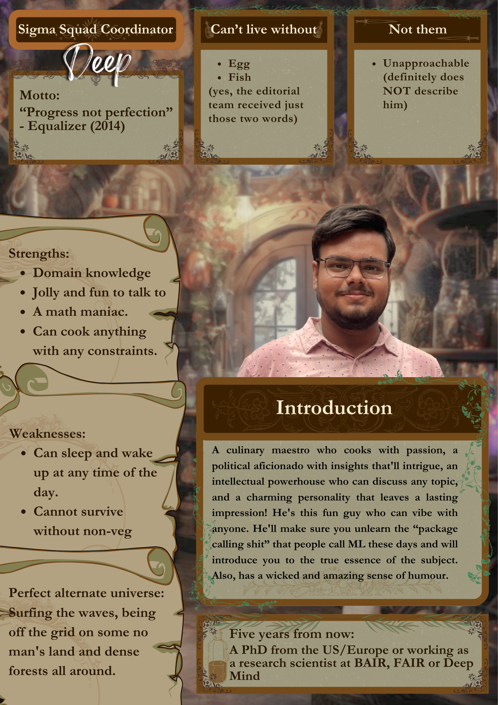

    

**How would you describe your tenure looking back at it now?**

Being the coordinator of a newly established club always has its challenges but thanks to such an amazing team the journey felt like a cakewalk. The inception of the idea of having a separate ML club had the primary objective of fostering a culture of solving real-world problems with ML and making the pursuit of demystifying AI and other heavy terms around us feel like ABC. A particular highlight would always be the Inter IITs, the meetings, and the brainstorming sessions that culminated to become the entire journey.                    

- - - 

**Humour us with some of the mistakes you’ve made during it.**                     

Perfectly predicting the position of our DevRev team after getting the penalty (applying ML in real life).                                  

- - - 

**As tradition goes, one will soon take your place. What advice would you give them?**                          

I think having a good discord management or tracking of the various branches would help immensely to monitor progress and put forward tangible metrics to attract new members going forward.                                             

- - - 

**Ever fancy yourself to spearhead another club?**

No other. This club was the idea that stemmed from the fact we need to give love the ML deserves from all aspects and not be only constricted to the implementation aspect of it.                                                        

- - - 

**Let’s take a look at what the student community has to say about them:**

>It was a great learning experience under him. As exposure, I got an opportunity to manage activities and conduct workshops. The club in its first year provided the college with a great base for the Inter-IIT Tech Meet. It was learning with fun, no small talk, open to all. He indeed did an excellent job in giving opportunities. His efforts as the co-ordinator have been nothing less than outstanding.                                       
> \- *Preet*
>
>It was a great experience, and I believe that all of us got to learn a lot from him. I've always been intrigued by the remarkable composure and ease with which Deep Dada orchestrates the affairs of our club. Merely jotting down a few lines of machine learning code is enough to stress us out, yet Deep Dada appears unfazed, effortlessly elucidating the intricate pipeline of an RL project. The enigma surrounding his ability remains unsolved, leaving us hopeful that one day he'll tell us how he does that.                        
> \- *Sayan*
>
>He gave us the freedom to learn at our own pace. Though I haven’t had much interaction on a personal level with him, he is famous for his advice that he has passed on to the seniors, in front of whom he had a really respectable image, and now to the juniors.                                
> \- *Ayush*
>
>This being the pilot year for the club, they both did a great job planning the activities for students and making a plan for the coming years. Also, we did a decent job in inter IIT events related to AI/ML.                             
> \- *Sumukh Porwal*

- - - 

**After 4 weeks of constant pestering, we consider ourselves lucky to share with you the responses from their dearest homies, on what Mr. Coordinator taught them:**              

>He has passed his invaluable knowledge in the domain of ML to us and how to just tackle life in general.               
> \- *Nilanjan*
>
>1. You need not be rigid about stuff, and being flexible has its own perks.
>2. Take the good from everyone and forget the bad.
>3. Live life one day at a time.
>4. Keep the end goal in mind.
>5. Work hard, party harder!
>6. Fish can never be replaced with anything!   
>                   
> \- *Ishaan*

- - - 

                                                       
- - -
As we reflect on the experiences, challenges, and triumphs of our outgoing representatives, one thing becomes abundantly clear: leadership at IIT Tirupati is not just about holding a title or attending meetings – it's about embracing the opportunity to make a difference, however small, in the lives of our fellow students. Whether you're bidding farewell to your time in office or considering stepping into the fray for the first time, let the stories of those who have come before you serve as inspiration and guidance. As the curtain falls on this chapter of student governance, we look forward to the next generation of leaders rising to the occasion, ready to write their own tales of resilience, camaraderie, and, of course, a healthy dose of chaos. Until then, let's raise a glass to our outgoing representatives and the memories they've helped create. Here's to the past, the present, and the exciting adventures that lie ahead at IIT Tirupati.

<!--EndFragment-->