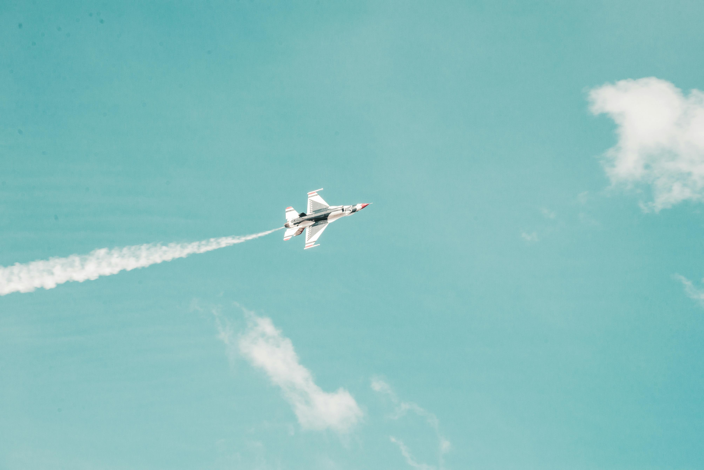

<!--StartFragment-->

***I can hear my heart beating.***

With the pressed tuxedo suit and the swaying coconut trees, the air was filled with grief and solemnity. The hymns of crickets on the trees brimmed the air, with people all entering the church for the funeral. The sunlight filtered in through the forest backdrop, giving a warm and comforting essence to the air. The whispers of Julie's family, the prayers, and the mourning blended together so seamlessly that my heartache showed no signs of abating. I stood beside the oak tree, this time with only the two of us, sharing this moment together.

***Flashback: 7 years ago, 2017***

“You have the patient, doc.”

“Sure, send them in.”

Curly hair, maybe around 5 foot 5, eyes shining like glitters, familiar dimples. A man walked along with her, holding her hand. His eyes dimmed down; he stared helplessly at me deep into my pupils.

“Hey, the nerdy Alex from school, aren’t you? Look how big you have become! In my wildest dreams, I would have never imagined that you were the Dr. Alex of the Neurology ward! You remember me, don’t you?” She gleamed at me with those eyelids as the album of memories crawled through my heart.

**THREADS OF THE PAST**

She was Julie Pauly, a character with a chapter published in my life; her story began back in high school. To put things in short, let me summarise. I was her senior back in school, and she had a huge thing for me. Starting from the secret stares I felt standing in the canteen queue to her filmy expressions when she walked past me through the corridors, it would be fair enough for me to say that I  found myself falling for each of her gimmicks, but the timing sucked. The subtle smiles and gazes developed into casual greetings, which then blossomed into what I'd call 'chit-chats'.

Ahem.

The chit-chats were suppressed easily. You know, it is so easy to shield something between a senior and a junior- all you have to say is, “ I’m mentoring her!”.

Yeah, so I was apparently mentoring her. Though I felt I was genuinely into this ‘mentoring’ mentoring business, she felt otherwise. Her intentions seemed questionable, and I was wary of her advances. The memories of the hour-long chats under the oak tree in the Church next to our school after the last period still blooms in my mind. The three of us had become partners in crime, and those were the small moments that made my school life colourful.

But I didn’t want to take our relationship any further than friendship. Not that she was a red flag, or a red carpet, as my Gen Z Instagram-addicted kids say, but rather the fact that I would be moving to the US the following year to continue my studies in medicine. I didn’t want to give her false hope as nothing was meant to be; it wouldn’t last. 

But she couldn’t contain her excitement, it seemed.  Two weeks before my prelims, she asked me to meet her near our church. the place that ignited the flame of all my memories. I remember it vividly,, under the oak tree, where she handed me a letter - the old school type, a poem. Perhaps too much to expect, I cursed myself for it. The poem wasn’t expertly woven, but it was enough to flatter and butter me up.

And where did it bring me? What did I do? I did something you’d probably beat me up for - I avoided her. I did what I had to do to avoid breaking her heart.

Immaturity versus maturity in action, I was recast in all the scenes.

The corridor walks- her eyes locked on every part of my face, while all I could do was embody what my Gen Z, Instagram-addicted son describes as his personality—yes, a sigma male, or an alpha male, whatever that means.  Sorry about the Gen Z references, but I consider myself a modern guy, even in medicine. Speaking of which, here's a joke for you: Do you know why the homoeopath brought a microscope to work? Because he couldn't see the effectiveness of her medicines!

Indeed, an alpha (or sigma) dad. But the tale goes on like this: the ignoring, the egos, the blue-tick-no-replies - it was rough, but I was convinced I was certainly right. Julie, on the other hand, moved on pretty quickly. After I had shifted to the US, I learned that she had moved on to the UK and had been accepted into the Oxford Aviation Academy to pursue her dream- flying. The one that never ghosted her. 

- - -

***PLAY***

I needed clarification. I was upset. I moved my hands, one pointing at the man, the other at her. I furrowed my eyebrows, giving a questioning stare that demanded, ‘Who are you to her?’.

Nivin's eyes, once brimming with hope, now reflected a deep worry that mirrored my own unease. He extended a trembling hand toward me, his voice barely a whisper, "Doc, she's Julie. I need to know about the reports. Is everything all right?" The weight of his words hung in the air, and my inability to find a comforting response added to the palpable tension in the room.

I ran out of words. My mind spun, and my eyes revolved around the room uneasily.

Julie’s mystical eyes, the MRI reports, husband Nivin’s worried gleam, and the wall posters. 

My throat tightened as I reached for the water, the cool liquid doing little to soothe the unease settling within me. My gaze shifted to the poster on the wall, the bold letters spelling out my achievements. Yet, beneath the surface, beneath the accolades, a storm brewed within, threatening to disrupt the calm facade.

I read the report statements and the MRI images. I couldn’t draw any link between anything in the room. 

“Hi Julie, nice to see you! I want you to wait outside. Could I please talk to Nivin?”

“Oh sure, you won’t kill him, though, would you?” She laughed.

The nurse assisted her, and the room now stood silent, with the both of us exchanging heavy stares.

His eyes oozed with tears, and he smacked the table. I took a heavy breath and consoled him. 

A profound sense of self-doubt gnawed at me, and I found solace in the familiar taste of blood as I unconsciously bit my lip. It struck me as odd; after all, I attend to nearly fifty patients daily, an almost mechanical routine that supposedly grants immunity to emotions. Yet, in the quiet moments, as Julie's story unfolded, I was forced to confront the vulnerability within, an unsettling reminder that, beneath the veneer of a seasoned doctor, I was still human, susceptible to the tidal wave of emotions crashing against the walls I had built - and the walls break pretty easily for friends and family.

Something felt unusual here- someone I liked back in school, those golden dimples, the passion she showed every time we talked, her successful career - and here was a case of an early onset Alzheimer's on the same remarkable gem, barely 35 years old. 

- - -

Never did I anticipate that Julie and my path would converge once again. Seeing the scan results, the hippocampus shrinkage, the tangles visible in the brain imaging, and the plaques - this was rare - a woman barely in her 30s diagnosed with Alzheimer’s.

Julie’s boldness shone, and the fact that her career and life would be doomed within a few years didn’t seem to bother her - it was a testament to the strength of her soul.

Exhaustion washed over me like a tide. A doctor, typically the harbinger of healing, confronted the stark reality of his own vulnerability. Treating those close to you inevitably unearths the human facets we often strive to conceal. In this poignant moment, I grappled with a profound sense of failure, my emotions tightening their grip on every fibre of my being. Helplessness loomed large, casting its shadow over me. 

“Nivin, Julie won’t be the one suffering. She won’t be in pain. She won’t be the patient. Alzheimer’s is one such villain who’ll prey on the patient’s loved ones. Disturbances, pain, and all of it are things that we - you and I - have to brace ourselves for. This disease encompasses all the emotions, depending on how we see it.”

I remember spending hours explaining to him what a neurodegenerative disease does. 

First, the speech, then the memories and slowly, the motor movement.

Physical agitation and violence - all a part of it.

But the part that pierces your soul is the gradual loss of familial memories - kids, parents, husband- name them all. Witnessing the transformation of the once active, enthusiastic person quickly fades away into shattered reflections of a mere shell, devoid of emotions, speechless and rather soulless, becomes the heart-wrenching ordeal that leaves scars on the souls of every doctor.

We employed the traditional approach for the first stage- omega-3 fatty acid supplements, vitamin D, speech therapy, exercise for motor functions and hydration. However, the paradox of my profession became quite evident, knowing these are only temporary interventions and that the disease will soon crave its path, thanks to its relentless course. 

Eventually, emotional detachment became my coping mechanism, and I could feel the emotional fortitude required within me beginning to develop. Yet as my emotions muted, my commitment as a doc to every patient only grew stronger - I realised that I was the wall they leaned on. It was my duty to ensure that for each patient, each story leaving an indelible mark, I never should let faith slip from their minds.

***PAUSE***

That night, I returned to my apartment and checked the racks. Inside the briefcase where I had all my school memories and albums stored, I found it.

A crumbled piece of paper with coffee stains on the corners, but the confession poem writing was as neat as ever.

“Hey Alex, 
My skin tingling with Alex Pox's itchy dance, 
Your eyes unravel my thoughts in a trance. 
Can't help but notice your effortless grace, 
Meeting up could be a captivating embrace? 
Share with me the secret of your godly stride, 
Not asking for a ring, just enjoying the ride. 
My eyes, like magnets, drawn to every part, 
That enchanting smile, a treasure from the heart. 
Remember our first encounter's light, 
You said tunnels end with a hopeful sight. 
Thoughts pour through my mind, a swirling funnel, 
You filled my heart, just an oil barrel!”

I couldn’t stop laughing. She continued, 

“They say dimples are deformities, 
But your stubble-d cheeks, I'm not at ease. 
The day you asked me to drop you home quick, 
Guess who prayed for traffic?”

I did pray, too, by the way, Julie. 

“And here's a pinky promise to the apple of my burning heart, 
Your drizzle waters the touch you planted, 
Won't leave you, my male-minx, 
Will unpack all the cool stuff in you with every convo, yours and mine, 
And hopefully gonna live together, ageing like fine wine…”

I had no clue why her proposal was still alive in my rack,  but it effortlessly revived the untouched corners of my school memories. My eyes glistened. 

- - -

***RESUME: 2018***

The therapy continued at pace, and Julie showed progress. Nivin appointed a home nurse. What really had me in dismay was an incident that happened a year ago. The periodic appointments continued, but I met Julie once after two weeks. 

I greeted Julie with a mixture of concern and hope, “Hey Julie, how are you holding up? Managing the supplements, all right?”

Julie moved in slowly, with Nivin holding her by her arm. The burden of the past year seemed etched on her face—dark circles shadowing tired eyes and an overall weariness that spoke volumes. She sat down and stared at me in deep silence. 

Julie then stared at Nivin with a flamboyant look. She looked back at me with a cagey face, a sense of unease lingering. 

“Ummm…. Aghhh… Where is he?” she asked, stammering a bit, seemingly rather disturbed - a visible struggle to articulate her thoughts. The disturbance in her expression reflected the frustration of trying to grasp a fleeting memory.

“Who?” I asked, sensing her confusion.

“The previous doctor, my college - no, high school friend? Did he leave this hospital?” Her words were stumbling upon once again, unable to express herself clearly. 

She seemed blank. I felt a void being carved out in my heart. Julie had now become family, and this hurt me. Nivin intervened and reassured her.

I placed my hand against her cheeks, seeing her pupils dilate. I asked her softly, 

“Look into these eyes, and tell me again you don’t know me, Julie! Alex Mathew, from high school, DAV - Aluva, the year 1998. Remember?”

She nodded for a no, and the folds on her forehead did the talking. Her fingers trembled and shook, and she pressed her hand, blinding her eyes, not wanting the sight of me anymore. I sat back and took a deep breath.

“Hey, listen to me. The person you see to your left, who’s come along with you, how do you know him?” I attempted to shift the topic.

Though Nivin tried to ease her hands, she held on tightly. Slowly, she strained her eyes, looking into mine. 

“He’s my husband, Nivin. He, um… yes - used to work at JP Morgan in London when I was practising as a pilot. We met at Nair’s party, remember?” A radiant smile graced her face as she reminisced.

“Yes, that party. I remember you wouldn’t stop eating the cheesecake, which was when I realised you would make a dedicated lover because all dedicated- “

"All dedicated eaters make dedicated lovers," they said in unison, their eyes locked, sharing a moment that seemed to rekindle their love. Julie's giggles filled the room, and I watched them with deep admiration.

But that year was particularly tough for both of them and me. Her condition deteriorated swiftly, and within months, all the consultations, therapy, exercises and supplements seemed to be helpless. This situation was unique because I have always been the one sitting, hosting the family sitting in front of me, who saw me as a saviour. But this was the first time in my life that I was also a part of the family, searching for a saviour within myself. 

**\*\*\*\*\*\*\*\*\*\*\*\*\*\*\*\*\*\*\*\*\*\*\*\*\*\*\*\*\*\*\*\***

***2019***

One troubling incident that hit me was one of the periodic consultation visits a year later. I remember Julie, who was expressionless, accompanied by a very anxious Nivin. Julie’s speech had taken a toll on her by then, and her language was rusty. Sign language and mood swings were the only indications of what the girl wished to convey. The moment they sat, she signalled Nivin with her arms, gesturing towards her mouth.

“Honey, we had breakfast a few minutes ago, remember? Your favourite salmon curry?”

Julie's response was a vacant stare, a chilling void that echoed the depths of her confusion.

She stared down at the tiles and shook her hand in the air, disagreeing completely. Nivin tried to ignore her reaction and looked into me, indicating to continue the conversation. 

But she intervened. 

She pushed him, held him by his collar, and broke down in anguish. I quickly picked up the tiffin I had packed from home - cut apples. A took one, snapped it into two and offered it to her.

She quickly grabbed the piece and chewed the apple. 

She kept chewing all the time I talked with Nivin about the medication. We discussed the dosage, schedules and therapy for quite some time, which was when I realised something. Glancing back at her, I realised that the apple was still in her mouth, and a sense of panic engulfed her. It dawned on me – she had forgotten how to swallow her food.

Nivin's hands trembled as he reached out to assist Julie, his heart aching with the weight of helplessness. He whispered words of comfort, his voice cracking under the strain of his emotions. "It's okay, Julie. We'll get through this together," he murmured, his words a fragile shield against the storm brewing within. I calmly held her hand and mimicked some jaw movements, teaching her to swallow. She glanced up at us, her eyes pleading for reassurance yet betraying a flicker of doubt. 

With a trembling breath, Julie tried to swallow, her throat constricting with the weight of uncertainty. But her body rebelled against her; the simple act of swallowing was now an obstacle. Panic surged through her veins, a wild torrent threatening to consume her from within.

We struggled for hours with this, and what became evident was her ability to gaze and listen to Nivin’s instructions carefully. In such a challenging condition, the best medicine was the tender tune of love and patience we all shared. 2019 was the last time Julie, the oak and I were reunited, though Nivin accompanied us. The serene solitude enveloping the atmosphere felt like a slice of heaven, a sanctuary where we attempted to recreate the familiar setting of our school days, hoping to trigger Julie's long-lost memories. Yet, as the months passed, our efforts began to falter, their efficacy diminishing daily. Our efforts went down in vain.

*The funny thing about life is that it is a big, big lie. A big lie spun out of many smaller lies. And this enlightenment only hits us when we are on the verge of losing someone dear to us. Society is a hunter at heart.* 

*Throughout my career, many times I have seen how the family members pray for the patient to die as soon as possible, for they cannot withstand the emotional massacre happening inside the four walls of the house. Not just death, but questions beyond - life after death, properties, relationships, and it brainwashes all the well-wishers of the patient to act.*

*Mentally, the fake family gets prepared for the loss, but they can’t show it outside for the sake of humanity. But in the world, there are a few people - maybe one or two, who yearn to see the patient every single day, no matter how much suffering they have seen.*

*Will they cry? Yes, they’ll.*

*Because they are the purest of souls - they cannot lie that the patient would recover.*

*So tell me, who are the ones supposed to act? Me, you and others - the fake family.*

*That’s how bitter life is.*

- - -

***2020***

The next year, during another consultation, we saw something similar. She gestured to the glass filled with the table, indicating her thirst. Nivin helped her with the glass, but she stubbornly slapped his hand away. She picked up the glass with her trembling fingers, and as I anticipated, it slipped from her grasp, shattering into pieces on the floor. The water spilled onto the mat. The sound of shattering glass echoed like a gunshot, reverberating through the silence like a mournful lament. She tried her best to control her tears, unsuccessfully. 

“We will help you with the water, don’t you worry,” I assured her.

I removed the mat and placed it on the side. I picked up another glass and filled it in halfway to reduce the weight. She gathered all her confidence and picked it up. Nivin watched anxiously as she took small sips of water, gulp by gulp, until she finished it. However, she didn’t release the glass from her grip.

“Honey, I can fill more water if you want-“ Nivin assured her.

Unyielding, she showed no signs of giving up. She continued sucking on the empty glass and then began biting it. I signalled to Nivin to take the glass away, but her grip was so tight that, as he attempted to ease her jaw, the second glass shattered into two pieces. 

One piece fell, cracking into fragments, and the other cut deeply into Julie’s lower lip, creating a bloody mess. 

The fragments scattered like stars, reflecting the harsh overhead light. Julie's eyes widened in horror as she watched the scene unfold, her trembling hands now painted in scarlet. The metallic tang of blood filled the air, mingling with the scent of fear. 

His breath caught in his throat, his hands trembling with a mixture of panic and helplessness. 

*A primal fear gripped her as she tasted the metallic bitterness on her tongue.*

She yelled in pain and tumbled down from her chair.

Julie, in a state of agitation, proved challenging to restrain. Beyond her bleeding lip, resembling a broken pipe, her frustration manifested as she tore at her temples and tried to pull out her hair in anger.

Taken aback, I urgently called for the nurse to assist. 

Julie ended up with a few stitches and her lip bandaged. The echoes of her cries from the emergency ward lingered, and this is one such incident I wish to erase from memory.

Love emerged as the guiding light amidst the shadows in the aftermath of chaos. I still remember the scene when Julie's eyes met Nivin's later, a silent vow passing between them like a whispered prayer. At that moment, they were bound by more than words; the unbreakable threads of devotion bound them. It was my first experience as a doctor cum family, and it taught me a million things about human emotions and humanity.

And so, they stood together, two souls intertwined in a dance of courage. For in the depths of despair, they found solace in each other's embrace, their love a testament to the power of the human spirit to endure, even in the face of unimaginable adversity. I remember that’s when I started paying visits to the church every week, praying for every single patient of mine who was stuck in the bubble of Alzheimer’s and then spending time under my favourite oak, where I confessed everything within my heart to the old friend of mine, who stood still - its leaves rustling every time I confessed was the sign that it was indeed listening to everything I had to say. Since then, it was only the two of us.

The following months unfurled with a relentless rhythm of intensive sessions and checkups. 

- - -

***2021***

The following year, one night, as I immersed myself in helping my son with his homework, the doorbell rang, disrupting the tranquillity of our home. To my surprise, Nivin stood at the threshold, a torrent of tears streaming down his face.

*Lewis Capaldi’s "Forever" played from the next room, the melancholy lyrics permeating the atmosphere:* 

`Caught me off guard, I wish that I'd been sober`

`Still, here we are, back in Hanover 99…`

Nivin stood in front of me, his eyes welled with tears. His look of composure and courage seemed to have faded away, and he could not find words to speak. His voice trembled with the weight of untold sorrow as he struggled to find words to convey the depths of his despair.

“She doesn’t recognise me anymore, doc. Her parents, my parents, and now me! Where did I go wrong? She can’t speak. She doesn’t smile. She seems imprisoned behind invisible bars she has no clue about. Am I a sinner? It feels like I’m witnessing someone ageing in reverse back at home, and now she’s a newborn toddler who has no clue about anything…”

My heart ached with empathy, and I stood there as a silent witness to a love story I once saw as unshakable. I stood before Nivin as a confidant, a beacon of solace amidst the storm. At that moment, Nivin was stripped bare, laid bare before me in a vulnerability too raw to conceal.

I endeavoured to console him, picked up one of my son’s white coloured pencils and guided him to the balcony, from where you could see the city's skyline on the left and the beautifully silky waves of the Arabian Sea to the right. 

`…Darling, nobody said that it would last forever`

`That doesn't mean we didn't try to get there…`

“The last few years of my life have mirrored this scenery, doc. From the skylines, representing a life I would give anything to relive, to the ominous waves of the lonely sea—silent, dull, and foreboding. My fate is out of my hands, but what distresses me more is Julie. She lost her career, her emotions, and her life. I just can’t handle that.” He sobbed.

“Here’s something you need to know, doc. I am not the Nivin she actually fell in love with.

The raindrops were relentlessly battering against the windshield like a thousand tiny fists. I was with my driver, returning from the airport, on my way home after the business meeting in Manchester. I remember staring outside, seeing my reflections in the droplets sticking to the window.

Suddenly, the driver's phone buzzed, shattering the eerie calm of the night. With a quick glance away from the road, he reached for the device, his attention momentarily diverted. He didn’t see that the road had a sharp curve, and I saw the road divider approaching right in front of my eyes, with my driver rather focused on his phone. I smacked his head and pointed to the road.

In that split second, the car veered slightly, the tyres losing traction on the wet asphalt. Panic surged through me as I gripped the armrest, my heart pounding in my chest. I tried to push some air into my vocal cords to scream out every bit of soul left in me, but the words caught in my throat as the car skidded, careening towards the unforgiving divider. The last thing I remember was the airbags popping out and being succeeded by a blacked-out screen.

The Nivin you see today wasn’t the one who worked at JP Morgan. He was prettier.

I was then admitted to the hospital in a coma, and the memories still seem to have faded. I remember how Julie used to sleep by my side in the room, with her grip giving me the warmth I needed and the endless number of stitches my face had taken. By the time I was fully conscious, two months had passed by.

My nose bridge bone was broken. My jaw had a crack. My right eyebrow had two cuts, slashing, just missing the eye. My left cheek appeared to be semi-burnt, and I couldn’t believe my looks the first time I stared back into a mirror. 

The doctor said that the next procedure that was called for was plastic surgery. At that instant, I really thought my love life was doomed. 

The next time I stood before the mirror was after the surgery. My reflection stared back, an unfamiliar visage gazing into my soul with eyes that seemed both foreign and hauntingly familiar.

Gingerly, I reached out, fingertips trembling as they traced the lines of my reconstructed face. I saw a stranger in my eyes. The lips, nose and structure- blanketed me in a sense of uneasiness and unfamiliarity with myself. Beneath the veneer of symmetry and perfection lay the remnants of a past I could barely recognise.

Gazing into the depths of my own eyes, I searched for traces of the man I once knew, the man whose features had been wrecked by fate's cruel hand. But he eluded me, lost amidst the maze of scars that now defined me.

I stood at the precipice of two divergent realities, each yearning for dominance over the fractured fragments of my identity. Who was this stranger staring back at me with his hollow gaze? “

I realised I hadn’t blinked my eyes in a while as I listened to a new, unfiltered story unfold.

`…Out of my mind, I don't remember calling`\
`Had too much tonic wine; sometimes it does the talking`\
`Hope you know I wish you all the love you're looking for…`

"But her affection for me remained steadfast. 

The first few weeks were awkward. I found it hard to befriend myself, let alone her. I remember my parents visited me - even beyond those happy tears, hugs and kisses, the snake of strangeness slithered over them. I wasn’t the son they made from the outside, and for a moment, I felt the grip of family no more.

But there stood someone else, beyond everything - Julie. I remember what she said: underneath this new skin is the familiar flesh and bone of my Nivin, and beneath that is the blood and soul of the guy I fell in love with. Her statements got me thinking, and I realised that soulmates- yeah, they do exist, and I’m lucky I can brag to my kids about having found mine!

Internally, I sensed that love transcends the superficialities of the mind; it resides in the depths of our souls. The true essence of beauty lies within, rendering external appearances immaterial. As time passed, I felt our connection grow stronger, and her warmth became a therapeutic balm for the wounds inflicted by the horrendous accident. During this period, I truly grasped the profound definition of love, doc. Now, I find myself in a state of helplessness and confusion, questioning whether I deserve her. Fading memories, and here, playing the role of a disabled husband failing to bloom any sense of hope in her life- I was never worth it for her!"

`…Nobody said that it would last forever`\
`Forever`\
`Forever`\
`Forever…`

I put my arm on his shoulder. The ball was in my court - it remained my duty to boost him up mentally amid the tornado that kept swallowing every bit of him, every ticking second.

"I can empathise with your sentiments, but you may have misunderstood. Consider the sea - its waves, tides, and ships- all in silence. Yet, beneath the surface, the moon's reflection sparks the water, extending as far as the eye can see.

Haven’t you heard the famous Malayalam song that goes by,

`‘Kadalinnagaadhamaam neelimayil,`

`Kathir chinnum muthu pole,`

`Pavizham pole….’`

*This means, ‘In the blue recesses of the sea, like a pearl that radiates light, like a coral.*

Don't you agree? Julie's life is akin to this. Afflicted by a disease with no cure, your role as her husband is to allow her to witness the pearl of the sparking water beneath her, even amidst the silence of the sea. As a family, it's our duty to ensure she relishes every moment of her life, up to her very last day."

I removed my son’s white pencil from my pocket.

"Look at this pencil. Its importance may elude us, but for an artist like him, it holds immense value. Similarly, in Julie's life, you are the white-coloured pencil, an essential element bringing beauty and meaning to her existence. While you may feel undeserving, belief can sometimes deceive us. Love is for the souls, and Alzheimer’s cannot extinguish the flame of a soul. Tomorrow, I want your assistance with something; I have a plan weaving in my mind."

`…When love was untamed`\
`Two burning hearts are dared to break, remember`\
`Nobody said that it would last forever….`

The captain of the Cochin naval and air-force port happened to be a dear friend of mine. With special permission granted, I envisioned a change of scenery for Julie, a surprise to lift her spirits. The following day, I chauffeured them to the base. Julie had hit rock bottom, and Nivin pushed the wheelchair as the girl, devoid of expressions, kept gazing cluelessly. I stood quietly behind them, the invigorating scent of the sea enveloping my senses.

As we arrived, the captain warmly greeted us and led us to the base, where a line of ten jets stood in impeccable order. Suddenly, one of the jets roared to life, ascending into the sky and gracefully cutting through the clouds. 

At that moment, a chuckle escaped Julie's lips, her hands trembling as she pointed to the sky. Nivin looked at her with pride, and it dawned on me - flying was the one passion that never faded for her.

I had been right all along. The flame of her love for flying still burned brightly, a candlelight in her heart. 

She gasped in surprise, and her lips widened, her eyes focusing on the jets carefully. I observed as her little finger intertwined with Nivin's, the sunset providing a cinematic climax backdrop.

- - -

Did I ever mention that Alzheimer’s patients are devoid of emotions and are soulless? I apologise; I take my words back.

<!--EndFragment-->