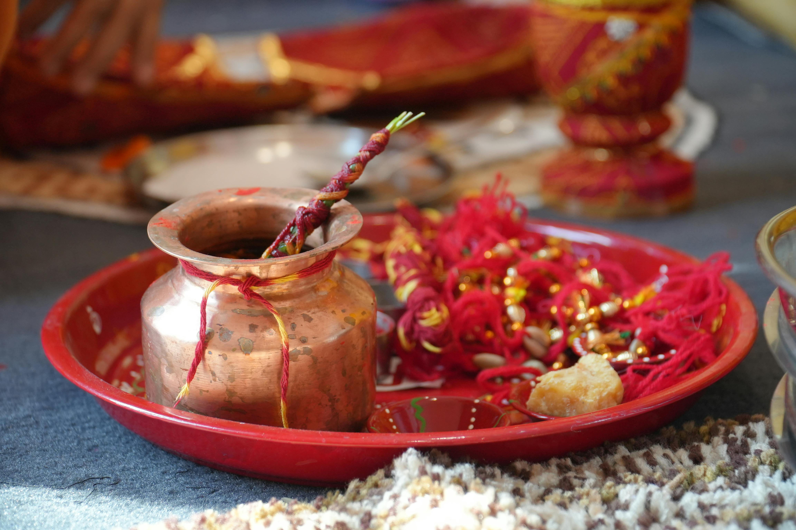

<!--StartFragment-->

> Please be advised that this article contains graphic scenes depicting violence, including blood and murder. Reader discretion is advised.

When will this be over?” I thought to myself.

Moving into a new workplace is one of the most stressful things that can happen to someone, especially to a new employee.

“Where should I put this?” asked one of the movers.

“Put it in the bedroom and wrap this up soon, please; I need to go to the office.”

It was Tuesday. I had just moved into my new house in this town, and my manager was gracious enough to scream at me for being late on my first day. I had to hurry.

\\[-_-]

I moved in, but I could not catch a second of free time to settle in. For about five days, I had been waking up, running to the office, crawling back to this hole I call home, and collapsing on my bed. One of my co-workers asked me what colour my bathroom tiles were. God knows! I never had enough time to notice them!

Finally, after the long one yearlong week, Sunday arrived! “Thank God!” I thought to myself. Another day without a break, I might have had to be buried right in my cabin! I really missed my mother. I had not eaten well the whole week! So, I decided to visit the temple nearby. I heard from the vegetable seller the day before that it was peaceful there.

As I started from my house towards the temple, which was about 500 steps away, I couldn't help but notice the imposing structure of the neighboring house, its modern design striking against the backdrop of the neighborhood. It stood tall, with a sophisticated flair that caught my envy. The alternating black and white paint on the house reminded me of the yin and yang for some reason. I also noticed some oak wood used for aesthetic design, which made me jealous. *Just wait until I build a house of my own!*

Yet, amidst my admiration and envy, I spotted symbols of faith adorning the house – a Hanuman flag fluttering proudly, alongside Swastikas and Chakras intricately designed on the walls. It was beautiful. Who would have guessed? Maybe these people were not those rich guys who acted like they were in Rome. Whoever lived there was evidently rich but also had devotion and some good taste. It gave me a sense of comfort and devotion. After all, I too found solace in spirituality. In fact, I was on my way to the temple! As I walked, singing, slowly losing all that stress accumulated that week, I entered the temple and looked at the statue of Sai Baba. I felt as light as cotton. He had always been a source of solace for me, a silent confidant in times of uncertainty.

Sai Baba, what should I tell you about him? His calm and comforting gaze, his relaxed pose, his omniscient eyes, looking into which I always found the answers to my questions. He is just divine! As I kept basking in the tranquillity of the temple, I came across an attractive girl. We were both standing in a line to crack our coconuts. She was ahead of me in the line and gave me a smile when I looked at her. I did not know what to do. Whenever we went to the temple in my hometown, my mom was in charge of cracking the coconuts. I had never learned how to crack one open!!

Standing there, unsure of what to do, the girl behind me sensed my hesitation with a mischievous smile. "You've never cracked a coconut before, have you?" she asked, her tone light and understanding. I nodded sheepishly, feeling a bit embarrassed. Without a second thought, she moved to the front of the line, taking charge of the situation- there was no one else in the line anyway.

She effortlessly took the coconut from my hand and held it with its tail pointing downwards. “This is how you should hold it,” she instructed calmly. So, I mimicked her actions. But I was scared. What if it cuts my palm, and I start bleeding? With another smile - indirectly calling me an idiot, she held my hand in hers, guiding me through the motion, encouraging me to crack it. “It will feel great,” she said. “What?” I asked. I did not know cracking a coconut could feel so great. But my hand definitely felt great in hers.

We exchanged names and shook hands. Her name was Amritha. She was a charming young lady dressed in a modern yet traditional-looking orange dress. She also had a noticeable hair bun, which was unlike ones I have ever come across. I told her that I had newly moved into the town, and she replied with a surprised smile that their family was the one living in that large house beside mine. 

She took me to her family sitting at the stairs of the temple to introduce us. There, I met her father, Mr. Uttam, for the first time. He struck an impressive figure, with a robust build and a neatly trimmed mustache adding to his dignified appearance. His demeanor suggested authority, hinting at a position of influence in his professional life. Beside him sat Amritha's mother, Priya, a woman whose radiant aura captivated me instantly. Like her daughter, she exuded a mysterious glow, yet hers seemed to shine even brighter. Her refined tone and eloquent vocabulary evoked images of an English teacher or perhaps a scholar.

I spent about an hour sitting there and chatting with them as if we were old friends meeting after a long time. With each passing moment, the weight of my job-related frustrations seemed to slither away, disappearing like a snake retreating into the shadows. They were friendly enough to ask how my work was and if I felt comfortable at the new place. They even welcomed me to their house if I ever felt lonely. In the end, I was surprised to learn that Amritha was 27. She was a year older than me! I thought she was a college student! Just as I thought she couldn’t get any cooler, she told me that she had a twin sister who lived in Bombay and was learning music.

\[-_-]

I used to visit their house regularly until December of 2020. They treated me like their son and often called me over for lunch or casual chats. Every now and then, when I cooked something myself, I took it to them, eagerly looking forward to their feedback. Uncle Uttam and Aunt Priya used to examine my food with sincerity, but my focus was invariably drawn to Amrita. Even when within the house, she often stayed in her room alone. It was during one such visit that I came to know that she had an Instagram handle with a good following. She posted unique content about devotional practices and combining modern fashion with traditional fashion. It was fascinating. So, I followed her account. Through one of her old posts, I found out that the hair bun she often wears is actually a replica of Lord Shiva’s hair bun. She called it an energy magnet that can bring peace to her mind. If only I had hair long enough to wear a hairbun!

As days passed, the pandemic kept getting worse. I decided that it would be better to keep my distance from the house, both for me and them. My work as a bank employee kept me occupied, providing a stable income amidst the uncertainty. Unlike me, Uncle Uttam and Aunt Priya both worked for private educational institutions. And by December, I could tell that they were beginning to get into an economic crisis. They even started looking pale and anxious as time passed. 

I felt I drifted away from them, and for the first time, I observed a shift in their demeanor, it seemed like they were pulling away. Before December, I had noticed quite a few people talking to them. But later, they wouldn’t meet anyone, even at Christmas! It was a stark contrast to the lively household I had grown accustomed to.  Well, everyone was stressed out from seeing the same faces at their homes throughout the lockdown! 

As the curfew was slightly relaxed in January, I decided to visit Tirupati and get the blessings of Balaji. Mindful of the auspiciousness of Fridays, I patiently awaited the opportune moment, and fortunately enough, I found an express straight to Tirupati. I decided to stay there for two days and return by Sunday night.  I packed my belongings and made my way out of my home. It was then I noticed Amritha passing by my gate. I greeted her, and her angelic smile didn't fail to stir my heart yet again. "You haven't posted anything recently?" I asked, unable to contain my curiosity. With a playful giggle, she assured me, "I will soon."  We chatted for a few minutes, and I told her that I was going to Tirupati. She wished me a safe journey and told me that her sister Diksha was returning from Bombay. She expressed how excited she was to introduce us both. Intrigued by the idea of meeting the twins, I set out.

\[-_-]

Tirupati is indeed a peaceful city! The temple, isolated from the city, located on the hills, gave me a lot of peace. On my return journey, I was extremely grateful to my mother, who recommended that I go there. I made a mental note to bring her along on my next pilgrimage. I wanted to share this peaceful experience with her. As my train reached the terminal, I got down and started walking out of the gate. But suddenly, I noticed Amritha there.

She did not see me, and she was talking to a man whom I had never met before. They sat on a bench, their backs turned to me, oblivious to my presence. I felt a little awkward to intervene. Plus, I did not know if it was Amritha or Diksha. I knew that Diksha was returning around that time. They were twins, and if this were Diksha, I would not have seen any pair of twins so identical in my life! I thought it would be better to visit them when I go to share the Tirupati laddu with them. So, I just went home, freshened up and fell asleep wondering if the girl I saw was Amritha or Diksha.

**25 JANUARY 2021**

As I drifted asleep, I heard a steady knock on my front door. It was around 12:30 at night. Who could it have been? I had no idea who could possibly be calling at such an hour. So, I just opened the door hesitantly and was stunned to see two policemen standing outside my house. My heart raced with fear as I struggled to comprehend the reason for their presence. “What happened…sir?” I asked them, my voice trembling. In an absolutely unexpected revelation, they told me that Mr. Uttam and his wife, Priya, murdered their daughters!

I was in shock. The police kept asking me if I had been home for the last few days if I had noticed any strange things around me, and if I had heard any screams that night. I had not! I had slept like a baby! And I could not bring myself to believe the fact that Uncle Uttam and his wife, of all people, MURDERED their own daughters! I told the police that I had just returned from Tirupati that evening, and I had seen one of the daughters at the railway terminal. I mentioned that I had seen her talking to some man. Since I had not seen his face. I could not give them any descriptions as to what he looked like. I even told them I was not sure which of the twins I saw. So, they took me inside their house to see if I could identify her from the pictures in their house. I was puzzled as to why they wanted me to look at their pictures inside the house and not at the girls themselves.

As I entered the big house, I felt my guts twist. I doubled over, retching uncontrollably, much to the surprise of the police officers accompanying me. The expensive white marble floor in Uttam Uncle's living room was now red. Blood was splashed all over the floor. And the girls? The back of the head of one of the girls was gone, and the face of the other was missing! I could not believe what I was seeing. I saw pooja items thrown around the hall and ashes spread before the pooja room. The police then told me that Mr Uttam and Aunt Priya had offered their daughters as sacrifices to God!

Sweat poured down my forehead, my body trembling with a mix of fear and confusion. As I slowly looked at Aunt Priya, who was sitting on the floor, she locked eyes with me and said, 

“Ajay!” 

“…Yes aunty…” I stammered, unsure of how to respond. Her next words hit me like a bolt of lightning.

“Why are you wearing chappal inside the house?” 

Her question echoed in my mind, sending a shiver down my spine. Without another word, I bolted out of the house, my heart pounding in my chest. What the hell did she mean? Her daughters were lying there dead! And my chappal was bothering her?

One of the policemen came to assist me. Gradually, a crowd began to gather, drawn by the unsettling atmosphere surrounding Uncle Uttam and Aunt Priya's home. The police began questioning the neighbours, seeking insights into the personalities of the parents. Just like me, everyone else was in shock that Uncle Uttam and Aunt Priya had done such a horrific thing! 

"There's no way Mr. Uttam could do such a thing, sir! He was a former vice principal of a government girls' college!" exclaimed one man, his disbelief evident in his voice.

"Priya was also a reasonable person! She was a math genius and a renowned lecturer at a nearby junior college," added a lady, her words echoing the sentiments of many.

I, too, shared my experiences with the family, recounting how kind they were to offer me counselling during my bouts of homesickness after I had moved in next door. Then, some boy from the crowd pointed out that Amritha had recently posted something weird on her Instagram account. 

Curious, I opened the post for the police, and it went something like this. “Freedom is close; he is here.” The ominous words sent a chill down my spine

The sky gradually got brighter, and the sun was about to rise. An ambulance arrived to take the bodies for post-mortem. But right when the medical staff attempted to place the girls on the stretchers, both the parents freaked out. They argued with the police and the medical staff that their daughters would be resurrected by sunrise and they should wait and see until then. Loony people, the whole bunch of them!

They explained to us that they were conducting a ritual to cleanse their souls, and that night was the last night of Kali-yuga. By dying that night and being reborn the next morning, which was the first morning of Satya yuga, their daughters will gain pure souls free of sin! I started sweating immediately after hearing this.

Those were not at all the neighbours I knew! What happened to them? Why were they saying such things? I could not comprehend a single word out of their mouth! Each statement felt like a blow, leaving me feeling increasingly disoriented and nauseous. The urge to vomit threatened to overcome me once more and I recoiled at the thought of hearing another word from them. Why would someone so educated say something so baseless? Could it be that they were right? Should we have waited till sunrise? Maybe we should wait…maybe I should persuade the police to wait. With my mind flooded with such erratic thoughts, I looked at the body of one of the twins. I did not know who it was, but it felt like her eyeball was staring at me.

“Mam, the brains of both your daughters are mingled and spread across your living room…” said the policeman with a sigh. He was holding a deep wave of emotion in his chest. “They are not coming back”. In that moment, all illusions shattered, and the gravity of the situation became painfully clear. He handcuffed both the parents and escorted them into the police jeep. Meanwhile, the medical staff solemnly carried the lifeless bodies of the twins into the waiting ambulance for post-mortem. While the police were driving away, the mother kept screaming, 

"You cursed bastards! You spoiled everything! You took them away and disturbed the ritual! Because of you, they will never come back!”

The psychiatrist brought in to evaluate the case pronounced that both the parents were taken over by their ‘faith’ in the supernatural, a force that had tragically led them down a path of destruction. She said that it would be no use to argue with them if what they did was right or wrong. The human mind can swiftly transform from a trusted ally to a formidable adversary. As the crowd slowly disappeared, I learned that the police had arrived because a neighbour had called them. And how had a neighbor come to be aware of the unfolding tragedy? He told us that Mr Uttam confessed to him over a phone call the previous night that he had killed his daughters by stabbing them with a trident. No satisfactory explanation could be found for his actions.

I returned home but could hear some crying from the neighbouring house. It must have been the relatives grieving the loss of their loved ones. I tried to get some rest, but whenever I closed my eyes, I saw red. Unable to fall asleep, I lay on my bed, my mind consumed by questions and doubts. Who was the girl I saw yesterday at the station? Who was the guy with her? Was he the ‘he’ from Amritha’s Instagram post? There were things thrown around in their house; were those signs of struggle? But I hadn't heard any screams last night. Did the girls volunteer for the damned ritual? The family was devotional, without a doubt. But still… why did Mr Uttam call someone and tell them about what he did? Was he scared? …whose was that eyeball? I did not know. I still don’t.

Curled up in a ball of dread, I spent the day gripped by a sense of unease that refused to go away. I could not get myself to eat or even to drink some water. I wanted some silence. I wanted peace. The only place where I found real peace in that neighbourhood was the temple. But after the events that had unfolded, I could not go there either. My head felt like it was about to explode. I wondered if I would ever be able to forget all of it. Would I ever be able to live peacefully in that neighbourhood? I tried to calm down. As I struggled to calm my racing thoughts, I realised that when the police were taking Aunt Priya into their jeep, she was wearing the same hair bun Amritha had described in her post. I gave up trying to comprehend the situation. But one question kept resonating in my ears. What does their faith mean?

\[._.]

> Note: This story is not entirely original; it draws inspiration from a real incident, with certain names changed and additional elements added.

<!--EndFragment-->