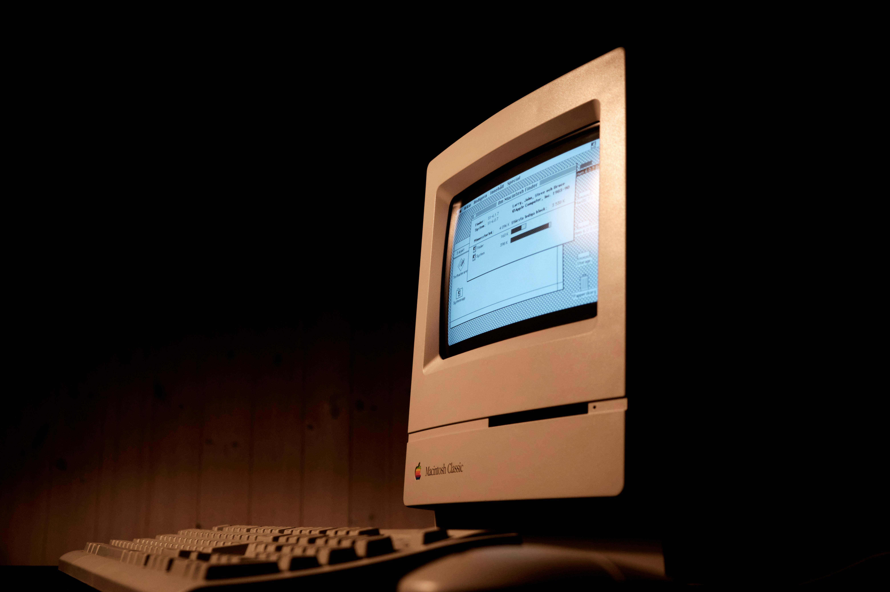

The author apologizes before they begin for the inadequacy of so small a work to capture so vast and nuanced a domain. The author would also like to point out that the examples herein represent (context-free?) spoilers for the relevant stories.       

Consider the Oracle of Delphi. A creature with perfect knowledge of the future.\
And yet, despite the predictive powers of this creature, the author would hardly call the Oracle a computer.      

Therefore, the author restricts our field of analysis. Specifically, this article will only call a computer a programmable electronic control system that does some calculations internally. Recognising that FSMs/DFAs are closely related to computers, this article will at times, give them special mention (if you have no idea what these are, ignore the sentence).

Today is the era of the business computer - even small businesses own a computer, if for nothing else, at least to do their finances. Yet, there was a time when everyone believed that computers were bound to fail, hence the name of the Digital Electronics Corporation -- named because investors were turned off by the word "computer".                          

Future Computing is, most briefly put, the kind of computer we imagine will exist in the future. And of course, the computers of secret societies and aliens everywhere, all waiting to kidnap unsuspecting protagonists, fall under this bucket.              

This article will trace the history of such imagination.

- - -

### Pre-WW1

The future was largely bleak and computerless. The occasional automation -- which responded to input by giving output through some specified rules -- enlivened a parchment, but by and large, humans wrote down their calculations by themselves and made adjustments to any machine of theirs manually.         

There are some mythical examples of automata, ranging from the creations of Daedalus to the notion of golems -- creatures made from dust animated by the power of G-d. *The Time Traveller* by H.G. Wells describes a world where the engineer Morlocks do the grunt work of repairing machines, having no automatic control systems, even on a small scale, let alone computing power. By the 1870s, with Edison and his light bulb, not to mention the telegraph, we at last see the arrival of electromechanical control systems as opposed to purely mechanical ones in the minds of authors -- take the *Nautilus*, Captain Nemo's submarine from *20,000 Leagues Under the Sea*.            

Aside from that, fans of aliens everywhere will appreciate those of *Gulliver's Travels* --- specifically the "computer" of Lagato -- the very first fictional one: a bunch of wooden pieces that shuffle with the same effect as monkeys on a typewriter, except that the output is vetted a bit by humans. Surprisingly similar to the operation of many LLMs today, it is possibly more prescient than appears at first glance.                 

The members of the Illuminati will doubtless appreciate *Tomorrow's Eve*, a story where analog circuitry controls an android changeling and the voice of said creature is pieced together from recordings of the human on phonographs, with all of this coming together due to the genius of Edison. This novel and its compelling (or maybe not) story and android brought that word its popularity as "the Imitation Human Being".  

- - -

### WW1-WW2

The advent of WW1 led to the immediate necessity of computation for military campaigns. Quoth Wikipedia: "The First World War required large numbers of human computers. Computers on both sides of the war produced map grids, surveying aids, navigation tables and artillery tables. With the men at war, most of these new computers were women, and many were college educated." This led to a sudden interest in computers and computing, not just in the professional but also the literary sphere. Authors started to pay attention to this new task -- what could these newfangled calculator-style jobs do in the future?       

Of course, where there is a question, the author jumps in to provide more answers than there are authors. *The Machine Stops*, by E.M. Forster, is an underground society on Earth where the central computer - the Machine - suffers from degradation of performance and eventually breaks down because no one knows how to fix it, leaving only the non-technological surface dwellers to carry on human civilisation. Interestingly enough, the author says he intended this story as a counterpoint to H.G. Wells' *The Time Traveller* because he felt that technology, not human decadence, would bring about the failure of the human spirit. The theme of a central computer starts out uncommon and ungainly in literature -- after all, how common can a room-sized hulking monster be in society? -- but eventually becomes a theme of choice.     

The classic robot story --- the story that created the word robot -- that is responsible for the notion of robot rebellions, *RUR (Rossumovi Univerzální Roboti)* -- came out in 1921. Not *quite* the metallic, expressionless creatures we so commonly associate with the word robot, the *roboti* of *RUR* are infact humanlike creatures with a much simpler anatomy geared only towards being able to work. Due to their being human, while they bear the responsibility for so many computers -- or automatons -- of the future, they do not themselves rightly belong here.            

By the 1930s, electronic control systems (not FSMs or programmed controls, simply controlling through switches and not levers) had become pretty standard in the real world and so ended up in most books from this time on. In 1937's *Galactic Patrol*, The control systems of the spaceship *Brittania* are wired up to a billiard table, and the bouncing of the ball off the walls is used as an RNG to decide the ship's heading. The notion of a "computer" is so alien to the book that when the villain is out of henchmen, he simply cannot run his base. At the same time, extrapolating from WW1's armada of human computers, the book describes a base employing human computers setting up computations on glorified calculators. Similarly, in *The Legion of Space*, the protagonist manually controls the ship through the risky maneuver of attempting short-range FTL inside an atmosphere, again because FTL is easier than computing 5000 years in the future.       

- - -

### WW2-1960

In 1936, Alan Turing described the basis of modern computing with his automatic machine, these days called a Turing machine. With the Z3, built in 1941, which was the world's first programmable digital computer, followed in 1944 by the Colossus of Bletchley Park, the first *electronic* digital programmable computer, the field of computing began to expand tremendously, and stopped being the job of humans and became one of the machines.    

With these changes in what *can* be done came a shift in perceptions of what *could* be done.     

Starting with Robert A. Heinlein's 1939 short story *Misfit*, where a young man supervised by a computer finds a flaw in its output and overrides it before catastrophe occurs, we see a new future for computers --- they start to be the mental match for humanity in raw calculating power, even if not in other ways -- for now. In another reaction to the growing capabilities of computers, Schwartz from *Pebble in the Sky* calculates logarithms automatically after having his mind enhanced by ~~drugs~~ an operation on his nerves. This sets us up to explore the notion of humans being enhanced to be as good as computers later on.   

In *The End of Eternity*, from Isaac Asimov, we see another example of computing power pitted against human ingenuity: Harlan calculates a better MNC (Minimum Necessary Change) to improve society than the best answer of the computers of Eternity, his employer. Arthur C. Clarke's first novel, *Against the Fall of Night* (later edited and re-published as *The City and the Stars*) involves a non-physical superintelligence called Vanamonde, which nonetheless remains childlike, in stark contrast to its predecessor, the Mad Mind, a galaxy destroying hyper-intelligent being.     

This tension between technology as an all-consuming wildfire and as the powering fire of human industry remains a theme in fiction, exemplified by robots.\
And so, what better place to introduce the creator of robotics, Isaac Asimov?

Starting from 1942's *Runaround*, which features an analog computer running a robot according to the Three Laws of Robotics running into a deadlock,
to the 1954 *Caves of Steel*, where the robot Daneel has an analog computer for a brain -- but one of unique manufacture: it is positronic in nature, and of such small scale that its manufacture is hampered by the Uncertainty Principle. Asimov's robots are, in contrast to many of the previous examples, simply human machines made to precise human specifications.    

In the introduction to *The Complete Robot*, Asimov claims that his new conception of robots as tools for a specific purpose drove the field of robotics to where it is, and the adoption of robots in factories as workers -- not humanoid, unlike *RUR*, but simply optimised for work, perhaps far more than Rossum Jr. could ever have thought of.    

The tiny-circuit positronic brain brings us to a new avenue of futurism in the realm of computing: size!       

In contrast to *The City and the Stars*'s Central Computer that runs a whole city, the *Galactic Empire* series of Isaac Asimov has guided missiles that can traverse the vast distances between stars, similar to the [V2 missile from WW2](https://en.wikipedia.org/wiki/V-2_rocket). The Tyranni from *The Stars, Like Dust* have computerized systems that allow them to automatically perform hyperspace Jumps with no human intervention. The Prime Radiant from the *Foundation* series is a hand-sized supercomputer that can calculate the mechanics of an entire society. Indeed, one of the primary themes of the series is the continuing miniaturization of equipment over time.          

At the other scale, *The Last Question* proposes a computer -- the cosmic AC -- whose size is that of the whole universe and whose raison d'être is to find a way to reverse entropy, which it eventually does, making it a literal god when it spawns a new universe. Similar to that, is Gold, a god that came into being when everyone pooled their resources into ending agnosticism, in the story *Answer*, by Fredric Brown. Akin to the Machine from *the Machine Stops*, we have... the Machines from *The Evitable Conflict*, who are programmed to protect humans and decide the best way to do it is to control humanity.

- - -

### 1960-1970

In the 1960s, the US Department of Defense started to fund the growing and new field of AI. Grandiose statements like "machines will be capable, within twenty years, of doing any work a man can do" were bandied about. The new generation of computers was coming onto the stage, with transistors and later ICs replacing vacuum tubes, leading to a shrinkage in the size of mainframes.     

Arthur C. Clarke and Stanley Kubrick's *2001: A Space Odyssey* has one of the first AIs in fiction, the famous HAL, encapsulating in it the fears about technology being a fire for adults to burn their fingers on. Of course, little about future computers would be complete without *Star Trek*, with its shipwide personality-embedded computer.  After all, Kirk can't even get it to stop calling him "Dear".     

This is a good point to bring up I/O for fictional computers: in this and the previous eras, the fictional computers were fed input through buttons and punch cards and read out by lights or printers. But after this point, the future computer gets smarter. With the release of PCs with monitors, the computer of the future now offers the user a graphical display.  

The usage of storage modules to hold programs also shows up now: the entire AI/chess program is not tied to a particular piece of hardware anymore.

The reaction to better computers takes an interesting turn in *Dune*, where the dominant ideology called the "Butlerian Jihad", created after a past AI revolt, prohibits the creation of AI and allows only drugs (now you see why we crossed it out earlier) to enhance the human mind.

- - -

### 1970-1980

Microprocessors show up, and Moore's Law (transistors on a processor double every two years) is proposed.    

*Hitchhiker's Guide to the Galaxy* discusses a computer built solely for the purpose of finding the answer to the Ultimate Question. While itself not too unique, its successor is the very Earth itself, meant to find out what the Question is, and all creatures on the Earth simply make up parts of a circuit of mind-boggling size. While on the subject of unique computers, consider the bistromathic computer from *Hitchhiker's Guide to the Galaxy*, which uses a simulation of a restaurant to solve complex navigational problems. The same book also brings up the "Infinite Improbability Drive" and its controlling computer, which gets past the problem of computation by just saying that it'll do whatever is impossible, so points for creativity on what is technically not a computer. 

> The above transcript was found on an old burnt-out computer, and AP Escher has not been located yet.