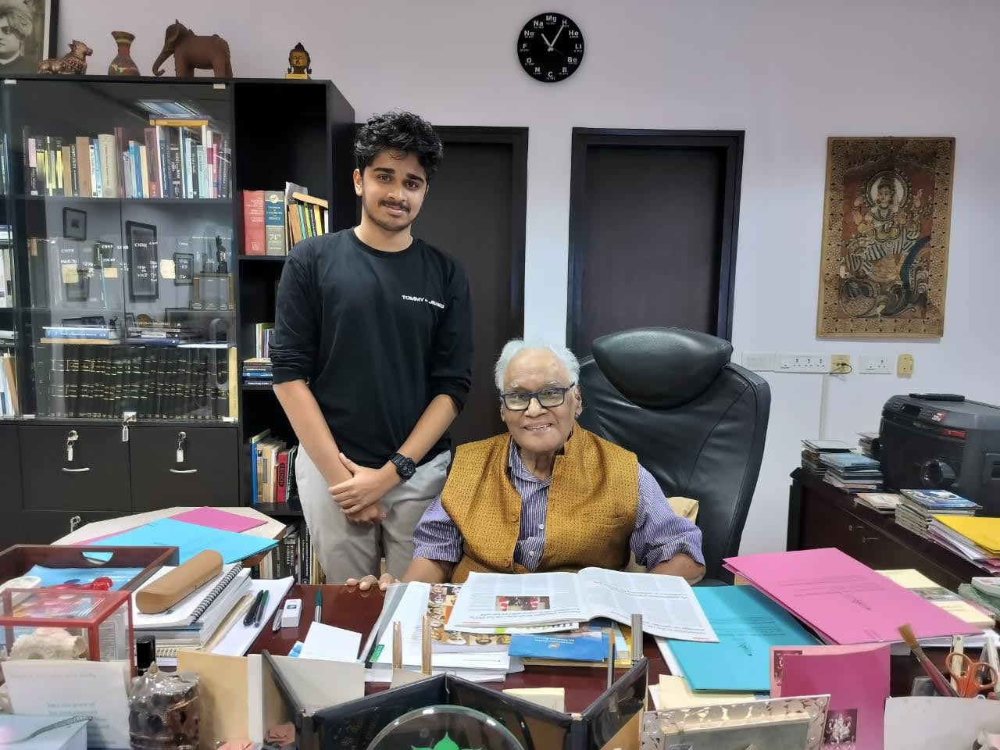

Dr. Chintamani Nagesa Ramachandra Rao, widely known as C.N.R. Rao, is a towering figure in the realm of chemistry, particularly celebrated for his pioneering contributions to solid-state and structural chemistry. Born on June 30, 1934, in Bangalore, India, Rao's relentless pursuit of knowledge made him the most influential chemist of our era.

In the summer of 2024, I got a chance to intern at the Jawaharlal Nehru Centre for Advanced Scientific Research (JNCASR), an institute founded by Prof. Rao himself. Every morning, on my way to my lab, which was located on the 2nd floor of the International Centre Of Material Sciences (ICMS), I used to pass by Prof. Rao’s cabin. I was taken aback by his unwavering commitment to coming to the workplace every day by 9:15 am despite being 89 years old and having health issues lately - he could have been sitting at home enjoying his retirement after achieving everything on his path, but he is built differently.

Prof. Rao's academic journey is nothing short of remarkable. He earned his Ph.D. from Purdue University and later conducted postdoctoral research at the University of California, Berkeley. His career has been adorned with numerous prestigious positions, including serving as the Head of the Department of Chemistry at the Indian Institute of Technology Kanpur and the Indian Institute of Science, Bangalore. Currently, he holds the position of National Research Professor and Linus Pauling Research Professor at the Jawaharlal Nehru Centre for Advanced Scientific Research (JNCASR), Bangalore, which he had founded.

CNR Rao's dedication to science extends beyond his ground-breaking research. He served not only as a trusted advisor to the Prime Minister of India for two terms (2004-2014 & 1985-1989) through his role as Chairman of the Scientific Advisory Council, but also championed science on a global scale as President of the Academy of Sciences for the Developing World (TWAS).  His leadership also extends within India, where he founded and continues to lead both the Chemical Research Society and the Materials Research Society, demonstrating his commitment to fostering scientific progress.

Throughout his illustrious career, Rao has authored over 1,800 research papers and 56 books, significantly advancing our understanding of materials chemistry. His research spans many topics, from high-temperature superconductivity and colossal magnetoresistance to graphene and nanomaterials. His work has expanded the boundaries of chemical knowledge and found practical applications in various technologies.

Rao's contributions have been recognized globally, earning him numerous accolades, including the Bharat Ratna, India's highest civilian award, in 2014. He is also a Fellow of several prestigious scientific academies, including the Royal Society (FRS) and the American Academy of Arts and Sciences. Some of the other awards include the Shanti Swarup Bhatnagar Prize for Science and Technology (1968), the Padma Shri (1974), the Padma Vibhushan (1985), the Karnataka Ratna (2001), the Order of Scientific Merit (Brazil, 2002), the Dan David Prize (Israel, 2005), the Royal Medal by the Royal Society (2009), the August-Wilhelm-von-Hofmann Medal (2010), the Ernesto Illy Trieste Science Prize (2011), the Von Hippel Award (2017), and honorary fellowships and memberships in several prestigious scientific academies, including the Royal Society (FRS), the American Academy of Arts and Sciences, and the National Academy of Sciences (USA). His legacy is one of unwavering dedication, intellectual brilliance, and an enduring commitment to advancing the frontiers of science. Not to mention, he is often regarded as the scientist who has won it all except the Nobel Prize.

(From Udaan's side: One of our editors, Neerav, interned at JNCASR Bangalore for this summer. We saw this as a golden chance to feature some global names from the famous research institute in our community magazine for the first time and to bring a different and ambitious essence altogether. So, after constantly disturbing him through emails, we at Udaan seized the opportunity to ask him a few questions about his secret to success. Since Prof. Rao has been tackling a few health issues lately, he had been having some difficulty with speech - with the answers being restricted to a few sentences. Still, we at Udaan remain honoured by the fact that he chose to spare some time for us despite his hectic schedule. It gives us a new excuse to flag off a new article series, the ‘World Icons’, with Prof. Rao being #1 himself!)

The first question was about the work schedule he followed.

> *“Firstly, I must mention again how much of a fan I am. Seeing your research contributions greatly inspires hundreds of students like myself who aspire to become scientists like you, sir. Every morning, I enter the ICMS building at around 9:15 am and see you are already in your cabin. I have seen many people just yearning to hit retirement age and enjoy life with no work and only pension money, but your case puzzles me. What motivates you to come daily to JNCASR, even at this age, having achieved everything there was to accomplish in your area except, maybe, the Nobel Prize? Don’t you ever feel like you are done, and maybe it’s time to have some rest? I need to know the secret to this everlasting energy that you have always had.”*
>
> "I encourage you to work hard to get profitable research; you must work almost 12 or 14 hours daily because it isn’t easy. If research is (your) passion, this is the way to go.”

 

Under Rao's visionary leadership, JNCASR has flourished, focusing on multidisciplinary research areas such as materials science, chemistry, biology, and engineering. His commitment to scientific excellence and education has significantly contributed to India's global scientific standing. JNCASR stands as a unique high-facility research centre and continues attracting top-tier researchers and students worldwide.

As mentioned before, Prof. Rao pursued his PhD at the very prestigious Purdue University despite being offered scholarships at MIT, Columbia and Penn State.  At various points in his career, Rao has made appointments as a visiting professor at Purdue University, the University of Oxford, the University of Cambridge, and UC Santa Barbara. He was the Jawaharlal Nehru Professor at the University of Cambridge and a Professorial Fellow at the King's College, Cambridge, from 1983 to 1984.

> *“I read that you completed your masters in India but decided to move to the US, in Purdue, for your PhD. How much do you think foreign exposure is important for an Indian student today?”*
>
> “In this world of competition, making a name for yourself is difficult. You must reach something excellent and noteworthy, and foreign exposure plays a crucial role in that. Engaging with a different culture, better infrastructure, diverse labs, and research will help you grow as a researcher.”

 

When asked about his success mantra to decode the crazy eye-bending research stats he holds- more than 1 lakh citations and an H-Index of a whooping 158 on Google Scholar, he had to say this:

> “Research is all about hard work. The more keen you are about success, the more time you put in to reach a respectable position. All the accolades you see thereafter - be it the Shanti Swarup Bhatnagar or civilian awards should be easy and will come on their own accordingly.”

 

Dr C.N.R. Rao has significantly advanced the fields of solid-state and structural chemistry, deepening our understanding of material properties and behaviours. His extensive research portfolio covers high-temperature superconductivity, colossal magnetoresistance, graphene, and nanomaterials.

Prof. Rao's foundational work in solid-state chemistry has greatly influenced our comprehension of the structural chemistry of transition metal oxides. His insights into the structure-property relationships of these materials are crucial for various technological applications. Another key area of Rao's research is high-temperature superconductivity. He has extensively studied the mechanisms behind superconductivity in copper oxides, which is vital for developing efficient power transmission systems and advanced magnetic materials. His pioneering research on colossal magnetoresistance (CMR) has shed light on the mechanisms that cause significant changes in electrical resistance in response to magnetic fields. This work has potential applications in magnetic sensors, data storage devices, and spintronics.

In recent years, Prof. C.N.R. Rao has focused on nanomaterials and graphene. His research includes synthesising and characterising various nanostructures, such as nanotubes, nanowires, and graphene. These studies have opened new possibilities for electronics, photonics, and energy storage applications. He has also explored the development of multifunctional materials, investigating properties like ferroelectricity, magnetism, and conductivity. These materials are critical for advanced technological applications, including smart materials and devices.

I was restricted from asking him any lengthy questions because of his health condition. So I thought of going a bit selfish for the next part -

> *“Last but not the least, what advice would you give to a student like myself - pursuing a BTech in Chemical Engineering at IIT Tirupati (which has a very technical engineering environment instead) - who wishes to glide into the world of research? What valuable things (advice welcomed) have you learnt during your journey that you would like to pass on, sir?”*
>
> “There is no substitute for the hard work you must put in, irrespective of the field. There is simply no other option to become successful in whatever you wish to do. It is all a lengthy process, and you must give it all the time it deserves.”
>
> *“Thank you for all the time you devoted to this. I wish you all the happiness in the world and a long and healthy life ahead, sir. The society may have to create new awards to award you because you seem to have grabbed everything on your path!”*

 

We at Udaan wholeheartedly thank Prof. C.N.R. Rao for devoting some of his time to answering our questions despite the health issues. We wish him all the best for his future and a long, healthy life ahead!