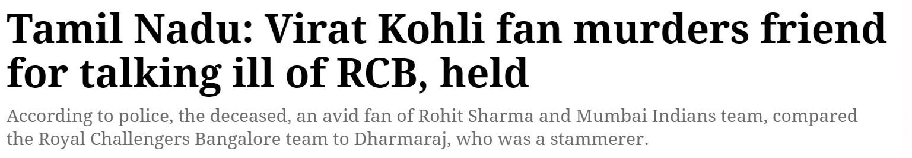
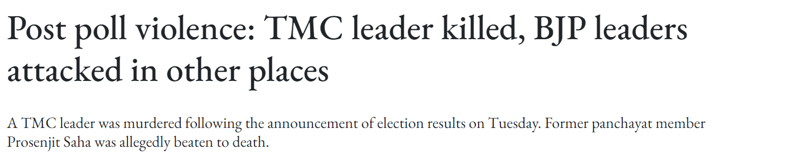
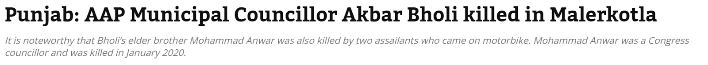

<!--StartFragment-->

In a world increasingly divided along political, social, and cultural lines, it's easy to fall into the trap of "us vs. them" thinking. This binary view, where we wholeheartedly support one side and demonize the other, hinders our ability to see the complexities of an issue. This tendency to align with one of two opposing factions can be observed in various arenas, from politics and sports to social and familial disputes. While taking sides can provide a sense of belonging and clarity, it also hinders the ability to objectively evaluate each position's pros and cons, ultimately obstructing a more nuanced and balanced understanding of the conflict.

Humans are social creatures with an innate need for belonging. Choosing a side can feel like joining a team, fostering a sense of solidarity and purpose. Complex issues often evoke strong emotions like anger, fear, or frustration. These emotions can cloud our logic and make us more likely to side with the party that aligns with our emotional state.

The problem with this side-taking tendency is that it blinds us to the potential validity of both viewpoints. Every issue has multiple facets, and each side likely has some legitimate arguments. When individuals align with one side of a conflict, they tend to engage in confirmation bias, selectively seeking out information that supports their chosen stance while ignoring or discrediting evidence that contradicts it. This reinforces their beliefs and deepens the divide between opposing groups. In political contexts, for example, supporters of one party may focus solely on their party's achievements and demonize the opposition, ignoring the complexities and valid points on both sides. This partisanship is further exacerbated by social media and echo chambers, where algorithms curate content that aligns with users' pre-existing views, reinforcing their biases and isolating them from diverse perspectives. As a result, individuals become entrenched in their positions, making constructive dialogue and compromise increasingly difficult. A two-faced perspective can be of incredible value because we can develop empathy and bridge the gap between opposing viewpoints by considering the reasons behind each side's stance. Often, there are areas of agreement, even in heated debates. Identifying these commonalities can pave the way for compromise and finding solutions. By acknowledging the pros and cons of each side, we can form a more nuanced and well-rounded opinion on the issue.

To move beyond side-taking and embrace a two-faced perspective, seek diverse sources. Don't rely on information that confirms your views. Actively seek out credible sources that present both sides of the argument. Engage with people who hold opposing viewpoints. Try to understand their reasoning without getting defensive. Separate the arguments from the people making them. **Attack the ideas, not the individuals**. *This is essentially the most important of them all*. In this growing social-media-reliant generation, we’re often pairing up a group of people with their ideology, not realizing several people might believe the same ideology yet have different perceptions of it, and hence abusing them all would not be sensible nor work out for a productive outcome.

Bringing up this topic inarguably requires a more focused incision of relevant examples into the reader’s mind. Let’s start with something on a lighter scale- take the case of the petty arguments that occur during IPL or the ones on which celebrity is better (read: Taylor vs Kanye, Rohit vs Kohli, and so on). It's like fighting with someone over which brand of cereal a billionaire eats for breakfast. The absurdity of it all just adds to the amusement, especially when the passion over someone who wouldn't even recognize our names gets so intense.

<!--EndFragment-->

<!--StartFragment-->

The mentality of taking sides cultishly shows danger, even over cricket teams and music bands. Complex matters are way more dangerous as they take our fundamental beliefs into question - the ones we’re influenced by and brought up with, over the course of our lifetime. This leads to people taking and losing their lives over this. 

The complex issue that can be relevant to us, the student community, right now is politics. Young and impressionable in the political sphere, we might start heralding a politician in our Instagram stories or even endorse a political party publicly. Hey, it's natural! We're social creatures desperate for the sweet validation of our online tribe. But therein lies the rub. Just like that awkward moment when you realize your crush only sees you as a friend, politics can leave you staring down the barrel of a disagreement. Suddenly, your perfectly curated Instagram feed looks like a war zone of political memes. Anger simmers, comments get snippy, and the only thing growing faster than your follower count is your blood pressure. So, how do we avoid this social media meltdown? The answer lies not in silencing ourselves but in approaching these discussions with the grace of a ballerina dodging a banana peel. Think of your political discussions as intellectual ping-pong, not gladiatorial combat. Keep things respectful, even if you disagree. You might score a point by changing someone's mind (or learning a new perspective).

<!--EndFragment-->

.")

<!--StartFragment-->

National politics isn't just fiery speeches and witty hashtags. It's a murky swamp, much deeper and far more dangerous than your textbooks might suggest. Here's the harsh truth: history is littered with examples of political violence, where disagreements morph into bloodshed. We've seen "honor killings" used to justify political dissent and revolutions fueled by passionate but dangerously simplistic ideas. This isn't fear-mongering – it's a reality check. Diving headfirst into this murky territory without proper grounding can be disastrous. Imagine this: you're swept up in the fervor of a national debate. Social media amplifies every extreme viewpoint, painting the "other side" as the enemy. Nuance is drowned out by outrage, and the lines between passionate debate and violent threats blur. This isn't just hypothetical. It's a dangerous path that can lead to real-world consequences for yourselves and the communities you hope to improve. Why is this especially dangerous for students? Your mind is still forming, critical thinking skills are under development, and the emotional pull of a cause can be strong. National politics, with its hyperbole and emotional appeals, can exploit these vulnerabilities. 

Remember, a well-informed student with a strong foundation of critical thinking is a far more powerful force for good than a passionate but easily manipulated follower. National politics will always be there, but your education is a once-in-a-lifetime opportunity. Make the most of it, and approach that political swamp with caution and a healthy dose of skepticism. You'll be much better equipped to navigate its murky depths and create real change once you graduate.This is why the title of this article proves relevant - It’s better to be in the middle than to be restricted to one side. Of course, some of the cases involved in this article are extreme - but with emotions in play and the amplification of basic ideology to extremism by social media, things can always prove to be dangerous.

<!--EndFragment-->