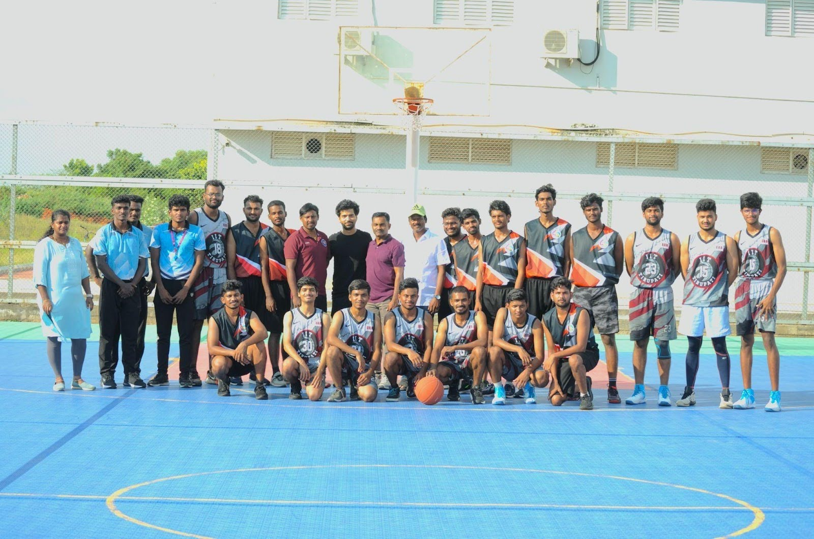

It wouldn’t be an Indian Institute of Technology now, would it, if we didn’t talk about the numerous and diverse tech clubs around campus. Antipasto is served, starting with the technical front of the show.

Following the success of Memethon 1.0, Gagan Vedhi’s 2nd edition of the contest proved to be equally hilarious and popular among the astronomy community on campus. Seeking to provide a unique and fun introduction to interested freshers, the club conducted a workshop on Basic Astrography and Image Enhancing using Adobe Lightroom. A screening of The Martian was conducted as part of Movie Night, which received positive feedback, with over 60 students attending it. An exciting collaboration with IISER Tirupati led to the successful execution of Astrofest during the last week of October, where numerous events were held, namely the Astrotrivia Quiz, an Astrophotography Workshop, a fun, space-themed JAM, Meme Madness, and Star Quest, a two-day treasure hunt. As usual, plenty of Star and Moon Gazing sessions were conducted over two semesters across the North and South campuses.

With a fresh change in their management and hierarchical structure, Digital Wizards conducted a plethora of workshops and sessions on domains including Web Development, Competitive Programming, and Cyber Security. Introductory sessions were also conducted for freshers on Git, Linux, and Python. The experienced and diligent techies of the club worked on several projects, such as websites (for IIT Tirupati and Techmaniacs) and an app for the Convocation. One of the highlights was a Cognitive activity testing app built in collaboration with IISER Tirupati. The icing on the cake was the club’s involvement in conducting and even participating and winning in Hackathons in the fields of Cyber Security and Quantum Technology.

When it came to the realm of entrepreneurship, E-Cell was buzzing with activity. The club launched a WhatsApp community and was even allotted a special office in the CIF for its activities. The core members were hard at work, as evidenced by the weekly contests and events that engaged the student community. A collaboration with the institute’s Innovation Council resulted in successful workshops on Intellectual Property Rights and Start-up Funding. Stock trading competitions were also organized via a tie-up with StockGro. Plenty of talks on start-ups were organized as well, and various founders and corporate leaders conducted them. The E-Cell team made the most of a beautiful opportunity to visit IIT Madras to participate in the 4th GDC Symposium to learn about their innovation culture and entrepreneurship ecosystem.

Techmaniacs decided to welcome the semester with a brand new logo along with the addition of a new Electronics Interest group, increasing the number of the club’s interest groups to 4. The club kicked off its new era with introductory workshops for each interest group, namely Arduino, Drone, Electronics, and Robotics. Steps were taken to increase the club's reach, such as registering the organization on Github and restarting the Techmaniacs YouTube channel. The coordinator and core members oversaw the introduction of many projects, including an Obstacle Avoiding Robot, a One Air Key Piano, a Hexacopter Drone, and a Bluetooth Speaker System. Innovation was steadfast, as proven by the development of a Fixed-Wing Plane to track wild animals within the campus. In the realm of competition, a Line Follower Robot built by the Robotics group secured first place in the ROBOTRAC 2024 competition. The club’s ambition was visible when it announced its collaboration with the drone interest club at CSU (California State University), Chico, to develop an AI-enabled drone.

Operating in the realm of innovative automobile engineering, Navgati’s newly appointed coordinators set a vision to fabricate a Crosskart. Following an 8-month-long period of dedicated meetings and meticulous planning, the construction of the chassis frame was completed, marking a significant milestone in the project. Arduous efforts, including procuring required materials from vetted vendors in Dehradun and approaching operators in Chennai, enabled the club to further its ambitions.

With a mission to promote AI & ML within the campus as the new club on the block, Sigma Squad set about organizing numerous workshops on the Math behind Machine Learning and Python Programming. The club coordinators and their core members efficiently worked on two subdomains, namely Natural Language Processing (NLP) and Computer Vision (CV), and actively participated in several hackathons. Sigma Squad tremendously contributed to IIT Tirupati’s success at the recently concluded InterIIT Tech Meet 2023, with teams finishing in the top 10 in events conducted on Large Language Models (LLMs) and Deep Reinforcement Learning (DRL). The amazingly skilled club members were also involved in collaborating on various projects as well. Overall, the club invested significant time in upskilling juniors to carry forward its penchant for AI and ML. 

Next up, Primi, in the form of the literary happenings around campus.

The Literary Affairs Council has continued to remain the backbone of the various literary activities held year-round and has also managed to conduct a few institute-wide events! The council conducted five Hindi Pakhwada events in September. They also introduced new events like the Cryptic crossword for the Intra IIT and helped the Aranya Club make puzzles for their event - "Treasure Hunt." On the eve of Valentine's Day, they conducted a poetry event that was conducted innovatively through social media. The event had a prize pool of 5000 rupees and amassed more than 25 entries. Moreover, on the renowned World Poetry Day, the council conducted the Poetry Slam, which was an offline event with a prize pool of 2500 rupees. They also did their part by lending a hand in distributing the certificates and trophies for the Intra IIT winners on the Gymkhana Day.

Moving on, the Debate and Oratory Club kicked off their academic year with a Standpoint Speaking Contest right before their Introduction session in the month of August. Furthermore, their weekly debate drew a significant crowd, enabling them to conduct the discussion in an exciting five versus five format. An excellent opportunity for students in the debating field was witnessed when the Debate and Oratory Club decided to take part in the IIT BBS Debate Contest, for which it sent two teams comprising three debaters and one adjudicator. Where one adjudicator managed to qualify for the break rounds, this club organized not one, not two, but four events for the Intra IIT that include Block and Tackle, Just a Minute, Shipwreck, and Spin a Yarn. Some events saw great participation, while some saw poor participation due to a variety of reasons. 

This club also consolidated and trained a team of debaters to participate in the Inter IIT Cultural and Literary Meet held in IIT Kharagpur. Evidently, this club made sure to make its presence felt during the Intra IIT. 
Furthermore, the Quiz Club did not fail to puzzle the students on a regular basis, too! With its consistent conduction of events all year round, it kept the quiz-loving students engaged almost every month! In August, they conducted their Monthly Quiz in two rounds, Prelims and Finals. September, unfortunately, saw no event from the Quiz Club, but October more than made up for that with four different events, namely - the Inra IIT MELA Quiz, India Quiz, General Quiz, and SciBizTech Quiz. Each of these events was meticulously conducted in two rounds, prelims and finals; this was surely an eventful month for the Quiz club. In November, the Sports Quiz was also conducted as a part of the Intra IIT events. As we entered 2024, the Quiz Club was back with a new and interesting set of events. In February, they conducted a quiz on Wars and Conflicts and their impacts on society. In March, an exclusive Women's Day quiz was held in collaboration with MEDHA, the Women's Club of IIT Tirupati. To call it a day ( or a year?! ), the quiz club ended their wonderful year in April with their last event, which was a general quiz for the graduating batch.

Lastly, the Scribbles Club had a busy year, too, with a vast assortment of events and engaging activities. Their academics had a great start with an event on historical fiction, which received decent participation, considering the fact that it was conducted online. This was followed by the Intra-IIT English Poetry Slam and Creative Writing contests, which amassed a great number of participants and turned out to be really fun events. A new event, the Intra-IIT Cryptic Crossword, was also conducted in October, which clocked 42 participant teams and was a grand success. The Intra-IIT Hindi Creative Writing was also conducted to add a regional twist to these events. Furthermore, an Essay Writing competition was conducted on the occasion of Khadi Mahotsav, which is a campaign run by the Government of India to promote the idea of Atmanirbhar Bharat amongst students. Also, an Essay Writing competition was conducted online on the occasion of Women's Day, and winners were declared shortly after. Lastly, in the Inter-IIT, the club took part in an assortment of events like Poetry Slam, Poetry writing, Cryptic Crossword, etc., and managed to get in the top 15 out of the 46 participants in the Hindi Poetry writing. 
This year, the literary team's primary focus was to indulge a great number of people in literary activities and help them to appreciate literature. This motive was successful to some extent, and it is hoped that this momentum will be carried and strengthened in the coming years.

As is customary, Primi is followed by Secondi, a hearty entrée platter, from Team Culturals. 

A day of promised Cultural Celebrations and events came in the form of a Nite. The 17th of April witnessed one of the wildest DJ Nights ever, with multiple Cultural Performances and Open Mics on the side. The eve of 24th March saw the annual celebration of the triumph of good over evil, in spectacular, toasty fashion, in the form of a bonfire. Holi celebrations soon followed on the 25th of March, with vibrant colours everywhere and music galore. 14th of February had something sweet for everyone involved! With Rasoi’s cookies and chocolates on one side and elegant waltz on the other side, it looked like the evening was a day of slow dancing and awkward yet sappy exchanges. The night however, saw the enthusiasm rise and fall with an all out dance party, and the adjective “slow” could no longer be applied to the music or the dancing. 26th of January marked the 75th year of Celebrating India’s adoption of its Constitution, with a college-wide gathering topped off with a parade and obligatory flag-hoisting. The Clubs came together to put on a show for the gathering, namely Actomania and Sargam, followed by commemorating the prize winners from the 6th Cultural and Literary Inter IIT Meet. The cold and unwavering serenity of a beautiful Winter morning, was shattered by the crackle of a blazing bonfire. Sankranti celebrations began early in the morning on the 14th of January, following which Artista organized a beautiful Rangoli Making Competition, and Rasoi teamed up to make authentic Pongal, straight out of the pot. Celebrations came to a close with picturesque and colourful kite-flying on the eve of 15th March. 

The highlight of the latter half of December would have to be the 6th Cultural and Literary Inter IIT Meet. An 11 day long endeavour, with arduous travels and a boring New Years’ in a non-AC train compartment, the journey was a destination in itself. The actual destination however, delivered beautiful views, a peaceful climate and an environment bursting with the thrill of competition and the occasional thorns of rivalry. The Contingent of 110 participated in a plethora of competitions and walked away with noteworthy achievements in Charcoal Art, Mono-Acting, Photoshop Battle and Street Battle (even managing to beat out the home IIT, congrats Xcite!). (And yes, we saw your “Remnesia”, PFC, and we’re trying to find which basement you’ve hidden Nolan in!)

The night of 12th of November, was one to remember, and hopefully photograph. The stars paled in comparison to the floating lanterns strewn across the sky. Diwali Celebrations were in full swing for two days, with Artista organizing a Diya Painting event followed by the Diwali Poojas and other celebrations. 

Picking up the other end of the emotional spectrum, spooky was the theme for the day on the 31st of October. Team Culturals put together a haunted house (well, a haunted old library, but that makes it sound scarier than it was), followed by a customary horror movie screening. Dussehra saw multiple events spread across the days, leading up to a Ravandahan on the 24th of October, with an almost life-like (ahem) Ravan effigy. Celebrations included nights of endless dancing and music, with a Dandiya Night and a Garba Night. The opening week of October was jam packed with competitions, 27 to be precise. All the Cultural and Literary Clubs came together to organize Intra IIT, Fiesta, with competitions ranging from Quizzes, Cryptic Crosswords and Shipwrecks, to Solo Instrumentals and Team Dances. There was a little something for everyone. Participants belonged to one of five distinct “houses”, namely, the Mandalorians, the Flat Earth Society, Team Sirius, Team Dhruva and the Cosmic Flares. Alas, the rains washed away all the hopes of vibrant stage events and performances planned out for the night of 11th of October, even robbing the Flat Earth Society of their moment in the spotlight, as the rightful winners of this year’s Intra IIT Meet. Team Culturals conducted the annual welcome for the Freshman Batch of the year, with an assortment of hand-picked events to baby step the Freshers into the Clubs and the extracurricular happenings of the college. Spanning the week from 11th to 17th of September, “Freshers’ Week” saw many events and competitions unfold, with a final day of stage performances and open mics. Following the crowning of Mr. and Ms. Freshers, the first of many DJ Nights to come, was held as one last welcome for the new faces, which were quite familiar by the end of the week. 

Ganesh Chaturthi was well rounded out with the unmissable large clay idol of Ganesha, the weeklong arthis and the idol immersion at the end. The 19th of September was the date for many small games and events, including a slow-cycling race and tug of war battle. Janmastami was graced with the presence of devotees from ISKCON, who led the rituals for the evening on the 7th of September. 

Onam celebrations had to be as traditional as possible, marking the first festive celebration of the academic year. A picture taken on the 20th of August would have everyone dressed in beautiful clothing, traditionally white, flowers and colours everywhere. The day was spent in many indoor and outdoor traditional games, including Musical Chairs and Lemon and Spoon Races. 

15th of August saw the Indian Flag fly high amidst patriotic celebrations, complete with cultural performances from the Clubs and a march-past. 

And, the buck stops here. The last event on the nostalgia trip and the first event of the academic year was the Freshers’ Orientation programme, held on the 8th of August. The programme included a gathering to introduce the Student Clubs to the Freshers, finishing off the night with stage performances from Sargam and Xcite.
	
Keen ones among you readers would have realized our little trip missed out on quite a few key events of the Cultural Clubs. Contorni is unavailable for today’s meal, apologies. The Culturals Report is the only one the editors received. When Team Udaan reached out to ask for the Cultural Club Reports, we were told that none of the coordinators had submitted any (*Bombastic Side Eye*). Maybe they lost the piece of paper it was written on…or something (*Criminal Offensive Side Eye*).

Lastly, and comfortingly, dessert.

2023-2024 was a highly spirited year for IIT Tirupati in terms of sports and wellness fervour. Besides the constant academic hustle, this year saw immense dedication and enthusiastic participation from our student-athletes, faculty and the people of our institution.

The year had an energetic start with the  3K Cycling Event organized on 3 June 2023
to celebrate World Cycle Day and encourage sustainability along with physical wellness in our transportation.
The year also saw several running events taken initiative by the Fitness Club, each with the outlook of promoting physical fitness, camaraderie and community spirit. From the National Sports Day run (3Km) in august to the Unity Run in October held in honour of Sardar Vallabh Bhai Patel and finally the mega event of the 5K Campus Run in April 2024, brilliant zealousness was observed within the community.

The 5K run was a simple winning event with over 400 participants from colleges over Tirupati taking part in it.

Next was the annual  Yoga Day celebration on 21 June in the confines of our indoor sports complex. The event welcomed esteemed guests from the Isha Foundation and the session involved practising yoga along with an attempt to be mindful of ourselves and action.
Participants were also given t-shirts for a collective experience.

A year of many firsts, IIT Tirupati also made its entry towards hosting an home-grown inter-collegiate sports tournament SANYOG! From the 3rd-5th of November.
With approximately 500 students from 13 different colleges the tournament  featured sports including cricket, basketball, volleyball,badminton and table tennis.
 It served as a platform for fostering friendly competition and camaraderie among students from different colleges along with an attempt to establish our college as a hub for sporting excellence in the region.

THE event of each year - Inter IIT Sports Meet.
This year the meet was held in IIT Bombay and Gandhinagar.
Roopa Sri Ganga, a second year  student and a highly talented athlete, clinched a silver medal in the high jump event, making history as the first medal for IIT Tirupati in the meet. Her remarkable achievement exemplified the dedication and skill of our athletes. Furthermore, our basketball team showcased exceptional teamwork and prowess, advancing to the semi-finals and leaving a lasting impression on the competition with their unwavering spirit.
These accomplishments while bringing pride to our institute also
highlighted our commitment to excellence in sports on a national platform.

The Aranya Club organized two treks in this academic year. In October of 23’ a trek to Tada falls (Ubbalamadugu falls) was planned with over 250 students embarking on an exhilarating trek to Tada Falls, blending easy paths with rugged terrain. Despite a minor injury, spirits soared as music-filled bus rides set a lively tone. Reaching the majestic waterfall, they were awed by nature's beauty, emphasizing the need to cherish such wonders. 
The second trek was organized in January for the first year students taking about 150 people for an adventurous expedition in Tirupati’s own wonder. 

Intra IIT Sports meet - ‘KRIDAN’:
Spanning from February 27th to April 24th, 2024, this event witnessed enthusiastic
participation from students across various disciplines, showcasing their
prowess in a plethora of sports ranging from Athletics to Chess.
This year the Inter IIT players were selected through an auction process
which was hosted by the sports council members and participated by each
team captain and vice captain who were selected by interview.The
remaining students were divided by their respective roll numbers.
The canvas of Kridan 2024 was painted with a diverse palette of sporting
events, including Athletics, Badminton, Basketball, Cricket, Chess,
Football, Table Tennis, Lawn Tennis, Volleyball, and Weightlifting. Each
sport offered its unique blend of excitement, strategy, and skill, captivating
both players and spectators alike. Throw Ball for girls and Weightlifting for boys was introduced this year. 
With an impressive student turnout of approximately 400 participants, Kridan 2024 transcended mere competition, evolving into a platform for fostering  holistic development. Students embraced the ethos of sportsmanship, pushing their limits and challenging themselves in pursuit of excellence.

Beyond the thrill of victory, the event instilled invaluable lessons in teamwork, resilience, and discipline. It served as a testament to the power of sports in nurturing not only physical fitness but also mental fortitude and character development.

Lastly, A self defence workshop was also conducted by the sports council  on April 14, 2024, drawing a diverse group of participants eager to enhance their personal safety
skills. The workshop was designed to empower attendees with practical techniques and knowledge to protect themselves in various situations. Led by experienced instructors, the session covered a range of topics including basic self-defence moves, situational
awareness, and strategies to de-escalate potential threats. 
By equipping individuals with the skills needed to defend themselves, we aim to foster a sense of empowerment and resilience. 

The Chaturanga Club, our very own chess club, had an exciting yet elaborate year hosting  a vibrant series of chess tournaments in 2023-2024, attracting enthusiastic players and creating memorable events.
Kicking off with AICL 5.0 from July 20-23, 2023, on Lichess, this online 5+0 format event saw intense competition among IITs, NITs, and BITS, with our team contributing an average of 30 participants per match. August began with the lively AARAMBH ’23 tournament on August 11 at the Indoor Sports Complex. This 5+0 format, 6-round Swiss system event marked the debut for the B.Tech Batch 2023, drawing an impressive 60 students. Celebrating Independence Day on August 15, the FREEDOM - THE AZADI tournament featured a 5+0 King of the Hill Chess Variant and involved 44 spirited players.

The Teachers Tournament on August 20, held at the Indoor Sports Complex in a 10+5 format over 5 rounds, provided a unique platform for 6 participants. On August 27, the Celebration of PRAGG event, an online 5+0 arena on Lichess, fostered friendly competition among 8 IITs, with 38 participants from our college joining 266 others. The Selection of Inter IIT players from August 31 to September 2 was a critical 10+0 round-robin event at the Indoor Sports Complex, attracting 40 contenders.

The adrenaline-pumping Fast and Furious wins the race! On October 22 was an online 1+0 arena event on Lichess, involving 10 players. The Not-So-Casual Tournament on November 11, a 5+0 arena event on Lichess, saw 19 participants battling it out. On November 14, the Children's Day Tournament at TC17 featured a 5+0 6-round event with 18 young chess enthusiasts. The Surprise Variant Tournament on November 15, a 10+0 round-robin event at TC17, included 12 participants, with 6 children and 6 students showcasing their skills.

In 2024, the Team Battle Tournament on January 14 was an exhilarating 5+0 arena event on Lichess, featuring 30 participants from our college among 101 players from 5 IITs. The Puzzle Tournament from February 16 to April 13 on WhatsApp was open to all, keeping the chess spirit alive. Celebrating Women's Day on March 8, the Women's Day Chess Tournament at AB2-CR002 was a 5+0 round-robin event with 13 women participating. The Chess Master's Premier League from March 24-29 on Chess.com featured a mix of 5+0 and 1+0 arena formats, with 25 participants from our college. On March 31, the Chaturanga CrazyHouse Arena, a 3+0 arena event on Lichess, saw 7 students in action.

The series concluded with The Farewell Tournament on April 21, a 5+0 event at AB2-CR004, engaging 13 students and wrapping up a thrilling year of chess activities organized by the Chaturanga Club.

With that, we conclude our 5-course meal. We hope you enjoyed your time with us. If you didn’t find any part of it exciting, don’t be afraid to walk into the unknown and break boundaries. Who knows, you may be the one to invent a new people’s favourite dish (ahem, club). We look forward to seeing you again, with even more exciting student activities and events in the years to come.