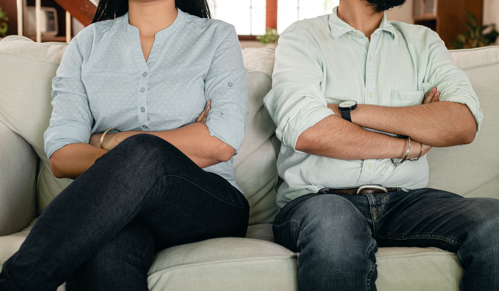

<!--StartFragment-->

All along, we've delved into the profound complexities of mental health—covering topics from the depths of depression to the importance of seeking help. Yet, mental well-being can also be found in the simplicity of everyday feelings. It's that flutter of unease as exams draw near, the subtle guilt on unproductive days. These everyday moments quietly influence our lives, shaping who we are. Each of you, with your unique experiences, have added your unique brushstrokes to the canvas of who you are today.

So today, we're embarking on a special journey—one that's all about the stories we rarely share but can connect us in the most unexpected ways. This isn't your typical article; it's more like a heart-to-heart conversation about mental well-being. Before we dive into these personal tales, let's take a moment to appreciate the power of conversation when it comes to mental health. It's like a warm cup of tea on a rainy day—comforting, reassuring, and a reminder that we're not alone in this journey. We all carry a unique story within us, and today, we're opening up those pages, hoping that in sharing, we can find a little more understanding and a lot more connection.

Our first stop is Ratna Sree's story—a tale of facing fears, finding strength, and realizing that sometimes, our biggest triumphs come from the battles we fight within. 

- - -

### Ratna Sree

During the preparation for UPSC, after four failed attempts, I was completely under stress and anxiety. Everyone knows UPSC is hard, but no one expects where all the hardships could come from. The preparation process was also detrimental to my mental health. I was going through newspapers and magazines every day to be up to date with current issues. What I never expected was the negative impact this would have on my mental well-being. Any news like accidents, floods, or crime would affect me so much. I started making all this news part of my world. I used to worry about them happening to me or the world around me. I used to worry every day about what my future would be. I attracted every single negative thought. I was afraid; there was fear. I started believing that all those negative thoughts would come true one day. At the beginning of this journey of stress and anxiety, I was inattentive to my negative thoughts. I eventually realised how fear can be heavily negative if not balanced. It has the ability to cripple one’s daily life. A little bit of fear can push one to achieve their dreams (acting like a catalyst), but it is a double-edged sword. It has the capacity to dismantle any individual’s journey. Fear can destroy positive thoughts and paralyse our individuality.

Then there is society. I will be honest; I come from a conservative, patriarchal family where comments like *“This is not a girl’s ball game”* were not uncommon. I had strong grit initially, but with time and the failed attempts, the words started getting to me. I started believing it might probably be true. I perhaps can’t do it because I am a girl. Riding a vehicle - a scooter and a car - was also something I was told girls can’t do. But I had learned them much faster than anyone had expected, and I especially loved riding my scooter. But as my mental health started deteriorating, I stopped loving these. As time passed, I started asserting that this was not something girls could do, so I shouldn't do it. I was like a ship, sailing with all her might, but one small hole let all the negative thoughts in, making the sailing unsteady.

This was one such thing that made me realise something was seriously wrong and that I needed to take care of myself. During this time, one companion was my collection of self-help books that walked me through this journey and helped me take a reality check of what was happening to me. I started reading these books and watching some videos, which gave me hope. Hope that was very much required. Another thing I tried was to actively follow a healthy diet. I believe that incorporating a little nutritious food (almonds, sprouts) greatly helped enhance my mental well-being. I saw some changes - felt more relaxed and less stressed.  Physical and mental well-being are perhaps interconnected; recent studies do point out the same. If I study well, I get energy was my go-to motto before, which is wrong. Ambitious and studious people generally forget about their physical well-being. I reiterate it’s as important, in fact, more important than your studies.

Through this journey, I eventually realised every negative thought would not end up in reality. There should be a balance between an individual's mental and physical energies. Emotional intelligence and life skills play a critical role in the productivity of an individual. Self-awareness is also one key parameter most people neglect. Fortunately, I became aware that something was amiss and started working on it, and this helped me defeat all these odds and turn them into my strength. I protected myself from entering into mental health deterioration. Looking back, I am proud of the way I handled myself through this whole journey. I believe this helped me spring back stronger than ever before.

I would, however, like to mention that this is my personal experience, and fortunately, I was able to overcome that dark phase without any professional help sans the self-help books. This might not work for everyone; each individual is unique, but I hope my experience will point you at signs that you generally don’t consider as signs.

> If Ratna's journey taught us about facing fears, Firefly's story is like a friendly chat about the intricacies of relationships. Imagine catching up with a pal over coffee as Firefly shares insights into the ups and downs of friendships, workplace clashes, and the transformative power of forgiveness.

### Firefly

So, the story goes back to the first year of my B.Tech life. I was a very reserved person, scared to interact with a person even though I very much wanted to find people who shared my interests. My fear of bad outcomes and different people held me back and kept me from trying to make friends with people. This attitude of mine did me no good and led to me feeling isolated and uncomfortable in college. As a result of this, college was not interesting. Though I felt a great need to have a few friends who were like me, I wasn't prepared to come out of my shell.

In my second year, I finally ended up being comfortable enough to make a friend.  Although we shared interests in building planes, conducting events, and so on, she was a very busy person, and this did not end up not a love story.  I barely spent any time with her, unlike what you would expect from a friendship. But eventually, I became not only her friend but also started to be friends with her male friends, all of whom shared a class with me. One day, she happened to share her life story with us, which was very hard to listen to. She wasn't given proper mental care at the time it was needed, and it eventually, unknowingly, affected the way she grew. I was able to understand her situation, and I felt okay with how she was.

Sometimes, however, her actions weren't reasonable, and it affected our friendship. I was forgiving and kept moving forward. The good side was that she was really good in her activities, and we both got involved in responsibilities in a few technical groups. We both really did a good job in our own parts, but sometimes we had clashes. Little did I realise how forgiving and tolerant I am.

One fine day, we had an argument. I was expecting a peaceful decision to be taken. It didn't go well. She was very harsh to me, I cannot express in words how difficult it was for me at that time, it was very bad. I never expected a friend would be like this to me. I was traumatized after this incident. Sadly this happened during the pandemic when we had relaxations.

Things actually got worse because of the responsibilities I held, and I didn't find anyone I felt comfortable sharing this incident with in college. Whenever I saw her or if we had a slight argument, I got triggered and started panicking. I started having anxiety and panic attacks while at home, waking up in the morning was the most difficult task for me. One day, I had a really bad breakdown in front of my parents, and they became terrified on seeing me like this. I didn't have the strength to open up to them, so they helped me take counselling. I reduced my interactions with her as much as possible, but I couldn’t keep her away from me until our responsibilities were handed to the juniors.

It took a lot of time for me to come out of this situation. I went through this struggle for almost one and a half years. 

But I wouldn't say the change was all of a sudden or it was only because of counselling. I, too, had to put in a lot of effort to pull myself up. I slowly saw changes in me: in how I started understanding my fears and coping with the situation. There were times I had to gather myself again. I overcame anxiety and panic attacks and started to be a little more open-minded.

Good things take time; I'll be happy to say that every year, I'm better than who I was last year…

> With a chat that felt like a comforting hug—one that says, "We've all been there, and it's going to be okay." let’s now move on to Amrit with an experience that takes us through the unseen outcome of an incident and how he finds glimmers of hope to help navigate through the darkest moments. 

- - -

### Amrit

I was prescribed bed rest for a month due to an injury. The entire month, I was pretty much isolated from everyone and fixed in one spot. To add to it, my room was not the most habitable one, to say the least. The only time I left the bed was to use the washroom about thrice daily. It felt like everyone was moving ahead and away, and since I had a lot of free time, I started overthinking as easily as I breathed. After the bed rest was over, the effects hadn't gone away. Now, I had become used to the loneliness and started to find ways to push people away. This further turned into self-harm and starving myself, sometimes not eating three days in a row. Pretty much anything that gave me satisfaction and pleasure was scrapped away by myself and killed the need to seek any joy or solace. A couple of other things happened which made it easier for me to think that no one wanted me. 

       Now I was clearly in pain, but I didn't want it to go away. I hated the pain but still stuck to it, believing that nothing could be done and that I deserved it. Thankfully, I had one friend who still stuck with me even after I was having difficulty talking to them. He helped me out quite a lot. Also, re-engaging in my hobbies, travelling, and revisiting my childhood helped me escape this. 

       Honestly, you don't realise the mistakes you make during this phase; your sense of wrong and right becomes unfaithful. And many of them are often irreversible, making you regret what you did. Forgiving oneself and moving on is the only way to heal from it. The regret doesn't go away; you just tend to forget it as time passes.

> With the strong resilience and the power of time reflected through Amrit’s story, let’s move on to Cupcakes, an inquiry into hope amidst life’s trials. 

- - -

### Cupcakes 

What motivates people to move on and keep going? What is that one thing that people cling to to keep their life on the move? Where does that hope come from? What is the assurance that things may turn out okay?

What happens when you’ve run out of hope?

Have you really run out of hope? Or are you simply looking in the wrong direction? 

Or….

Is the true essence of adulthood…moving through life without any hope?

Well, guess what? Sitting in a puddle of these questions with nothing but my own ability to find answers is what I do for a living these days.

Around mid-Jan 2023, I was freshly back from a trip, and in a mood to sort out certain things in my life. That trip was quite an eye-opener. I realised that there were certain things in my control, things that hurt me, things that weren’t good for me, and there was nothing wrong in choosing what was better for me. Despite such learnings, it wasn’t until another trip of mine that I realised something else about my life. I always considered close relationships were not something that could significantly hamper my life. But for the first time, I was able to clearly see the extent to which it affected me. 

All of us need people around us. People we can rely on. As they used to say, “We all need that someone who gets you like no one else, right when you need it the most”. People to help us in times of need. And what do you do when those people aren’t there for you? Well, life doesn’t bother waiting; and the things you dreamt would go in a certain direction simply do not fall in place. Those dark moments are the ones which highlight what happens when close relationships fall apart and how important they were in the first place. 

All those trips and all these learnings came at a cost, though. Attendance. Unsure if I would be allowed to attend the exams, there was a moment I thought to myself, “Maybe this is rock bottom”.

Sike.

Summer brought new problems. Biological problems. After a Medical Examination of the issue and the realisation that the first symptom did not “fix itself” and was merely an indicator, I was admitted for surgery. With that complete, I was sentenced to two months of bed rest. Those two months held new problems in their path. I did, however, find peace, and in essence, a powerful timepass, in Minecraft. But, to this day, I carry the side effects of this surgery with me, limiting the duration and distance I can walk or run. 

Then came the next academic year. It held new responsibilities for me. Bigger responsibilities for me. These responsibilities would later end up taking up a lot of time, energy, and mental space and would probably not allow me to live my life in peace.  

There were times when I felt like I had lost control over life. Times when there was nothing I could do. It was like I was a passenger, desperately trying to hold on while things happened around me. Times when I had no one around me to even understand what I was going through, let alone actually help out. The distances between the people whom I could rely on only seemed to widen. I simply could not talk it out because of work and life, and eventually, it was too late. The damage was already done. The distances were too big to bridge. The relations seemed unredeemable. All that made me wonder was, “Was I correct to believe that I could rely on them in the first place?” 

One of the incidents I recall vividly was a workplace accident. A minor one, on the roadside, still holding onto the handle. Something that could have happened to anyone. But, considering all the things that had happened up to that point, it became something I would always remember; a scar, along with the trauma, to mark that there is no such thing as rock bottom. 

At some point, the work I put into my responsibilities had far outweighed what was visible to the outside world. People simply took the behind-the-scenes work for granted. I realised that I did not work so hard and with so much care to simply watch as the people around me looked down on all that hard work and dismissed it as something they were “entitled” to. What even is the point of going on and working so hard again for an ungrateful bunch of people?

I thought to myself, “Maybe this really is rock bottom after all.” This became evident as the days passed simply by looking at my room and the state of disarray it would be in. On bad days, the room would get messier, more chaotic, and overall uninhabitable. The good days meant I could fall asleep in my room without having to move around piles of clothes. 

Oh boy…

What is hope? Where do people find this hope? Do I even have hope anymore?

At the end of the day, all I’m left with is a grim question.

“Would things have been different had I had more hope?...

…or are some things simply meant to happen the way they did whether or not I am hopeful?”

“Is choosing one's battles what we call hope? And if so, is letting things just happen without choosing a sign of a man who has lost hope?”

> This one, I’d like to say a few words about. There’s always something that has to be done and somebody that has to do it. And there’s always so many fingers pointing at what is not done, and so little that actually step up and do it. We all have our own battles in life, and somebody who chooses to take up other battles on top of this deserves significant recognition. It is so very important to be kind and respectful of anybody trying to work for a common cause. It is so very important to recognize that they’re one among us, and they’ve simply chosen to take responsibility for all the fingers we point.  Even asking, “How’s this going?” rather than “Why are you not doing this?” is a significant step towards boosting their morale and helping anyone understand the actual work that goes into establishing something. There’s so much they do, so many meals they skip, and so many sleepless nights that lead to a beautiful cute little stage for us to celebrate in. Sure, it might all have its ups and downs, but they definitely deserve a good amount of credit for all the work that goes into it. 

**************************

Oof, that was definitely a wild ride. And there you have it—a friendly exchange of stories, reflections, and shared moments. Maybe you’ve related to some of these experiences, and maybe this little piece has helped you have some hope based on how they’ve navigated through them. With all this, I hope we’ve served as a space for all the narrators who’ve taken up this platform to share their experiences. As we encounter others trying to overcome their own battles, it is important to extend the same kindness and compassion and give your little bit of support to them.  

Keep the conversation going, share a smile, and lend an ear—because, in the end, it's these simple gestures that might not seem like a big deal to you but actually impact somebody’s life. Until next time, take it easy, and remember, you're not alone in this journey. 

Bon Voyage!

<!--EndFragment-->