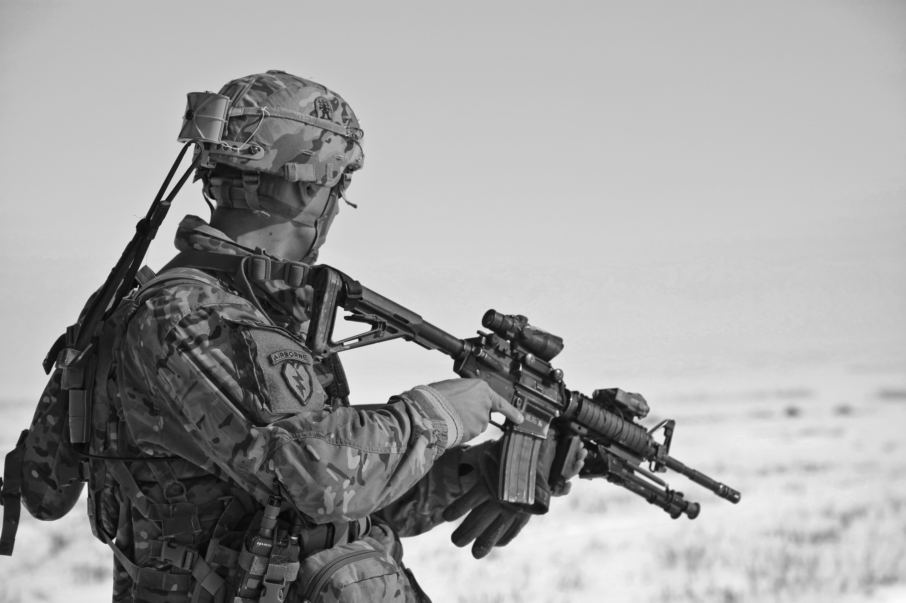

### Introduction

From an elixir of life to the breech of a machine gun, gunpowder has come far from its humble origins. This article attempts to summarise (as it happens, one millennium cannot be anything but summarised in a single article) the development of gunpowder and of course, guns. Since events that long ago are hard to trace with extreme accuracy, there are often multiple plausible hypotheses. Here, we will present the most likely one.

- - -

### Eternal life aka gunpowder

It was known in China in the first millennium AD that a mixture of certain chemicals (saltpetre aka KNO~3~, sulfur and at times other substances) burned very, VERY well. A large number of alchemists were of the opinion that this concoction was definitely the 100% new solution for the problem of gold, eternal life and perhaps all the world’s problems (which it certainly is in Stalin’s view).

The ratio of the two ingredients was very different from black powder (the standard smoky gunpowder), having far less saltpetre (which is an oxidant, making the powder explode). Early powders didn't have enough saltpetre to produce the explosion that characterises gunpowder. Instead, the powders ended up on fire arrows. These ‘arrows’ moved from being launched from bows to being fired from rocket launchers made of bamboo or paper, exciting choices for a firearm barrel. 

Keeping true to the spirit of Jackal, the weapon that evolved from these, the fire lance, used an inflammable barrel and scraps of metal or porcelain for bullets.

Eventually, someone wanted a gun you could use more than once and so, the barrels were made of metal in the hand cannon. The technique of single-use cannons persisted afterwards for those in desperate circumstances but largely fell out of favour. The technique of cramming whatever you could find into a barrel stayed around for a while, until designers realised that matching barrel and bullet size allowed you to get more range than a sneeze.

This insight made people put stones or iron balls of the same diameter (calibre) as the barrel as projectiles in guns instead of just picking up whatever was lying around.

- - -

### Attack of the Cannons

On the coattails of Genghis Khan’s Mongol Empire, rode the new weapon, reaching first the Arab Empire, then reaching further north and west.

In 1453, the Byzantine Empire was shot at point-blank range by the new and improved European empire, the Ottomans. This marks the rising importance of artillery in bombarding defences to rubble and the development of guns into an unstoppable weapon. The old trebuchets were replaced by the new “cannon”. Cannons came in a variety of sizes, from the small to the huge.

In the face of these new developments, Niccolo Machiavelli (yes, that Machiavelli) wrote, “There is no wall, whatever its thickness, that artillery will not destroy in only a few days."

Still, you can’t blame a ~~girl~~ fortress for trying. The initial attempts were simply at making walls thicker. After all, it worked against catapults and trebuchets, so why not cannon? Sadly, this effort was ill-conceived.

The main problem with trying to out-stiffen cannons is racking stress (the walls twisting against each other), and the problem gets worse as you thicken the wall.

An engineer called Vauban adopted a new approach: keep the cannons from hitting the walls and keep the soldiers from scaling them. Don’t try to stiffen the wall against cannons; just avoid the balls by raising the walls on a slope, adding external walls… Whatever it takes to keep the cannons away from the walls. Infantry is less dangerous than even a BB gun, after all.

- - -

### Guns. Lots of guns

Or is it? Let’s have a look at what’s been happening with those small arms of ours.

Where we last left off,  pretty much described our guns. Short-range weapons shooting pebbles at plate armour don’t tend to make much of an impact.

All the same, against equally well-equipped infantry, guns do better than arrows. The hand cannon eventually evolved into the first gun with a trigger, the matchlock. The key difference is the ignition mechanism: all our previous guns have been lit with live fire (the type that you can ride to heaven with a barrel of gunpowder), whereas the matchlock used a slow-burning fuse that had no open fire but was prone to going out. The later matchlocks had a distinctive s-shaped lever (called the serpentine) used to touch the match to the firing pan. (For those unaware, a matchlock has powder in a firing pan to convey the flame from the match to the actual chamber.)

A heavier version of the arquebus branched out and became the musket, the first armour-piercing gun. The flintlock musket, named for its new firing mechanism – sparks struck on flint – had no live fire or clumsy match.

As usual, the response to better armaments was thicker defences. Cuirassiers (named for their cuirass) wore thick armour to withstand the impact of at least one shot. Over time, the armours ended up being unfeasibly heavy and simply ended up not worn.

For all its advantages, the musket had some serious disadvantages: it was heavy and hard to load, requiring you to reach into the muzzle, tear a part of the packet containing bullet and powder, spill the powder into the barrel and then ram it in. The Revolt of 1857 occurred in part due to needing to bite the packet open to tear it.

The problem was solved in part by breechloading weapons, which allowed one to load the gun without ramming the bullet in.  Breechloaders were just as heavy, however, and had an additional problem of back-blast – the gun blowing up in your face even when you successfully fire.

To find the next piece of the puzzle, we need to look at bullets.

- - -

### Don't shoot till you see the whites of your eyes

It was a well-known principle since feathered arrows that spinning makes a projectile more stable. Many approaches had been adopted to allow the bullet to spin, most involving a rifling of the lands on a gun (for the less terminally-definition-oriented, making a groove in the barrel of a rifle) and possibly a matching protrusion on the bullet to spin it as it exits the bore.

The problem with such approaches is the difficulty in actually loading the bullet: if the groove is tight enough to spin the bullet, then it is hard to fit the bullet into the rifle.

A French inventor, Claude-Étienne Minié, achieved worldwide fame by resolving the paradox with the Minié ball, a cylindro-conoidal bullet (think mix of cone and cylinder) with a cavity at the back. The bullet could be made smaller and expand due to the pressure of firing until it engaged the rifling on the bore. (Again, this means fitting the bullet into the groove.) This invention was so popular that Minié balls were the most common bullet in the American Civil War and put the rifle solidly on the market.

- - -

### Poof!

To avoid going out with a bang and a splash, it was now necessary to get rid of sparks and firing pans. By this time, chemists had found more excitingly unstable compounds than gunpowder. Of importance here is Mercuric fulminate (Hg(CNO)~2~), an unstable compound that explodes when struck. By placing a cap of this behind the gunpowder, you could fire a weapon without ever using a spark outside the barrel. This had the added advantage of being quicker to fire due to no firing pan. From the percussion cap (what we have just discussed), it was just a skip and a hop to the cartridge, where the powder was safely enclosed away from pesky rain.

However, the powder in these guns remained notoriously smoky. Snipers could not fire without being revealed. Commanders could not issue orders once firing started. And on top of all this, they were quite heavy, fouled the barrel and were hygroscopic, which made it even worse to handle. For all this, gunpowder was also a poor explosive.

As always, the chemists have found new ways of blowing themselves and everyone else up, this time with nitroglycerine. As the name alone evokes, a long, long series of factory and field explosions led to various derivatives of nitrocellulose, starting with guncotton and reaching Poudre B, creating the first practical smokeless powder at 1/3rd the weight of black powder. Further attempts have largely balanced the ratios of nitroglycerin, nitrocellulose and stabilisers to keep it from exploding outside the barrel.

- - -

### The right end of the gun

The usual method of fire, when it came to guns, had been to use volley fire, where one troop splits into a kneeling and standing line, and one shoots as the other reloads. This approach, however, just wasn’t good enough at killing soldiers (this was an article about guns; what did you think the military was interested in?) This defect needed to be remedied.

The mitrailleuse was a gun that spat out 25 rifle bullets one after the other, called a volley gun. However, it was limited by the operator's speed to crank the firing mechanism. The Gatling gun, built by Dr. Gatling, ended up the more popular and better-developed precursor to the modern machine gun. While it also suffered from the hand-cranking defect, unlike the mitrailleuse, it had no problem of overheating as each barrel had been given time to cool.

Lead is a metal with a low melting point. Previously, this made lead a good choice for bullets: easily manufactured and to exact specification. But with more and more powerful rifles, lead gets likelier to jam in the rifle on its own. Eduard Rubin, a Swiss army engineer, discovered that ‘jacketing’ – covering – a lead bullet in copper made it able to tolerate more heat and friction.

The first *truly* automatic weapon was the Maxim gun. Using the recoil from each bullet to load the next and water cooled to prevent overheating, it was the final word in ~~murder~~ offense. While the Spartans failed to stop Xerxes, the British army faced off a charge of 6000 riflemen and spearmen with a mere 750 troops using Maxim guns. The gun was so successful that it saw action (with some modification) even through WW2.

And with that, we reach the business end of the machine gun as promised.

- - -

### References

* Wikipedia’s pages on [Fulminates](https://en.wikipedia.org/wiki/Fulminate), etc
* Encyclopaedia Britannica
* Special mention for Saphroneth’s [Saruman of Many Devices](https://tvtropes.org/pmwiki/pmwiki.php/Fanfic/SarumanOfManyDevices), which inspired me to make this article.