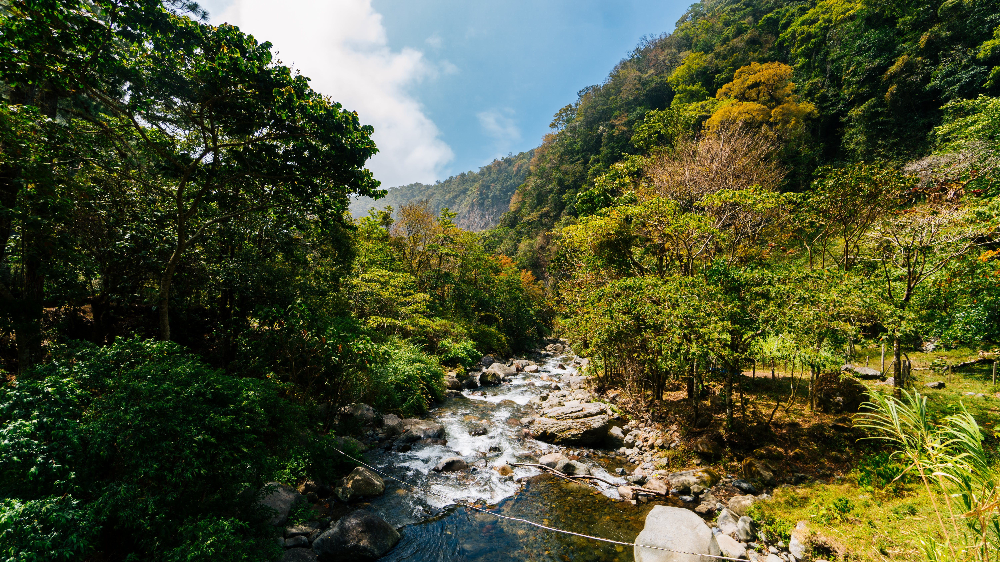

<!--StartFragment-->

Everything begins with a tiny speed, 
We call this season spring, 
Life on Earth is brought to speed, 
May it be plant or human being, 
The meadows all turn lush green, 
The daisies and buttercups grow, 
The birds chirp and the bears are seen, 
The beginning of life they show.

<!--EndFragment-->

<!--StartFragment-->

Summer arrives, the sapling now a tree, 
New streams from the mountains emerge,  
The youngster from his chains now free,  
A whole world ahead for him to merge,  
Fresh fruits the trees now bear,  
May be sweet or sour to taste,  
Life as a man, his biggest fear,  
One wrong decision can take it all to waste.  

<!--EndFragment-->

There is a definite crack in the leaves, 
As we towards the fall, 
He is a grown man, in himself he believes, 
Experience in life says it all, 
Brown leaves and a ground full of broken branches, 
Bears now preparing for months of sleep, 
He sits now and remembers all the pulled punches, 
Either pride or regret now starts to creep. 

Winter itself is the omen of death, 
Leafless the tree does stand, 
A good long rest after the final breath, 
Possessions now fall out of his hand, 
Pure white snow covers it all, 
The bears now in a deep slumber, 
A great life he lived, but die he shall, 
With a smile as cool as a cucumber. 

This is a cycle, a process, a loop, 
Life on the Earth shall never end, 
A new child will start its coop, 
To conquer each problem that God does send, 
The cycle of life thus keeps going, 
Hand in hand with mother nature, 
May it be a plant or a human being, 
The rules don’t change for any creature. 