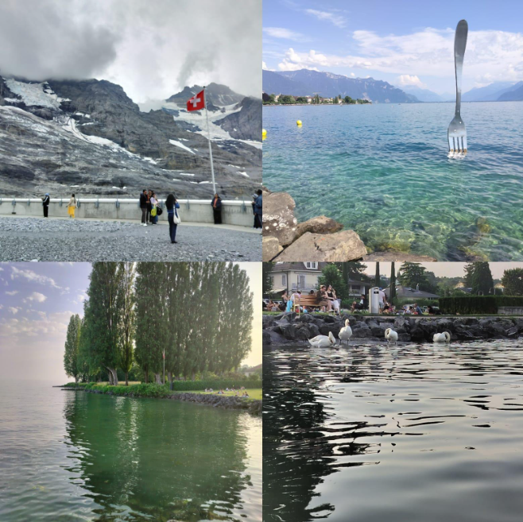
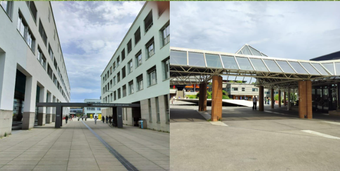
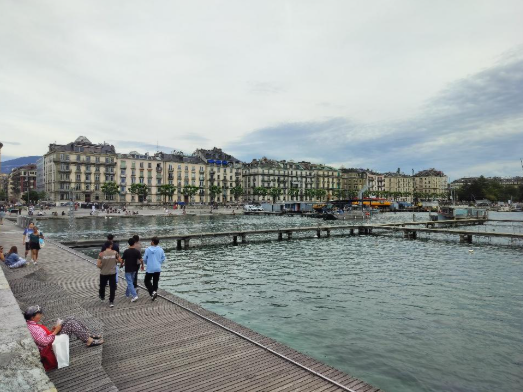
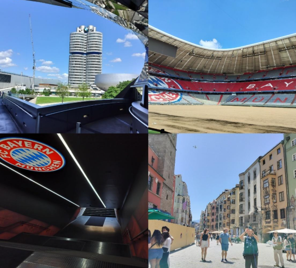
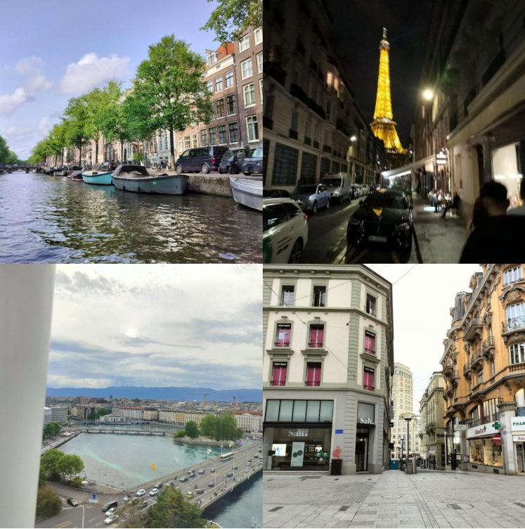
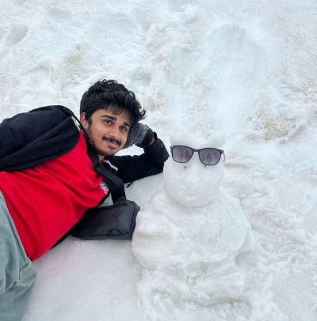

### Internship @EPFL, Switzerland ft. the Lindt, the Alps and Unlimited Pasta

I vividly remember the first day I knocked at his cabin, and he said in his chalky-smokey Italian voice, “_Si, si!! Come in!_” I opened the door to find him having arranged 3 chairs beside each other and lying on them, effortlessly, streaming a David Guetta concert. Yep, he had some unseen (or unheard?) aura farming in that room. I was totally rizzed.

Prof. Francesco Stellacci is a biggie-big shot in the field of nanomaterials and nanomedicine. His group, the Supramolecular Nanomaterials and Interfaces Laboratory (SuNMIL), started off at the Massachusetts Institute of Technology (MIT) back in the 2000s, after which he shifted to the Swiss Federal Institute of Technology in Lausanne (EPFL) in Switzerland, in the last decade. When I first received the confirmation email from EPFL that I had been selected as an E3 fellow in 2025, under Prof. Stellacci, I surfed Amazon right away to buy myself a pacemaker. I told my parents about the same, they laughed it off and said, “_Enough of your comedy, dinner’s ready- better come fast._”

> 
“Life was good.“

> 
“Actually, pretty good this summer.“

> 
“Lakes, snowy Alps, a vacation-like internship, unlimited Pasta.“

> 
“Nice money. Really nice. 2 lakhs a month, for a research internship.“

> 
“Roamed Munich, Paris, Amsterdam, Innsbruck, Salzburg, Geneva, Rotterdam, Jungfrau, Vevey and Montreux and still saved an impressive sum.“

> 
“Lindt, Torino, Frey, Ferrero, Haribo, a flood of chocolates that would have probably gotten me diabetic- oh, I didn’t check yet.“

> 
“Post lab hours? Recreation? YT? Netflix? A walk? Hell nah, never been so mid.“

> 
“Kayaking, paddle boarding, shooting stars, barbeque and staring at the French border from our campus beach. Every. Single. Day.“

**EPFL is one of the most prestigious universities in the world, regularly ranked within the top 30 in the QS World Rankings, and within the top 10 for a few engineering streams. EPFL conducts internships of 8-12 weeks through 2 programs: E3 Excellence in Engineering (the one I got, open to all departments), and Summer @EPFL (open to CSE, EE and related areas only). The acceptance rates of both these programs are <2.5%, with students applying across the globe, which makes the process quite tough and expectations naturally low.**

**In my case, I had Indian co-interns from IISc, IITM, NITT, IITB, IITBHU and other schools. But the foreign crowd was all fancy- students from MIT, Harvard, UC Berkeley, Georgia Tech, Duke and Johns Hopkins. Seeing this did give me heebie-jeebies at first, but when I think of it this way as me, from a campus still undergoing construction and a lot of infrastructural and research deficits landing up at the same place as someone from an Ivy, it made me realise that some of the craziest dreams I had as a kid had already been fulfilled, I just didn’t give time to myself to appreciate it enough.**

**Self-love is important, kids.**

- - -

### How to Get In?

I’ll try covering every bit of information I can give on securing a foreign internship, as I have been asked this a lot by juniors and daily DMs getting spammed by students from other colleges on LinkedIn.

Firstly, any foreign research internship isn’t a piece of cake. With MITACS and DAAD programs closed permanently, it has become only tougher for us to secure a fully funded summer abroad. However, I would recommend each and every one of you to have research done on opportunities abroad and apply to each and every one of them- many programs like IST Austria, Max Planck, Purdue SURF, UTokyo, OIST, Caltech SURF, Khorana, Viterbi, etc. do host interns up to 3 months with competitive stipends.

Secondly, securing a foreign research intern is only possible if you can demonstrate strong prior research experience. They have no reason to select you just because you cracked the IIT-JEE or you have a CGPA >9, as you are competing against students across all IITs, IISc, BITS and IISERs having similar profiles, which requires you to stand out. In my case, I had a remote internship from Purdue and another one from JNCASR Bangalore before the application. Moreover, I had the results from my Purdue work accepted at a conference and under review in a journal at the time of application, which boosted my chances. I don’t believe that my CGPA was even close to impressive for an institute like EPFL, but my research experiences compensated for it pretty well. I would recommend having a CGPA of >8.8 and strong previous experiences for a well-built, robust CV that could make a competitive profile for such apps. This requires constant efforts right from your 2nd year, and it could be in the form of any previous lab experience or a good, productive stint at one of the labs in our college itself, with eye-catching results that could totally rizz up the panel.

The next thing is a well-crafted SoP. CVs, transcripts and SoPs are the soul of any research application. Make sure you prepare a tailor-made SoP, using absolutely 0 GenAI (they’d reject straight away) for every program you apply to. By tailor-made, I mean that the SoP must be like a story, engaging the panel as to how, what, when and why you are who you are. It should also explain why you wish to join the group or institute, and your long-term plans, with brevity. In my case, I mentioned my areas, nanotechnology and drug delivery, with 3 preferred faculty I would wish to work with, citing their recent papers and which part of their work I am particularly interested in. This is also the most important step, so that the committee feels that the application is personalised and not just a spam attempt based on luck.

As the icing on the cake, try giving the names of 2-3 strong references who could write you a powerful LoR. How powerful is an LoR has 2 aspects- one, choosing a professor who is famous, and whose research is well regarded in the scientific circles (check citations, preferably >1500, and h-index, preferably >15, on Google Scholar, as his /her words would certainly hold weight if they have a strong track record, and second, choosing someone who can vouch for you decently, i.e. the ability to write and describe you enough to persuade the committee that the professor knows you well, in and out. If you get a couple of such profs backing you, the gates to such programs will only get easier to break open. I had my profs at JNCASR and Purdue (both internship supervisors, both globally renowned for research, and both sweethearts) write 1-2 pages supporting me, which massively boosted my chances. 

And last but not least is the interview round, which, in my opinion, is the easiest part of the process. Any interview for a research opportunity digs up your CV and previous projects to know more about your experiences and how well-versed you are in the work you did. If you can explain your work, interests and motivations from A to Z without self-doubt, that should pretty much do the trick.

The whole moral of the story is to not be the jack of all trades and the master of none. It’s the opposite. Master one domain and streamline your CV and your SoPs only on that. Take electives in college accordingly, and not just to improve grades, so that you end up gaining some knowledge in an area of interest, giving you more awareness and an edge in interviews.

- - -

### Living There

Switzerland is one of the most expensive countries in the world, but at the same time, it is one of the ones with the highest stipends. As an intern, you would earn close to 2L per month, which is more than sufficient to experience heaven on earth. Accommodation cost me around 60,000 INR per month (double sharing, private kitchen and bathroom), and being close to my lab, I didn’t have to avail myself of any transportation.

I cannot stress this enough: **carry a pressure cooker and a tava** (and first, learn how to use them). They’ll be your lifeline. Europe may ace watches, trains, and chocolate, but when it comes to food, let’s be honest- it’s bland. Croissants, pasta, baguettes… they look fancy on paper, but try eating them daily and your spice-accustomed Indian taste buds will protest. I smuggled salt, sugar, and spices from home, and thank god I did. Breakfast was mostly cereal/muesli, lunch was either sandwiches or those divine thin-crust pizzas (200–400 INR, and they made me realise Pizza Hut and Domino’s are the biggest scammy dogshit we tolerate in India), or sometimes raw European pasta (trust me, ISTG, it’s a whole different species compared to the “pasta” we know). Dinner was the survival kit: bread omelette, Maggi, or just fruit (grapes, pineapples, whatever I could grab). Not impressive, but hey, I forgot to carry my cooker, and that was on me. So again- _please, carry a pressure cooker_.

Vegetarians, you’ll have it rough. Europe thrives on meat. Yes, you’ll find ready-to-eat stuff at Migros or Denner, but it’ll burn holes in your pocket. I once bought Indian chicken tikka masala out of homesickness - what I got was an ultra-sweet curry clearly designed for European palates, with just a spoonful of rice. Price? 8 CHF (850 INR). Heartbreak. Walletbreak. Hence, my free TED talk today: _carry that cooker_. This is not an ad, bbg.

The cultural aspect of EPFL was its finest feature. Nobel Laureates casually visited for distinguished lectures. Every professor you walked by was a big name and searching them online would almost always lead to a Wikipedia page. Some professors even rode around campus on skateboards, as skateboarding or waveboarding were just two modes of transportation on campus. Then there was the infrastructure. Labs here are equipped: every lab has its own FPLC, HPLC, SAXS, SANS, BET, PAM, SEC, AUC, SIC, fluorescence instrumentation, plate readers, basically every characterisation instrument you could think of. In India, these may all fall under central facilities or at most one per department, but in Switzerland or even at EPFL, these equipment are on your doorstep.

The thing that surprised me most was the work-life balance. At 6 pm on the dot, the labs were empty, the doors were locked, and the campus was silent. Saturdays and Sundays were like this as well. Once, I stayed until 8 pm to finish my DLS runs, only to be caught by security, written up for a complaint and warned I would lose lab privileges if they found me working late again without my supervisor. I lowkey wished this happened in India too, lmao, the culture contrast was so evident.

The diversity present in my lab was another masala. The division consisted of people from all over the world, including a contingent from Vietnam, China, Turkey, Germany, Italy, France, and Russia. I remember a group meeting where the Chinese dude said, “_And these films can be used to pack snakes!!_”, and the entire lab was like WTF?? It was later clarified that bro actually meant ‘snacks’ and not ‘snakes’- it was just an accent issue that we giggled on till our bones tickled. The perspectives that were developed in our discussions made our group meetings feel like brainstorming at the U.N. The discussions were so broad, covering such topics as viruses, protein-protein interactions, Cryo EM, biofilms, and nanomaterials; every discussion caused me to rethink all of my own local abilities.

My project was on the stabilisation of insulin for diabetes. Insulin is usually stored and stabilised as zinc hexamers, but only the monomer form is effective in regulating blood glucose. We demonstrated that dispersing insulin using proline enhanced its stabilisation in the monomeric form, decreasing both hexamer and aggregate formation, while also improving bioavailability compared to controls. Using DLS and SEC/FPLC, we have shown that proline can stabilize monomers at a concentration of 1.5 M, resulting in 82 % monomer and at 1 M resulting in 70.6 % monomer. Other amino acids were inferior, with serine being weaker than proline and arginine, which stabilised monomers but also created aggregates greater than 50 nm. Since amino acids are safe and biocompatible, the use of amino acids presents an interesting opportunity for formulation-based, on-demand delivery during bolus dosing. This also has implications for preventing insulin-derived amyloidosis at the injection site, which is a key driver of reducing bioavailability and therefore necessitates higher doses of the protein. Proline is particularly interesting as a simple but effective method to make insulin quite a bit better.

At the end of the day, it’s about the experience and the journey. Seeing the Eiffel Tower sparkle wasn’t something I dreamt of happening, and trust me, they all were right. The Eiffel doesn’t just take your breath away, it sucks it. I also took a bus to Munich to visit the first love of my life, FC Bayern Munich and the Allianz Arena (oh, to be in love), where you get to see the dressing room, the conference centre, the stands and the stadium tour. The whole vibe of the city, the BMW headquarters, and the donner kebabs stood out, scarring my mind so deeply.

Amsterdam and Rotterdam, the gorgeous canals and tiny buildings peeking from the sides have spoiled me; my bars have reached somewhere, god knows. Switzerland itself remains mesmerising in its own ways. The tiny streets of Lausanne, the snowy hills through cable cars of Jungfrau and having a campus next to the majestic Lake Geneva, crowned with the French border visible on the other side, with a facial makeup of cruises and a variety of options from paddleboarding and kayaking to waveboarding for rejuvenation post lab hours hit like crack. The roads were the cleanest you would ever see. Even the outskirts have been maintained like some fancy Taj resort with aesthetics. Try crossing the road, the cars stop for you to cross, unlike our beautiful country, where bikers will smash pedestrians on the footpath, sending them to heaven- heaven could be Switzerland, so the poor bikers had good intentions, okay? Shush.

Weekend sneak peeks at the heavenly Alps of Grindelwald or glimpses of Geneva’s most unaffordable fashion streets made this stay in this slice of heaven even more magical, hence proving that a foreign internship is as good as a vacation to tick your bucket list.

Looking back, the Alps, the Lindt, and the unlimited pasta were unforgettable- but what really stayed with me was the sense of possibility. If a student from a still-growing IIT campus can share lab space with peers from MIT or Harvard, it just proves that the only real barrier is in our heads. So, pack your curiosity, a little confidence, and yes, for the last time, a pressure cooker - and go chase that foreign internship. You'll come back with not just a line on your CV, but with stories you'll tell for a lifetime.

Maybe I should have named this article _“The Summer Neerav Turned Pretty”_ ... but then I wouldn't have gotten to tell you about the cooker, so nvm :(

_Season 3rd year, out on my beloved ex, Udaan, now._