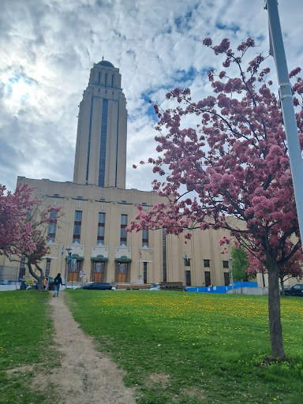
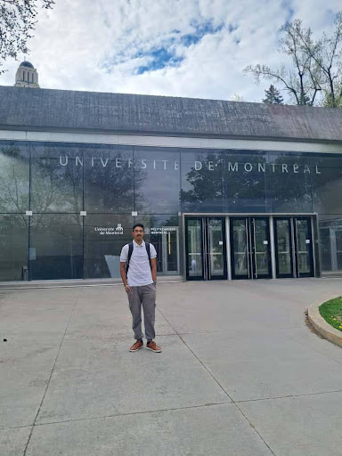

### Where did I go

My internship this summer was a research opportunity at Polytechnic Montréal, Canada, in the SWAT Lab under Prof. Foutse. I got this opportunity through Dr. Sridhar Chimalakonda (CSE HOD), who connected me with the lab. From the beginning, I knew this would be my first international internship, and the excitement of working abroad was mixed with nervous anticipation of facing new challenges. It kept me on my toes.

- - -

### What I worked on

During my three months at the lab, I worked on a project focused on using reinforcement learning to reduce false positives in static analysis for Rust programming language. I was the only intern on this project, guided by a postdoctoral mentor. My role involved exploring algorithms, running experiments, analyzing results, and iterating to improve the accuracy of the static analysis tools. As expected, the work was tough - research rarely goes as planned, and I faced many roadblocks that tested my problem-solving and perseverance. Still, the challenge was exactly what I had hoped for, pushing me to think critically and independently while contributing meaningfully to the lab’s goals.

- - -

### What was it like?

The people at the lab were incredibly welcoming. Canadians, in my experience, are some of the most humble and helpful people. From helping me settle into my room to assisting with grocery shopping and day-to-day queries, I always had someone to turn to. Montreal itself is a vibrant city with a mix of French and English cultures. Even small things were new for me - the default language on my computer and keyboard was French, which initially made typing tricky. The sun set around 9–10 PM, which shifted my sense of daily routine, and being vegetarian meant I had to cook my own meals every day. While these might seem like minor challenges, they added to the adventure and taught me to adapt quickly to new environments.

- - -

### And more!

This being my first international trip, I had pre-booked a room in Montreal, but not everything went as planned. I had to spend the first week at a friend’s house while searching for suitable accommodation. It made me realise the importance of having friends and contacts wherever you go - they are often your lifeline in unfamiliar cities. Over time, I met students and PhDs from Brazil, Tunisia, Iran, China, and other countries, making this internship not only an academic experience but also a culturally enriching one.

Living in Montreal gave me a first-hand view of their work-life balance, which is a bit different from what I'm used to in India. Work typically ran from 9 AM to 5 PM, leaving ample time for family, socialising, and leisure. The city itself was fascinating - half the roads seemed filled with Teslas, Android phones were rare, and local staples like Tim Hortons were everywhere, giving a warm, familiar feeling similar to tea shops in India. I even tried Japanese ramen, which became a small but memorable part of my Montreal life.

Living in Montreal also gave me the chance to explore nearby cities. During one week, I went on a trip to Toronto and Quebec City. While Toronto was bustling and modern, I was particularly captivated by Quebec City with its charming European-style landscapes and historic architecture - it felt like stepping into a different era. Travelling added a refreshing break from work and made my internship experience richer, giving me a deeper appreciation of Canadian culture and history.

Reflecting on this internship, I can say it was transformative. _The experience confirmed my interest in research, exposed me to international work culture, and taught me lessons about independence, perseverance, and cultural adaptation._

- - -

### Advice

I would suggest you to have connections with some professors on campus by working with them. There are other professors from other departments also who have connections with other professors from foreign countries - you can make good connections with them.