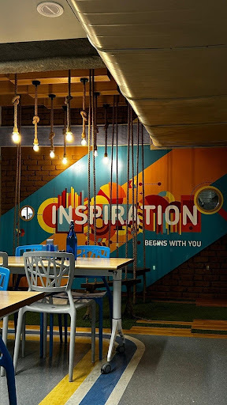
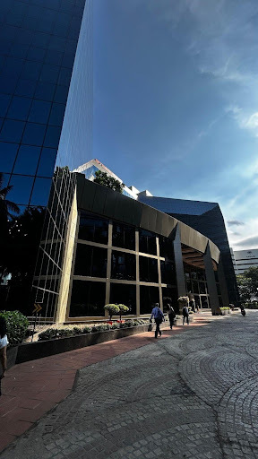
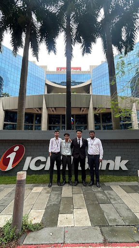

### How it all Started

So here’s the story. ICICI Bank’s summer internship had over a hundred applicants. Out of those, eleven of us made it through resume shortlisting. Then came this "Occupational Personality Questionnaire,” which sounds scary but is basically a personality test disguised as corporate psychology. Not exactly an elimination round, but you still end up overthinking every answer. Finally, the interviews: the real deal.

If you’re preparing for those, remember this: know your resume like your best friend’s secrets, and don’t "yes sir” everything. Be confident, not rehearsed. They’re not looking for textbook answers... they’re looking for people who can think on their feet and sound like actual humans. (And maybe throw in a small smile when your brain blanks out.. it helps (wink).)

- - -

### Welcome to Bandra Kurla Complex — My Home Turf (for Two Months)

The ICICI headquarters in Bandra Kurla Complex, or BKC if you want to sound like a local, is every bit the glass-and-granite corporate jungle you’d imagine. My daily routine had one consistent element: the Starbucks right across the street. We used to stroll over there mid-day, buy nothing, and come back refreshed. Just vibes. There was also a Subway nearby, our other escape from the office food, which, to be fair, was pretty good, just got monotonous after a month. And no, it’s not free. (I checked. Twice.)

The stipend? ₹85,000 per month... one of the highest on campus. Felt amazing until I realised I was paying ₹40,000 in rent. Because genius me decided to rent a flat near the office. In Bandra. Don’t do that. Get a PG. Or share. Or literally anything that doesn’t make your stipend cry for help.

- - -

### Work, Mentors, and the Mysterious World of Models

ICICI assigns you both a mentor and a guide, basically your work lifelines. Mine were brilliant, approachable, and surprisingly fun to talk to. You can discuss work, career goals, or even random ideas that come to you mid-lunch.

My project was to benchmark ICICI’s model validation practices against global frameworks. RBI, Basel, US GAAP, EBA. Sounds fancy, right? It is. But in practice, it’s a mix of reading thousand-page regulatory documents, running validation tests on credit risk models (PD, LGD, EAD), and explaining why something that "technically works” still needs fixing. Some days were smooth; others felt like arguing with Excel until one of us gave up.

But that’s where the fun was: learning how a massive bank actually uses data, risk models, and analytics to make real decisions. It was finance meets tech, with a sprinkle of detective work.

- - -

### The Great Tesla Heist (Sort Of)

Bombay never stops moving. And right towards the end of our internship, Tesla decided to open its first-ever showroom in Jio World Drive... literally walking distance from our office. So, naturally, we had to go. And yes, we may have snuck out of office hours to do it. (If my manager is reading this, that was a... planned field visit.) The showroom was a dream; a shiny car, flashing lights, and we interns pretending to belong there.

Evenings in Bombay were an adventure on their own. Phoenix Marketcity, Jio World Drive, and Jio World Plaza are all dangerously close and equally tempting. Marine Drive was a bit far, but we still made the pilgrimage a couple of times. When we were too lazy, Rapido and Blinkit became our unofficial sponsors. Mumbai without quick commerce apps is like Biryani without raita.

### What I Actually Learned (Besides the Price of Rent)

You won’t become a finance wizard in two months, but you’ll definitely see how the pieces fit together… data, regulation, human judgment, and a healthy amount of Excel and Python magic. You’ll learn to think more clearly, communicate better, and question things that don’t add up.

And beyond the work, you meet incredible people. I made friends from other IITs and B-schools, and even now, we still stay in touch. The internship was equal parts work and discovery, of how banking operates, and how you operate under caffeine and deadlines.

- - -

### The Intern Survival Guide: Mumbai Edition

1. **Don’t rent in Bandra (unless you secretly enjoy donating your stipend to landlords).** PGs are cheaper and cleaner than you expect, and usually come with a friendly cat or two.
2. **Learn the art of the mid-day Starbucks walk.** It’s not about the coffee, it’s about the sanity break. Even pretending to order helps.
3. **Carry a light jacket.** Because the office AC runs on ‘Antarctica’ mode.
4. **Use Rapido and Blinkit wisely.** You’ll thank yourself on days when you’re too tired to exist.
5. **Don’t overthink the project.** You’ll figure it out as you go. Everyone’s winging it a little... some just do it with better formatting.
6. **Explore.** Mumbai has too much to offer: food, chaos, stories. Take it all in. Even if you’re tired, go to Marine Drive at least once. It’s a reset button.
7. **Be curious, not corporate.** Ask questions. Talk to people. The more you engage, the more you’ll learn.. not just about banking, but about how people think and work.

- - -

### Closing Thoughts

If you ever get the chance to intern at ICICI, take it. It’s not just an internship... It’s a crash course in finance, people, and real-world responsibility. You’ll learn, laugh, and occasionally wonder how Excel formulas have so much emotional power. Bombay will tire you out, inspire you, and maybe even change how you see work.

"Work hard, sneak out responsibly, and never underestimate the healing power of a Starbucks walk.” - unofficial intern motto.
