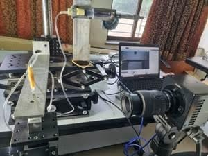
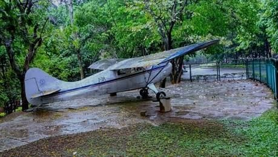

Here’s a look back at my journey, from the application process to the invaluable lessons from working as an intern at NIRF #1 research university.

- - -

### How it all started

I had gathered some insights about manufacturing and assembly and I had gained  experience on  how an industry works as I had done my internship in 2nd year in LPSC – Bengaluru. I wanted to do a research internship in my 3rd year due to two main reasons. One was to clear my career confusion, whether to plan for higher studies or placements. From this experience, I wanted to get a sense of what research is like. Another reason was “GRADE". I heard from a few seniors that my department prioritizes research internships over industrial internships. And it actually turned out to be true, at least in my case. When I expressed this to my parents, they suggested I target IISc as it was just 30 minutes away from my home (we Bangaloreans measure distance by time :)).

I wasn’t very confident about securing an internship at such a prestigious institute. I started drafting my application with IISc. I mailed 2 to 3 professors from the mechanical department and waited for a couple of weeks and got no response. I refined my application and mailed 2 to 3 professors, but this time in the aerospace department. After a few days, I got a response from a professor stating that “I have a small problem statement which can be solved in 2 months…" He explained the problem in detail and inquired if I could solve this by achieving good results, then we can also try publishing jointly after the tenure of my internship. I was excited after reading the mail, I searched about it, and though my first thoughts were petty, I found it interesting. So, I expressed my interest and finally got into it.

<u>Protip</u>: Do not spam emails to all professors in the same department. They talk among themselves.

### My work

I studied the impact of droplets on non-circular orifices. In 2 months, I had to perform experiments, analyze the data and come to a conclusion and explain what effect it would have due to non-circular orifices and if there wasn’t any effect why doesn’t it have. I was given 4 different orifices and the experiments had to be varied across different impact heights. This part of the internship tested my patience to the core and I felt hell as I had to ensure each time that the droplet impacted on the exact centre of the orifice, this was the most exhausting task and it took over 2 weeks. And as the data was captured by a high-speed camera at 6250fps, I had enormous data to extract the required par"ameters from each frame; this could have been painful if the ImageJ software had never existed. I tried to extract a few parameters from image processing using OpenCV, this shortened the time significantly. In this process, I was left with another month left.

The OriginPro software helped me visualize data and plot useful information for easy comparison. Analysing the results and arriving at a conclusion was the best part and this was when we discussed the possibilities and explored each possibility. The best and crucial part of research I would say. Thankfully I was sent a few research papers beforehand and the setup was made ready so as to start the experiments without wasting time. At this point I had to complete documenting everything, like the image sequences, plots and the report. I must mention that the PhD scholars were very welcoming and supportive. They made me learn patience in the entire process of experimentation and documentation. They maintained the entire lab with positive vibes.

### Apart from routine work

Other than usual stuff I got to attend a talk from “NOBLE LAUREATE Brain Schmidt !!!” which I realized was common in IISc, unlike …. His talk was about how the universe works, what a supernova is and astrophysics. It was a completely engaging talk, I was fascinated and impressed by looking at his passion in that field and the eagerness to even learn more.

Another interesting experience was when I attended a speech by Dr. V. Narayanan, the current chairman of ISRO. He spoke about his early struggles, his contributions to ISRO and what ISRO means to him. He explained about the future perspectives of ISRO which caught my attention. I was one of the people who was truly inspired in that hall to serve our country in a meaningful way.

Finally, my two months of summer internship ended in a smooth way. I mainly loved the ambience, the lab atmosphere, the people, the lush greenery and the peacefulness of the entire campus. I wish I had more time to spend there.

### Suggestions

1. While drafting application research more about the professor, cite a few relevant works of theirs and mention how their experience will be helpful for you in future.
2. Exhibit your skills if you don’t have a good CGPA. Tailored applications must be above others to strengthen your application and draft it more like a story about how, when, where and why you are where you are.
3. Do not add irrelevant information and things on your resume for example, positions of responsibilities like some club activity that doesn’t relate to your application. Make your application concise and straight to the point.
4. Take a letter of recommendation from someone who works in that domain, who knows you well, and can judge you personally. For example, the faculty on our campus who have taken courses or supervised your projects.
5. Python code was useful throughout my internship from extracting data to curve fitting parameters. So at least a basic level of programming language is required to survive in core domains too.
6. Never hesitate to ask even the smallest of doubts, this will improve overall understanding of the concept by correlating things. Internship experience differs completely from routine classroom knowledge.
7. I would always say to stay humble with your lab mates and professor, as they are experienced and would advise or give valuable suggestions when you face challenges.
