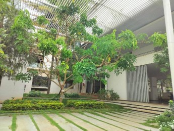
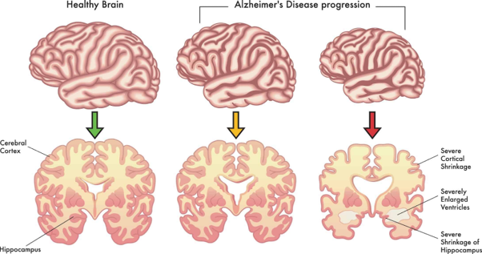
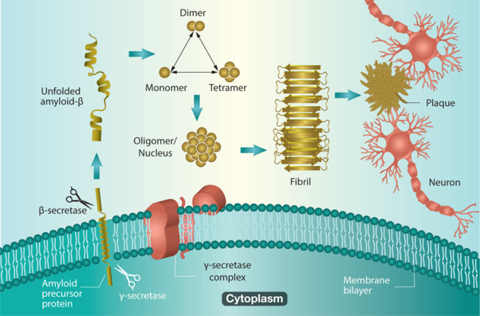
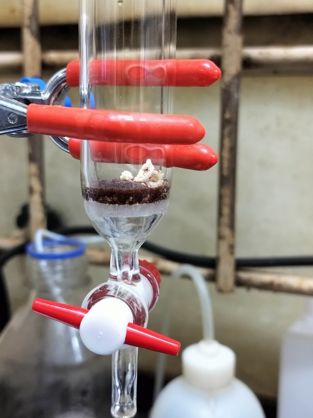
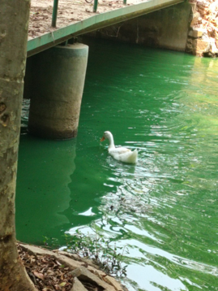
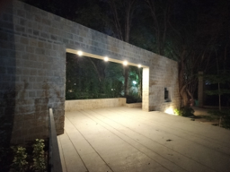

<i>"And if a double-decker bus crashes into us</i>

<i>To die by your side</i>

<i>Is such a heavenly way to die"</i>

 

<b>Pause soundtrack:</b>

<i>But wait, this isn't quite 500 Days of Summer; it's more like 60 Days of Summer: The Internship Edition. Cue the reality check!</i>

<b>Play:</b>

After asking several security guards for directions, I finally found my way to the International Centre of Material Sciences (ICMS) on the <b>Jawaharlal Nehru Centre for Advanced Scientific Research’s (JNCASR)</b> charming, contemporary campus in Bangalore. It was my first day of a summer internship, right after my sophomore year, and I was both nervous and excited. As I entered ICMS, the first thing that caught my eye was a hall on the opposite side labelled “Prof. C.N.R. Rao.”

Curious, I approached the door. Through the glass, I could see a large meeting room, a waiting area, a couple of administrative staff, and even two bodyguards. But what intrigued me most was a small, black door that stayed shut. Behind it, I learned, was where Bharat Ratna Prof. C.N.R. Rao, a legendary figure in Indian science, had his office. A month later, after persistently emailing him <i>(thanks to the motivation offered by one of the editor-in-chief herself who said, ‘Dude, we have to article this guy!!’)</i>, I finally had the privilege of stepping through that mysterious door to meet Prof. Rao himself. Everything they said about him was true—he was warm, approachable, and filled with wisdom.

The shut door opened, and two familiar faces walked out. One was Padma Shri Prof. K.N. Ganesh—a name I instantly recognized and someone I would later interview (again, thanks to the editor-in-chief’s rallying cry of <i>“We have to get him too!”</i>). Known as the founding director of IISER Pune and IISER Tirupati, he’s also currently a SERB Chair Professor at JNCASR—and, as I found out, the son-in-law of Prof. Rao himself. Beside him was Prof. K.S. Narayan, another renowned researcher.

That brief moment at JNCASR left a lasting impression on me. It quickly became evident that I was entering a community of intellectual giants, many of whom were Shanti Swarup Bhatnagar awardees and internationally recognized scientists. The environment was charged with brilliance, where the most prominent figures in science, such as Prof. Umesh Waghmare, Prof. Tapas Kumar Kundu, and Prof. Kanishka Biswas, among others, regularly interacted and collaborated. JNCASR wasn’t just an institute to me—it felt like a vibrant hub. In this dynamic space, the brightest minds in Indian science converged, creating an atmosphere akin to a gathering of pioneers shaping the future of research.

 

<b>How did I get in?</b>

Well, I was selected as one of the 70 Summer Research Fellows from the country through the JNCASR SRFP Program, which opens every year in January. My previous internship experience at Purdue University and the letter of recommendation from Prof. Anki Reddy Katha significantly boosted my application. In my Statement of Purpose, I mentioned my willingness to learn more about Alzheimer’s Disease (my area of interest starting from the Purdue project), the progression, the mechanisms, and the strategy used by chemists in drug design. One of my biggest motivations behind applying at JNCASR was that Prof. T. Govindaraju, one of the world's leading researchers on Alzheimer's, works there, and I wanted to join his group for the summer. I received the selection notification during a random Mumbai metro ride from Andheri to Goregaon, and it was enough to keep me smiling for the rest of the day!

<b>The accommodation and food were all sorted at the New Visiting Students’ Hostel (NVSH) in a double seater room with an attached bathroom, within the JNCASR campus, for a subsidised fee of Rs 13000 for 2 months, mess and hostel combined. I was given a lump sum of Rs 20,000 during my stay as the fellowship amount.</b>

I was also fortunate enough to have Prof. T. Govindaraju himself as my supervisor for the project.

<i>So, let me give you an overview of Alzheimer’s Disease (AD) before I bore you with what exactly I did.</i>

Alzheimer’s disease (yes, something close to dementia but with the exception that it is fatal, involves loss of speech, affects movement and memory, causes stiffness, etc.) is a multifactorial condition characterised by two major hallmarks - <b>amyloid-beta plaque formation and neurofibrillary tangles</b>. Despite numerous clinical trials targeting these specific hallmarks, most have been unsuccessful, highlighting the need for a deeper understanding of the disease’s underlying molecular mechanisms. For instance, Donepezil was one of the approved drugs by the FDA. This drug helps improve cognitive symptoms by improving acetylcholine levels in the brain. However, this drug showed a steady decrease in performance in AD patients, concluding that there is some acceleration mechanism behind it and that Alzheimer’s is not just plain memory loss. One critical aspect of Alzheimer’s progression is the role of metal ions such as copper, iron, and zinc, which contribute to the disease through oxidative stress through Fenton reaction and ferroptosis, which leads to the shrinkage of the hippocampus, as shown in the figure below.

These metal ions generate <b>reactive oxygen species (ROS) via Fenton’s reaction</b>, leading to oxidative damage and ferroptosis—a form of iron-dependent cell death of neural cells. AD is caused majorly by the Amyloid Beta peptide, which misfolds and forms sequences of different lengths. Out of this, Amyloid Beta 42 is the most toxic peptide known for causing the disease. Whenever proteins misfold, they form fibrils that stick together to form sticky aggregates that cannot be removed from the body. As you know, the protein-solving puzzle is still unsolved, and once we see the mechanism through which they fold, understanding disease progression from the roots will become much easier. Still, it looks nearly impossible even after centuries of research in this domain. Moreover, copper, iron, and zinc form stable complexes with amyloid-beta peptides promoting plaque aggregation and accelerating neurodegeneration. Recent research has shown that Alzheimer’s pathology mimics ferroptosis, further exacerbating mitochondrial dysfunction, lipid peroxidation, and inflammation, all of which drive disease progression.

 

<b>Why are there peptide-based therapeutics and synthesis procedure?</b>

NMR studies confirmed strong metal-chelating abilities attributed to the nitrogen donors in the imidazole rings of histidine residues within the peptides. Building on these findings, I synthesised peptides containing histidine and amino acids such as lysine, glycine, and aspartic acid to enhance complex binding and remove excessive Cu, Fe and Zn levels by leveraging the strength of resonance binding using nitrogen rings. Moreover, peptides, being more bioavailable and biocompatible than other drug molecules, are increasingly being used in biomedical therapeutics.

This led to sequences like HK, GHK, DAHK, FRHD, etc., which are known for their antioxidant and multifactorial properties. We also attached N-Methyl Glycine to each peptide, as cells have proteolytic enzymes that can detect and destroy peptides. To keep these peptides undetectable, we basically modify them using a functional group that the cell can’t detect, and the therapeutic properties are retained.

I synthesised 16 such bioactive peptides with multifactorial properties to target Alzheimer’s disease plaque removal using Solid Phase Peptide Synthesis involving Fmoc Chemistry and using Rink Amide Resin as the support. After forming the peptide, we cleaved it using a cleavage cocktail of strong acids. The precipitate was later separated using centrifugation to obtain our final peptide. These were then purified using High-Performance Liquid Chromatography (HPLC) in the central facility, where I froze in the AC despite wearing a hoody (some temperature requirement for the equipment to function) and verified their molecular mass using MALDI-TOF.

These peptides are currently undergoing cell culture testing, after which we can conclusively shed some light on peptide-based therapeutics for AD.

I often found myself sitting at the table outside the lab, and it wasn’t long before I became acquainted with the group at the adjacent table—students from another lab. One of them was a wonderful Malayali girl, and we quickly bonded over playful debates—Mammootty vs. Mohanlal (I was firmly on Team Mammootty, of course). What started as light-hearted banter soon evolved into deeper conversations. She would vent about her friends, who were already married with kids, while she had spent the last four years tirelessly working toward her PhD. Her voice had a mix of frustration and determination, a strength I truly admired.

Through these interactions, I learned a lot about the inner workings of a PhD group. I saw firsthand the responsibilities they juggled—ordering chemicals, managing collaborations, conducting experiments at IISc when the lab didn’t have the required instruments, attending seminars, navigating lab protocols, and facing the unspoken pressure to publish. The atmosphere in the lab had its own rhythm: the tense silence that would settle when the professor walked in to check on his students and the chaotic energy that immediately returned when he left. He was strict and cold, and you could feel the weight of the pressure on the PhD students. One of the guys I worked with once told me he had only been to Koramangala once in his four years in Bangalore. Their days began at 8:30 a.m. and stretched until 9 or 10 p.m.; some pulled all-nighters, sleeping in the lab itself, and Saturdays were no exception—they were full workdays. Public holidays? Well, they were practically a myth.

I wasn’t spared either. I worked every Saturday from 9 a.m. to 7 p.m., and my dream of a Mysore trip quickly faded. This was worlds apart from what I had seen at IIT Tirupati, which felt far less competitive and lacked the same level of research output. Even my supervisor at JNCASR would be in his cabin on Saturdays until evening, sometimes even on Sundays! The funny part was that the cabins of other professors also had their lights on until late in the evening. That was when I realized how highly competitive JNCASR was—not just for students, but for the faculty as well. To become a top-tier researcher in a field, I now understood just how hard I’d have to work in the future. This internship taught me a lot, especially in contrast to my college's more relaxed and less research-intensive atmosphere.

During my time at JNCASR, I also attended the American Chemical Society JNCASR Chapter’s annual event, which was filled with entrepreneurs and innovators in the field of chemistry. There were invited talks by Prof. Rishikesha T Krishnan (Director of IIM Bangalore) and Dr. Premnath Vengugopalan (Director of CSIR-NCL Pune Venture Centre), which offered valuable insights into how science and engineering incubations work. On a lighter note, a flute concert was organized by Prof. C.N.R. Rao and his wife, a beautiful gesture of thanks to the JNCASR community. These little moments—whether intellectual or cultural—added colour to my stay and gave me a deeper appreciation for the vibrant, hardworking atmosphere of JNCASR.

Every Friday, the lab held a group meeting where each student presented their weekly progress. I remember the eerie silence that would take over the place on those Fridays before the meeting, with everyone glued to their laptops, frantically perfecting their presentations. But Fridays were also the best for me and a fellow intern from IIT Bombay who didn’t have to present - the intern concession. We had a little tradition: escaping to the nearby Rachenahalli Lake that bridged Jakkur and Thanisandhra. There, we indulged in plates of lakeside chicken momos—7 for just 70 Rs, a steal—and devoured two plates each without fail. The inevitable food poisoning over the weekend? Strangely, it felt like a badge of honour, the sweetest kind of suffering, pleasure with pain.

 

<b>Malayali Union at the urinal:</b>

One of the most unexpected and memorable moments at JNCASR happened in the washroom of all places. I was doing business when I noticed a man with a familiar moustache standing beside me at the urinal. Something about him felt familiar, so I had this hunch that I knew who he was. Without thinking much, I discreetly pulled out my phone and used Google Lens to scan him through the mirror—admittedly a bit creepy, but I had to confirm my suspicion. And sure enough, it was Prof. Subi Jacob George, the renowned supramolecular chemist.

Without a second thought, I dashed over to him and introduced myself before he could even finish. I gushed about how I was a fan of his work, mentioned that I was a fellow Keralite, and threw in some flattery about all I had heard about him. To my surprise, he was taken aback, blushed red, and invited me to his office. That spontaneous encounter became a content conversation, and we became good friends from that day on.

 

<b>Ducks, ducks and ducks</b>

I also fondly remember my morning walks across the JNCASR campus, where the tranquillity of the place never failed to amaze me. I often spotted ducks gliding across the campus lake, living their own F1 Bangalore Grand Prix.

 

 

<b>Night romance - free of cost</b>

The nighttime walks were just as magical—peaceful and serene, with a hint of romance in the air. The campus's beauty at night was extraordinary, the perfect setting for a quiet stroll or even a romancy-whispered conversation under the stars, just cinematic.

  

<b>And... soulmates DO EXIST!</b>

Another unforgettable memory from my time at JNCASR was my roommate—a final-year IISER Pune student doing his thesis at the Department of Animal Behaviour. Every night, like clockwork, he would settle down for his girlfriend’s nightly "ordeal" from 9 p.m. to 1 a.m. They would talk for hours on end about everything under the sun, and I could hear it all, much to my annoyance (and the eternal strain on my earphones). He would hug his pillow, nibbling the tip while chatting with her, and when he told me they had been together for three years, I realised that true love—soulmates, even—does exist. I couldn’t help but feel like the saddest person on Earth at the thought of them not ending up together. The funny thing about him was that this charming, social butterfly of a romantic was researching parrots—their speech patterns, to be precise. The irony still cracks me up; it fits him perfectly, like the last puzzle piece.

At the end, I would also wish to give some tips to any juniors reading this:

<ol>
<li>Literature review is critical while applying for research internship programs. Cite a few relevant works, what you liked, how you see yourself in a few years, and how working with that particular professor will shape your research trajectory.</li>
<li>Highlight your strengths in your applications- in case you don’t have a great CGPA, cover it up by throwing much light on your previous projects, and vice versa. Maybe even scores from classes 10th and 12th to cover up would be tactically brilliant.</li>
<li>The statement of purpose (SoP) or the research statement has to be above others to strengthen your CV. Avoid any grammatical errors, and make your statement interesting enough to read, more like a story about how, when, where and why you are where you are. English phrasing is crucial; it’s like the match decider.</li>
<li>Avoid irrelevant information on your CV and SoP- for example, positions of responsibilities like some club activity that doesn’t relate to your internship profile make your application less relevant. Condense the information and make it concise, solid and to the point.
</li>
<li>Take a letter of recommendation from someone who is known well in scientific circles, equally knows you well, and can judge you personally. The faculty could have taken courses or supervised your projects, but at the same time, ensure that the professor has a decent number of citations (1000+) and h-Index (15+) on Google Scholar so that the letter would hold weight.</li>
</ol>

 

Looking back, JNCASR was the homeliest experience I’ve ever had, even more than college. The joy of doing an internship away from your usual environment is seriously underrated, and I’d recommend anyone to take advantage of India’s top research institutes—be it IISc, JNCASR, IISERs, TIFR, or CSIR labs—if you ever get the chance. The exposure, both academically and personally, is invaluable. Moreover, you experience a new city - I could feel Bangalore traffic growing within me, watched tons of films every night, tried every cuisine at different places as revenge on the college mess out of delusion, explored some cute areas in Indiranagar, Church Street and Kamanahalli with some close friends, and heard girl gossip daily from the two girls who lived in the adjacent room through the bathroom from which all their conversations about ‘X being bitchy, OMG, blah blah blah’ would leak. But fair warning, be prepared to watch your pocket money drain quickly—Swiggy and Zomato in metro cities can be an equally depressing experience!