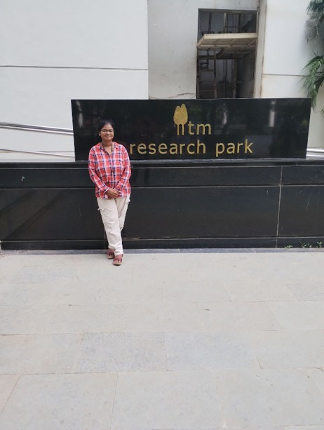

I am Aditi, a final-year bachelor's student in chemical engineering at IIT Tirupati. I completed my summer internship at the <b>International Advanced Research Centre for Powder Metallurgy and New Materials (ARCI)</b>, an autonomous R&D centre under the Department of Science and Technology (DST), Government of India. ARCI's main campus is in Hyderabad, with additional operations in Chennai and Gurgaon.
 

<h2>The Application Process</h2>

The application link for ARCI's summer internship program typically becomes available on their website around February. I applied after receiving the link from one of our professors. The website comprehensively lists summer research projects in various fields, including fuel cell and hydrogen technologies, automotive energy materials, solar energy materials, sol-gel coatings, nanomaterials, and more. Candidates can select up to three preferred areas in order of priority. I was selected for my top choice: Hydrogen and Fuel Cell Technologies, located at ARCI's Center for Fuel Cell Technology within the IIT Madras Research Park in Chennai.
 

<h2>Project Work</h2>

My project focused on developing a Temperature Swing Adsorption (TSA) hydrogen dryer. My objective was to design and optimize a TSA system to effectively remove water vapour from hydrogen produced by a Proton Exchange Membrane (PEM)-based Electrochemical Methanol Reformer (ECMR), a technology patented by ARCI scientists that functions similarly to a methanol electrolyser. Another key goal was to enhance the efficiency and consistency of hydrogen drying to meet industrial purity standards. This involved monitoring breakthrough time and experimenting with regeneration techniques to improve cycle times. The project was entirely experimental.

This work is crucial in advancing hydrogen purification for clean energy applications. Through this project, I developed a strong interest in separation and purification technologies, gaining hands-on experience with adsorption techniques and deepening my understanding of how chemical engineering concepts are applied in real-world scenarios.
 

<h2>Obstacles encountered</h2>

I often found myself stuck during the project and had to sift through numerous research papers to draw meaningful conclusions. Fortunately, I had the support of a JRF Scholar who guided me throughout the internship, and we collaborated closely on the project. I genuinely miss those brainstorming sessions we shared. My supervisor, Dr. R. Balaji, was incredibly helpful—he arranged all the necessary facilities to streamline my tasks and provided invaluable advice and direction.
 

<h2>Accommodations</h2>

We were not provided any accommodation, so I had to search for some PGs nearby. Fortunately, there were a lot of PGs nearby, so I had no problem searching for one.

 

<h2>Last but not the least, advice for juniors</h2>

Since ARCI is a research-focused centre, being comfortable with reading scientific papers and understanding research methodologies can be a strong advantage. Supervisors at ARCI value interns who demonstrate a genuine interest in learning and problem-solving, so don’t hesitate to ask questions or explore additional aspects of your project. This initiative can really help you stand out.

Overall, I had a fantastic experience working at ARCI. One of the most memorable aspects was the vibrant environment at the IIT Madras Research Park, a hub for startups and innovation. I enjoyed the lively atmosphere in the food court, where people from various teams and companies would come together for lunch. Experiencing this dynamic corporate culture and interacting with professionals from diverse backgrounds made my time there truly unique and enjoyable.
