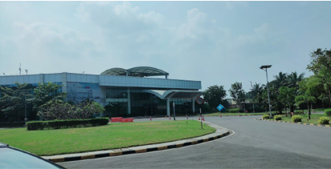
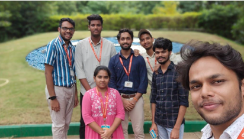

<h2>Securing the Internship</h2>

Interning in the R&D department at Ashok Leyland provided invaluable insights into the corporate world. I secured this opportunity through an on-campus recruitment process. After submitting my resume, I was invited to a phone interview where I was asked a few technical questions related to my projects. Shortly afterward, I received an offer to join the R&D team at Ashok Leyland.

<h2>Interview Preparation</h2>

My interview preparation was straightforward: I thoroughly reviewed my projects, maintained confidence, and stayed positive. If I knew an answer, I explained it clearly and concisely; if I didn’t, I honestly stated that I wasn’t familiar with the topic. This approach helped me navigate the interview smoothly, a strategy I believe works well in any interview setting.

<h2>Objectives and Responsibilities</h2>

My primary objective was to gain an in-depth understanding of the propeller shaft assembly process used across various vehicle types at Ashok Leyland. I focused on identifying factors contributing to noise in the shaft and studying the calculations necessary for assembly. Using my web development skills, I developed a calculator to streamline these calculations, enabling the R&D team to efficiently manage the assembly process.

<h2>Accommodation</h2>

Another challenge was adjusting to Chennai, a new city with Tamil as an unfamiliar language. In my rush to secure housing, I paid an advance for a PG in Anna Nagar, only to find it had limited network coverage, which made staying connected difficult. Since I had already paid the advance, I couldn’t change accommodations and managed without reliable connectivity for three months - a lesson I hope others can avoid.

<h2>Key Takeaways</h2>
<ol>
<li><b>Hands-On Technical Knowledge</b>: Developed a strong understanding of the propeller shaft assembly process, including factors that impact noise and necessary assembly calculations.</li> 

<li><b>Practical Skill Application</b>: Used my web development skills to create a custom calculator, simplifying complex calculations and improving assembly efficiency for the team.</li> 

<li><b>Adaptability</b>: Adapted to an extended workday and long commute, which enhanced my resilience and time management skills.</li> 

<li><b>Cultural Awareness</b>: Improved communication and adaptability by navigating life in Chennai, a new city with different cultural and language dynamics.</li> 

<li><b>Problem-Solving Under Constraints</b>: Devised practical solutions to manage work despite limited connectivity in my accommodation.</li> 

<li><b>Professional Networking</b>: Established connections with industry professionals, mentors, and colleagues in the R&D department, gaining valuable insights into the corporate work environment.</li> 

<li><b>Interview Confidence</b>: Gained confidence in presenting and discussing project work in interview scenarios, handling questions with clarity and honesty.</li> 
</ol>