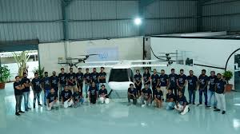

Hi, I’m Pulluru Asha, a final-year undergraduate student studying Mechanical Engineering. I have carried out my internship at BluJ Aerospace Pvt Ltd., located in Nadergul, Hyderabad.
 

<h2>Application Process</h2>

From the application point-of-view, BluJ had come a little late, providing the opportunity near the end of semester examinations. That was when many of us lost hope of getting an industrial internship. Fortunately, BluJ was there for us, giving us a stipend of 15,000/-.

Many of our classmates applied, and BluJ conducted resume-based shortlisting and selected nearly six students across all the departments. Interviews were conducted one-on-one. I still remember the interviewee Amardeep Srivastavaya (CEO), who had an aerospace background and powerful technical knowledge. The interview went at the same pace. Fortunately, the Finite Element Method course and the design-related courses I took helped me answer most of the questions. I was a bit nervous during the interview, but the interviewee was so good that he gave me space to calm down and spoke a few words to relieve my tension. Finally, though I was a bit nervous, I managed to answer most of the questions, which landed me this wonderful opportunity.
 

<h2>Internship Work</h2>

Moving forward, all the selected interns decided to go to BluJ on 20th May 2024, which was a wonderful experience. There was a little difficulty in reaching the place and finding a PG, as this place is on the city's outskirts. So safety was always a significant concern (One of the better PGs: Safety Nest Women’s PG, Contact: 9553303157, Owner: Chandra Mohan). We stayed in Adibatla, around 5 km away from the company. The company has provided a Cab facility that has reduced a lot of our efforts.

As BluJ Aero is an R&D company, it was an industrial research internship, and I worked on designing a lightweight composite skid landing gear under the guidance of Mr. Amardeep Srivastavaya. The company’s culture was so good, and they asked us to address each by name and not as sir or any other than that of a typical corporate company. Initially, I carried out a literature review to improve the crashworthiness of the landing gear. I developed a composite solution that eventually led to the design of lightweight skid landing gear. My colleagues, Mudassar Bhisty and Tarun Mandapaka, have helped me learn new things.

In BluJ, every post-lunch ‘stand-up’ meeting is conducted, in which everyone speaks about what they are working on and the current status of work to the Vice-President (Pranay Rebala), CEO, and CTO (Utham Kumar Dharmapuri). This helped me grow at work and get a helping hand whenever required. Mr. Amar was very patient and helpful and motivated me throughout the more challenging times I had during my research.

Ultimately, I learned new software models such as ANSYS LS-DYNA and ANSYS ACP. Modelling composites on software excited me a lot. Initially, I, too, faced many difficulties in setting up the simulation in LS-DYNA, but working consistently improved me. In the end, I was able to succeed and come up with the results. Although I had been using ANSYS for the last 2 years, all those were implicit analyses that do not take a longer simulation time. During my academics, I read several times that some higher-level simulations take a few days to run, and I could experience them for the first time in BluJ. I felt happy hearing from my colleagues that, “Many mechanical engineers can perform implicit analysis, but only a few can perform explicit or dynamic analysis in simulation software; and not just performing, but also analysing the results from explicit which also deals with different types of energies involved and their conservation which was a bit different from implicit.”
 

 

<h2>Facilities</h2>

There was a table tennis facility to play and relax. I enjoyed & learnt playing TT there. Not only TT, but on the last working day of May 2024, they held a cricket match, which all of us enjoyed playing, and I enjoyed watching it even though I didn't know how to play cricket. Even the CEO, CTO, and VP were very generous. They mingled well with the employees and had fun.

All the Saturdays & Sundays were holidays, and there was no holiday for festivals like Mohram. There is also a very small cafeteria where you can make your tea, coffee, and milk.  BluJ also provided us with lunch without any extra charge, and the food was good, too. The location of Adibatla is full of restaurants and supermarkets, and everything is available nearby. So, in particular, it is okay even if we do not carry everything with us when leaving for Hyderabad. And the Rapido facility, which is the nearby metro station, is too limited. But we can use bus services if we can reach a nearby place called Bongloor.

Coming back to the work there, there was also a manufacturing unit of BluJ where we could get to see the preparation of composite in practice. We are fortunate to have seen the manufacture of BluJ’s prototype. I enjoyed learning about each and every part of it and its role in front of my eyes with the help of the colleagues I mentioned earlier and two others, Ravi Kasipaka and Sandeep Azmeera. Also, we could get to see the drone miniature version of this prototype and the controls testing. With the help of my colleague Ravi, I could also explore the battery systems, the hydrogen fuel cell system and its working principles, and all my doubts were clarified. BluJ extensively works on hydrogen fuel cell systems sustainably with the motto of “Making Aviation Simpler & Sustainable”.
 

<h2>Experience</h2>

Finally, we ended the internship with a presentation to the BluJ team and returned to college, leaving with heavier hearts. I stayed there until the last day, July 31st, and reached college early in the morning on August 1st, the first working day of the semester. In that way, I missed the holidays, but it was a nice experience, and BluJ was perfect in crediting salaries. We correctly received it on the last day of the month. Now, BluJ has showcased its prototype to the media and broken its cold chain. I have witnessed the progress that is being made and is achieving many awards in the industry among many other startups.

In conclusion, this experience has enriched my technical skills and allowed me to explore myself and improve my courage to travel to a new city alone. I was fortunate to work under the guidance of Mr. Amar, the CEO, so I also tried to learn entrepreneurial skills from him. This was a good exposure to the corporate world, too, in a positive way. So, I acknowledge all the people, Dr Subba Reddy Daggumati, who brought BluJ to the campus for internships, Mr Amar, Mr Mudassar, and my other colleagues for their unwavering support.

Thank you for reading about this long journey, and thanks to Udaan for giving me this opportunity to showcase my experience.
