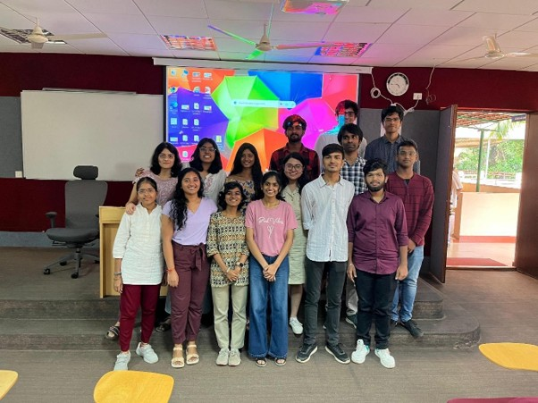
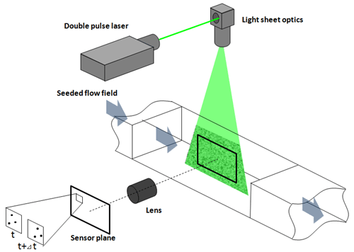

<h2>Application Process</h2>

I applied for this research internship through the Chemical Engineering Internship Program (CEIP) offered by IISc. The application required submitting my resume, a Statement of Purpose (SOP), and my academic transcript. Fortunately, no interviews were conducted for the selection process, so my application materials alone were enough to secure a position.
 

<h2>Internship Objectives</h2>

From June 3 to July 26, I had the chance to intern under Dr. Prabhu R. Nott from the Department of Chemical Engineering at IISc. My mentor, Dr. Aqib Khan, was incredibly supportive and guided me throughout the program, making the whole experience more insightful.

The main goal of my internship was to understand how granular materials flow in piles, especially in different silo setups. I worked on experiments with cylindrical silos that had rough and smooth bases, and I also used a 2D silo made of transparent acrylic sheets to get a clearer view of the particle movement.

This internship gave me an excellent opportunity to learn about granular flow and gain hands-on experience with designing experiments and analysing results in a real-world setting.

 

<h2>Research Focus and Experimental Work</h2>

My research focused on investigating granular flow dynamics, and I primarily worked with mustard seeds in different experimental setups. By employing Particle Image Velocimetry (PIV), I could capture the movement of particles and analyze velocity fields. I experimented with flow through small orifices and the "raining effect" setup, where particles dropped from a large opening. I carefully recorded and analysed data to understand the behaviour under different conditions.

Granular physics is an essential field that studies the behaviour and dynamics of granular materials—large aggregates of discrete particles like sand, grains, or powders. Although it may seem niche, granular physics broadly impacts multiple industries and emerging technologies. Here's an overview of its significance and potential future contributions:

<h3>Industrial Applications - Why Granular Physics?</h3>

Granular physics plays a vital role in shaping industries and solving real-world challenges. In agriculture and food processing, it helps streamline the sorting and transport of grains and seeds - reducing waste and improving efficiency to support the global food supply. Understanding how pharmaceutical particles behave ensures more effective powder compaction and tablet formation, leading to better medicines and optimized production processes. Mining and construction also benefit greatly, with insights into particle flow enabling safer storage, more stable structures, and smoother material handling.

This field also drives innovation in advanced materials, such as smart packaging that adapts to environmental changes and improved 3D printing processes that produce stronger, more intricate designs. Granular physics addresses environmental concerns, too, offering solutions to prevent soil erosion and land degradation while aiding in the modelling of natural disasters like landslides and avalanches. Beyond Earth, it helps design tools for space exploration by studying how materials behave under low gravity, which is crucial for future planetary missions.

From robotics inspired by granular interactions to sustainable construction practices, the applications of granular physics are vast and impactful. Bridging the gap between solids and fluids advances scientific understanding and provides practical solutions to some of the most pressing challenges of our time.

<h3>Potential of Granular Physics</h3>

Granular physics will continue evolving, driven by interdisciplinary research in materials science, bioengineering, and robotics. As we develop technologies like autonomous construction in space, better materials for sustainable infrastructure, and adaptive robotic systems, granular physics will likely play a pivotal role. The field’s insights could also be central to tackling pressing global challenges, from environmental sustainability to improving food security and manufacturing resilience.
 

<h2>Any speed breakers? Well…</h2>

Experimental work with granular flows brought unique challenges. For instance, achieving stable flow rates and capturing precise PIV data required meticulous setup adjustments. Working in a research environment meant continually refining techniques to handle unpredictable flows, especially with different surface textures and orifice sizes, and ensuring accurate data collection and analysis. I have put in a schematic figure for reference below:

 

<h2>Faculty Lectures and Learning Opportunities</h2>

One of the highlights of the internship was the series of lectures by IISc faculty members. These lectures provided a glimpse into advanced topics and current research trends in chemical engineering, deepening our understanding of the field. The sessions covered cutting-edge concepts and ongoing research that helped frame our experimental work within the broader landscape of chemical engineering.
 

<h2>CEA Nite at IISc</h2>

During our stay, we had the chance to attend CEA Nite, an annual event organized by IISc’s Chemical Engineering Association (CEA). The event featured a mix of academic and cultural activities, allowing students and interns to unwind, network, and celebrate the vibrant community within the department. Highlights included engaging games, cultural performances, and a great chance to bond with faculty and peers in a lively and informal setting.
 

<h2>Accommodation and Location Experience</h2>

I stayed at a PG in Malleshwaram, conveniently close to IISc. The area had a bustling yet welcoming vibe, with plenty of amenities. Staying nearby allowed me to maximize my lab time and connect with other students and interns in the area, making the overall experience enjoyable and well-rounded.
 

<h2>Financial Insight</h2>

The internship provided a stipend of ₹15,000 - awarded after completing the program. Though modest, the stipend covered basic expenses, and with additional savings, I managed my finances comfortably for the duration.
 

<h2>Handful of memorable moments as well</h2>

One standout memory was during the sieving experiment when an unexpectedly sizeable initial heap led to a mini avalanche of mustard seeds that we scrambled to control and reset. In another setup, the "raining effect" produced beautiful, almost fluid-like movements as the particles spread and settled, highlighting the unique behaviour of granular materials and making me appreciate the field's complexities even more. One of the unexpected highlights of my internship was getting hands-on experience with a DSLR camera to capture detailed videos of my experiments. Using a DSLR allowed me to explore how settings like frame rate, exposure, and focus directly impact the quality of footage—skills typically outside the scope of a chemical engineering internship.
 

<h2>Advice for Juniors</h2>

I’d recommend focusing on particle dynamics and fluid mechanics fundamentals for anyone considering this internship, as these are essential for understanding granular flows. Additionally, programming skills in MATLAB or Python are invaluable for analyzing data. This is a highly hands-on research experience, so being patient and detail-oriented will go a long way. IISc provides a stimulating environment to learn and grow, especially for those passionate about experimental research.
 