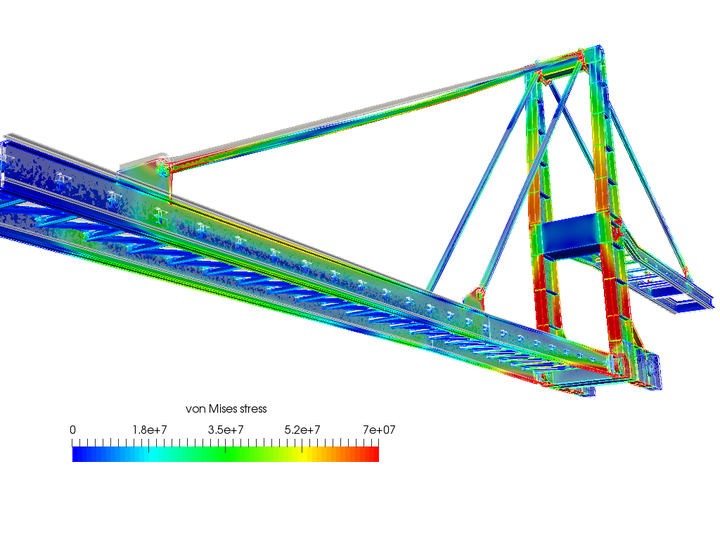

I am Utkarsh Dhar Dubey, from the Department of Civil Engineering. For my BTech summer internship, I gained the opportunity for a research internship under Prof. Rajesh at IIT-BHU. I had been applying to be a research intern at universities near home like IIT-BHU, IIT Kanpur, HBTU, etc. and thankfully, IIT-BHU allowed me to intern from my hometown, Varanasi.
 

<h2>Application Process</h2>

To be selected, I had to first send my CV to the institute and look into the different available projects and research topics that the professors there were offering for the internship. My interests lie in structural dynamics and fluid mechanics, and so I was interviewed by Prof. Rajesh on structural engineering and other generic interview questions. For this, I mostly prepared by studying Finite Element Analysis which was required for the internship.
 

<h2>Internship Work</h2>

Once my internship started, I spent the major portion of my time deriving the expressions of the bending of plates, beams and columns under various types of loads like UDL (uniformly distributed loads), space-dependent loads, time-dependent loads like earthquakes, etc. A heavy use of differential and integral calculus was involved.
 

 

<h2>Overall Experience</h2>

Even though this opportunity didn’t come with a grand stipend, the money rewarded was enough to sustain my gym membership. Plus, I saved money by staying at home. It also gave me some free time to meet and catch up with old school friends who all attend different colleges now.
 

<h2>Advice to Juniors</h2>

For my juniors who are trying to get into the research field, I’d advise you to keep your core concepts and have your basics strong, to practise mathematics as it’s needed everywhere (trust me, I found out the hard way), and to not overthink about the work that you’re doing. As long as you keep working and moving forward, you will have something for yourself at the end of the day.
