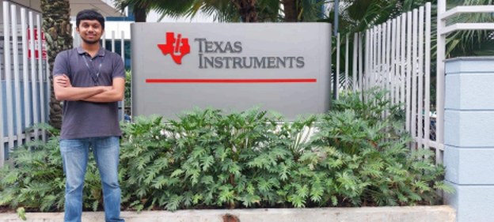

<h2>Securing Internship at TI</h2>

The second year of college flew by in a blur—before I knew it, half of our BTech degree was behind us, and we faced the big task: securing an internship. The internship season arrived, but honestly, it was a bit of a letdown at first, with only a few big names approaching campus. Still, my friends and I were holding out for one company: Texas Instruments, the semiconductor giant with one of the best R&D centres in India.

But as August turned into September, and then September into October, it seemed TI wasn’t coming. By the end of the semester, we’d pretty much given up. We knew that TI usually wrapped up intern recruiting by early September, so we figured the opportunity had passed.

Then, out of nowhere in March, we got an email announcing an Analog Hackathon, hosted by TI at our college. I signed up right away.

When hackathon day finally arrived, the TI team started with a session on designing a Tunable Biquad Filter. My teammate and I brainstormed hard, then, after a quick lunch, jumped back in and completed the circuit within 1.5 hours. We were the first ones to finish!

The top two teams would get interview opportunities for an Analog Intern role at TI. Four of us qualified, but two opted out, leaving just two of us for interviews. Mine happened right after our sixth-semester finals. The interview was another story. To prepare, I had binge-watched YouTube videos about TI’s interview style, trying to get a sense of their questions. I focused on the fundamentals—RC, RLC, and OpAmp-based RC circuits—and worked on building intuition around these topics, since TI is big on answering through intuition rather than formulas.

My interview lasted 55 minutes long, which I felt pretty good about. The first 5 minutes felt like an hour, but the next 50 flew by in a flash. 
Finally, with that behind me, I headed home, waiting for the results. Finally, the next night around 9 pm, the email landed: I’d been selected! I was thrilled—interning at my dream company, and in the exact field I wanted.

 

 

<h2>Internship at TI</h2>

A week after I got the offer, I was off to Bangalore to start my internship. TI turned out to be super employee-friendly; they even set us up with accommodation for a week so
we’d have time to find a PG. And get this—the accommodation wasn’t just any guesthouse. They put us up in a five-star hotel! I arrived around 9 am, and since check-in wasn’t until 1 pm, I found myself waiting in the lobby with a bunch of other interns. Perfect setup for some socializing! Most of them were from IITs or NITs, so it was fascinating to hear about everyone’s journey to TI.

The next day was our first day at the office—a whirlwind of orientation activities. They had fun icebreaker games to get everyone comfortable (or at least less awkward), and then came the usual company policies, ethics, and all that standard stuff. They also gave a lot of goodies: a box of chocolates, a bag, a T-shirt and a coffee mug.

Then came the big moment—meeting my mentor. Turns out, he was a TI Fellow (basically, TI’s version of a VP), which felt a bit intimidating at first. But he turned out to be incredibly kind and easygoing. First, he asked me to complete a few training courses to get lab access (yes, lab access requires exams here, but thankfully there were unlimited attempts, and the questions never changed).

After three or four days of breezing through those, I finally entered the lab. It was massive, with all kinds of R&D projects happening around me. I couldn’t wait to dive in.

My first project was coding an RF transceiver. Coding wasn’t exactly my thing, but since there was some hardware involved, I thought, why not? After about a week, though, it was clear that this just wasn’t for me, so I requested a project change. That’s when I got reassigned to a project on <i>Estimating Non-Linearities of High-Speed ADC</i>s, a mix of communications and signal processing work.

For my fellow EE folks—imagine working on an ADC as a nonlinear system. My job was to model this nonlinear behavior and reduce the intermodulation distortion (okay, enough jargon!).

Just as I was settling into the five-star life, the time came to move out of the hotel and into a PG. It was a bit of a downer—after all, we’d been living it up with cozy beds and amazing food—but we knew it had to happen eventually. I managed to find a PG that was within walking distance of the office, and as luck would have it, it was brand new.
 

I went with a triple-sharing room (budgeting is real), and here’s the best part: most of the other TI interns had chosen the same PG! It was like bringing a bit of the fun from the hotel with us. With friends close by, the whole internship felt like an extended college experience, complete with all the usual “college student stuff”.

Settling into office life soon became routine. Work was going well, and my mentor even assigned a manager to answer my questions—who then assigned another guy under him to help me out. It was a whole support chain, but it worked! Everyone was super approachable and, honestly, really knowledgeable.

To shake off that daily post-lunch slump, I started heading over to Texins, TI’s dedicated unwind spot right inside the office area. Texins had it all—a volleyball court, tennis court, TT tables, basketball court, badminton court, gym, and more. I’d usually hit the basketball court to recharge before diving back into work.

The way things worked with my mentor was pretty straightforward: he’d give me a task, I’d finish it, report back, and then move on to the next one. Toward the end, as I got deeper into the project, I realized I needed to step up the pace in order to finish my work on time. Since it was all so new to me, I put in some extra hours, pushing myself to complete each task and move forward.

Just three days before my internship was set to end, I got a call from my manager while walking back to the PG around 7:30 pm. He let me know that the next morning, they’d be interviewing me for a full-time position. I got pretty nervous, I stayed up brushing up on the fundamentals.

The interview began the next morning, with two interviewers joining me in a meeting room. It went on for 1.5 hours, from 11:30 am to 1 pm, and was intense. They told me I’d hear back soon about the outcome.

Fast forward to my last day—I was working on the final task my mentor had assigned when, around noon, I got a call asking me to come to a meeting room. I hurried over and found a senior team member waiting to speak with me. She asked me a few
HR-style questions and the conversation went on for about an hour. Finally, she told me that TI would be offering me a PPO. I was relieved beyond words—a huge weight lifted off my shoulders. That day was one of the happiest moments of my internship.
 

Reflecting on my time at Texas Instruments, it’s incredible to think about how much I learned—not only about analog design and signal processing but also about working in a team of highly skilled people. From meeting my mentor and adapting to new projects to those after-lunch games at Texins, every part of the experience felt enriching. The journey had its fair share of challenges, but each one taught me something invaluable.
