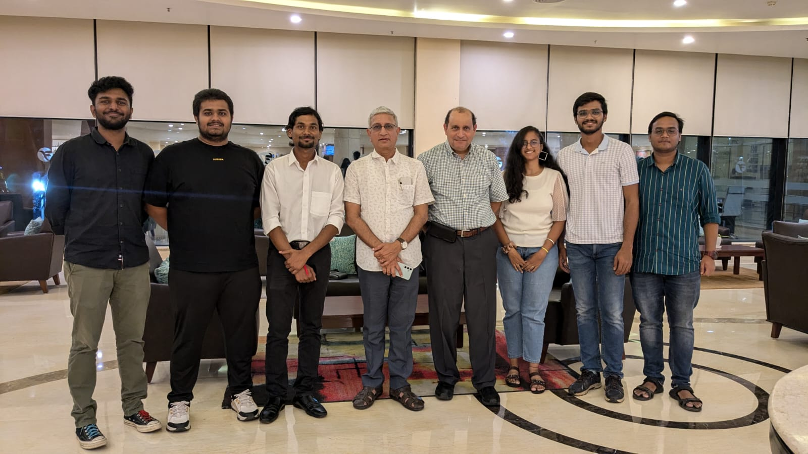

## Introduction

“Whoa! That’s a lot of money!” was definitely the reaction when the students of our batch got to hear about this company. As a not-so-well-known company founded by a Stanford Graduate well-versed in the art of semiconductor fabrication and lithography, Prima Innotech LLC caught the attention of students from core engineering fields, especially those who were from mechanical, chemical and electrical engineering. With the promise of quality work right in the research limelight of today’s tech giants, those few who were tired of watching software and data analyst companies come and go finally had their moment. 

Let’s join some of the interns in a recount of their time working with Prima Innotech LLC and hopefully have some additional insight into the internship experience. And yes, if you’re wondering, the Editor also happened to intern at Prima Innotech LLC and definitely has his own two cents to share.

 

## Selection

The interns were selected through many layers of filtering and shortlisting. The mentor, Dr.  Ajit Paranjpe, was not very fond of interviews. He stressed on the importance of work content, thoroughness and results, as reflected by the selection process. Here’s what the interns had to say about the gruelling selection.

> “The selection process started with submitting our resumes and statement of interest which was followed by getting a pre-internship assignment to be completed within 14 days to all those who were selected based on the aforementioned process. After completion of the assignment, we needed to present our work to Dr.  Ajit Paranjape, our mentor during the internship who was a very helpful and dedicated person.  The goal of our internship was to make a prototype for a motor control and then run the Turnigy – Aerodrive motor.”
>
> \- *Chetan, Electrical Engineering Intern*
>
> “The application process included a resume and a phone call-based shortlisting
> after which the shortlisted students were assigned a pre-internship assignment with a time of one month. We presented the work we did after which four students were selected for the project I worked on during the internship. My pre-internship assignment was to simulate an electrochemical cell for electroplating on COMSOL Multiphysics. Initially, it was tough as I was totally new to COMSOL but after learning the basics I caught onto the work. I rehearsed the final presentation before presenting it to the company, focused more on visualizing the results I got, and tried to keep the presentation simple and easy to comprehend.”
>
> \- *Prince, Chemical Engineering Intern*
>
> “As an applicant, we had to submit our resume and a statement of interest. I crafted my statement of interest such that it was relevant with the project. I focused mainly on showcasing those skills and projects of mine which would have been helpful for the project that Prima Innotech was offering.
>
> One thing I want to share that happened during the application process is, we were supposed to send our statement of interest and resume via mail to Ajit sir (internship advisor). After submission, interns who were working there were supposed to call everyone who submitted and take a brief about projects that we have done and skills that we were good at to shortlist a few candidates for further selection rounds. Unfortunately, my mail went unnoticed by Ajit sir and nobody called me. But luckily Arun, a final year student working in Prima, knew that I applied for this company, so he suggested I drop a mail to sir again and this time he noticed it. After the call, a few students got a mail regarding further process.
>
> Ajit sir shared 8 different problems or assignments which we were supposed to work on for around 3 weeks and after that we had our interviews scheduled where we had to present our assignment work. After submitting the preference for the assignment problem, he allotted one assignment problem to each person. Luckily, I got the assignment to which I had given first preference. My assignment was to make a user manual for the exfoliation apparatus that previous interns designed. As a part of my assignment, I learned the basics of SolidWorks and understood the working of the model and its features thoroughly and made a user manual. As an add-on, I tried to render the images of the apparatus design. During my interview, I kept my presentation very specific and just explained the working of the model using images such that a user could easily understand it. I focused on what exactly I was supposed to present and did not present anything other than that. After my presentation, he asked me a few questions which I was able to fortunately answer.”
>
> \- *Sayali, Mechanical Engineering Intern*

 

## Work

Work for the interns was mostly confined to the IITT campus, making use of the in-house labs and workshops, with the occasional trip to outsource material. With the employer residing in the Americas, communication was primarily through mail and online meets, scheduled once a week. Perhaps this is when it would’ve felt more like a research internship than a corporate one. 

The electrical interns worked to build a prototype motor controller to suit the Turnigy-Aerodrive motor. The motor would be used in robotics applications, especially for the precise control of cobot attitude and other similar fields. The words of the intern are surely more potent in describing the project.

> “To tell you more about our internship, I would need to explain a lot of intricacies which might be a little boring to put up in such an article. But for my electrical engineering juniors reading this who are interested in my work, we aimed to create a prototype for a compact controller for a brushless DC motor suitable for driving the joint of a cobot using controllers and inverter boards made from cutting-edge technology, namely GaN-Fets. To create the prototype, we first had to learn about many topics which included Motor Control techniques, FOC algorithms, GaN-Fets and how to configure the boards equipped with GaN-Fets. Thus, my first one and half months mainly was research work. During this time, we also received some electrical equipment from our mentor on which we did some basic experiments so we could understand our project better. This included using Arduino Mega / Python Gui to run a BLDC motor (Moteus Motor) using a Moteus controller which came in a kit. All in all, you can say that our work was to understand the working of the Moteus controller and replicate it using the GaN-Fet technology. The next phase of my internship consisted of configuring the motor, finding the relevant parameters, creating a detailed experimental plan, and lastly, to order the required electrical component such as the EPC9194 KIT. It may sound easy, but calculating parameters is no joke, especially the lengthy process of creating a detailed experimental plan. The details that go behind creating one can be mind boggling, when done to the last detail. It literally took me 2-3 attempts and a lot of help from our mentor to create one.”
>
> \- *Chetan*

The mechanical and chemical interns worked to build an exfoliation and electroplating apparatus respectively to produce a cost-effective machine combo for manufacturing of ultra-thin GaN wafers. Let’s hear what each of them have to say about their work at Prima. 

> “During the internship, I simulated the electroplating apparatus being designed by the company and suggested changes to be made in the design in order to get a uniform deposition of Nickel over the Silicon wafer in the apparatus. I was also involved in the manufacturing of parts for the apparatus with my co-intern Sayali. Simulating the apparatus and step by step changing the geometry to get to the final optimum geometry was kind of an iterative but interesting task to do. There were some hiccups in the project sometimes, such as facing errors while running simulations, encountering design modifications which were not practical to manufacture etc. I am not deep diving into them but with consistent efforts and guidance, we sorted them out. I was on the campus during my whole internship period and seeing metal parts, nylon slabs machined by those giant CNCs was very fascinating, it was like coming from Autodesk Fusion to the real world.”
>
> \- *Prince*
>
> “The main objective of my internship was to develop a theoretical plan for experiments using the exfoliation apparatus. Since the apparatus was still under construction, I focused on creating a comprehensive experimental plan, covering every detail from setup to material selection. Initially, this was challenging due to my lack of exposure, but after a month of literature review, I gained a clearer understanding, and the tasks became more manageable.
> The internship was structured as a 40-hour work week, with regular progress meetings every Thursday with Ajit sir. The workload was balanced and could usually be completed in 3-4 days, leaving the remaining days relatively free.
> The biggest challenge I faced was logistical, particularly around the apparatus’s manufacturing. College machines were sometimes unavailable, and technicians weren’t always accessible, causing delays in producing even simple parts. This waiting period was frustrating since it limited our progress and left us dependent on external factors.
>
> We were required to stay on campus throughout the internship, so I spent most of the summer there, going home just 2-3 times. While staying on campus had its pros and cons, it provided easy access to necessary resources and allowed me to focus on my work without major interruptions. Aside from the regular stipend, we received a per diem for staying on campus, which helped cover the cost of accommodations during the summer.”
>
> \- *Sayali*

Well, yours truly was occupied with what he does best. The Editor worked on developing a set of equations that would describe the deflections in a bimetallic disc under residual stress. The numerical values of deflection and stress predicted by these would go on to form the basis of the experimental exploration and would dictate the design criteria for the exfoliation apparatus.

Apart from the “lost in equations” part of the job, he was also in charge of getting some parts machined and outsourced from an external Wire EDM machine. This allowed him the luxury to step out from his college and indulge in some field work. 

 

## Experience

Working with Dr. Ajit Paranjpe at Prima Innotech LLC was a great experience. His emphasis on quality work, clear presentation and the engineering way of thinking definitely refined our own thought processes as well. Let’s dive into what everyone took away from the internship apart from the lump sum of cash.

> “To sum up, my experience with my mentor, Dr. Ajit Paranjpe, was exceptionally good. He patiently listened to every single doubt we had in our weekly meetings and gave very constructive and critical feedback on our work. We also had G.B Fernandez, a faculty at IIT Bombay as our advisor on our project with whom we used to discuss our technical doubts and the necessary experiments which needed to be completed in our institute labs.
>
> Looking back, I can confidently say that the time I spent working as an intern for Prima Innotech has greatly influenced how I look at things from an engineering perspective and has sharpened my professional skills as well. To anyone considering an internship, I encourage them to embrace it with an open mind and willingness to learn and grow.”
>
> \- *Chetan*
>
> “Overall, it was a very good experience working for Prima Innotech. Our supervisor Dr. Ajit Paranjpe visited our campus to have a look at our progress and he arranged an Intern Appreciation Dinner for us, which we had with our Director K.N. Satyanarayana sir. This was one of those moments I will remember throughout my life. My advice to any junior who wants to pursue the same internship would be to focus on any one core skill like simulation, design etc, and prepare a very good presentation to show your pre-internship assignment as it is the deciding factor for your internship at Prima Innotech.”
>
> \- *Prince*
>
> “One of the highlights of my internship was working under Ajit sir, a Stanford graduate with extensive expertise. His guidance was invaluable, teaching me not only academic concepts but also how to approach problems with an engineer’s mindset, plan meticulously, and present my work effectively. Additionally, collaborating with fellow interns from my batch and previous interns was a good experience. 
>
> While my internship was remote, and I didn’t get the chance to work in a new city or company environment, I was grateful for the opportunity to stay on campus and spend time in my room. I got to spend more time on campus before my graduation and I am happy about that.
> For juniors, I highly encourage you to apply for Prima Innotech since it will be a great opportunity for you to work with Ajit sir and the project will also challenge you with new things with which you can learn many new things. If you are interested in applying, I will suggest you keep your statement of interest short and focused on skills which are relevant to the project that company is offering to you. Also, after getting an assignment, ask sir exactly what he is expecting from you and work accordingly. Do not try to do something which is very fancy or exotic, just complete everything he wants you to complete. Keep your presentation short and crisp while covering every detail asked in the assignment.”
>
> \- *Sayali*

The Editor ran into a couple of awkward moments as well during the internship. Off the top of his head, he recalls the time the design sent to the Wire EDM machine was simply not read by the machine at all. After nearly the entire day of attempting to resolve the issue, he found the solution and realized that the way to mitigate said software problem in the future was a bit of honest piracy. Another instance was of a weekly presentation, during which he was informed, in a rather deadpan manner, that his graphs were very poor and did not communicate matters clearly at all. (This would go on to be evermore crucial, as he’d learn in the days to come). He also recalls the time his intuition for solid mechanics reached a euphoric high while imagining how a trimetallic strip would bend, as opposed to a typical bimetallic strip. He also rather fondly would like to mention that those who are into meticulous work and excruciating attention to detail will definitely find working with Dr. Ajit Paranjpe a joyous experience. 

Overall, the internship helped the interns grow and learn a bunch of new things and hopefully, pushed them one step closer to answering the mind-boggling question, “What does it really mean to be an engineer?”